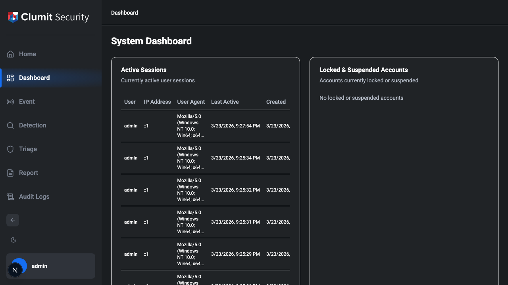
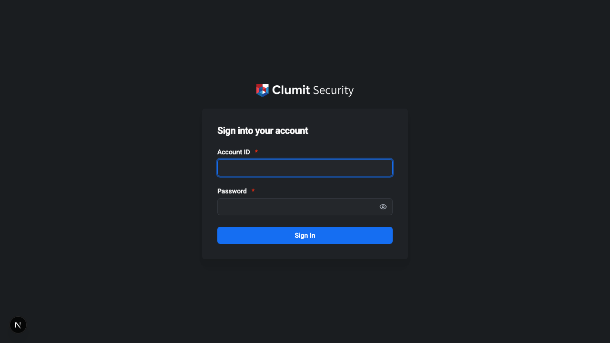
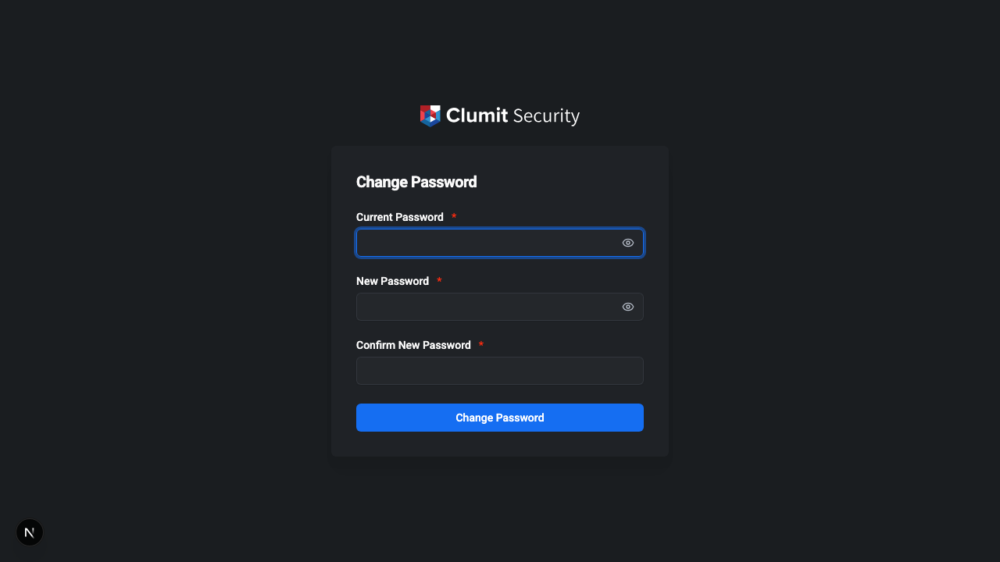
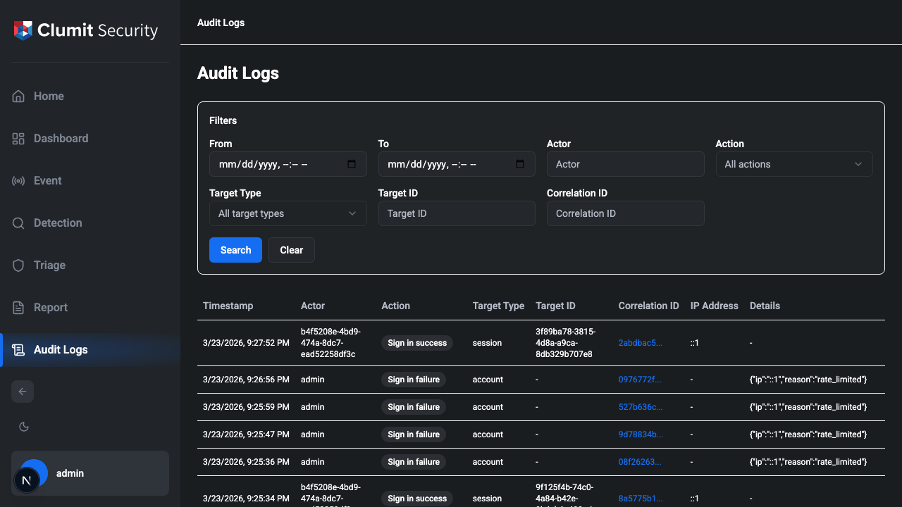

# Administration

This page covers account, role, customer, and system management.
These are administrative functions — the core threat detection
features are documented separately as they become available.

## Navigation

The sidebar provides access to all areas of the application. The
**Settings** menu contains administration pages, each gated by
permissions:

| Settings Page | Required Permission |
|---------------|---------------------|
| Accounts | `accounts:read` |
| Roles | `roles:read` |
| Customers | `customers:read` |
| System | `system-settings:read` |

Your profile preferences are always accessible from the sidebar
user menu. A dark/light theme toggle is located at the bottom of
the sidebar.

## Sign-In

Enter your username and password on the sign-in page. The system
enforces rate limiting — too many failed attempts will temporarily
lock the form.

Possible error conditions:

- **Invalid credentials** — username or password is incorrect.
- **Account locked** — too many failed sign-in attempts triggered
  a temporary lockout (Stage 1).
- **Account suspended** — repeated lockouts resulted in permanent
  suspension (Stage 2). An administrator must restore the account.
- **Account disabled** — the account has been deactivated by an
  administrator.
- **IP restricted** — sign-in is not allowed from this IP address.
- **Max sessions reached** — the per-account session limit has
  been reached. Sign out from another session first.

## Sign-Out

Click the user menu in the bottom-left of the sidebar and select
**Sign out**. This revokes the current session.

After signing out (or when a session expires), you are redirected
to a reason screen explaining why you need to sign in again:

- **Signed out** — you signed out manually.
- **Session ended** — your session expired due to inactivity or
  reaching the absolute timeout.

## Password Management

### Changing Your Password

Navigate to the password change page (you are redirected here
automatically if `must_change_password` is set on your account).

Enter your current password and choose a new one. The new password
must satisfy the system's password policy:

- **Minimum length** — configurable (default: 12 characters).
- **Maximum length** — configurable (default: 128 characters).
- **Complexity** — when enabled, requires uppercase, lowercase,
  digits, and symbols.
- **Reuse ban** — cannot reuse the last N passwords
  (default: 5).
- **Blocklist** — common passwords from a bundled blocklist are
  rejected.

### Admin Password Reset

The system provides an API for administrators with the
`accounts:write` permission to reset another user's password.
A password reset sets `must_change_password` on the target
account, forcing a password change on next sign-in. This
capability is not yet exposed in the UI.

## Session Management

### Timeouts

Sessions have two timeout mechanisms:

- **Idle timeout** — session expires after a period of inactivity
  (default: 30 minutes).
- **Absolute timeout** — session expires after a fixed duration
  regardless of activity (default: 8 hours).

### Session Extension Dialog

When the remaining session time falls below 1/5 of the token's
total lifetime, a dialog appears with a countdown timer (e.g., if
the token lifetime is 15 minutes, the dialog appears at 3 minutes
remaining). You can choose to extend the session or sign out.

### Multi-Session

The system can limit the number of concurrent sessions per account.
When the limit is reached, new sign-in attempts are rejected until
an existing session expires or is revoked.

## Account Management

Navigate to **Settings → Accounts** to manage user accounts.
Requires `accounts:read` permission to view, `accounts:write` to
create and edit, `accounts:delete` to disable and delete.

### Account List

The account list shows all accounts with filtering and pagination.

Available filters:

- **Search** — filter by username or display name.
- **Role** — filter by assigned role.
- **Status** — filter by account status (active, locked,
  suspended, disabled).
- **Customer** — filter by assigned customer.

### Creating an Account

Click the **+** button to open the account creation dialog.

Fields:

- **Username** — unique login identifier (immutable after
  creation).
- **Display name** — shown in the UI (required).
- **Email** — optional contact email.
- **Phone** — optional contact phone.
- **Role** — determines permissions. System Administrators can
  assign any role. Tenant Administrators can only create accounts
  with Security Monitor-equivalent roles (any role with zero
  permissions, including the built-in Security Monitor and
  zero-permission custom roles).
- **Customer assignment** — required for roles that need customer
  scope. The number of assignable customers depends on the role's
  `max_customer_assignments` setting.
- **Password** — set the initial password for the account.

### Editing an Account

Click the edit icon (pencil) on an account row. The following
fields can be modified: display name, email, and phone. Username,
role, and customer assignments are immutable after creation.

### Disabling and Deleting Accounts

Click the delete icon (trash) on an account row. A confirmation
dialog appears. Role hierarchy is enforced — you cannot delete
accounts with a role equal to or higher than your own.

System Administrator accounts have constraints: a minimum of 1
must always exist, and a maximum of 5 are allowed.

### Account Status

| Status | Description |
|--------|-------------|
| Active | Normal operating state |
| Locked | Temporarily locked due to failed sign-in attempts (auto-recovers) |
| Suspended | Permanently locked after repeated lockouts (admin restore required) |
| Disabled | Deactivated by an administrator |

## Role Management

Navigate to **Settings → Roles** to manage roles. Requires
`roles:read` to view, `roles:write` to create, edit, and clone,
`roles:delete` to delete.

### Built-In Roles

Three roles are provided out of the box and cannot be edited or
deleted (marked with a **BUILTIN** badge):

- **System Administrator** — full access to all features.
- **Tenant Administrator** — manage operations and Security
  Monitor accounts within assigned customers.
- **Security Monitor** — read-only access to events and dashboards
  within a single assigned customer.

### Custom Roles

Click the **+** button to create a custom role, or click the
clone icon (copy) on an existing role to use it as a starting
point.

The permission grid shows all available permissions grouped by
resource:

| Group | Permissions |
|-------|-------------|
| Dashboard | `dashboard:read`, `dashboard:write` |
| Accounts | `accounts:read`, `accounts:write`, `accounts:delete` |
| Roles | `roles:read`, `roles:write`, `roles:delete` |
| Customers | `customers:read`, `customers:write`, `customers:delete`, `customers:access-all` |
| System Settings | `system-settings:read`, `system-settings:write` |
| Audit Logs | `audit-logs:read` |

## Customer Management

Navigate to **Settings → Customers** to manage customers.
Requires `customers:read` to view, `customers:write` to create
and edit, `customers:delete` to delete.

### Creating a Customer

Click the **+** button to open the customer creation dialog.

Fields:

- **Name** — customer display name (required).
- **Description** — optional description.

When a customer is created, the system:

1. Inserts the customer record with `status='provisioning'`.
2. Creates a dedicated database and runs migrations.
3. Updates the status to `active`.

If provisioning fails, the record and database are cleaned up
automatically.

### Deleting a Customer

Deletion requires the `customers:delete` permission (System
Administrator only). The system checks that no accounts are
assigned to the customer before allowing deletion. On deletion,
the customer's database is dropped.

## System Settings

Navigate to **Settings → System** to configure system-wide
policies. Requires `system-settings:read` to view,
`system-settings:write` to edit.

Settings are organized into tabs:

### Password Policy

| Setting | Default | Description |
|---------|---------|-------------|
| Minimum length | 12 | Minimum password length |
| Maximum length | 128 | Maximum password length |
| Complexity | Enabled | Require uppercase, lowercase, digits, and symbols |
| Reuse ban count | 5 | Number of previous passwords that cannot be reused |

### Session Policy

| Setting | Default | Description |
|---------|---------|-------------|
| Idle timeout | 30 min | Time before inactive session expires |
| Absolute timeout | 8 hours | Maximum session duration |
| Max sessions | Unlimited | Maximum concurrent sessions per account |

### Lockout Policy

| Setting | Default | Description |
|---------|---------|-------------|
| Stage 1 threshold | 5 | Failed attempts before temporary lock |
| Stage 1 duration | 30 min | Duration of temporary lockout |

Stage 2 (permanent suspension) triggers automatically when an
account is locked a second time.

### JWT Policy

| Setting | Default | Description |
|---------|---------|-------------|
| Token expiration | 15 min | JWT access token lifetime |

### MFA Policy

| Setting | Default | Description |
|---------|---------|-------------|
| WebAuthn (FIDO2) | Enabled | Allow hardware key / platform authenticator |
| TOTP | Enabled | Allow time-based one-time passwords |

### Rate Limits

**Sign-in rate limits:**

| Setting | Default | Description |
|---------|---------|-------------|
| Per-IP count / window | 20 / 5 min | Requests per IP address |
| Per-account-IP count / window | 5 / 5 min | Requests per account + IP |
| Global count / window | 100 / 1 min | Total sign-in requests |

**API rate limits:**

| Setting | Default | Description |
|---------|---------|-------------|
| Per-user count / window | 100 / 1 min | Requests per authenticated user |

All changes to system settings are recorded in the audit log.

## Dashboard

The dashboard provides administrators with a real-time operational
overview. Navigate to **Dashboard** in the sidebar.

### Active Sessions

Lists all currently active sessions. Administrators with the
`dashboard:write` permission can terminate individual sessions
using the **Revoke** button. Sessions requiring re-authentication
are flagged with a badge.

### Locked and Suspended Accounts

Shows accounts that are currently locked or suspended.
Administrators with the `accounts:write` permission can:

- **Unlock** a temporarily locked account (clears the lockout).
- **Restore** a suspended account (re-activates it).

### Certificate Expiry

Displays mTLS certificate status with severity indicators:

- **OK** — certificate is valid with plenty of time remaining.
- **Warning** — certificate will expire soon.
- **Critical** — certificate is expired or expiring imminently.

Shows the certificate subject, issuer, validity dates, and days
remaining.

### Suspicious Alerts

Displays security alerts detected by the system, categorized by
severity (critical, high, medium, low). Each alert shows the rule
name, a descriptive message, occurrence count, and the timestamp
of the most recent occurrence.

## Audit Logs

Navigate to **Audit Logs** in the sidebar. Requires
`audit-logs:read` permission.

The audit log records all significant actions in the system. Each
entry contains:

- **Timestamp** — when the action occurred (displayed in your
  timezone).
- **Actor** — who performed the action.
- **Action** — what was done (e.g., `account.create`,
  `sign-in.success`).
- **Target type** — the type of object affected.
- **Target ID** — the specific object identifier.
- **Correlation ID** — links related log entries from a single
  operation. Click a correlation ID to filter the view to that
  operation.
- **IP address** — the source IP of the request.
- **Details** — additional structured data in JSON format.

### Filtering

Use the filter panel to narrow results by any combination of date
range, actor, action, target type, target ID, or correlation ID.

## Locale and Timezone Preferences

Navigate to your profile page via the sidebar user menu to set
your language and timezone preferences.

- **Locale** — choose between English and Korean. The UI language
  updates immediately.
- **Timezone** — select your timezone from the dropdown. All
  timestamps in the application are displayed in this timezone.
  If not set, the browser's timezone is used automatically.
