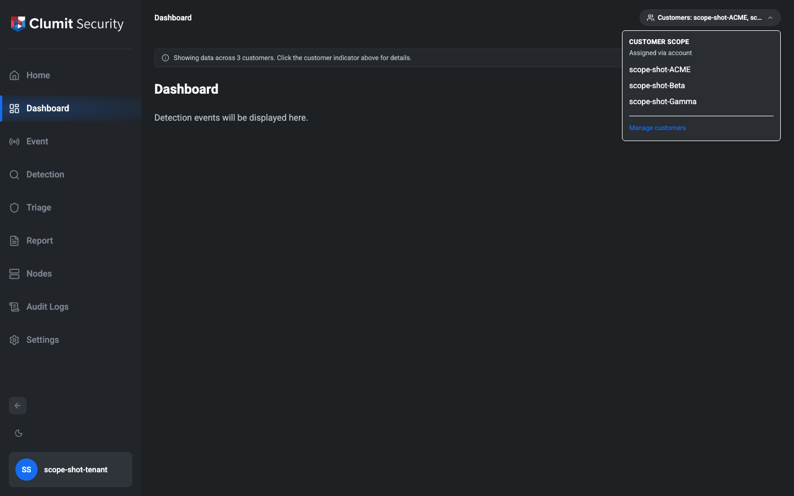
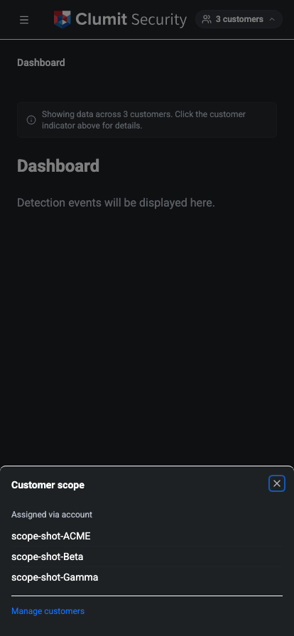
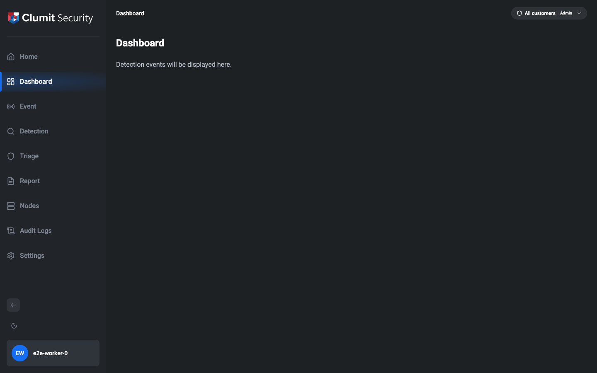

# Customer Scope Indicator

The customer scope indicator surfaces the session's effective
customer access in the application header so multi-tenant
operators always know which slice of the system they are looking
at. The indicator is read-only — it does not narrow or switch the
session; that is tracked separately as a future enhancement.

## Where the indicator appears

The indicator is rendered for every authenticated page:

- **Desktop** — right-aligned in the breadcrumb bar at the top of
  the page, sharing the row with the breadcrumb trail.
- **Mobile** — in the mobile header, right of the menu trigger
  and the logo. The pill collapses to a customer-name chip in the
  single-customer case (`ACME`), a count chip in the multi or
  admin cases (`3 customers`, `All`), or a short warning chip when
  the session has no customer access. Tapping the chip opens a
  bottom sheet rather than the desktop popover, so the full
  customer list and management link fit a narrow viewport without
  overflowing the header.

Click (or tap) the pill to open the popover (desktop) or sheet
(mobile) that lists the full set of customers in scope and labels
the source of the access.

## Indicator labels

The label format depends on how many customers the session can
see. The choice between *"admin"* and *"assigned"* sources is
independent of size — a non-admin operator who happens to be
assigned to every customer is **assigned**, not **admin**, and
the popover differentiates the two.

| Scope | Label |
|---|---|
| Single customer | `Customer: ACME` |
| 2 – 3 customers | `Customers: ACME, Beta, Gamma` |
| 4 + customers | `Customers: ACME, +N more` (popover lists all) |
| `customers:access-all` admin | `All customers` (with an Admin badge) |
| 0 customers (degenerate) | `No customer access` (warning style) |

The empty state means the session has no `account_customer`
assignment and is not an admin. The page renders cleanly but
shows a warning-styled pill so the operator notices that no
customer data is available.

## Popover

The popover anchored under the indicator shows:

- **Source** — *Assigned via account* for tenant operators or
  *Admin scope (`customers:access-all`)* for admins. Empty
  sessions show *No customers are assigned to this account.*
- **Customer list** — every name in scope. For the 4+ case the
  list is the only place where the full roster is visible.
- **Manage customers link** — appears only for operators with
  `customers:read`. Navigates to **Settings → Customers**.

## Page-level callout

When the session has more than one customer in scope and is not
an admin, top-level pages (Dashboard, Detection, Node status,
Node detail, Node settings) render a small callout above the
page content:

> Showing data across N customers. Click the customer indicator
> above for details.

Single-customer sessions and admin sessions skip this callout —
single is implicit and admins know.

## When the scope changes

The scope is resolved server-side on every navigation. If an
operator's customer assignments change mid-session (for example,
an administrator unassigns a customer), the indicator and any
filtered results update on the next page navigation.
