# Detection

The Detection page is accessed from the sidebar. It is the hub for
investigating detection results produced by the backend — filtering,
reviewing, and drilling into individual findings.

Viewing the page requires the `detection:read` permission. The
built-in roles Security Monitor, Tenant Administrator, and System
Administrator receive this permission by default. Custom roles that
grant `detection:read` also qualify.

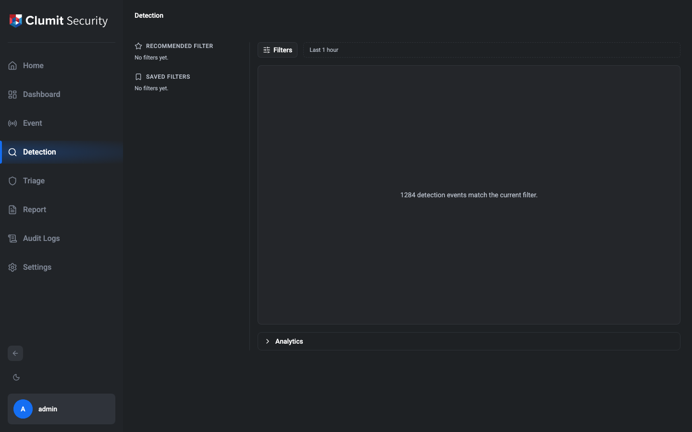

## Layout

The page is organized into four regions. The Results area is the
dominant region of the workspace; the supporting regions are kept
compact so they do not distract from the findings.

### Saved / Recommended rail

A slim rail on the left lists two sections:

- **Recommended Filter** — curated starting points.
- **Saved Filters** — personal filters you have saved yourself.

On narrow viewports the rail collapses to icons only. On desktop
widths it expands to show the section headings.

#### Recommended filters

The **Recommended Filter** section ships a curated set of broad
starting points so a new operator can land on a populated view with
one click instead of building a filter from scratch. The initial
v1 list mirrors the broad-lookback presets the team agreed on in
the umbrella:

- **3 years** — Time period set to the last 3 years, no other
  narrowing.
- **1 year, Inbound** — Time period set to the last 1 year,
  Direction restricted to **Outside → Inside**.
- **1 year** — Time period set to the last 1 year, no other
  narrowing.

Activating a row opens the preset in a **new tab** (matching the
default activation contract Saved Filters use) and auto-runs the
query so the new tab lands populated. The current tab is left
untouched, the same way the pivot path and saved-filter activation
behave. Hitting the 8-tab cap surfaces the same "close a tab to
load — already at the 8-tab limit" toast the rest of the workspace
uses; nothing is silently dropped.

The preset's start / end is resolved at activation time relative
to "now," so the filter committed today reflects the same window
the **Period** chip would compute today — not whatever window was
current when the page first rendered.

Recommended filters are **system-provided and read-only** in v1:
the rail exposes no rename / delete / save affordances. Per-tenant
recommendation lists and an admin UI to manage the set are tracked
as future work.

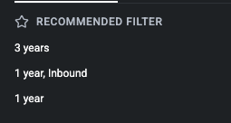

#### Saving a filter

Open the filter drawer, configure the filter you want to keep, and
click **Save this filter** in the drawer footer. A naming dialog
opens pre-populated with an auto-generated name from the filter
summary (e.g. `Last 1h · High`); accept the suggestion or type a
new one and click **Save**.

Names are personal and must be unique within your account — the
dialog reports an inline error if you reuse a name. Saving the
filter does not run the query; the saved entry shows up in the
**Saved Filters** rail immediately and remains available across
reloads.

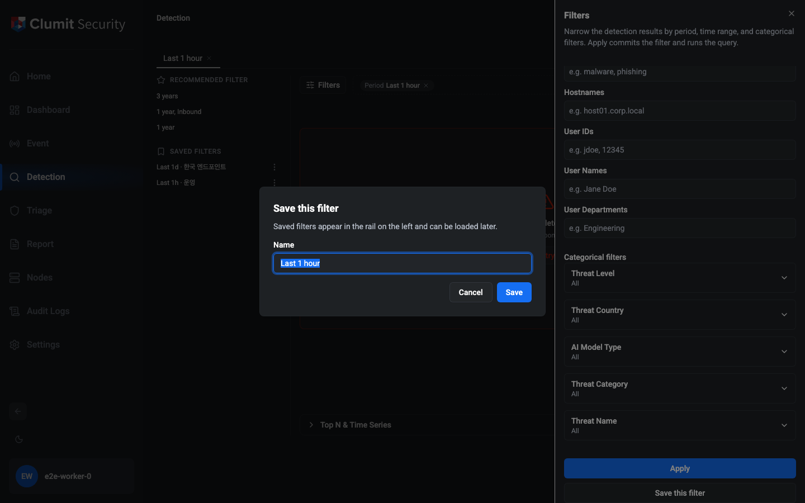

#### Loading a saved filter

Each row in the **Saved Filters** rail acts on the active workspace
when you interact with it:

- **Click the row** (or pick **Load in new tab** from the row's `⋮`
  menu) — the default action — opens a new tab pre-seeded with the
  saved filter and auto-runs the query, leaving the tab you were on
  untouched. This matches the tab-bar contract that tabs are for
  context switches.
- **Load in current tab** (from the row's `⋮` menu) replaces the
  active tab's filter with the saved filter and re-runs the query.
  The active tab's pagination resets to the first page; the rest
  of the workspace (analytics expansion, Quick peek selection)
  follows the standard Apply contract.

The filter loads with all of its committed fields applied —
including the time range, levels, sensors, source / destination,
direction, confidence bounds, country / category / kind / learning-
method selections, and Network / IP endpoints carried in the
filter payload.

If the workspace already has the maximum 8 tabs open when you
click a row or pick **Load in new tab**, the rail surfaces the
same "close a tab to load — already at the 8-tab limit" toast
the pivot path uses instead of silently no-opping. **Load in
current tab** is unaffected by the cap because it does not
create a new tab.

#### Renaming and deleting

The `⋮` menu on each saved-filter row also exposes:

- **Rename** — opens a dialog pre-populated with the current name.
  Submit a new unique name; duplicate names surface the same inline
  error as the save dialog.
- **Delete** — opens a confirmation dialog. Confirming removes the
  saved filter; the action cannot be undone in v1 (no version
  history). Open tabs that were loaded from this filter are not
  affected — the tab keeps its own copy of the filter state.

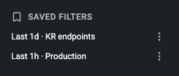

#### Scope and limits

Saved filters are **personal in v1** — only you can see and manage
the filters you have saved. Tenant or team sharing is not yet
supported. The full filter payload is stored, so a saved filter
will load correctly on any device once you sign in.

### Tab bar

Every Detection session is organised as one or more **tabs**. Each
tab carries its own filter, result slice, drawer draft, and UI
state (analytics expansion, Quick peek selection), so switching
tabs is a cheap way to hold multiple investigations in view at
once without losing context.

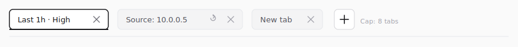

!!! note "Wireframe stand-in"

    The tab-bar illustration above is an SVG wireframe rather than a
    real capture. The bar sits above the filter chip bar and renders
    alongside the same live REview-backed result list; the authoring
    worktree has no staging backend with seeded detection data, so a
    PNG captured here would show the empty-state panel rather than
    a populated multi-tab session. Per `docs/AUTHORING.md`'s
    "Screenshot exception for infrastructure-gated features", this
    section ships localized SVG wireframes and will be replaced with
    a real screenshot once staging with sample data is available.

#### Creating tabs

On page entry, Detection starts with one **default tab** on the
**Last 1 hour** filter and auto-runs the query, so the first
view is never empty.

- The `+` affordance on the right of the tab bar creates a new
  tab populated with the same default filter, but **does not
  auto-run** — the tab lands on the pre-query empty state
  ("Build a filter to begin") and the operator clicks Apply to
  populate it.
- Activating a **saved filter** or a **recommended filter** from
  the slim left rail (default click — see "Saved Filters" and
  "Recommended filters" above) or following a **pivot link**
  (Phase Detection-12) also creates a new tab pre-seeded with the
  target filter rather than replacing the current tab.

The tab cap is **8 simultaneous tabs**. At the cap the `+`
affordance disables and surfaces a tooltip explaining that you
need to close a tab first; saved-filter activation and pivot
links surface the same cap message in a transient toast instead
of silently no-opping.

#### Switching tabs

Clicking a tab immediately activates it: the filter drawer and
the active chip bar re-synchronise to the selected tab's filter,
and the result list shows that tab's cached result. Switching
tabs **does not hit the network** — the result you see is the
one that was last fetched for that tab. Click **Refresh** on
the result header, or reopen the drawer and Apply, to re-run
the query.

An **Apply** affects only the active tab — each tab holds its
own independent result slice.

#### Closing tabs

Each tab exposes a × close affordance on hover. Closing an
active tab activates its right-hand neighbour (or the left-hand
neighbour when the closed tab was the rightmost). Closing the
last remaining tab auto-creates a fresh default tab so the
workspace is never empty; the fresh tab lands in the pre-query
empty state (same as the `+` affordance) — click Apply to run
the query.

#### Tab names

Tab labels are auto-derived from the tab's filter summary — a
short dot-separated concatenation of the first two chips, e.g.
`Last 1h · High`. The label updates as the filter changes so
each tab in the bar remains scan-readable.

Double-click a tab label (or press `Enter` on it) to rename the
tab; press `Enter` again to commit, or `Esc` to cancel. A
manually-renamed tab gains a small **Reset name** affordance —
clicking it clears the manual override and lets the auto label
take over again. Manual renames are preserved across filter
edits: the tab stays on the name you chose even if the filter
behind it changes.

#### Freshness indicator

The result header for the active tab shows **Updated _N_ ago**
with a ticking relative timestamp, plus a **Refresh** button.
This is a per-tab indicator — inactive tabs keep their own
`Updated` timestamp and refresh state until you switch back.

#### What persists across reloads

Tab state is persisted so a browser reload or a mistaken
navigation does not lose your work:

- **URL search params** carry the **active tab's filter** and
  its pagination — the shareable surface. The active filter
  rides in a single `?f=<encoded>` parameter that round-trips
  the full filter shape (every structured field — time range,
  levels, countries, learning methods, categories, threat
  kinds, directions, confidence bounds, sensors, source /
  destination, tag inputs, endpoints — and the future query-
  language mode). A `?tab=<id>` parameter anchors which tab is
  active, and a link recipient opens that tab as their single
  bootstrap tab. URLs do NOT carry the other tabs you had
  open; those are private to your session. Outbound
  Investigation handoff links of the older shape
  `/detection?source=X&window=1d&kind=HttpThreat` continue to
  bootstrap the destination tab — the page parses the legacy
  pivot params when `?f=` is absent and flips the URL over to
  the encoded blob on the next state mutation.
- **`sessionStorage`** carries everything else: the full tab
  list (filter, name, manual-rename flag, endpoints,
  pagination, drawer draft, analytics expansion), so a reload
  restores all the tabs you had open. Cached events are not
  persisted — inactive tabs return to the pre-query empty
  state on reload and you click **Apply** to re-populate.
  Refresh stays disabled for a tab in the pre-query empty
  state (matching the `+`-affordance "no auto-run" rule), so
  the first query after rehydrate always goes through Apply.

Because shareable URL state is narrower than private session
state, the split is documented in the persistence module so
future contributors can reason about each store's contract
separately.

### Top bar

The top of the main region holds the **Filters** button and the
active filter chip bar. Clicking **Filters** opens the filter
drawer on the right; the chip bar to its right summarises the
filter currently applied to the active tab.

The chip bar is built from a single shared helper
(`summarizeFilter(filter: Filter)`) so every surface that renders
chips — the active bar and any future forms of it — follow the
same aggregation rules:

- The committed period (or explicit time range) always renders as
  a removable `Period: …` chip so the operator can drop it with
  `×` just like any other filter.
- Single-value fields (`Source`, `Destination`) render as a single
  chip with the value (e.g. `Source: 10.0.0.5`).
- Tag fields with **1–3** values render one chip per value.
- Tag fields with **more than 3** values collapse to a single
  count token (e.g. `Keywords: 12`). Activating the count chip
  reopens the drawer focused on that field so you can edit the
  list.
- Direction, Confidence, Sensor, and every categorical
  multi-select (Threat Level, Threat Country, AI Model Type,
  Threat Category, Threat Name) follow the same ≤ 3 / aggregate
  rule.

When the future search-language filter mode is enabled
(`Filter.mode === "query"`) the shared helper returns no chips
and the bar will instead render the query text as a single
editable pill — the query language can express OR / NOT / regex
that structured chips cannot represent. The pill's query editor
lands in a later phase; until then, query-mode filters carry no
chip-level decomposition.

Every chip carries an `×` affordance. Pressing `×` is a
self-contained commit — the field is removed from the active
filter immediately, the query re-runs, and the chip disappears.
For aggregate chips (e.g. `Hostnames: 7`) the `×` removes the
whole field. Single-value removal is atomic and explicit, so it
does not conflict with the drawer's Apply-centric model — Apply
exists to batch multi-field edits. Activating a chip's body
(rather than its `×`) opens the filter drawer scrolled to the
matching section (text / tag chips focus the input; the period,
direction, confidence, sensor, endpoint, and categorical chips
scroll their section into view) so you can amend the value
before re-applying.

The active tab's filter — every drawer field, the time range,
the endpoint entries, and any URL-only pivot extras — is
persisted in a single `?f=<encoded>` URL parameter, so a
reload restores exactly what you had committed (including the
period). Outbound Investigation pivot links keep the older
human-readable shape (`?source=X&window=1d&keywords=alpha,beta`)
for inbound bootstraps; the URL writer flips them over to the
encoded blob on the next Apply / chip removal so a subsequent
share-this-URL carries the full filter.

### Results

The Results region is the **hero** of the main work area: it
occupies the largest share of the viewport at every supported
width. On page entry the default filter (**Last 1 hour**) runs
automatically so the page is never empty on first view.

#### Header line

A single header line above the list shows:

- The result count and time range
  (`Detected events <range> / <totalCount>`). Total counts are
  64-bit safe — REview returns them as strings to avoid loss of
  precision, and the UI displays them verbatim.
- An **Updated _N_ ago** label that refreshes itself in the
  background so you can see how stale the current view is.
- A **Refresh** affordance that re-runs the active filter
  without going through the drawer. Refresh is disabled on a
  newly-created (`+`) tab until the first Apply, so the operator
  always opens the drawer once before any results appear.
- A **Download CSV** button that exports the active tab's
  filtered result set. See [Export to CSV](#export-to-csv)
  below for the column layout, the filename, and the large-
  export confirmation flow.

#### Result rows

Each detection event renders as a compact two-line entry:

- **Line 1** — severity badge (LOW / MEDIUM / HIGH), event time
  (locale-aware), event kind (e.g. `HTTP Threat`), an optional
  attack kind for the ML subtypes, the threat category, the
  detection confidence score, and a triage summary (max score +
  policy count) when triage scores are present.
- **Line 2** — `source endpoint → destination endpoint`, each
  endpoint formatted as `IP[:port] (country)`, followed by the
  sensor name and a fixed pair of identity cells: a
  `User: <username>` cell and a `Host: <hostname>` cell. Subtypes
  whose source or destination is an array show the first entry
  plus a `+N more` button; clicking the button opens an inline
  popover listing every hidden IP or port. The user / host cells
  are pivotable when the event subtype emits the underlying field
  per the REview schema — see the [Pivot section](#pivot-drill-down-from-result-cells)
  for the full list of subtypes that emit each field. Subtypes
  that do not emit the field render the cell as a non-pivotable
  `User: —` / `Host: —` token so the column position stays stable
  across the list and the operator can tell that the row simply
  has no identity to pivot on (rather than guessing whether the
  column was hidden).

Severity, time, and kind are present for every event subtype.
Source IP+port and destination IP+port are present for every
subtype that the vendored schema exposes as network-side — two
host-/agent-side subtypes (`ExtraThreat`, `WindowsThreat`) carry
no addressing fields at all, and those rows drop the source →
destination line entirely (see the schema-limited note below).
At narrower viewports the row tightens (shorter country labels,
truncated attack kind with a tooltip, secondary labels such as
attack kind, category, confidence, and triage summary are hidden),
and at the narrowest widths the source and destination stack
vertically — whenever the source → destination line is rendered,
the destination and the severity indicator are never hidden.

#### Empty, loading, and error states

The result region uses distinct panels for each non-ready state:

- **Loading** — shows a spinner with `Running query…` while the
  active filter is being executed.
- **Error** — shows `Could not load detection results`, a short
  hint, and an inline **Retry** button so a transient failure
  does not require reopening the drawer.
- **No matches** — shown when the query succeeds but returns zero
  events. The copy invites the operator to loosen the filter or
  pick a wider time range.
- **Build a filter to begin** — the rare empty pre-query state
  (a freshly-created tab or a tab whose filter has been fully
  cleared). The panel offers a button that opens the drawer.

#### Row interactions

Clicking anywhere on a row body opens the **Quick peek**
inspector (see the dedicated section below). The inline `›` icon
at the end of the row opens the full Investigation view directly,
skipping Quick peek. Investigation navigation is locale-aware and
carries a `returnTo` URL parameter so the Back link returns to
the exact Detection tab the operator left, including the active
filter's chip state.

Two subtypes in the vendored schema — `ExtraThreat` and
`WindowsThreat` — model host- / agent-side threats and expose no
network addressing at all. For those rows the source →
destination line is omitted, and the row still renders severity,
time, kind, confidence, triage summary, and sensor. A handful of
other subtypes omit one side or one port (for example
`UnusualDestinationPattern` is responder-array only, and
`RdpBruteForce` omits the originator port); in those cases the
missing slot falls back to `—`.

Selecting any row opens the Quick peek inspector, including the
schema-limited subtypes that have no encodable locator —
`ExtraThreat`, `WindowsThreat`, and rows that happen to carry
neither source nor destination IP. The inspector still renders
every field the schema provides for those events. Only the
investigate chevron is hidden on those rows, because it would
navigate through the locator token the investigation page needs;
the Quick peek itself stays available. The URL mirror skips the
selection for these rows (the token cannot be encoded), so a
reload or shared link restores the peek only for selections that
do round-trip through the locator.

### Pivot (drill-down) from result cells

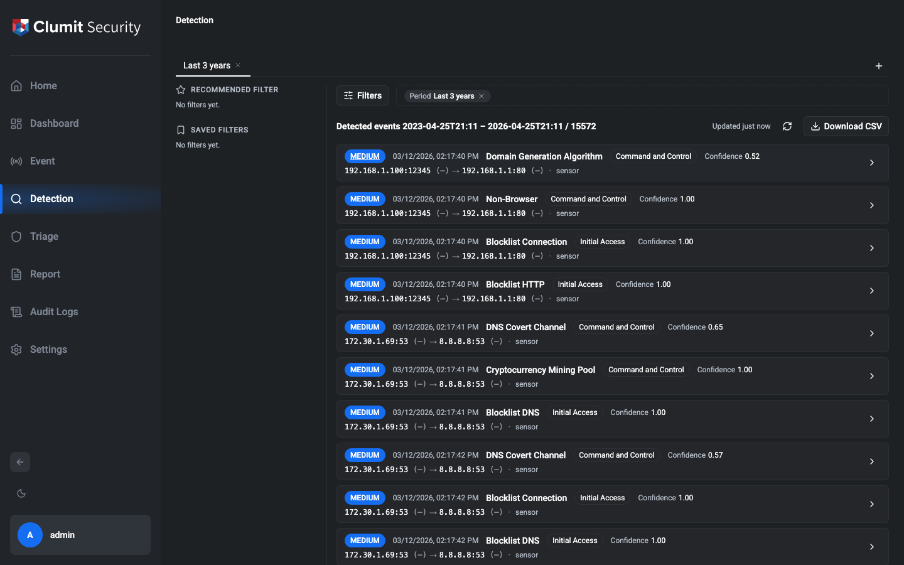

Pivotable cell values render as in-line buttons — hover reveals an
underline and the cursor flips to a pointer. Activating a cell
narrows the active filter by that value and opens it in a new tab,
or focuses an existing tab with a brief flash if one already
carries the resulting filter. Pivots inherit the active tab's
relative period (e.g. **Last 1 hour**), so two clicks from a
1-hour tab pivot into a 1-hour tab.

The pivotable cells in v1:

| Cell                    | Filter field merged                                |
| ----------------------- | -------------------------------------------------- |
| Severity badge          | `levels` (add unique)                              |
| Threat name (Kind)      | `kinds` (add unique)                               |
| Category badge          | `categories` (add unique)                          |
| Source IP               | `endpoints` with `direction: FROM` (new entry)     |
| Destination IP          | `endpoints` with `direction: TO` (new entry)       |
| Country code            | `countries` (add unique)                           |
| User name (`User: …`)   | `userNames` (add unique)                           |
| Hostname (`Host: …`)    | `hostnames` (add unique)                           |

The user / host identity cells follow the sensor on the second
line of every row. The cell is pivotable when the event subtype
emits the underlying field per the REview schema:

- **userName** — HTTP-class events (`HttpThreat`, `BlocklistHttp`,
  `DomainGenerationAlgorithm`, `NonBrowser`, `TorConnection`) and
  `BlocklistNtlm` carry `username`; `BlocklistRadius` carries the
  camelCase outlier `userName`; the FTP plain-text family
  (`BlocklistFtp`, `FtpPlainText`) and `WindowsThreat` carry the
  documented-as-Username `user` field.
- **hostname** — HTTP-class events carry `host`; `BlocklistNtlm`
  carries `hostname`.

Subtypes outside that set render the cell as a non-pivotable
dash (`User: —` / `Host: —`) so the column position stays stable
across the list and the click affordance is suppressed because
there is no value to merge into the active filter.

Three more columns the pivot engine recognises — `userId`,
`userDepartment`, and `direction` (`FlowKind`) — are tracked in
[issue #348](https://github.com/aicers/aice-web-next/issues/348)
and will only become actionable once REview extends the per-event
payload to include them. They are not surfaced in the row today.

A click that would only re-narrow the **active tab** by a value it
already carries shows a transient toast — `Already filtered by X`
— and creates no new tab. A click that targets a filter another
tab already represents focuses that tab and flashes its label
briefly so the operator sees which tab now holds focus. A click
that would push past the 8-tab limit shows a cap-reached toast
instead of opening a tab; close one first.

The buttons are keyboard-reachable: tab to the cell, press **Enter**
or **Space** to activate. The cell itself layers above the row's
overlay button, so a click on the cell does not also open Quick
peek — the row-open click only fires on the row body around the
cells. Country pivots are skipped for the sentinel codes `XX`
(unknown) and `ZZ` (unavailable) since they are not real ISO
codes; clicking those values is a no-op. Right-click context-menu
pivots and exclusion (NOT) pivots are out of scope for v1.

## Quick peek inspector

Selecting a row opens the **Quick peek** inspector — a compact
summary of the event that stays in context with the result list
so you can triage without leaving the tab.

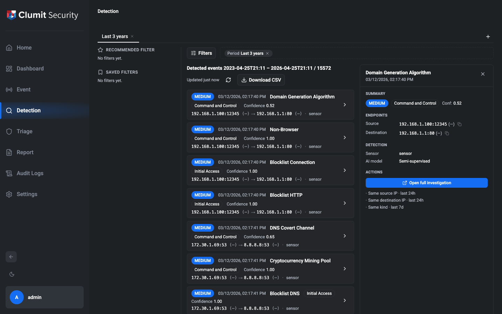

### Responsive surface

- **Wide viewport (≥ 1280 px)**: Quick peek renders as an inline
  right-hand **inspector pane**. The result list shrinks to make
  room so the list and the inspector coexist side-by-side.
- **Narrower viewports**: Quick peek renders as an overlay
  **drawer** above the list, so smaller screens do not try to
  fit two columns of dense data. The list keeps its full width
  beneath the overlay.

The breakpoint matches the slim-rail breakpoint used elsewhere in
the page.

### Dismissing the peek

Quick peek is dismissable via the close affordance (inline Close
button on desktop, Sheet-supplied Close on the overlay drawer),
the Escape key, or by selecting a different row — picking another
row updates the existing peek's content rather than opening a
second instance. It also closes the instant a committed query
transition is dispatched (Apply, chip removal, or Refresh) so
there is no window during the round-trip where the inspector
could still describe a row the newly committed filter no longer
returns.

### Content

The peek groups the event's most useful fields into short,
collapsible-free sections. Empty fields are **hidden** rather
than rendered as `(Not Provided)` placeholders, so a peek on a
subtype whose schema omits certain fields simply shows fewer
rows rather than a column of dashes.

- **Summary** — severity level, threat category, detection
  confidence, and the triage summary (max score + policy count)
  when triage scores are present.
- **Endpoints** — source and destination, each rendered as
  `IP[:port] (country)`. The country label is an inert text
  span — country pivots are out of scope for v1 (see the
  issue's **Pivot affordances** note). Sentinel codes (`??`,
  `—`) represent `location unknown` / `location unavailable`.
  Array-valued endpoints — `origAddrs` (`ExternalDdos`),
  `respAddrs` (`MultiHostPortScan`, `RdpBruteForce`,
  `UnusualDestinationPattern`), `respPorts` (`PortScan`) —
  render up to three tuples inline, then fold any remainder
  into a `+N more` button. Each inline tuple keeps its per-entry
  country (so the four-host `MultiHostPortScan` case shows three
  flags alongside the three hosts rather than flattening to a
  single country). For the `PortScan` shape — one shared responder
  IP with an array of ports — the shared IP and country back-fill
  every inline tuple so each port still reads as `IP:port
  (country)` rather than a bare port number. Activating the
  `+N more` button opens an inline popover that lists every
  remaining tuple with the same formatting. The popover dismisses
  on outside click or Escape and uses the same control as the
  result list. Pressing Escape with a popover open only closes
  the popover; the enclosing Quick peek inspector stays open and
  a subsequent Escape dismisses it. A subtle copy-to-clipboard icon next to each inline
  IP copies the literal into the clipboard for use in another
  tool; the same Copy affordance is preserved on every entry
  inside the `+N more` popover so the 4th+ overflowed responder
  remains one click away. Copy there emits the raw IP (not the
  `IP:port (country)` display string) so it drops cleanly into
  another tool.
- **Detection** — the sensor that produced the event, the ML
  subtype's `attackKind` when present, and the `learningMethod`
  (Unsupervised / Semi-supervised) for the ML threat types.
- **Protocol** — a handful of kind-specific fields that matter
  at a glance. Each subtype exposes under ten fields; the rest
  belongs to the Investigation view. Current highlights include
  method / host / URI / status code for HTTP subtypes
  (`HttpThreat`, `BlocklistHttp`), query / type / response code
  for DNS subtypes (`DnsCovertChannel`, `BlocklistDns`), server
  name / version / JA3 for the TLS subtypes
  (`SuspiciousTlsTraffic`, `BlocklistTls`), user list / internal
  flag plus detection window for `FtpBruteForce`, and the
  detection window for `RdpBruteForce`, `PortScan`,
  `MultiHostPortScan`, and `ExternalDdos`. Subtypes without
  highlights render no Protocol section. Hostname, URI, DNS
  query, JA3, and user-identifier values expose a hover-revealed
  copy icon so the operator can pull a single literal into the
  clipboard. For array-valued identifiers such as `userList`, the
  Copy affordance is preserved inside the `+N more` popover so
  the 4th and later entries stay one click away from the
  clipboard.
- **Actions**:
  - **Open full investigation** jumps into the Investigation
    view at `/events/<eventToken>`. It is a real anchor tag,
    so **middle-click** or **Cmd/Ctrl-click** opens the full
    page in a new browser tab while leaving the current
    Detection tab's filter and peek state intact. The anchor
    is omitted (not disabled) for subtypes that carry no
    encodable locator — `ExtraThreat`, `WindowsThreat`, and
    some host-only subtypes — since no link would land on a
    valid investigation.
  - **Pivot links** — `Same source IP · last 24h`,
    `Same destination IP · last 24h`, and `Same kind ·
    last 7d` — are also real anchor tags pointing at the
    `/detection?…` page, so they can be middle-clicked into a
    new tab. Pivot targets that are not present on the event
    (e.g. source IP on a response-only subtype) are omitted
    rather than rendered as dead controls.

### Selected-event URL state

The selected event's locator token (the same base64url token the
Investigation view uses) is mirrored into the tab's URL as an
`event` query parameter. A page refresh or shared link restores
the peek on the same row — when the token's locator still matches
an event in the current result slice. When the restored token
does not match any event in the current slice (pagination
shifted, filter narrowed, event aged out), the token is stripped
from the URL on mount and the peek stays closed rather than
opening on an arbitrary row. If the first slice fails to load
(e.g. a transient backend error on a shared link), the URL token
is preserved across the error panel and the multi-tab wrapper's
URL rewrites until the operator's next successful Retry / Refresh
— that successful slice is what decides whether to restore the
peek or strip the now-stale token. Clicking Refresh or committing any
new query clears the `event` parameter from the URL so a
subsequent reload lands on a clean slate rather than resurrecting
the stale selection. The URL write uses `history.replaceState`,
so Back does not rewind the peek and does not add a navigation
entry per click.

Only one event is selected at a time; selecting another row
replaces the token in the URL rather than stacking peeks.
Selecting a row whose event cannot be encoded into a locator
(`ExtraThreat`, `WindowsThreat`, or any row that is missing both
source and destination IP) still opens the Quick peek inspector,
but the URL `event` parameter is cleared on that selection — the
peek is live for the current tab only and will not be restored by
a reload or shared link.

#### Pagination

A Gmail-style paginator sits immediately below the result rows.
It carries, from left to right, the page-size selector, the
locale-grouped range + total indicator (`1–50 of 1,453`), the
**First** / **Previous** page indicator / **Next** / **Last**
controls, and a **Go to page** input for rare deep seeks.

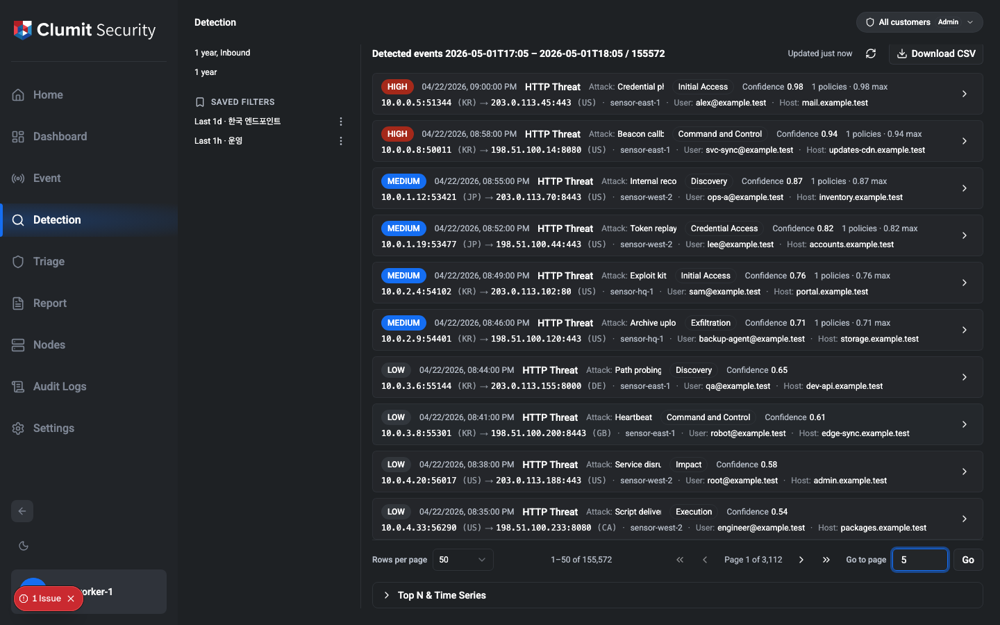

- **Rows per page** toggles between `25`, `50`, `100`, and `200`.
  The default is `50`. Changing the size keeps the operator near
  the start of the current window: on page 3 at `50/page`
  (rows 101–150), switching to `100/page` lands on page 2
  (rows 101–200) instead of snapping back to page 1. Because
  REview cursors are page-size scoped, this is accomplished by
  walking forward from head at the new size — the same cursor
  walk Go-to-page uses — so deep windows cost one request per
  page traversed.
- The **range indicator** formats totals and page bounds with
  locale-aware grouping (for example, `1–50 of 1,453`). Totals are
  BigInt-safe: REview returns them as strings and the UI preserves
  that precision end-to-end, so counts beyond `2^53` still render
  without rounding.
- **First / Previous / Next / Last** walk adjacent windows.
  **First** uses `first: pageSize`. **Previous** and **Next** use
  the current page's `startCursor` / `endCursor` to paginate one
  window at a time. **Last** narrows its request to the partial
  final page's real row count when the total is known — on 1,453
  rows at `100/page` it asks for `last: 53` so the window lands on
  rows 1,401–1,453 under the `Page 15 of 15` label, rather than
  the straddling `last: 100` window (1,354–1,453) that Relay's
  spec returns by default. If the total has drifted since the
  current window was loaded (new events arrived in the background,
  for example), the paginator re-queries once with the freshly
  returned `totalCount` so the rows, page label, and range
  indicator all reflect the same up-to-date total. Buttons
  auto-disable at the boundaries — First and Previous gray out at
  the head, Next and Last gray out at the tail.
- The **Go to page** input jumps to an explicit page number. The
  input accepts positive integers only — scientific notation
  (`1e3`), decimals, and signed values are rejected so the target
  page always matches what was typed. For a target that is not 1
  or the last page, the input walks cursors forward one request
  at a time: page 50 from page 1 requires 49 sequential requests,
  since Relay cursors have no O(1) jump. A subtle `Walking…
  page N of M` hint appears under the input while the walk is in
  flight so the operation does not look hung. A target that
  exceeds the derived total page count is capped at the last page
  instead of walking forever, and applies the same partial-final-
  page + drift correction as the **Last** button.

Per-tab pagination state — page size, page number, and the anchor
cursor — is serialized into the URL alongside the filter. Refreshing
the page (or sharing the URL) restores the exact slice you were
viewing. Applying a new filter or removing a chip resets the
anchor to the head of the new connection, because cursors are
scoped to a single committed filter and carrying them across
filters would point at stale positions.

### Top N & Time Series analytics

Below Results, an analytics strip surfaces two aggregate views of the
active tab's filter: a **Top N** breakdown by the dimension you pick
and an **Event frequency** time series over the filter's time range.

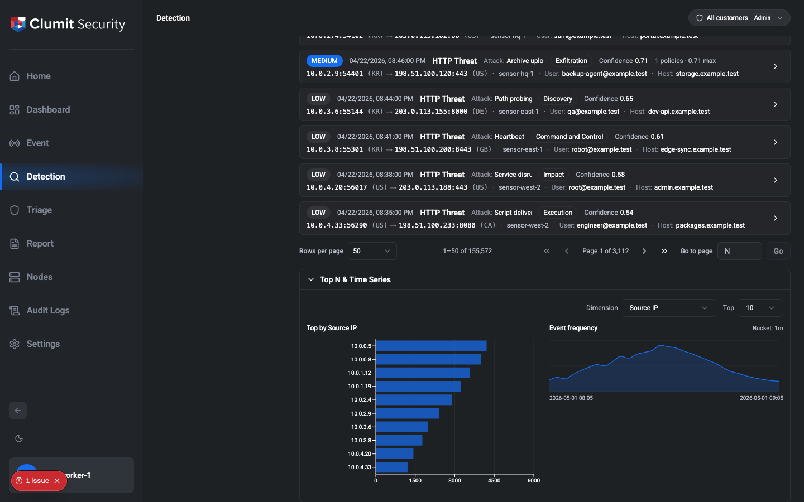

The strip is **collapsed by default**. Clicking the `▸ Top N & Time
Series` affordance expands it inline below the result list. The
result list keeps its full width and stays the focus of the page —
expanding the strip never covers or shrinks the rows.

The collapse state, the selected dimension, and the Top N count are
**per-tab** and persist across reloads in the same browser session.
Switching tabs re-renders the strip against the active tab's filter
and remembers each tab's open / collapsed state, dimension, and
count independently.

#### Lazy fetching

The strip does **not** hit the server while it is collapsed. The
first time you expand it in a given tab, both queries dispatch in
parallel. Subsequent committed filter changes (Apply, chip removal)
re-fetch automatically while the strip is open. Re-applying the
same relative period (e.g. clicking **Last 1 hour** again from the
drawer) recomputes the time window, so the strip refetches against
the new bounds even though the period chip text is unchanged.

Collapsing the strip aborts any in-flight fetch. Reopening it with
the same filter / dimension / Top N reuses the cached payload and
skips the network round-trip; if any of those inputs changed while
the strip was closed, the next expansion fetches fresh data. The
**Retry** button on the error state always bypasses the cache.

#### Dimension selector

Pick the dimension that powers the Top N chart from the dropdown:

- **Source IP** (`origAddr`)
- **Destination IP** (`respAddr`)
- **Country** — combined originator + responder country codes; the
  REview sentinel codes `XX` (location unknown) and `ZZ` (location
  database unavailable) appear with localized labels.
- **Threat Category** — MITRE-style category labels.
- **Threat Level** — `Low`, `Medium`, `High`.
- **Threat Name** — the canonical event subtype name (`HttpThreat`,
  `PortScan`, …).

The **Top** selector controls how many rows the chart shows: `5`,
`10` (default), or `20`. Each row is a horizontal bar proportional
to the dimension's largest count.

#### Event frequency time series

The right-hand chart plots the event frequency for the filter's
time range. The bucket size is auto-derived from the range:

| Range | Bucket |
|---|---|
| ≤ 3 hours | 1 minute |
| ≤ 1 day | 10 minutes |
| ≤ 1 week | 1 hour |
| ≤ 1 month | 6 hours |
| ≤ 3 months | 1 day |
| ≤ 1 year | 1 week |
| larger | ~30 days |

The chart's caption shows the filter's start / end (UTC, compact
form) and the active bucket size so it is easy to read what the
chart spans even after a filter edit.

#### Pivoting from chart rows

For the dimensions whose values map cleanly onto a single
`EventListFilterInput` field — Source IP, Destination IP, Threat
Category, Threat Level, and Threat Name — clicking a Top N row
opens (or focuses) a tab narrowed to that value. The behaviour
matches the result-list pivot contract from
[Pivot (drill-down) from result cells](#pivot-drill-down-from-result-cells):
already-narrowed filters surface a "Already filtered by …" toast
instead of duplicating a tab. Country rows are not clickable
because REview's `eventCountsByCountry` mixes originator and
responder rows and a single click cannot decide between
`origCountry` and `respCountry`.

#### Loading, empty, and error states

The strip surfaces its own panel for each transient state, distinct
from the result list:

- **Loading** — both queries are in flight.
- **Empty** — both queries returned zero rows. The strip recommends
  broadening the filter rather than the result list's "open
  filters" affordance, because the result list is already showing
  the same zero-events condition.
- **Error** — REview rejected one of the queries; a `Retry` button
  re-issues the pair without affecting the result list.
- **Forbidden** — your account lacks `detection:read`. The same
  permission already gates the result list, so this state is
  reached only when the role changes between the page load and the
  strip's first expansion.

#### Chart implementation note

The Top N chart and the event-frequency time series both render via
[Recharts](https://recharts.org/). Recharts also ships
`<FunnelChart>`, `<Sankey>`, and stacked `<Bar stackId>`, which is
the criterion the upcoming Triage menu funnel view requires — so
the same dependency will cover both phases without introducing a
second charting library.

## Filter drawer

The filter drawer is where you describe the window of detection
events you want to look at. It opens from the **Filters** button
in the top bar and slides in from the right.

### Period

The **Period** section exposes the common relative windows as
chips: `Last 1 hour`, `Last 12 hours`, `Last 1 day`, `Last 1 week`,
`Last 1 month`, `Last 3 months`, `Last 6 months`, `Last 1 year`,
`Last 3 years`. Picking a chip fills the **Time period** inputs
with its start and end.

### Time period

Two `datetime-local` inputs let you specify an explicit start and
end. Editing either input clears the Period chip selection — an
edited range is no longer a quick-select window.

### Direction

The **Direction** section is a three-way multi-select matching the
backend's `FlowKind` values:

- `Inside → Outside` (outbound traffic)
- `Inside → Inside` (internal traffic)
- `Outside → Inside` (inbound traffic)

All three are selected by default, which is equivalent to "no
filter" — the submitted filter omits `directions` in that case.
Toggle a chip off to drop that direction from the results. The
drawer refuses to empty the set: attempting to deselect the last
remaining direction silently reverts to all three selected, since
an empty selection would mean "no rows".

When fewer than three are selected, the active filter chip bar
renders one chip per selected direction (e.g. `Direction: Inbound`,
`Direction: Internal`).

### Confidence

The **Confidence** section narrows the result set to events whose
detection score falls within a `[min, max]` window. The domain is
`0.00`–`1.00` with two-decimal precision; arrow keys nudge the
focused input by `0.01`, `Home` jumps to the input's lower bound
(`0.00` for min, the current min for max), and `End` jumps to the
corresponding upper bound.

The inputs cannot produce a reversed range — typing a min that
exceeds the current max snaps max upward, and vice versa. Leaving
both inputs at `0.00` / `1.00` is the "no filter" default and
omits `confidenceMin` / `confidenceMax` from the submitted query.
Any non-default range surfaces a single chip in the active filter
bar (for example, `Confidence 0.70 – 1.00`).

### Customer

**Customer** is a multi-select that narrows results to a subset
of the customers your account can access. The list is sourced from
the same scope helper that drives the customer indicator in the
page header, so the drawer and the indicator always agree about
which customers are visible.

Open the control to reveal a search box, a **Select all / Clear
selection** toggle, and a scrollable list of customer names; picked
customers also appear as removable chips just below the control.
The customer list is delivered with the Detection page itself, so
the drawer is populated the very first time it opens — no waiting
for a separate fetch. A small **↻** refresh icon in the panel
header explicitly re-fetches the customer list; this is useful
when an admin has just changed account-customer assignments in
another browser tab. There is no automatic refresh; the cached
list is reused for every drawer open and is shared across every
filter tab in the current page session.

Applying the filter submits the selected customer IDs. They show
up in the active chip bar at the top of the page following the
shared aggregation rule — one chip per customer for one to three
selections, a single `Customer: N selected` aggregate token for
four or more.

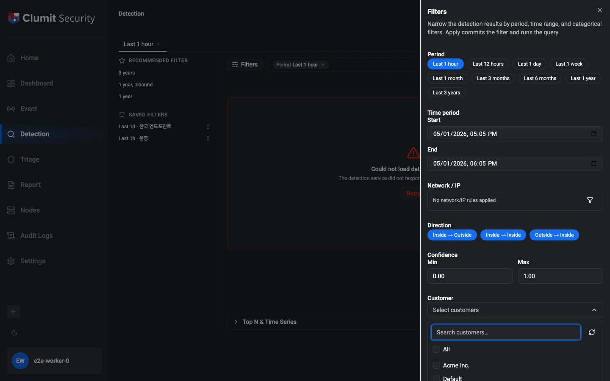

If your account has **no customers in scope**, the control is
disabled with a **No customer access** affordance and the filter
never submits a `customers` value. A manual **↻** refresh button
sits next to the disabled control on this path so an operator
whose admin just assigned them a customer in another tab can
recover without reloading the page.

The customer list is lazy-loaded: opening the Detection page
does not fetch it, the first time you open the filter drawer in a
page session does, and subsequent drawer opens reuse the cached
result. While the first-open fetch is in flight the control shows
a **Loading customers…** affordance with an inline spinner so the
in-flight fetch is visible at a glance; if it fails transiently, a
**Failed to load customers** message is displayed alongside an
inline **Retry** button so you can recover without closing and
reopening the drawer. Customer chips that arrive on the very
first paint via a bookmarked `?f=` URL, a saved filter, or a
pivot link still render with the customer **name** rather than a
raw ID — the page-rendered customer scope payload is reused for
chip-name lookups during that brief loading window.

> Security note: aice-web-next independently rejects any filter
> whose `customers` list references a customer outside your
> effective scope. Loading a saved filter, activating a recommended
> filter, or following a pivot URL whose `customers` list exceeds
> your current scope produces a clear failure rather than silently
> stripping the offending IDs and returning a partial result. When
> a Detection query (or a CSV export) is rejected for this reason
> the result region (or export banner) shows an actionable
> **This filter references a customer outside your access. Remove
> the unavailable customers and retry.** message rather than the
> generic transient-error copy. The backend (REview) applies its
> own intersection on top, but the aice-web-next side is no longer
> relying on REview as the only enforcement point.

### Sensor

**Sensor** is a multi-select backed by the sensor inventory that
the detection backend maintains for the customers you can access.
Open the control to reveal a search box, a **Select all / Clear
selection** toggle, and a scrollable list of sensors; picked
sensors also appear as removable chips just below the control.

Applying the filter submits the selected sensor IDs; they show up
in the active chip bar at the top of the page. For one to three
selections each sensor gets its own chip; four or more collapse to
a single `Sensor: N selected` aggregate token so the bar does not
wrap unpredictably.

If the detection backend in use has not yet published the
sensor-list endpoint, the Sensor control falls back to the same
**Coming soon** disabled state as Customer and is simply not
submitted. This fallback only appears in transitional builds — as
soon as the backend ships the endpoint the control becomes
functional without any further change here.

While the sensor list is being fetched on the first drawer open,
the control shows a **Loading sensors…** affordance instead of
**Coming soon** so the disabled state is not mistaken for a
missing endpoint. If the fetch fails transiently, the control
surfaces a **Could not load sensors** message with an inline
**Retry** button; clicking Retry re-issues the request without
having to close and reopen the drawer.

### Source, destination, and user attributes

Below the sensor control, a dedicated **Attributes** section narrows
the query by free-form strings.

- **Source** and **Destination** are single-value text inputs — the
  active filter carries exactly one source string and one destination
  string at a time. Validation is lenient: the backend rejects
  malformed values, so operators can paste whatever REview accepts.
- **Keywords**, **Hostnames**, **User IDs**, **User Names**, and
  **User Departments** are tag inputs. Press `Enter` or type a comma
  to commit the current entry as a chip; `Backspace` on an empty
  input removes the most recent tag. Paste a comma-separated or
  newline-separated list to bulk-add many values at once. Entries
  are trimmed and deduped automatically.

Clearing all tags in a field omits that field from the submitted
filter entirely. Apply also mirrors the free-form fields into the
URL so a refresh restores the active tab's filter state.

### Categorical filters

Below the time range, a **Categorical filters** section groups the
per-event dimensions you can narrow by. Each dimension is a
multi-select with the same interaction pattern:

- A trigger shows the current summary. For closed-list fields
  (Threat Level, Threat Country, AI Model Type, Threat Category)
  the summary reads `All` when everything or nothing is selected —
  both mean "no filter" — and `N selected` otherwise. **Threat
  Name** is treated as an open list while its options are still a
  seed subset (see below): a saturated Threat Name selection reads
  as `N selected` rather than `All`, because the submitted filter
  still actively constrains to the visible list.
- An **All** master toggle selects or clears every option. When
  some but not all options are checked, the toggle renders as a
  mixed state.
- Long lists (Threat Country, Threat Category, Threat Name) expose
  a case-insensitive substring search above the options.
- For closed-list fields, selecting zero options and selecting
  every option are both treated as "no filter" — the field is
  omitted from the submitted query and does not appear in the chip
  bar. Threat Name follows a different rule: selecting zero still
  omits the field, but selecting every visible option submits the
  explicit list and still emits chips, since the seed list is not
  exhaustive.

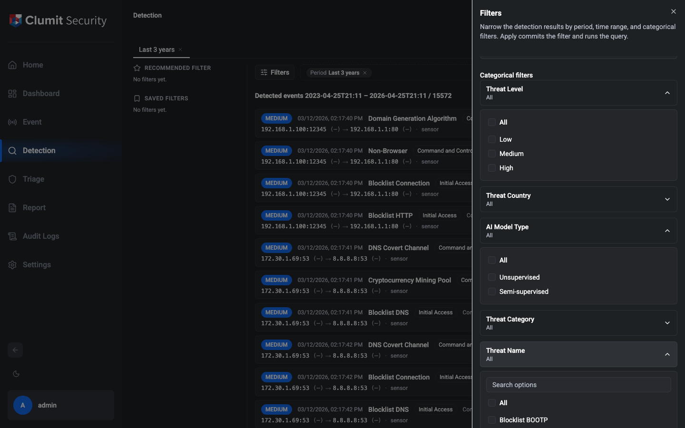

The five categorical fields are:

- **Threat Level** — `Low` / `Medium` / `High` (maps to
  `levels: [1, 2, 3]` on the backend).
- **Threat Country** — originator / responder country, selected by
  ISO-3166 alpha-2 code. The list includes the REview sentinels
  `XX` and `ZZ` so events that could not be geolocated can still
  be filtered in or out. These surface with explicit localized
  labels — `Location unknown (XX)` and `Location database
  unavailable (ZZ)` — and the option search matches both the raw
  code and the meaning (e.g. searching `unknown` lands on `XX`,
  `unavailable` lands on `ZZ`).
- **AI Model Type** — `Unsupervised` / `Semi-supervised` (maps to
  `learningMethods`).
- **Threat Category** — the 14 MITRE ATT&CK tactic-style categories
  REview tags events with (Reconnaissance, Initial Access,
  Execution, …).
- **Threat Name** — a curated starting list of attack kinds
  submitted as REview's canonical event `__typename` tokens
  (`HttpThreat`, `PortScan`, …). The option labels render the
  friendlier display name ("HTTP Threat", "Port Scan"), and search
  matches either form. The list is an open seed subset rather than
  an exhaustive option source: saturating the visible list does
  **not** broaden the query, and a live completion sourced from
  REview will replace the seed list in a follow-up.

### Active filter chip bar

Applied filters appear as chips in the top bar next to the
**Filters** button. Categorical fields follow a shared aggregation
rule:

- For closed-list fields: no chip when nothing or everything is
  selected for a field (both mean "no filter").
- For Threat Name (open-list): no chip when nothing is selected,
  but a saturated selection still emits chips because the field is
  still actively filtering to the visible list.
- One chip per value for 1 – 3 selected values.
- A single aggregate token (e.g. `Countries: 12 selected`) when
  more than 3 values are selected, to keep the bar compact.

### Apply

Click **Apply** (or press `Enter` while focused in the drawer) to
commit the current draft to the active tab's filter and run the
query. After Apply the drawer closes. Closing the drawer without
Apply (via the close affordance or `Escape`) preserves your
in-flight edits — they reappear the next time you open the drawer.

The drawer rejects a range whose end is not strictly later than its
start, surfacing an inline validation message.

### Network / IP

The **Network / IP** section carries a summary line and a funnel
affordance. Activating the funnel opens the advanced Network/IP
filter panel alongside the drawer so the drawer stays in view.

The panel has two sections:

- **Saved Network/IPs** renders in v1 but is not functional. It
  shows `No saved network/IPs` and a help line explaining that
  saved network/IP groups are not yet available in this version.
- **Custom Network/IPs** is fully functional. Each row represents
  a single entry with its original text, a selection checkbox, a
  Direction selector (Both / Source / Destination) and a remove
  control.

A single text input above the list accepts three formats:

- Single IP — `10.84.1.7`.
- IP range — `10.1.1.1 - 10.1.1.20`.
- CIDR network — `192.168.10.0/24`.

Press `Enter` or the `+` button to commit the entry. A smart
parser routes each entry into the correct bucket — single IPs
become hosts, ranges become ranges, CIDRs become networks. An
invalid input surfaces an inline error listing the three valid
examples.

Above the list, a master checkbox selects or clears every entry
and a `Set directions` control applies a direction to all selected
rows at once. Deselected rows are visually de-emphasized but
retain their state; they are simply omitted when the filter is
submitted.

Close the panel with the close affordance or `Escape`. The
entries you've added persist until you close the filter drawer
without applying.

#### Active filter chips

Each committed Network/IP entry surfaces a chip in the active
filter bar so the operator can see what's scoped:

- No entries — no chip.
- 1–3 entries — one chip per entry, each prefixed with `Src`,
  `Dst`, or no prefix for Both (e.g. `Src 10.0.0.5`).
- More than 3 entries — a single aggregate chip
  (`Network: N rules`).

Activating any Network/IP chip body (rather than its `×`) reopens
the filter drawer scrolled to the Network/IP section with the
advanced Custom panel expanded, matching the chip-body contract
for every other chip type.

### Save this filter

The **Save this filter** button sits alongside Apply in the
filter drawer footer. Clicking it opens the naming dialog seeded
with the auto-generated filter summary; submitting persists the
filter to your personal **Saved Filters** rail. See "Saved
Filters" above for the full save / load / rename / delete flow.

Save shares the same time-range gate as Apply: if start/end is
missing or end is not strictly later than start, the inline range
error appears and the naming dialog never opens, so a draft
Apply rejects can never be persisted as a saved filter.

## Export to CSV

The **Download CSV** button at the right of the result header
exports the active tab's filtered result set as a CSV file. The
download respects whatever filter is currently committed — chips
in the active filter bar, the time range, the categorical
selections, the free-form attribute fields, and any Network/IP
entries are all applied. Pagination is followed server-side, so
the file always contains the full result set rather than just
the current page.

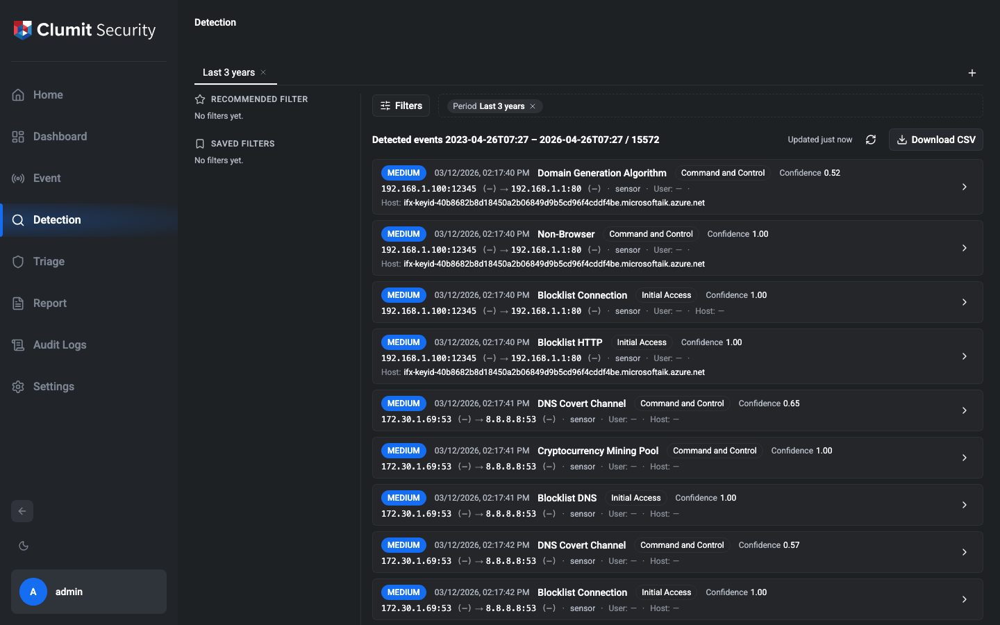

### Columns

The CSV header carries the same columns the result list shows,
in the same order:

| Column | Source |
|---|---|
| `Severity` | localized level — `Low` / `Medium` / `High` |
| `Time` | event time, ISO-8601 UTC |
| `Kind` | friendly event kind (e.g. `HTTP Threat`) |
| `Attack Kind` | secondary attack kind for ML subtypes |
| `Category` | localized threat category |
| `Confidence` | detection confidence, `0.00`–`1.00` |
| `Triage` | single triage summary token mirroring the result row, e.g. `3 policies · 0.90 max` — empty when the event has no triage scores |
| `Source` | originator endpoint, `IP[:port] (CC)` — country code inlined as in the result row |
| `Destination` | responder endpoint, `IP[:port] (CC)` — country code inlined as in the result row |
| `Sensor` | sensor name |
| `User` | username for subtypes that emit `username` / `userName` / `user` (HTTP-class threats, `BlocklistNtlm`, `BlocklistRadius`, `BlocklistFtp`, `FtpPlainText`, `WindowsThreat`); empty otherwise |
| `Host` | hostname for subtypes that emit `host` / `hostname` (HTTP-class threats, `BlocklistNtlm`); empty otherwise |

The column order is taken from the result row reading order: the
severity badge, time, kind, attack kind, category, and confidence
on the top line; the triage summary token; then the source → destination
endpoints and the sensor on the lines below; finally the trailing
`User` and `Host` identity columns, which mirror the `User: …` /
`Host: …` cells the row renders after the sensor. Triage is emitted
as a single cell (matching the UI's `TriageSummary`), not split
across two columns, so a reader can line the CSV up against what
the result list shows without re-ordering.

Subtypes that don't carry a given field render the cell as
empty — the column position is preserved, so two-sided spreadsheet
formulas keep working across the row. Subtypes whose addressing
arrives in plural fields (`ExternalDdos`, `MultiHostPortScan`,
`PortScan`, `RdpBruteForce`, `UnusualDestinationPattern`) write the
primary endpoint plus the locale's `+N` suffix — `+N more` in
English, `+N개 더` in Korean — mirroring the exact token the result
row renders through `ResultListLabels.moreCountSuffix`. Only the
primary country is rendered in the `Source` / `Destination` cell —
extras are not surfaced, because the result row does not surface
them either. The sentinel country codes `XX` (unknown origin) and
`ZZ` (unavailable) are mapped to the same locale-specific labels
the result row uses.

> **CSV-injection safety.** Cells whose value would otherwise begin
> with `=`, `+`, `-`, `@`, tab, or carriage return are prefixed with
> a single quote (`'`) so Excel and Google Sheets render them as
> literal strings instead of evaluating them as formulas.

### Filename

Downloaded files are named
`detection-events_<timestamp>_
.csv`. The timestamp is the
download moment in UTC, with colons replaced by hyphens so the
filename survives Windows paths (e.g. `2026-04-20T15-32`). The
summary is the active period slug when one is committed
(`last-1h`), the explicit start/end range
(`2026-04-20_to_2026-04-21`), or `all` when the filter has no
time bounds.

### How the download is delivered

On Chromium-based browsers (Chrome, Edge, Opera, Arc), Detection
uses the browser's native Save-As dialog so the response streams
straight to the path you choose — the full CSV never has to fit
in tab memory. This matters when the export is close to the hard
per-export cap (one million events / several hundred megabytes).
The dialog opens with the same
`detection-events_<timestamp>_
.csv` default the server
uses in `Content-Disposition`, so the filename you see in the
picker is the one the server streams under.

On browsers that do not yet implement the File System Access API
(Firefox, Safari), the download falls back to the browser's
default download folder. The server still streams page-by-page
from REview; only the final hand-off buffers in tab memory, so
the same hard cap keeps peak memory bounded on those browsers.

### Large-export guardrail

When the filter matches **100 000 events or more**, the export
pauses to confirm. The dialog quotes the matched row count and
an estimated download size, and offers three paths:

- **Continue export** — proceeds with the full export. On
  Chromium, the native Save-As dialog opens after you click
  Continue: the row-count confirmation always comes first so
  you never have to pick a save path for a download you may
  want to cancel.
- **Cancel** — closes the dialog without downloading anything.
- **Narrow filter** — closes the dialog and reopens the filter
  drawer so you can tighten the time range or other dimensions
  before retrying.

This guardrail prevents accidental multi-hundred-megabyte
downloads while still letting deliberate large exports through
in one extra click. Exports that already exceed the one-million
row hard cap surface the limit error directly without opening
the save picker at all — the export would be rejected by the
server anyway.

### Cancelling an in-flight export

Cancelling an in-flight export now terminates the active REview
page rather than waiting for it to complete. Whether you cancel by
clicking **Cancel** on the large-export confirmation, dismissing
the Chromium Save As dialog, or closing the tab, the underlying
fetch is aborted and the signal is forwarded all the way through
the server's pagination loop into the in-flight `eventList`
request — so the export stops within a small bounded delay
instead of running the current page (up to 500 events) to
completion. The previous behaviour cancelled the loop only at the
next page boundary; a Cancel mid-page could still burn tens of
seconds on the active REview round-trip on a large filter.

### Errors

If the export fails partway — REview connection reset, server
error, or a mid-download transport abort — the download is
discarded by the browser rather than landing as a partial file,
and a banner appears below the result header explaining that the
export could not be produced. Retry by clicking **Download CSV**
again after the filter or backend is in a better state.

Dismissing the Save As dialog on Chromium is not treated as an
error. The export simply returns to its idle state without a
banner — closing the save picker is how the operator cancels the
export, so there is nothing to report. A genuine picker failure
(permission denial, filesystem error) still surfaces the banner.
