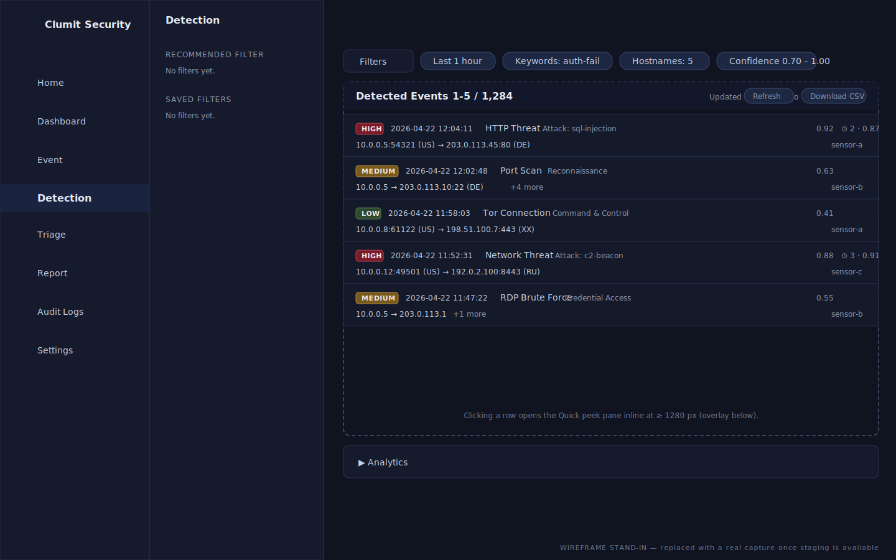
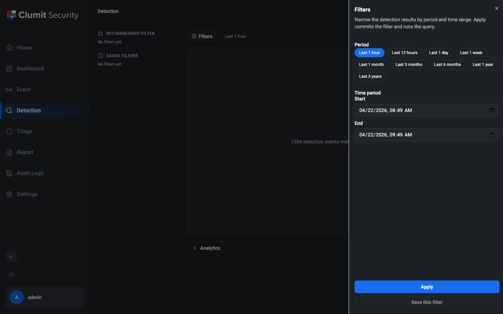
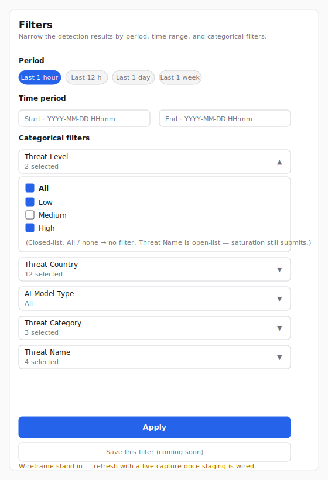
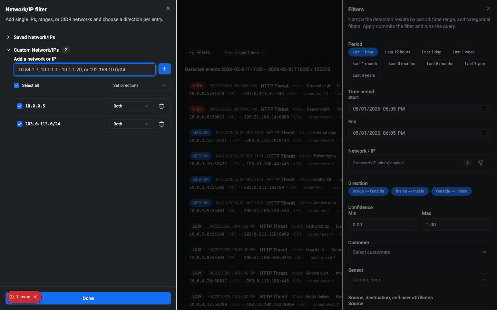

# Detection

The Detection page is accessed from the sidebar. It is the hub for
investigating detection results produced by the backend — filtering,
reviewing, and drilling into individual findings.

Viewing the page requires the `detection:read` permission. The
built-in roles Security Monitor, Tenant Administrator, and System
Administrator receive this permission by default. Custom roles that
grant `detection:read` also qualify.

!!! note "Wireframe stand-in"

    The page-level illustration above is an SVG wireframe rather than a
    real capture. The Detection page renders its hero count from a live
    REview query, and the authoring worktree has no staging backend with
    seeded detection data — a PNG captured here would show the
    `Could not load detection results.` error state. Per
    `docs/AUTHORING.md`'s "Screenshot exception for
    infrastructure-gated features", this page ships a localized SVG
    wireframe and will be replaced with a real screenshot once a
    staging environment with sample data is available. The filter
    drawer capture further down is a real PNG — the drawer is
    client-rendered and does not depend on backend data.

## Layout

The page is organized into four regions. The Results area is the
dominant region of the workspace; the supporting regions are kept
compact so they do not distract from the findings.

### Saved / Recommended rail

A slim rail on the left lists two sections:

- **Recommended Filter** — curated starting points.
- **Saved Filters** — filters you have saved yourself.

On narrow viewports the rail collapses to icons only. On desktop
widths it expands to show the section headings.

### Top bar

The top of the main region holds the **Filters** button and the
active filter chip bar. Clicking **Filters** opens the filter
drawer on the right; the chip bar to its right summarises the
filter currently applied to the active tab.

The chip bar is built from a single shared helper
(`summarizeFilter(filter: Filter)`) so every surface that renders
chips — the active bar and any future forms of it — follow the
same aggregation rules:

- The committed period (or explicit time range) always renders as
  a removable `Period: …` chip so the operator can drop it with
  `×` just like any other filter.
- Single-value fields (`Source`, `Destination`) render as a single
  chip with the value (e.g. `Source: 10.0.0.5`).
- Tag fields with **1–3** values render one chip per value.
- Tag fields with **more than 3** values collapse to a single
  count token (e.g. `Keywords: 12`). Activating the count chip
  reopens the drawer focused on that field so you can edit the
  list.
- Direction, Confidence, Sensor, and every categorical
  multi-select (Threat Level, Threat Country, AI Model Type,
  Threat Category, Threat Name) follow the same ≤ 3 / aggregate
  rule.

When the future search-language filter mode is enabled
(`Filter.mode === "query"`) the shared helper returns no chips
and the bar will instead render the query text as a single
editable pill — the query language can express OR / NOT / regex
that structured chips cannot represent. The pill's query editor
lands in a later phase; until then, query-mode filters carry no
chip-level decomposition.

Every chip carries an `×` affordance. Pressing `×` is a
self-contained commit — the field is removed from the active
filter immediately, the query re-runs, and the chip disappears.
For aggregate chips (e.g. `Hostnames: 7`) the `×` removes the
whole field. Single-value removal is atomic and explicit, so it
does not conflict with the drawer's Apply-centric model — Apply
exists to batch multi-field edits. Activating a chip's body
(rather than its `×`) opens the filter drawer scrolled to the
matching section (text / tag chips focus the input; the period,
direction, confidence, sensor, endpoint, and categorical chips
scroll their section into view) so you can amend the value
before re-applying.

Tag-field state and the `Source` / `Destination` values are
persisted in the URL as comma-separated values
(`?keywords=alpha,beta`). Refreshing the page restores these
free-form fields, and clearing all values removes the parameter
from the URL. The time range is not persisted in the URL, so a
refresh falls back to the default period.

### Results

The Results region is the **hero** of the main work area: it
occupies the largest share of the viewport at every supported
width. On page entry the default filter (**Last 1 hour**) runs
automatically so the page is never empty on first view.

#### Header line

A single header line above the list shows:

- The result count and time range
  (`Detected events <range> / <totalCount>`). Total counts are
  64-bit safe — REview returns them as strings to avoid loss of
  precision, and the UI displays them verbatim.
- An **Updated _N_ ago** label that refreshes itself in the
  background so you can see how stale the current view is.
- A **Refresh** affordance that re-runs the active filter
  without going through the drawer.
- A **Download CSV** button. The button is visible but disabled
  in this phase; CSV export wiring lands in a later phase.

#### Result rows

Each detection event renders as a compact two-line entry:

- **Line 1** — severity badge (LOW / MEDIUM / HIGH), event time
  (locale-aware), event kind (e.g. `HTTP Threat`), an optional
  attack kind for the ML subtypes, the threat category, the
  detection confidence score, and a triage summary (max score +
  policy count) when triage scores are present.
- **Line 2** — `source endpoint → destination endpoint`, each
  endpoint formatted as `IP[:port] (country)`, followed by the
  sensor name. Subtypes whose source or destination is an array
  show the first entry plus a `+N more` button; clicking the
  button opens an inline popover listing every hidden IP or port.

Severity, time, and kind are present for every event subtype.
Source IP+port and destination IP+port are present for every
subtype that the vendored schema exposes as network-side — two
host-/agent-side subtypes (`ExtraThreat`, `WindowsThreat`) carry
no addressing fields at all, and those rows drop the source →
destination line entirely (see the schema-limited note below).
At narrower viewports the row tightens (shorter country labels,
truncated attack kind with a tooltip, secondary labels such as
attack kind, category, confidence, and triage summary are hidden),
and at the narrowest widths the source and destination stack
vertically — whenever the source → destination line is rendered,
the destination and the severity indicator are never hidden.

#### Empty, loading, and error states

The result region uses distinct panels for each non-ready state:

- **Loading** — shows a spinner with `Running query…` while the
  active filter is being executed.
- **Error** — shows `Could not load detection results`, a short
  hint, and an inline **Retry** button so a transient failure
  does not require reopening the drawer.
- **No matches** — shown when the query succeeds but returns zero
  events. The copy invites the operator to loosen the filter or
  pick a wider time range.
- **Build a filter to begin** — the rare empty pre-query state
  (a freshly-created tab or a tab whose filter has been fully
  cleared). The panel offers a button that opens the drawer.

#### Row interactions

Clicking anywhere on a row body opens the **Quick peek**
inspector. At desktop widths (≥ 1280 px) Quick peek docks inline
as a right-hand pane beside the result list — the list shrinks
proportionally to the right to make room. At narrower widths the
same summary is rendered as an overlay drawer and the list keeps
its full width, so smaller screens don't try to fit two columns
of dense data. Quick peek carries the event summary (severity,
time, kind, confidence, source → destination, sensor) and an
**Open investigation** button that jumps into the full
Investigation view. The inline `›` icon at the end of the row
opens the Investigation view directly, skipping Quick peek.
Investigation navigation is locale-aware and carries a `returnTo`
URL parameter so the Back link returns to the exact Detection
tab the operator left, including the active filter's chip state.
Pivot links on supported values (IP, country, kind, category,
level, hostname, user) open or focus a narrowed tab — that
wiring lands in the Pivot phase.

Two subtypes in the vendored schema — `ExtraThreat` and
`WindowsThreat` — model host- / agent-side threats and expose no
network addressing at all. For those rows the source →
destination line is omitted, and the row still renders severity,
time, kind, confidence, triage summary, and sensor. A handful of
other subtypes omit one side or one port (for example
`UnusualDestinationPattern` is responder-array only, and
`RdpBruteForce` omits the originator port); in those cases the
missing slot falls back to `—`. Quick peek follows the same
rule — a one-sided-address row still shows `— → <destination>`
(or `<source> → —`) in the inspector summary, so the operator
never loses the endpoint context they just clicked.

Quick peek closes the instant a committed query transition is
dispatched — Apply, chip removal, or Refresh — not after the
replacement slice resolves. The inspector and its **Open
investigation** button disappear synchronously with the new
chip bar / URL, so there is no window during the round-trip
where the handoff could fire on a row the newly committed
filter no longer describes. REview does not yet expose a stable
per-event identity, so carrying the inspector across committed
queries could silently retarget it at a different event;
closing on every commit is the defensive alternative, and at
desktop widths restores the hero list to its full width once
no row is selected. Reopening Quick peek on the row you want
after a filter change is a single click.

### Analytics strip

Below Results, an Analytics strip is reserved for aggregate views of
the current result set. It is collapsed by default; clicking the `▸`
affordance reveals an empty placeholder panel in this phase.

## Filter drawer

The filter drawer is where you describe the window of detection
events you want to look at. It opens from the **Filters** button
in the top bar and slides in from the right.

### Period

The **Period** section exposes the common relative windows as
chips: `Last 1 hour`, `Last 12 hours`, `Last 1 day`, `Last 1 week`,
`Last 1 month`, `Last 3 months`, `Last 6 months`, `Last 1 year`,
`Last 3 years`. Picking a chip fills the **Time period** inputs
with its start and end.

### Time period

Two `datetime-local` inputs let you specify an explicit start and
end. Editing either input clears the Period chip selection — an
edited range is no longer a quick-select window.

### Direction

The **Direction** section is a three-way multi-select matching the
backend's `FlowKind` values:

- `Inside → Outside` (outbound traffic)
- `Inside → Inside` (internal traffic)
- `Outside → Inside` (inbound traffic)

All three are selected by default, which is equivalent to "no
filter" — the submitted filter omits `directions` in that case.
Toggle a chip off to drop that direction from the results. The
drawer refuses to empty the set: attempting to deselect the last
remaining direction silently reverts to all three selected, since
an empty selection would mean "no rows".

When fewer than three are selected, the active filter chip bar
renders one chip per selected direction (e.g. `Direction: Inbound`,
`Direction: Internal`).

### Confidence

The **Confidence** section narrows the result set to events whose
detection score falls within a `[min, max]` window. The domain is
`0.00`–`1.00` with two-decimal precision; arrow keys nudge the
focused input by `0.01`, `Home` jumps to the input's lower bound
(`0.00` for min, the current min for max), and `End` jumps to the
corresponding upper bound.

The inputs cannot produce a reversed range — typing a min that
exceeds the current max snaps max upward, and vice versa. Leaving
both inputs at `0.00` / `1.00` is the "no filter" default and
omits `confidenceMin` / `confidenceMax` from the submitted query.
Any non-default range surfaces a single chip in the active filter
bar (for example, `Confidence 0.70 – 1.00`).

### Customer

**Customer** is a disabled placeholder marked **Coming soon**.
Customer scoping still happens automatically — results are already
limited to the customers your account has access to — but picking
a subset of them from the UI arrives with the Customer directory
in a later phase. The field is never submitted with the filter and
never appears in the chip bar.

### Sensor

**Sensor** is a multi-select backed by the sensor inventory that
the detection backend maintains for the customers you can access.
Open the control to reveal a search box, a **Select all / Clear
selection** toggle, and a scrollable list of sensors; picked
sensors also appear as removable chips just below the control.

Applying the filter submits the selected sensor IDs; they show up
in the active chip bar at the top of the page. For one to three
selections each sensor gets its own chip; four or more collapse to
a single `Sensor: N selected` aggregate token so the bar does not
wrap unpredictably.

If the detection backend in use has not yet published the
sensor-list endpoint, the Sensor control falls back to the same
**Coming soon** disabled state as Customer and is simply not
submitted. This fallback only appears in transitional builds — as
soon as the backend ships the endpoint the control becomes
functional without any further change here.

While the sensor list is being fetched on the first drawer open,
the control shows a **Loading sensors…** affordance instead of
**Coming soon** so the disabled state is not mistaken for a
missing endpoint. If the fetch fails transiently, the control
surfaces a **Could not load sensors** message with an inline
**Retry** button; clicking Retry re-issues the request without
having to close and reopen the drawer.

### Source, destination, and user attributes

Below the sensor control, a dedicated **Attributes** section narrows
the query by free-form strings.

- **Source** and **Destination** are single-value text inputs — the
  active filter carries exactly one source string and one destination
  string at a time. Validation is lenient: the backend rejects
  malformed values, so operators can paste whatever REview accepts.
- **Keywords**, **Hostnames**, **User IDs**, **User Names**, and
  **User Departments** are tag inputs. Press `Enter` or type a comma
  to commit the current entry as a chip; `Backspace` on an empty
  input removes the most recent tag. Paste a comma-separated or
  newline-separated list to bulk-add many values at once. Entries
  are trimmed and deduped automatically.

Clearing all tags in a field omits that field from the submitted
filter entirely. Apply also mirrors the free-form fields into the
URL so a refresh restores the active tab's filter state.

### Categorical filters

Below the time range, a **Categorical filters** section groups the
per-event dimensions you can narrow by. Each dimension is a
multi-select with the same interaction pattern:

- A trigger shows the current summary. For closed-list fields
  (Threat Level, Threat Country, AI Model Type, Threat Category)
  the summary reads `All` when everything or nothing is selected —
  both mean "no filter" — and `N selected` otherwise. **Threat
  Name** is treated as an open list while its options are still a
  seed subset (see below): a saturated Threat Name selection reads
  as `N selected` rather than `All`, because the submitted filter
  still actively constrains to the visible list.
- An **All** master toggle selects or clears every option. When
  some but not all options are checked, the toggle renders as a
  mixed state.
- Long lists (Threat Country, Threat Category, Threat Name) expose
  a case-insensitive substring search above the options.
- For closed-list fields, selecting zero options and selecting
  every option are both treated as "no filter" — the field is
  omitted from the submitted query and does not appear in the chip
  bar. Threat Name follows a different rule: selecting zero still
  omits the field, but selecting every visible option submits the
  explicit list and still emits chips, since the seed list is not
  exhaustive.

The figure above is an SVG wireframe stand-in for the expanded
categorical section. It is shipped under `docs/AUTHORING.md`
§"Screenshot exception for infrastructure-gated features"; replace
it with a PNG capture (`detection-drawer-categorical-en.png`) once
a staging environment with a seeded REview session is available to
render all five fields in their expanded state.

The five categorical fields are:

- **Threat Level** — `Low` / `Medium` / `High` (maps to
  `levels: [1, 2, 3]` on the backend).
- **Threat Country** — originator / responder country, selected by
  ISO-3166 alpha-2 code. The list includes the REview sentinels
  `XX` and `ZZ` so events that could not be geolocated can still
  be filtered in or out. These surface with explicit localized
  labels — `Location unknown (XX)` and `Location database
  unavailable (ZZ)` — and the option search matches both the raw
  code and the meaning (e.g. searching `unknown` lands on `XX`,
  `unavailable` lands on `ZZ`).
- **AI Model Type** — `Unsupervised` / `Semi-supervised` (maps to
  `learningMethods`).
- **Threat Category** — the 14 MITRE ATT&CK tactic-style categories
  REview tags events with (Reconnaissance, Initial Access,
  Execution, …).
- **Threat Name** — a curated starting list of attack kinds
  submitted as REview's canonical event `__typename` tokens
  (`HttpThreat`, `PortScan`, …). The option labels render the
  friendlier display name ("HTTP Threat", "Port Scan"), and search
  matches either form. The list is an open seed subset rather than
  an exhaustive option source: saturating the visible list does
  **not** broaden the query, and a live completion sourced from
  REview will replace the seed list in a follow-up.

### Active filter chip bar

Applied filters appear as chips in the top bar next to the
**Filters** button. Categorical fields follow a shared aggregation
rule:

- For closed-list fields: no chip when nothing or everything is
  selected for a field (both mean "no filter").
- For Threat Name (open-list): no chip when nothing is selected,
  but a saturated selection still emits chips because the field is
  still actively filtering to the visible list.
- One chip per value for 1 – 3 selected values.
- A single aggregate token (e.g. `Countries: 12 selected`) when
  more than 3 values are selected, to keep the bar compact.

### Apply

Click **Apply** (or press `Enter` while focused in the drawer) to
commit the current draft to the active tab's filter and run the
query. After Apply the drawer closes. Closing the drawer without
Apply (via the close affordance or `Escape`) preserves your
in-flight edits — they reappear the next time you open the drawer.

The drawer rejects a range whose end is not strictly later than its
start, surfacing an inline validation message.

### Network / IP

The **Network / IP** section carries a summary line and a funnel
affordance. Activating the funnel opens the advanced Network/IP
filter panel alongside the drawer so the drawer stays in view.

The panel has two sections:

- **Saved Network/IPs** renders in v1 but is not functional. It
  shows `No saved network/IPs` and a help line explaining that
  saved network/IP groups are not yet available in this version.
- **Custom Network/IPs** is fully functional. Each row represents
  a single entry with its original text, a selection checkbox, a
  Direction selector (Both / Source / Destination) and a remove
  control.

A single text input above the list accepts three formats:

- Single IP — `10.84.1.7`.
- IP range — `10.1.1.1 - 10.1.1.20`.
- CIDR network — `192.168.10.0/24`.

Press `Enter` or the `+` button to commit the entry. A smart
parser routes each entry into the correct bucket — single IPs
become hosts, ranges become ranges, CIDRs become networks. An
invalid input surfaces an inline error listing the three valid
examples.

Above the list, a master checkbox selects or clears every entry
and a `Set directions` control applies a direction to all selected
rows at once. Deselected rows are visually de-emphasized but
retain their state; they are simply omitted when the filter is
submitted.

Close the panel with the close affordance or `Escape`. The
entries you've added persist until you close the filter drawer
without applying.

#### Active filter chips

Each committed Network/IP entry surfaces a chip in the active
filter bar so the operator can see what's scoped:

- No entries — no chip.
- 1–3 entries — one chip per entry, each prefixed with `Src`,
  `Dst`, or no prefix for Both (e.g. `Src 10.0.0.5`).
- More than 3 entries — a single aggregate chip
  (`Network: N rules`).

Activating any Network/IP chip body (rather than its `×`) reopens
the filter drawer scrolled to the Network/IP section with the
advanced Custom panel expanded, matching the chip-body contract
for every other chip type.

### Save this filter

The **Save this filter** button is present alongside Apply but
disabled in this phase. The naming flow is wired up in a later
Detection phase.
