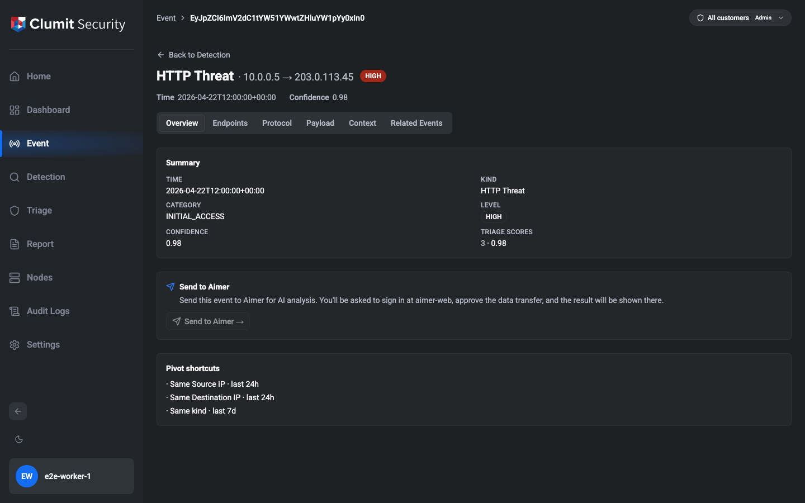
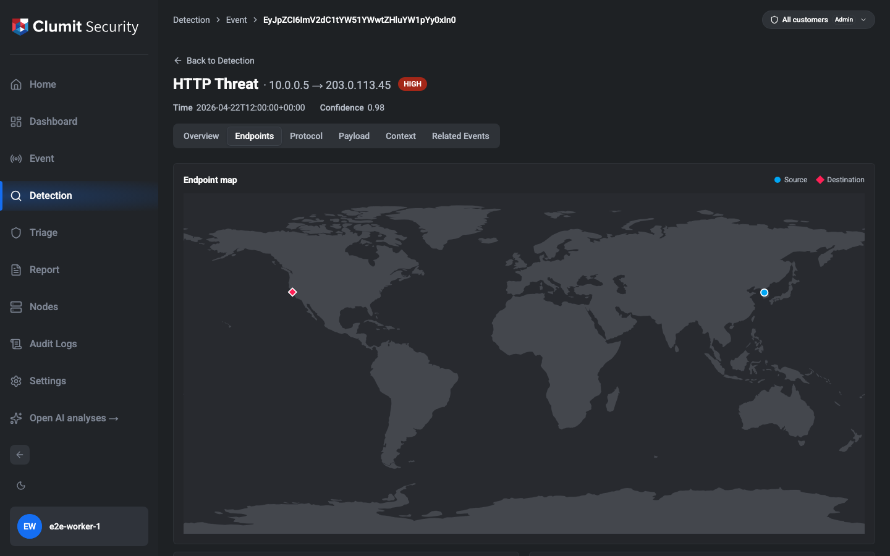

# Event Investigation

The Event Investigation page is the destination for deep forensic
analysis of a single detection event. The page is addressable by
URL so an investigator can share or bookmark a link to a specific
finding.

The page is reached from the Quick peek inspector's **Open full
investigation** action on the Detection page. Quick peek itself
lands in Phase Detection-18; until that phase ships, the page is
still reachable by direct URL (shared links, bookmarks, sibling
menu pivots). The locator codec the Quick peek action calls is
exported from `src/lib/events/event-locator.ts`, so wiring the
inspector is a consumer-side change only.

Viewing the page requires the `detection:read` permission — the same
permission that gates the Detection page. Accounts without it are
redirected away from the Investigation URL even if they obtain a
valid event link.

## URL shape

The page is served at `/events/<eventToken>`. The route is
menu-neutral (not nested under `/detection/`) so that sibling
menus such as Triage can link to the same page without a
Detection prefix.

`eventToken` is an opaque, URL-safe string that wraps the
event's stable `id`. The detection service issues that `id` on
every event and its single-event resolver (`event(id:)`) accepts
it back as the lookup key, so the link loads exactly the
intended event for as long as the event is retained under the
current storage key format.

## Header

The page header shows:

- The event kind's friendly name and an endpoint summary
  (for example `HTTP Threat · 10.0.0.5 → 203.0.113.45`).
- A severity-level badge.
- The event time and confidence.
- A back link. By default it returns the user to `/detection`.
  When the page is opened from a list or inspector, the opener
  appends `?returnTo=<relative path>` to carry the user's prior
  tab and filter state back on return. Off-site `returnTo`
  targets are rejected — the back link only follows
  same-origin relative paths.

## Error states

### Invalid event link

When the token is malformed or has been tampered with, the page
renders an **Invalid event link** state with a back link to
Detection. No network request is made to the detection service.

### Event no longer available

When the locator decodes successfully but the detection service
returns no matching event, the page renders an **Event no longer
available** state. This happens when the event has aged out of
retention, when the caller's customer/sensor scope no longer
includes it, or when a future storage-key migration invalidates
older `id` values.

### Could not load event

When the detection service is unreachable or returns an error,
the page renders a **Could not load event** state with guidance
to retry.

## Tabs

The investigation view is organized into tabs instead of one long
scroll. Tabs that would carry no useful content for the event are
hidden rather than painting an empty placeholder:

- The **Protocol** tab is hidden for event subtypes that the
  investigation page does not yet render kind-specific fields for.
  Supported subtypes today are HTTP Threat, DNS Covert Channel,
  Blocklist / DNS, Port Scan, Multi-Host Port Scan, FTP Brute Force,
  FTP Plain Text, Network Threat, and Blocklist / Connection.
- The **Payload** tab is hidden for events that carry no captured
  byte stream (today only HTTP Threat events surface payload bytes,
  via the HTTP body field).

The other tabs — Overview, Endpoints, Context, and Related Events —
are always available.

The issue originally scoped this section as a **Packets** tab with
a raw packet-capture hex dump. In v1 the detection service does
not expose a raw packet-capture field on any event subtype — only
HTTP Threat carries captured bytes, and what it exposes is the
HTTP body stream rather than link-layer packets. The tab is
therefore labelled **Payload** in v1 so investigators don't read
packet semantics into application bytes. When the detection
service adds a true packet-capture field, the tab will be re-
labelled and extended without changing the URL or layout.

The event itself is fetched once when the page loads — a single
`event(id:)` lookup whose selection set carries every subtype
fragment the page knows how to render. That call powers Overview,
Protocol, Payload, and Context without any additional network
traffic, and it also decides whether the Protocol and Payload
tabs are visible at all. The two tabs that make extra detection-
service calls — Endpoints (`ipLocation` enrichment) and Related
Events (per-pivot count + last-seen snippets) — defer their work
until a user first opens the tab. Once a lazy tab has been
activated its data is kept in memory for the life of the page:
switching away and back does not re-issue the lookup.

### Overview

Summary card with severity, time, kind, category, confidence
and triage scores (each score with its policy ID).

The tab also includes a **Send to Aimer** banner.  Clicking
**Send to Aimer** opens a confirmation modal, then performs one
of two flows depending on whether the event is currently
baseline-passing (the routing decision is made server-side by
`POST /api/aimer/detection-send` against
`baseline_triaged_event`).  Both flows are gated by the same
`detection:read` permission and use the same customer-selection
modal:

1. The investigator picks the customer this event should be
   sent under.  When the event is connected to a single
   customer the modal shows that customer's name and the
   investigator only has to confirm.  When the event is
   connected to two or more customers (today this happens for
   subtypes such as Multi-Host Port Scan, RDP Brute Force, and
   External DDoS, whose responder/originator side carries an
   array of customers) the modal renders a radio list and the
   investigator must pick one.
2. The browser POSTs the locator + customer to
   `/api/aimer/detection-send`.  The server probes
   `SELECT 1 FROM baseline_triaged_event WHERE event_key = $1`
   under the chosen customer's DB to decide which path applies,
   and — on the Phase 2 path — also mints the multipart tokens
   in the same response so the routing decision is
   server-authoritative.

**Phase 1 — non-baseline-passing events.**  The browser fetches
a short-lived signed context token from
`/api/aimer/context-token`, builds a hidden HTML `<form>` with
three text parts (`context_token`, `events_envelope`,
`events_data`) and submits it as a top-level multipart POST to
aimer-web's bridge endpoint.  The investigator lands on
aimer-web, where they sign in, approve the transfer, and the
event is stored in `detection_events` for single-event
analysis.  No in-page disclosure is rendered — the navigation
itself is the signal that the send happened.

**Phase 2 — baseline-passing events.**  The server has already
returned the multipart tokens alongside the routing decision.
The browser POSTs them directly to aimer-web's
`/api/phase2/baseline/batch` endpoint without leaving the
event-detail page; on a 2xx ack the modal shows the disclosure
**"Sent via Phase 2 (Triage analysis)"** and an investigator-
dismissable confirmation.  Phase 2 sends do not advance the
opportunistic streaming cursor, so a subsequent automatic sweep
past the same event is absorbed by aimer-web's idempotent
`(baseline_version, event_key)` check (`duplicates_skipped`).
Re-clicking the same event therefore stays idempotent.

Manual Send always bypasses the opportunistic-push pause
toggle: a Send click is a deliberate per-item operator
override.  The pause toggle only gates the automatic
background flow.

The button is disabled when:

- The event is not connected to any customer (no Aimer customer
  to scope the transfer under).
- Every connected customer is missing the `external_key`
  needed to identify it on aimer-web.  An operator with the
  Customers permission can populate that key on the **Customers**
  page.
- The Aimer integration is not configured by a System
  Administrator (the AICE ID, bridge URL, or active signing
  key is missing).

The tooltip on the disabled button names the specific reason so
the investigator knows whether to ask their administrator or
their customer-management peer to unblock the flow.

When two customers are listed in the modal and only one of them
has an `external_key`, the customer without a key is shown
disabled (with an "(no external_key set)" hint) — the
investigator can still send under the configured one.

<!-- TODO: screenshot - aimer-bridge batch -->
<!-- TODO: screenshot - Phase 2 in-page "Sent via Phase 2 (Triage
     analysis)" disclosure with the Dismiss button -->

The browser primitive used here is intentional.  An HTML form
submit is the only standard browser API that produces a
top-level multipart POST so the user actually navigates to
aimer-web — `fetch` with a `FormData` body would not navigate.
Because HTML form parts can only be text, the events payload is
sent as a text part rather than a `Blob`.  Payloads that need a
binary upload remain out of scope for this release.

Below the Aimer banner, **Pivot shortcuts** lists links that
open the Detection page pre-filtered to related activity:
same source IP in the last 24 hours, same destination IP in
the last 24 hours, and same kind in the last 7 days. The
filter is encoded into Detection's URL as search params
(`source`, `destination`, `kind`, `window`, `origPort`,
`respPort`, `proto`); the Detection page displays the
resulting filter as chips in its active-filter toolbar.

### Endpoints

Source and Destination cards with the IP, country, region and
city, ports, coordinates (when available), and a derived
**Company** value. The Company row falls through three
sources in priority order, and the source is annotated next to
the value:

1. The event's customer (`origCustomer` / `respCustomer`).
2. The event's network (`origNetwork` / `respNetwork`).
3. The `ipLocation` enrichment's ISP, fetched lazily from the
    detection service when this tab activates.

For event subtypes that carry array endpoints (for example
scanned-port lists), all entries are shown — the investigation
view is deliberately verbose compared to the list view.

For subtypes with an array of responders (notably Multi-Host
Port Scan), the destination column renders one card per
responder, each with its own country, customer, and
`ipLocation` enrichment.

When at least one endpoint's `ipLocation` enrichment includes
both latitude and longitude, an **Endpoint map** is rendered
above the Source / Destination cards. The map plots one
marker per unique `(address, role)` pair: sources as blue
circles, destinations as rose diamonds. Hovering a marker
surfaces the IP address and, when available, the country.
For array-addressed subtypes (Multi-Host Port Scan, External
DDoS) every resolved address is plotted — not only the first.
When no endpoint has geographic enrichment the map is hidden
entirely; the Source / Destination tables remain fully
functional on their own.

The map is rendered as a static SVG using an equirectangular
projection of the `world-atlas` `land-110m` topology. It has
no client-side runtime dependency on a tile server, no pan /
zoom, and no ongoing map network traffic — once the map chunk
loads, marker rendering is fully local. Click-to-pivot from a
marker is deliberately out of scope for v1.

### Protocol

All kind-specific fields for the event's subtype, grouped into
logical subsections rather than a flat grid. Examples:

- **HTTP Threat** — Request (method, host, URI, referer,
    version, User-Agent, request length), Response (status
    code, status message, response length, content
    encoding/type, cache control), Auth (username, masked
    password, cookie), Body (filenames, MIME types, event
    content, and a hex preview of the captured body bytes).
    Passwords are rendered as a fixed-length mask — the
    full plaintext is never painted on this page.
- **DNS Covert Channel** — Query (query name, class, type,
    transaction ID, round-trip time), Response (answer,
    response code, TTL), Flags (authoritative, truncated,
    recursion desired / available).
- **Port Scan** — Scanned ports, detection start and end time.
- **Multi-Host Port Scan** — Destination IPs, destination port,
    detection start and end time.
- **FTP Brute Force** — User list, detection start and end
    time.
- **FTP Plain Text** — User, masked password, session start and
    duration, captured commands (first ten).
- **Blocklist / DNS** — Query, response, and flags sections
    (same shape as DNS Covert Channel).
- **Network Threat** — Service, attack kind, content, start and
    duration.
- **Blocklist / Connection** — Connection state, service, start
    and duration, originator / responder byte and packet counts.

Empty fields are skipped rather than rendered as blank rows.

### Payload

When the event carries captured bytes, the Payload tab renders
a classic hex dump of the payload with offset, hex, and ASCII
columns, plus a **Download payload** action that saves the
bytes as a `.bin` file for offline analysis (for example a
Wireshark or `xxd` workflow). The tab is hidden for events
without captured bytes.

### Context

Threat metadata for the event: threat name (from the
subtype's `attackKind` field where present), threat category
(REview's `ThreatCategory`, treated as a MITRE tactic),
threat level, and — when the event matches the built-in
MITRE catalogue — a structured **MITRE ATT&CK** card with
the resolved tactic, technique, and (where applicable)
sub-technique. Each identifier links to the canonical entry
on `attack.mitre.org`. A descriptive **Explanation** card
follows when the catalogue has guidance for the event's
class.

The catalogue is keyed first by `attackKind` (per-technique
entries) and falls back to the event's `__typename`
(explanation only) and `category` (tactic only). It lives in
`src/lib/events/mitre-catalogue.ts` and is the extension
point both for adding new techniques and for merging
REview-sourced strings later behind the same lookup.

### Related Events

Filter-based pivots rendered as link rows. Each row opens a
new Detection page pre-filtered to the relevant activity:

- Same Source IP — last 24 hours.
- Same Destination IP — last 24 hours.
- Same kind — last 7 days.
- Same session / flow — same originator and responder,
    last 24 hours. In v1 the detection service's list filter
    does not accept ports or protocol, so the session pivot
    narrows on the address pair only. The Count / Last seen
    snippet uses the same 2-tuple, so it matches what the
    user sees after clicking through.

When the tab activates, the page issues one `eventList`
lookup per pivot to populate a small **Count / Last seen**
snippet next to each row. Counts come from REview's
`totalCount`. Because the detection service's `eventList`
documents no sort order, the timestamp is computed
client-side as the max `time` across a bounded sample of the
window — honest best-effort: the snippet never reports a
value that is not an actual event in the window, but when
the window is large enough that the sample misses the true
latest event the timestamp may trail it. A failing lookup
falls back to "No matches in window" and does not blank the
rest of the tab.

Related pivots use only filter-based lookups against the
detection service. No external AI-inferred relationships are
fetched here.
