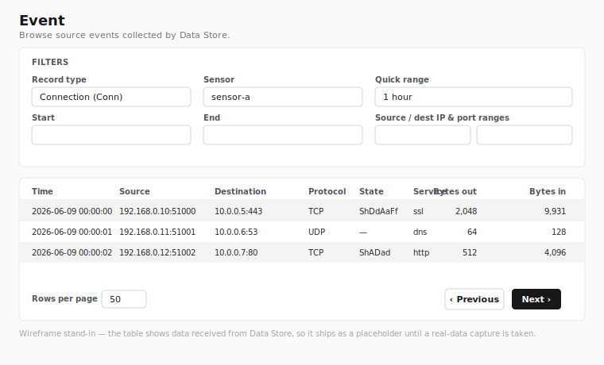

# Event

The Event page is accessed from the sidebar. It browses **source
events** collected by Giganto — the raw records the backend ingests,
before any detection logic runs. It covers connection (**Conn**)
network records and the **Sysmon / Windows endpoint** event types
(process, file, registry, network-connection, pipe, DNS, and image
events).

Viewing the page requires the `event:read` permission. The built-in
roles Security Monitor, Tenant Administrator, and System Administrator
receive this permission by default. Custom roles that grant
`event:read` also qualify. The Event menu item stays visible to every
user; the permission is enforced when the page loads, and a user
without it is redirected away.

!!! note "Wireframe stand-in"

    The figure above is an SVG wireframe rather than a real capture.
    The results table shows data received from Giganto, so a real
    screenshot is taken from a stack with real data loaded and replaces
    this placeholder in the final documentation sweep.

## Filters

The Filters card at the top of the page builds a query. Nothing is
fetched until you choose a sensor and select **Apply** — a sensor is
required because Giganto scopes every network query to exactly one
sensor.

- **Record type** — the kind of source event to browse: **Connection
  (Conn)** or one of the 14 Sysmon / Windows endpoint types. The
  choice also decides which filters apply (see *Sysmon / endpoint
  events* below).
- **Sensor** — the single sensor to query. The list is populated from
  the sensors Giganto has ingested data for. If the list cannot be
  loaded, the selector is disabled and a notice is shown. A sensor is
  required for every record type, including the Sysmon types.
- **Quick range** — a shortcut that fills the start/end time range with
  a relative window (1 hour, 12 hours, 1 day, … up to 3 years).
- **Time range** — explicit **Start** (inclusive) and **End**
  (exclusive) bounds. Editing these overrides the quick range.
- **Source / destination IP range** — optional start/end IP bounds for
  the originating and responding addresses.
- **Source / destination port range** — optional start/end port bounds
  for the originating and responding ports. Ports must be whole numbers
  between 0 and 65535; **Apply** is blocked while a port entry is not a
  whole number in that range (decimal or exponent input is rejected
  rather than rounded to a different port).

There is no separate protocol filter: Giganto's network filter has no
protocol field, so the IP protocol cannot be used as a query input. It
is shown per record in the **Protocol** results column instead.

**Apply** runs the search from the first page. **Reset** clears every
field. The active filter and page are kept in the page URL, so a search
is shareable and survives a reload.

## Sysmon / endpoint events

Besides Conn, the **Record type** menu lists 14 Sysmon / Windows
endpoint event types: process create, process terminate, process
tampering, file create, file create time changed, file create stream
hash, file delete, file delete detected, image load, network
connection, registry value set, registry key/value rename, pipe event,
and DNS query.

These types are filtered by **agent**, not by IP/port:

- When a Sysmon type is selected, the source/destination **IP** and
  **port** range inputs are replaced by a single **Agent ID** text
  input. Agent IDs are free text — there is no agent picker — so type
  the id you want to filter by, or leave it blank to match every agent.
- The **Sensor** and **Time range** filters still apply and are still
  required/sent exactly as for Conn. Only the IP/port bounds are
  dropped; switching type never leaks a stale IP/port (or, switching
  back to Conn, a stale agent id) into the query.

Each Sysmon type has its own columns and a row-detail panel listing
every field of that record (timestamps, process identity, hashes, and
the type-specific fields). List-valued fields such as hashes are joined
for display, boolean fields show a localized **Yes**/**No**, and the
string-encoded numeric fields (process id, logon id, query status) are
shown verbatim.

## Results

Matching records are listed in a table. The Sysmon types render their
own columns (see *Sysmon / endpoint events* above); Conn records use
these columns:

| Column | Meaning |
| --- | --- |
| Time | Record timestamp |
| Source | Originating `address:port` |
| Destination | Responding `address:port` |
| Protocol | IP protocol (TCP, UDP, ICMP, or the raw number) |
| State | TCP connection-state string |
| Service | Detected service name |
| Bytes out | Bytes sent by the source |
| Bytes in | Bytes received by the destination |

Byte and packet counts and the connection duration are 64-bit values
that Giganto returns as strings; they are formatted for display without
losing precision.

### Row detail

Selecting a row opens a side panel with the **full** record — every
field above plus the start time, duration, per-direction packet counts,
and layer-2 byte counts.

## Pagination

Giganto returns results as a cursor-based connection that does **not**
expose a total count, so the paginator is **Previous / Next** only —
there is no total, no "last page", and no go-to-page jump.

- **Previous** and **Next** step one page at a time and are enabled only
  when Giganto reports another page in that direction.
- **Rows per page** selects the page size (25, 50, or 100). 100 is the
  maximum Giganto accepts.

Changing the page size restarts from the first page.
