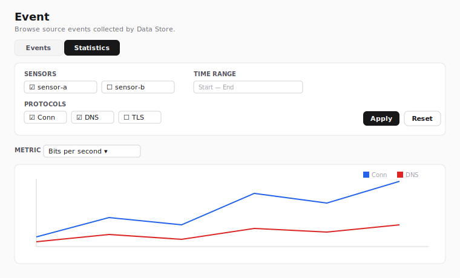

# Event

The Event page is accessed from the sidebar. It browses **source
events** collected by Giganto — the raw network records the backend
ingests, before any detection logic runs. It covers all 20 Giganto
network record types — connection (**Conn**) plus the 19 protocol
record types listed under [Record types](#record-types) — each with
type-appropriate columns and a full row detail.

Viewing the page requires the `event:read` permission. The built-in
roles Security Monitor, Tenant Administrator, and System Administrator
receive this permission by default. Custom roles that grant
`event:read` also qualify. The Event menu item stays visible to every
user; the permission is enforced when the page loads, and a user
without it is redirected away.

!!! note "Wireframe stand-in"

    The figure above is an SVG wireframe rather than a real capture.
    The results table shows data received from Giganto, so a real
    screenshot is taken from a stack with real data loaded and replaces
    this placeholder in the final documentation sweep.

## Views

A toggle at the top of the page switches between two views of the same
sensor data:

- **Events** — the record table described below. This is the default.
- **Statistics** — an aggregation chart of per-protocol metrics over
  time (see [Statistics](#statistics)).

The active view is kept in the page URL alongside the filter, so a
chosen view is shareable and survives a reload. Each view keeps its own
filter, so switching back and forth does not discard either one.

## Filters

The Filters card at the top of the page builds a query. Nothing is
fetched until you choose a sensor and select **Apply** — a sensor is
required because Giganto scopes every network query to exactly one
sensor.

- **Record type** — the kind of source event to browse. All 20 Giganto
  network record types are selectable (see
  [Record types](#record-types)). The new type takes effect when you
  select **Apply**, which re-runs the search and swaps the results
  columns and detail layout for that type.
- **Sensor** — the single sensor to query. The list is populated from
  the sensors Giganto has ingested data for. If the list cannot be
  loaded, the selector is disabled and a notice is shown.
- **Quick range** — a shortcut that fills the start/end time range with
  a relative window (1 hour, 12 hours, 1 day, … up to 3 years).
- **Time range** — explicit **Start** (inclusive) and **End**
  (exclusive) bounds. Editing these overrides the quick range.
- **Source / destination IP range** — optional start/end IP bounds for
  the originating and responding addresses.
- **Source / destination port range** — optional start/end port bounds
  for the originating and responding ports. Ports must be whole numbers
  between 0 and 65535; **Apply** is blocked while a port entry is not a
  whole number in that range (decimal or exponent input is rejected
  rather than rounded to a different port). For the **ICMP** record type
  the port inputs are disabled and not applied — ICMP records have no
  ports.

There is no separate protocol filter: Giganto's network filter has no
protocol field, so the IP protocol cannot be used as a query input. It
is shown per record in the **Protocol** results column instead.

**Apply** runs the search from the first page. **Reset** clears every
field. The active filter and page are kept in the page URL, so a search
is shareable and survives a reload.

## Results

Matching records are listed in a table. Every type shares a common
leading column set — **Time**, **Source**, **Destination**, and
**Protocol** — followed by a curated set of type-specific summary
columns. For **Conn**, the summary columns are:

| Column | Meaning |
| --- | --- |
| Time | Record timestamp |
| Source | Originating `address:port` |
| Destination | Responding `address:port` |
| Protocol | IP protocol (TCP, UDP, ICMP, or the raw number) |
| State | TCP connection-state string |
| Service | Detected service name |
| Bytes out | Bytes sent by the source |
| Bytes in | Bytes received by the destination |

Each other record type curates its own summary columns (for example HTTP
shows method, host, URI, and status code). Wide types render only a
short default column set in the table; the full field list is in the row
detail. Byte and packet counts and durations are 64-bit values Giganto
returns as strings; they are formatted for display without losing
precision.

For the **ICMP** type, which has no ports, the Source and Destination
columns show bare addresses.

### Row detail

Selecting a row opens a side panel with the **full** record — every
field of the selected type, not just the summary columns. List-valued
fields (such as DNS answers or TLS extensions) are shown inline; raw
byte payloads are shown one row per line; and the nested sub-records of
**DCE/RPC** (bind contexts), **FTP** (commands), and **DHCP** (options)
are rendered as labelled sub-blocks.

## Record types

All 20 Giganto network record types are selectable in the **Record
type** filter:

| Group | Types |
| --- | --- |
| Connection | Conn |
| Name resolution | Dns, MalformedDns |
| Web | Http, Rdp |
| Mail | Smtp |
| Authentication / directory | Ntlm, Kerberos, Ldap, Radius |
| Remote access / RPC | Ssh, DceRpc |
| File transfer / sharing | Ftp, Smb, Nfs |
| Messaging | Mqtt |
| Encryption | Tls |
| Address assignment | Bootp, Dhcp |
| Diagnostics | Icmp |

A few types differ from the rest:

- **MalformedDns** is not shaped like Dns: instead of query/answer/rcode
  it carries DNS-header counts and the raw malformed query/response byte
  payloads.
- **Tls**, **Http**, **Dhcp**, and **Radius** are wide (26–33 fields);
  the table shows a curated subset and the row detail shows everything.
- **DceRpc**, **Ftp**, and **Dhcp** carry nested sub-records, rendered in
  the row detail.
- **Icmp** has no ports; its port filter inputs are disabled.

## Pagination

Giganto returns results as a cursor-based connection that does **not**
expose a total count, so the paginator is **Previous / Next** only —
there is no total, no "last page", and no go-to-page jump.

- **Previous** and **Next** step one page at a time and are enabled only
  when Giganto reports another page in that direction.
- **Rows per page** selects the page size (25, 50, or 100). 100 is the
  maximum Giganto accepts.

Changing the page size restarts from the first page.

## Statistics

The **Statistics** view aggregates Giganto's per-protocol traffic
metrics into a time-series chart instead of listing individual records.
Select it from the [view toggle](#views).

!!! note "Wireframe stand-in"

    The figure above is an SVG wireframe rather than a real capture.
    The chart shows data received from Giganto, so a real screenshot is
    taken from a stack with real data loaded and replaces this
    placeholder in the final documentation sweep.

### Statistics filters

- **Sensors** — a **multi-select** list (one checkbox per sensor). The
  statistics query aggregates across every selected sensor, so unlike
  the single-sensor event search you can pick several at once. At least
  one sensor is required before **Apply** is enabled.
- **Quick range** and **Time range** — the same relative-window
  shortcut and explicit start/end bounds as the event search.
- **Protocols** — an optional subset of the protocols the statistics
  API tracks (Conn, DNS, Malformed DNS, RADIUS, RDP, HTTP, SMTP, NTLM,
  Kerberos, SSH, DCE/RPC, FTP, MQTT, LDAP, TLS, SMB, NFS, BOOTP, DHCP,
  ICMP, and Statistics). Leave every box unchecked to include all of
  them. The picker only offers these keys because Giganto rejects any
  other protocol value.

### Chart

A **Metric** selector chooses which value to plot — **bits per second**,
**packets per second**, **events per second**, **count**, or
**size** — and the chart draws **one line per protocol** over time.
Plotting every metric at once would be unreadable, so the metric is a
display switch over the already-fetched data and does not re-query.

The X-axis is the bucket time. Giganto reports each bucket's timestamp
as an epoch-nanosecond value, which is converted to a calendar time for
the axis. The 64-bit `count` and `size` values can exceed what a chart
coordinate can hold exactly, so the plotted line may round above
2^53; the tooltip always shows the exact integer Giganto returned.
