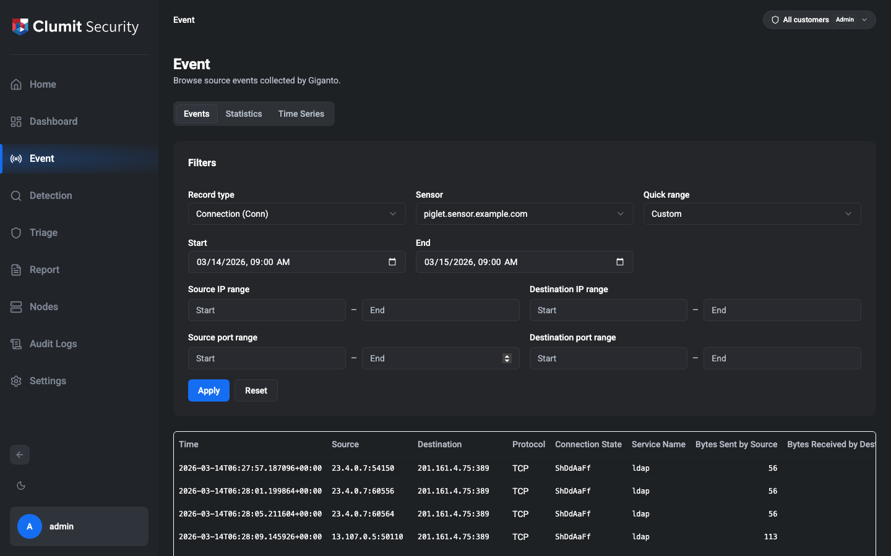
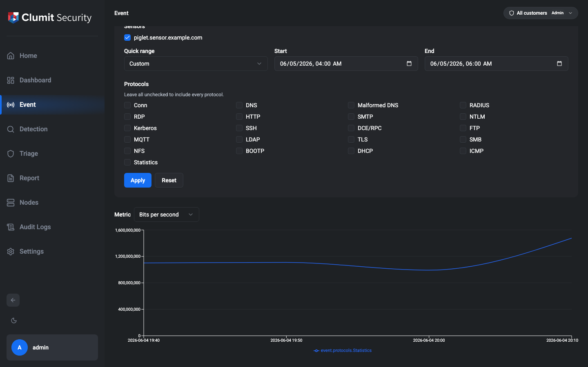
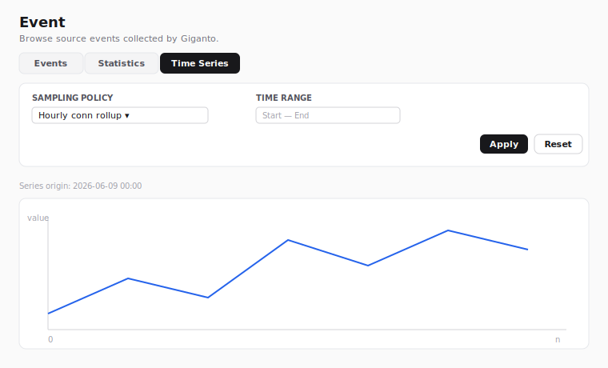

# Event

The Event page is accessed from the sidebar. It browses **source
events** collected by Giganto — the raw records the backend ingests,
before any detection logic runs. It covers all 34 Giganto record types:
the 20 network types — connection (**Conn**) plus the 19 protocol
types — and the 14 Sysmon / Windows endpoint types, all listed under
[Record types](#record-types). Each type has type-appropriate columns
and a full row detail.

Viewing the page requires the `event:read` permission. The built-in
roles Security Monitor, Tenant Administrator, and System Administrator
receive this permission by default. Custom roles that grant
`event:read` also qualify. The Event menu item stays visible to every
user; the permission is enforced when the page loads, and a user
without it is redirected away.

## Views

A toggle at the top of the page switches between three views of the same
sensor data:

- **Events** — the record table described below. This is the default.
- **Statistics** — an aggregation chart of per-protocol metrics over
  time (see [Statistics](#statistics)).
- **Time Series** — the periodic numeric series of a selected sampling
  policy (see [Time Series](#time-series)).

The active view is kept in the page URL alongside the filter, so a
chosen view is shareable and survives a reload. Each view keeps its own
filter, so switching back and forth does not discard any of them.

## Filters

The Filters card at the top of the page builds a query. Nothing is
fetched until you choose a sensor and select **Apply** — a sensor is
required because Giganto scopes every network query to exactly one
sensor.

- **Record type** — the kind of source event to browse. All 34 Giganto
  record types are selectable (see [Record types](#record-types)). The
  new type takes effect when you select **Apply**, which re-runs the
  search and swaps the results columns and detail layout for that type.
  The record type also decides which filter inputs apply: network types
  show the IP/port ranges below, while Sysmon types show a single
  **Agent ID** field instead (see below).
- **Sensor** — the single sensor to query. The list is populated from
  the sensors Giganto has ingested data for. If the list cannot be
  loaded, the selector is disabled and a notice is shown. The sensor is
  required for every record type, network and Sysmon alike.
- **Quick range** — a shortcut that fills the start/end time range with
  a relative window (1 hour, 12 hours, 1 day, … up to 3 years).
- **Time range** — explicit **Start** (inclusive) and **End**
  (exclusive) bounds. Editing these overrides the quick range.
- **Source / destination IP range** — optional start/end IP bounds for
  the originating and responding addresses.
- **Source / destination port range** — optional start/end port bounds
  for the originating and responding ports. Ports must be whole numbers
  between 0 and 65535; **Apply** is blocked while a port entry is not a
  whole number in that range (decimal or exponent input is rejected
  rather than rounded to a different port). For the **ICMP** record type
  the port inputs are disabled and not applied — ICMP records have no
  ports.
- **Agent ID** — shown **only for Sysmon types**, in place of the IP and
  port ranges. Sysmon events are scoped by the reporting agent rather
  than by network address, so this is a free-text match on the agent id
  (Giganto exposes no agent list to populate a dropdown). When you switch
  between a network type and a Sysmon type, the inputs that do not apply
  to the new type are hidden, cleared, and dropped from both the query
  and the bookmarkable URL, so a value typed for one family never leaks
  into the other — not even after a reload or after switching back.

There is no separate protocol filter: Giganto's network filter has no
protocol field, so the IP protocol cannot be used as a query input. It
is shown per record in the **Protocol** results column instead.

**Apply** runs the search from the first page. **Reset** clears every
field. The active filter and page are kept in the page URL, so a search
is shareable and survives a reload.

## Results

Matching records are listed in a table. Every type shares a common
leading column set — **Time**, **Source**, **Destination**, and
**Protocol** — followed by a curated set of type-specific summary
columns. For **Conn**, the summary columns are:

| Column | Meaning |
| --- | --- |
| Time | Record timestamp |
| Source | Originating `address:port` |
| Destination | Responding `address:port` |
| Protocol | IP protocol (TCP, UDP, ICMP, or the raw number) |
| State | TCP connection-state string |
| Service | Detected service name |
| Bytes out | Bytes sent by the source |
| Bytes in | Bytes received by the destination |

Each other record type curates its own summary columns (for example HTTP
shows method, host, URI, and status code). Wide types render only a
short default column set in the table; the full field list is in the row
detail. Byte and packet counts and durations are 64-bit values Giganto
returns as strings; they are formatted for display without losing
precision.

For the **ICMP** type, which has no ports, the Source and Destination
columns show bare addresses.

Sysmon types have no network endpoints, so their table leads with a
different common set — **Time**, **Agent name**, **Image**, and
**User** — followed by their own type-specific summary columns (for
example Process Create shows the command line, parent image, integrity
level, and hashes). The row detail still lists every field of the
selected type.

### Row detail

Selecting a row opens a side panel with the **full** record — every
field of the selected type, not just the summary columns. List-valued
fields (such as DNS answers or TLS extensions) are shown inline; raw
byte payloads are shown one row per line; and the nested sub-records of
**DCE/RPC** (bind contexts), **FTP** (commands), and **DHCP** (options)
are rendered as labelled sub-blocks.

## Record types

All 34 Giganto record types are selectable in the **Record type**
filter. The 20 network types come first:

| Group | Types |
| --- | --- |
| Connection | Conn |
| Name resolution | Dns, MalformedDns |
| Web | Http, Rdp |
| Mail | Smtp |
| Authentication / directory | Ntlm, Kerberos, Ldap, Radius |
| Remote access / RPC | Ssh, DceRpc |
| File transfer / sharing | Ftp, Smb, Nfs |
| Messaging | Mqtt |
| Encryption | Tls |
| Address assignment | Bootp, Dhcp |
| Diagnostics | Icmp |

A few network types differ from the rest:

- **MalformedDns** is not shaped like Dns: instead of query/answer/rcode
  it carries DNS-header counts and the raw malformed query/response byte
  payloads.
- **Tls**, **Http**, **Dhcp**, and **Radius** are wide (26–33 fields);
  the table shows a curated subset and the row detail shows everything.
- **DceRpc**, **Ftp**, and **Dhcp** carry nested sub-records, rendered in
  the row detail.
- **Icmp** has no ports; its port filter inputs are disabled.

### Sysmon / endpoint record types

The 14 Sysmon / Windows endpoint types follow the network types in the
selector. They are filtered by [**Agent ID**](#filters), not IP/port,
and share a common header — time, agent name, agent id, process GUID,
process id, image, and user — plus their own type-specific fields:

| Group | Types |
| --- | --- |
| Process | Process Create, Process Terminate, Process Tamper |
| Image | Image Load |
| File | File Create, File Create Time, File Create Stream Hash, File Delete, File Delete Detected |
| Registry | Registry Value Set, Registry Key Rename |
| Network | Network Connect |
| Pipe | Pipe Event |
| DNS | DNS Query |

A few Sysmon types are worth noting:

- **Network Connect** carries its own source/destination host, IP, and
  port fields (distinct from the network family's connection records).
- **File Create Stream Hash** uses a singular `hash` list field, while
  the other file/process types use `hashes`.
- **DNS Query** carries a `queryResults` list and a `queryStatus` code.

## Pagination

Giganto returns results as a cursor-based connection that does **not**
expose a total count, so the paginator is **Previous / Next** only —
there is no total, no "last page", and no go-to-page jump.

- **Previous** and **Next** step one page at a time and are enabled only
  when Giganto reports another page in that direction.
- **Rows per page** selects the page size (25, 50, or 100). 100 is the
  maximum Giganto accepts.

Changing the page size restarts from the first page.

## Statistics

The **Statistics** view aggregates Giganto's per-protocol traffic
metrics into a time-series chart instead of listing individual records.
Select it from the [view toggle](#views).

### Statistics filters

- **Sensors** — a **multi-select** list (one checkbox per sensor). The
  statistics query aggregates across every selected sensor, so unlike
  the single-sensor event search you can pick several at once. At least
  one sensor is required before **Apply** is enabled.
- **Quick range** and **Time range** — the same relative-window
  shortcut and explicit start/end bounds as the event search.
- **Protocols** — an optional subset of the protocols the statistics
  API tracks (Conn, DNS, Malformed DNS, RADIUS, RDP, HTTP, SMTP, NTLM,
  Kerberos, SSH, DCE/RPC, FTP, MQTT, LDAP, TLS, SMB, NFS, BOOTP, DHCP,
  ICMP, and Statistics). Leave every box unchecked to include all of
  them. The picker only offers these keys because Giganto rejects any
  other protocol value.

### Chart

A **Metric** selector chooses which value to plot — **bits per second**,
**packets per second**, **events per second**, **count**, or
**size** — and the chart draws **one line per protocol** over time.
Plotting every metric at once would be unreadable, so the metric is a
display switch over the already-fetched data and does not re-query.

The X-axis is the bucket time. Giganto reports each bucket's timestamp
as an epoch-nanosecond value, which is converted to a calendar time for
the axis. The 64-bit `count` and `size` values can exceed what a chart
coordinate can hold exactly, so the plotted line may round above
2^53; the tooltip always shows the exact integer Giganto returned.

## Time Series

The **Time Series** view charts the **periodic numeric series** of a
single sampling policy, rather than aggregating traffic metrics. Select
it from the [view toggle](#views).

!!! note "Wireframe stand-in"

    The figure above is an SVG wireframe rather than a real capture.
    The chart shows data received from Giganto, so a real screenshot is
    taken from a stack with real data loaded and replaces this
    placeholder in the final documentation sweep.

### Time series filters

- **Sampling policy** — a single-select dropdown that chooses which
  series to chart. The options are the sampling policies defined in
  REview; each option's label is the policy name. A policy is **required**
  before **Apply** is enabled, because Giganto keys a time series by its
  policy id. If the policy list cannot be loaded, the selector is
  disabled and a notice is shown.
- **Quick range** and **Time range** — the same relative-window shortcut
  and explicit start/end bounds as the other views. The window is
  optional; leaving it unset charts the policy's full available series.

Reading the sampling policy list and the series both require the
`event:read` permission — the same gate as the rest of the Event menu.
The policy list is sourced from REview while the series itself comes from
Giganto; no additional permission is needed.

### Chart

The chart draws **one line** for the selected policy's `data` values. The
series may arrive in several chunks, each with its own origin time; they
are ordered by that origin and joined into one continuous line. The
**series origin** — the timestamp of the first chunk — is shown above the
chart.

The X-axis is the **cumulative sample index** (the series carries no
per-sample interval), and the Y-axis is the sample value. Values are
plain numbers, so unlike Statistics they need no 64-bit parsing. When the
selected policy has no data points, an empty-state message is shown
instead of an empty chart.
