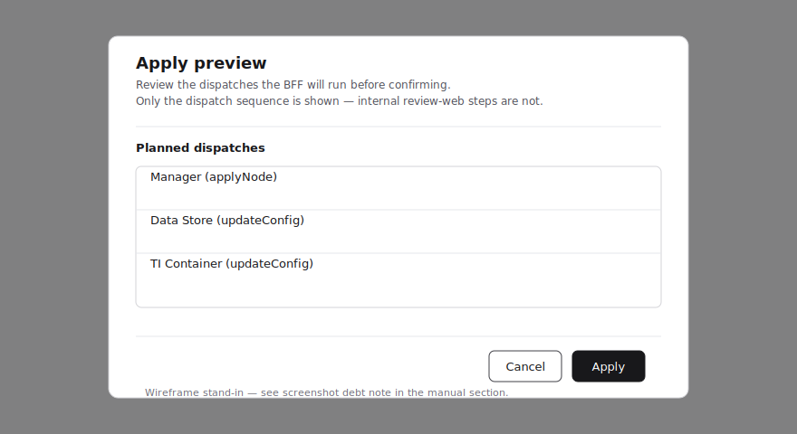
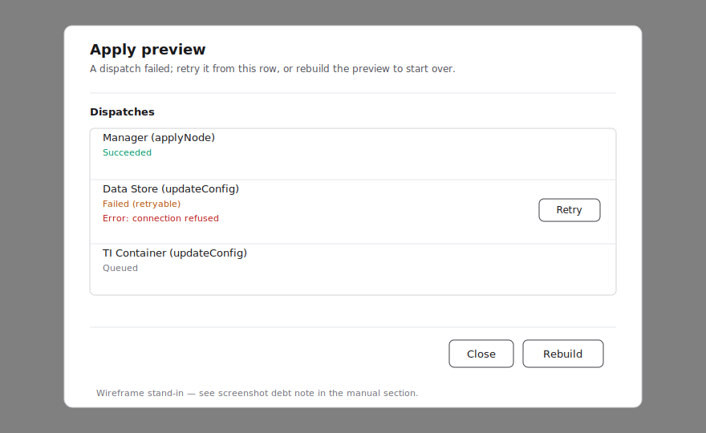
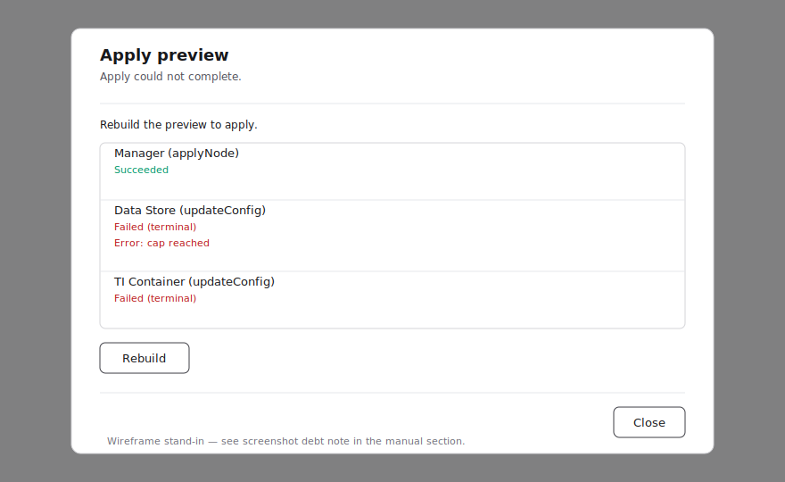

# Node management

This page documents the **Status** and **Settings** tabs of the Nodes
feature. The per-service configuration editors and the per-service
on/off control are owned by later phases of the same feature and will
be documented as those land.

## Permissions

Both tabs are reachable only with **both** `nodes:read` and
`services:read`. A custom role missing either receives an HTTP 403
response with the URL preserved; the layout renders a localized
"forbidden" panel instead of the table.
Built-in roles already pair the two:

- **System Administrator** — full read/write/delete across all customers.
- **Tenant Administrator** — full read/write/delete within assigned
  customers.
- **Security Monitor** — read-only within assigned customers; sees the
  list but no Add / Edit / Delete affordances.

## Node list


The table shows every node the caller has access to. Each row carries
applied state (currently committed on the manager) and any pending draft
side-by-side.

### Pending changes

Rows with a draft that differs from the applied state render with:

- A **Pending** badge on the left edge of the row.
- Two-line cells for any of `name`, `customer`, `description`, or
  `hostname` whose draft value differs from the applied value: the
  applied value appears struck through, with the draft value shown
  below.
- A small amber dot beside any service status icon whose service has a
  pending draft.

The summary chip above the table — "N nodes with pending changes" —
filters the table to changed rows when active.

### Status filter

The chip group above the table accepts any combination of:

- **Pending** — rows whose applied state differs from the saved draft
  for any of name, profile, agents, or external services.
- **Alive** / **Dead** — derived from the one-shot `nodeStatusList` ping
  fetched at page render. The chips are accessibly disabled until the
  ping reading arrives; they switch to live polling data once Phase
  Node-6's polling hook lands.

### Search and sort

The search box matches name, hostname, and customer (case-insensitive)
across both applied and draft values. The sort dropdown re-orders the
visible rows by **Newest**, **Name (A→Z)**, or **Hostname**.

### Tenant filter

System Administrators see an extra **Customer** dropdown that filters by
the assigned tenant. Tenant Administrators are scoped to their
customers automatically and do not see the dropdown.

### Manager column

The right-most column is a status-only badge derived from
`NodeStatus.manager`:

- **Running** — the manager process is reachable on the node.
- **Not running** — the manager has not reported alive.

Manager has no UI-editable draft in v1: no Pending badge and no kebab
appear on the Manager cell.

## Bulk delete

Left-side row checkboxes select one or more rows. Once any row is
selected, a floating bar at the top of the page surfaces:

- "N selected" counter.
- A **Delete selected** action that opens a confirmation modal.
- A **Cancel** action that clears the selection.

Confirming the bulk delete deletes each node individually. Each
successful deletion writes one `node.delete` audit entry with the
node's id and `{ hostname }` in `details`. Failed deletions do not emit
an audit entry.

The checkbox column is hidden entirely for callers without
`nodes:delete` (Security Monitor), so a read-only viewer never sees the
first step of the bulk-delete flow.

## Per-row Edit / Delete

The row kebab menu offers **Edit** (opens the create/edit dialog) and
**Delete** (opens a single-row confirmation modal). Edit and Delete are
hidden for callers without `nodes:write` / `services:write` and
`nodes:delete` respectively.

## Manager offline

When the upstream manager is unreachable, the table area is replaced
with a "Cannot reach manager" panel. The sidebar and the Nodes tab bar
continue to render so the caller can navigate elsewhere.

## Saving drafts

This section documents the **save-draft server action** that lives in
the BFF. The Edit dialog UI that calls into it ships in a sibling
Phase Node-9 sub-issue and is not yet renderable on this branch, so
nothing on this branch lets an operator save a draft from the UI.
What is documented below is the contract the dialog and any other
caller (scripts, automation) will rely on once the dialog ships, and
the audit rows operators will see when saves start landing.

> **Screenshot debt.** The Edit dialog and the stale-conflict
> reconciliation prompt are owned by the sibling sub-issue that builds
> the editing UI. PNG captures of the save happy path and the
> reconciliation prompt will be appended to this section by that
> sub-issue's PR, per `docs/AUTHORING.md`.

### Permissions

The save-draft action requires **both** `nodes:write` and
`services:write`. Calls missing either permission are rejected at the
BFF boundary with a typed `NodePermissionError` before any GraphQL
dispatch reaches the manager. Built-in **Tenant Administrator** and
**System Administrator** roles already pair the two; **Security
Monitor** has neither. Customer scope is enforced by the manager DB
via the dispatch context's `customer_ids`; out-of-scope nodes surface
to the caller as a typed `NodeNotFoundError`.

### CAS contract (`updateNodeDraft(id, old, new)`)

Each save dispatches one `updateNodeDraft(id, old, new)` call to the
manager. The `old` value is the **full node snapshot** the caller
opened against — applied state *and* current drafts (name draft,
profile draft, per-service `status` and `draft`); the `new` value
carries the proposed name, profile, agents, and external-service
drafts. The manager performs a compare-and-swap on that whole
snapshot: if the current server snapshot no longer matches `old` —
including a concurrent draft-only edit by another writer — the call
is rejected as a *stale conflict* and the user's edits are not
silently overwritten.

### `service.draft_save` audit emission

A successful save emits one **`service.draft_save`** audit entry per
service whose draft string actually changed. A save that touches two
services emits two entries; a save that only changes node metadata
(name / customer / description / hostname) emits zero
`service.draft_save` entries. Each entry carries
`targetId = "${nodeId}:${serviceKind}"` and
`details = { serviceKind, nodeId }`, so operators can filter the audit
log to a single service on a single node. Saves that fail at the
permission boundary, the customer-scope check, or with a double
stale-conflict (see below) emit **no** `service.draft_save` rows.

### Stale-conflict replay

When the first `updateNodeDraft` call is rejected with the documented
stale-conflict shape (see `decisions/node-conflict-patterns.md`),
the BFF transparently re-reads the current node, rebases the caller's
intent on top of that fresh baseline, and replays the call once. The
rebase is **field-granular**, not row-granular: if the caller edited
only a service's `draft` and a concurrent writer flipped only that
same service's `status`, the replay sends `{fresh status, user
draft}`. The same per-field merge applies to profile subfields
(`customerId`, `description`, `hostname`). Whole-row fallback applies
only when the caller adds or clears an entry, since there is no fresh
subfield to interpolate against.

If the rebased payload already matches the fresh canonical state
byte-for-byte over the editable surface — the case a redundant retry
of the same payload produces — the replay mutation is **not**
dispatched and no extra audit is emitted.

### `StaleConflictError` on double conflict

When the replay also rejects with the stale-conflict shape, the
server action stops, throws a typed `StaleConflictError`, and emits
no audit. Callers (the Edit dialog and any future automation) are
expected to surface a reconciliation choice to the user — discard the
local edits and reload, or keep the edits and refresh the baseline —
rather than retrying automatically. The visual surface for that
choice is owned by the sibling sub-issue that ships the dialog.

## Bulk apply

This section documents the **bulk-apply executor** that promotes a
node's pending drafts in one operation. The user-facing modal that
opens this flow ships in a sibling Phase Node-9 sub-issue and is not
yet renderable on this branch; what is documented below is the
contract the modal and any other caller will rely on once it ships,
and the audit row operators will see when applies start landing.

> **Screenshot debt.** The Apply preview modal, the lifecycle
> badges, and the retry / rebuild prompts are owned by the sibling
> sub-issue that ships the modal UI. Captures of the apply happy
> path, the partial-failure prompt, and the rebuild-prompt state
> will be appended to this section by that sub-issue's PR per
> `docs/AUTHORING.md`.

### What bulk apply does

Bulk apply runs a two-phase fan-out behind a single user
confirmation:

1. **Manager step.** Dispatches the upstream `applyNode` mutation,
   which atomically promotes every pending draft on the node
   (name, profile, agents, external services) to applied state in
   the manager DB.
2. **External step.** For each external service that had a pending
   `draft` at apply-build time (Giganto for `DATA_STORE`, Tivan for
   `TI_CONTAINER`), dispatches the upstream `updateConfig(old,
   new)` mutation against the service. `old` is read fresh from the
   service on every dispatch (including retries); `new` is the
   frozen draft string captured at apply-build time and never
   re-read.

The dispatches run sequentially in a fixed order: manager first,
then each external in plan order. A failure at any step stops the
fan-out — the next dispatch only runs after the previous one
succeeds.

### Permissions and tenant scope

Bulk apply requires both **`nodes:write`** and **`services:write`**.
The combined gate is enforced at every confirm and every retry
(not just at apply-build time): a caller whose permissions or
customer scope changed between building and confirming the apply
is rejected with a typed `NodePermissionError` before any GraphQL
dispatch reaches the wire.

The recheck is performed at two layers:

1. **Tenant-scope materialisation.** Every confirm and every retry
   rebuilds the dispatch context from the caller's current session,
   re-deriving `customer_ids` (and `customers:access-all` if the
   caller holds it). A caller whose tenant scope resolves to empty
   without `customers:access-all` is rejected before any node is
   read.
2. **Node-specific scope assertion (and existence check).** The
   wrapper then re-reads the canonical node from the manager DB
   **only when the row is in a status that can still reach a
   dispatcher** — `pending` for confirm, `failed_retryable` for
   retry. For terminal / idempotent statuses (`succeeded`,
   `failed_terminal`, `stale`, `expired`, `executing`) the lifecycle
   either returns the persisted row idempotently or rejects without
   dispatching anything, so the canonical-node read is unnecessary
   and would wrongly turn an idempotent re-confirm of an already-
   `succeeded` row into `NodeNotFoundError` once the node is later
   deleted (round 8). Skipping the read for these statuses also
   preserves the audit-recovery finish path: a follow-up confirm /
   retry against a `succeeded` row whose audit emission never
   completed can still drive `node.apply` to durable, even after the
   node has been deleted.

   For tenant-scoped callers, the wrapper re-derives the node's
   `customerId` and asserts it against the caller's *current*
   materialised scope. For globally-scoped callers
   (`customers:access-all`), the wrapper performs the same read but
   only as an **existence check** — there is no tenant boundary to
   enforce, but the read still ensures the node has not been
   deleted between confirm and a subsequent retry. This is critical
   for `retryDispatch` whose target is an external service: the
   external dispatcher otherwise talks to the deployment-global
   Giganto / Tivan endpoints with no per-node guard of its own.
   Without this wrapper-level recheck, an actor whose customer
   scope shrank between confirm and retry could keep driving
   `updateConfig` against an out-of-scope node, and a globally-
   scoped actor could keep driving `updateConfig` against a
   *deleted* node (and emit `node.apply` for it). A forged client
   payload cannot bypass the check because the `customerId` and
   the existence verdict are both read from the manager DB, not
   trusted from the request. For tenant-scoped callers, both
   possible review-web responses for an out-of-scope node — a
   filtered `null` payload *and* a `NOT_FOUND` GraphQL error — are
   mapped to `NodePermissionError` (mirroring the create-attempt
   surface), so the wrapper never leaks "this node exists but you
   cannot see it" semantics back to the caller. For globally-
   scoped callers a deleted-node read surfaces as
   `NodeNotFoundError` (no scope-shrunk semantics to hide).

A bulk apply is **single-actor**: only the account that built the
plan can confirm or retry it. Another account presenting the same
`attemptId` is rejected as `ApplyAttemptNotFoundError` (the BFF
does not leak whether the row exists).

### Lifecycle states

A confirmed apply progresses through one **resumable** state and
three **terminal** states. Only `succeeded`, `failed_terminal`,
and `stale` are terminal — `failed_retryable` is the resumable,
non-terminal state inside the original time window:

- **`failed_retryable`** *(resumable, non-terminal)* — a transient
  external failure stopped the fan-out within the original time
  window. The same actor can call the retry path
  (`retryDispatch({ attemptId, dispatchId })`) to resume from the
  failed dispatch. The frozen `new` from apply-build time is
  replayed; only `old` is re-read fresh. The manager step is
  **not** re-run if it already succeeded. Successive retries
  within the per-dispatch cap drive the row to either `succeeded`
  or `failed_terminal`. The original window is preserved across
  soft fails — a retry submitted past the window surfaces as a
  stale-plan error.
- **`succeeded`** *(terminal)* — all dispatches landed. A single
  `node.apply` audit row is emitted (see below). The row is
  retained for an operator-readable interval and then hard-deleted
  by the cleanup sweep.
- **`failed_terminal`** *(terminal)* — the per-dispatch retry cap
  has been exhausted, the recovery sweep abandoned a stuck claim,
  or the row TTL-terminalised past `expires_at`. The row will not
  transition further; the operator must rebuild the plan from a
  fresh preview. The modal surfaces a "rebuild" prompt for this
  state.
- **`stale`** *(terminal)* — drift between the apply-build and
  apply-confirm fingerprints. Written by the executor when the
  post-claim fingerprint recompute (step 5b) detects the
  mismatch survived; the call rejects with a typed
  `StalePlanError`. No manager mutation is sent and no external
  mutation is sent. A pre-claim hint that drift has settled by
  the time of the post-claim recompute is honored — the
  recompute is authoritative. The modal also surfaces the
  "rebuild" prompt for this state.

### `node.apply` audit emission

A successful apply emits exactly **one** `node.apply` audit row,
regardless of how many calls it took to reach `succeeded` (a
single `confirmApplyAttempt`, a confirm followed by one or more
`retryDispatch` calls, or even an idempotent re-confirm of an
already-`succeeded` row from a double-clicked button). The
"exactly once" contract is enforced by two complementary layers:

**Layer A — schema-level dedupe (authoritative).** `audit_logs`
carries a partial unique index on
`(correlation_id) WHERE action = 'node.apply' AND correlation_id
IS NOT NULL`. Both the wrapper and the cleanup-sweep recovery pass
the attempt UUID as `correlation_id` on every `node.apply` row, so
a duplicate insert from any source — concurrent caller, recovery
sweep, partially-failed prior call, process restart — is rejected
by the database with a `unique_violation` (PG SQLSTATE 23505). This
is the guarantee that no two `node.apply` rows can exist for the
same attempt; it does not depend on coordination between the
wrapper and the cleanup sweep.

**Layer B — slot coordination (avoid the wasted INSERT).** Two
columns on `apply_attempts` serialise the common case so the
duplicate-violation path is the rare exception:

1. `succeeded_audit_emitted_at` — atomically test-and-set
   (`NULL → NOW()`) under a `status='succeeded' AND emitted_at IS
   NULL` guard. Only the caller whose `UPDATE` matches a row may
   emit. Concurrent racers and idempotent re-confirms both observe
   `rowCount = 0` and skip emission.
2. `succeeded_audit_completed_at` — set after the audit row is
   durably written to the audit DB. This makes the emission
   *durable*: once `completed_at` is set, the slot can never be
   released.

If the audit DB write fails synchronously *and* the failure is not
a duplicate-violation, the wrapper releases the slot (clearing
`succeeded_audit_emitted_at` back to `NULL` under a `completed_at
IS NULL` guard) so a follow-up confirm/retry can re-attempt. On a
duplicate-violation the slot is left claimed and `completed_at` is
marked instead — the audit row is already durable, releasing would
just invite the next call to attempt the same insert and get
rejected again. If the process dies between the slot claim and the
audit write, the cleanup sweep's `recoverPendingNodeApplyAudits`
pass picks the row up after the staleness window
(`APPLY_EXECUTING_STALE_MS`) elapses, re-emits the audit using the
row's persisted metadata (`audit_actor` → actor, planned dispatches
→ `appliedServices`, `node_id` → `targetId`, `attempt_id` →
`correlationId`), and marks `completed_at`. If the original audit
row already landed before the crash, the recovery sweep observes
the same duplicate-violation and marks `completed_at` without
re-inserting.

**Cascade-delete and audit recovery (round 8).** Until round 8 the
`apply_attempts.created_by` foreign key on `accounts` was
`ON DELETE CASCADE`, so deleting the creator account would remove
the attempt row out from under the recovery sweep — a row that
reached `succeeded` but never made it through
`succeeded_audit_completed_at` could end up with zero `node.apply`
entries. Round 8 decouples the cascade observable from audit-
recovery durability:

- `audit_actor UUID NOT NULL` is a non-FK snapshot of the creator's
  account id taken at insert time. The recovery sweep reads this
  column for the audit `actor` field, so deleting the account
  cannot strip the actor from a pending recovery.
- The `created_by` FK switches from `ON DELETE CASCADE` to `ON
  DELETE SET NULL`. A `BEFORE DELETE` trigger on `accounts` runs
  first and explicitly deletes `apply_attempts` rows that are NOT
  succeeded-audit-pending, so the umbrella's "cascade-delete
  removes the attempt row" behavior still holds for the common
  case (`failed_retryable`, `pending`, `failed_terminal`, etc.).
  Rows whose `status = 'succeeded' AND
  succeeded_audit_completed_at IS NULL` survive with `created_by`
  set to NULL; the lifecycle's ownership check
  (`row.createdBy !== session.accountId`) then rejects any follow-
  up confirm or retry as `ApplyAttemptNotFoundError` — the
  observable surface a user sees is unchanged — while the recovery
  sweep keeps the row visible and emits `node.apply` using the
  snapshotted `audit_actor`.

**Recovery covers two windows (round 6).** The cleanup sweep's
candidate `SELECT` matches both failure modes:

1. **Slot claimed, completion never landed.** A wrapper claimed the
   slot but the audit insert or `completed_at` marker never landed
   (audit-DB transient or process death after the claim). Predicate:
   `succeeded_audit_emitted_at IS NOT NULL AND
   succeeded_audit_completed_at IS NULL` past the staleness window.
2. **Slot never claimed.** The lifecycle committed `status =
   'succeeded'` but the wrapper crashed before reaching
   `claimNodeApplyAuditSlot`, leaving both audit columns `NULL`.
   Without this branch the row would sit `succeeded` forever with no
   `node.apply` audit; only a manual re-confirm could rescue it.
   Predicate: `succeeded_audit_emitted_at IS NULL` plus a derived
   `succeeded_at` (≈ `expires_at - APPLY_ATTEMPT_RETENTION_MS`)
   older than the staleness window. For this branch the recovery
   sweep claims the slot itself before emitting; if a wrapper
   arrives concurrently and wins the claim, the sweep skips and the
   wrapper drives the row.

**Purge ordering (round 6).** The retention sweep
(`purgeRetained`) hard-deletes terminal rows past their retention
deadline, but it now exempts `succeeded` rows whose
`succeeded_audit_completed_at IS NULL`. This stops a prolonged
audit-DB outage from purging an audit-incomplete row before the
recovery sweep gets a chance to finish it; the row remains
recoverable until `completed_at` is set, then the next purge sweep
removes it. The cleanup orchestrator also runs audit recovery
*before* purge in the same pass, so the audit-DB-healthy case
recovers in a single cycle instead of waiting one cycle for the
exemption to clear.

**Recovery-sweep failure handling.** A transient audit-DB error
during a recovery pass leaves the slot CLAIMED (it does *not* clear
`succeeded_audit_emitted_at` back to `NULL`). Leaving the slot
claimed lets the next sweep re-pick the same row; the staleness
window only grows wider. The same rule applies if the post-insert
`completed_at` UPDATE itself throws: the audit row is already
durable, so the slot stays claimed and the next sweep observes the
schema-level duplicate-violation and marks `completed_at` via the
dedupe path. Together these layers turn the emission contract
from "at most once" into "exactly once per attempt that reaches
`succeeded`".

The audit row carries:

- `actor` — the account that confirmed the apply.
- `action` — `"node.apply"`.
- `target` — `"node"`.
- `targetId` — the node id (not a composite key).
- `details.appliedServices` — the list of external service kinds
  that were dispatched (`["DATA_STORE"]`, `["TI_CONTAINER"]`, or
  both, in plan order).

A confirmed apply that settles to `failed_retryable`,
`failed_terminal`, or `stale` emits **no** `node.apply` row. v1
does not emit a `service.apply` audit per external — that audit is
reserved for Phase Node-12 (#333).

## Apply preview

The **Apply preview** modal is the operator's checkpoint between
saving drafts and confirming the apply. It opens in two phases — a
read-only **planned dispatches** list, and a live **per-dispatch
status** view once the operator clicks **Apply**.

The figures below are wireframe stand-ins per the
infrastructure-gated screenshot exception in `docs/AUTHORING.md`:
the modal does not yet have a mount point on the node detail page
(owned by Phase Node-5 / #311), and the bulk-apply mock manager /
external endpoints used by the e2e harness are tracked separately.
Real PNG captures of all three states will replace these wireframes
in the same PR that lands the detail-page mount.

### Planned dispatches (before execution)



Opening the modal calls `createApplyAttempt({ nodeId })`. The BFF
returns the planned dispatch list — the **top-level dispatches the
BFF itself orchestrates**: the upstream `applyNode` mutation followed
by one `updateConfig` per external service whose draft is pending at
plan-build time. Internal review-web execution stages are not
surfaced; the modal only renders the dispatch sequence the BFF will
issue.

Each row shows the dispatch kind label
(`Manager (applyNode)` / `Data Store (updateConfig)` /
`TI Container (updateConfig)`). The **Apply** button is enabled when
at least one dispatch is planned; an empty plan renders a "no pending
changes" message and disables Apply.

### Per-dispatch status (during and after execution)

Clicking **Apply** calls `confirmApplyAttempt({ attemptId })`. While
the call is in flight the modal:

- Ignores Escape and outside-clicks — the underlying BFF call cannot
  be cancelled, so dismissing the UI mid-flight would orphan the row
  in `executing`.
- Promotes only the **first** still-`queued` row to **In flight**,
  mirroring the BFF's sequential-advance rule (`advanceForClaim` in
  `apply-attempt-lifecycle.ts`). Later rows stay **Queued** until the
  executor commits the running row and advances the next one.
  Marking every row in flight would imply parallel execution the
  state machine does not perform.
- Shows the **Applying…** label on the action button.

Each row renders one of five states. **Queued** is shown before the
user clicks Apply (the planned-list view), on later dispatches while
the leading row is still in flight, and on dispatches after a settled
`failed_retryable` row — under the sequential-advance rule from #359
a failure halts the sequence with subsequent dispatches still
`queued`, awaiting resume on a successful retry.

| State | Meaning |
| :-- | :-- |
| **Queued** | Not yet started — shown on the planned list before Apply, on later dispatches while an earlier row is in flight, and on dispatches after a `failed_retryable` row that have not been advanced by the resume rule yet. |
| **In flight** | Dispatch is running. While `confirmApplyAttempt` is pending the modal projects this state on the first still-`queued` row; while `retryDispatch` is pending it projects this state on the retried row only. |
| **Succeeded** | Dispatch returned successfully. |
| **Failed (retryable)** | Soft failure; the row offers a **Retry** button. |
| **Failed (terminal)** | Cap exhausted, abandoned, or stale-lock recovery cascade — no Retry. |

State colours are: green for **Succeeded**, sky for **In flight**,
amber for **Failed (retryable)**, red for **Failed (terminal)**, and
muted for **Queued**.

### Retry vs. Rebuild





A failed dispatch presents one of two recovery paths:

- **Retry** — visible only when the dispatch is in
  `failed_retryable`. Clicking the row's Retry button calls
  `retryDispatch({ attemptId, dispatchId })` against the same
  `attemptId`. The state-machine guarantees at most one
  `failed_retryable` per attempt at any time (sequential advance with
  stop-on-first-failure), so the modal never renders more than one
  Retry button on the same plan. On retry success the resume rule in
  `_internal_retryDispatch` advances the next `queued` dispatch
  automatically — no second click is needed.
- **Rebuild** — required when the row settles to `failed_terminal`,
  the plan has gone `stale` / `expired`, or the modal could not even
  fetch a plan. Rebuild discards the current `attemptId` and re-runs
  `createApplyAttempt({ nodeId })` to obtain a fresh plan against the
  latest manager-DB drafts. The modal explicitly tells the operator
  to "Rebuild the preview to apply" when a row is in
  `failed_terminal`; no Retry button is offered on terminal rows.

### Accessibility

The modal carries `role="dialog"` and uses Radix's focus trap so tab
navigation stays within the dialog. Escape closes the modal only
when not executing; per-row Retry buttons carry an accessible name
naming the dispatch kind so screen readers can disambiguate
("Retry – Data Store (updateConfig)").

## Status tab


The Status tab is the default landing for `/nodes`. It renders one row
per node the caller has access to, with live resource bars driven by a
client-side polling loop and a node-level control menu.

### Columns

- **Node** — name and hostname, taken from the latest snapshot.
- **CPU**, **Memory**, **Disk** — progress bars. Bars colour amber at
  `≥ 80%` and red at `≥ 95%`.
- **Manager** — derived directly from `NodeStatus.manager` returned by
  `nodeStatusList`. Reads **Running** when `true`, **Not running**
  when `false`.
- Six per-service placeholder columns (Sensor, Data Store, TI Container,
  Unsupervised, Semi-supervised, Time Series) — Phase Node-7 fills
  these with on / off / idle status.
- A row-level kebab opens the **Restart** / **Shutdown** control menu.

### Polling

The table refreshes every `NEXT_PUBLIC_NODE_STATUS_POLL_MS`
milliseconds (default `10000`, clamped to `[5000, 300000]`). When the
tab is hidden, polling pauses; on resume, the hook issues a single
one-shot refresh before the regular cadence resumes. A "Last updated"
indicator above the table reports the timestamp of the most recent
sample, and switches to a "stale" hint when the gap exceeds twice the
polling interval. The hook does not synthesise filler samples — gaps
appear as honest data loss in the rolling buffer.

### Restart / Shutdown

Both actions live behind the row's kebab menu and require
`nodes:write`. Security Monitor accounts see the row but no control
menu. Each action opens a confirmation modal; on confirm, the BFF
calls `nodeReboot(hostname)` or `nodeShutdown(hostname)` and writes a
single `node.restart` / `node.shutdown` audit entry with the hostname
in `details`. Hostname is resolved from the node id server-side, so a
forged hostname cannot bypass tenant scope.

### Row navigation

The Status tab does **not** carry an Apply button. Clicking anywhere
on the row outside the kebab menu navigates to the node's detail
route at `/nodes/[id]`; the node name doubles as a keyboard-focusable
link to the same target. In this release the detail route only
renders a placeholder card — the per-node dashboard with pending-edit
review and the **Apply All Pending** action is delivered by Phase
Node-5 (a follow-up). v1's single apply entry point will live on
that detail dashboard once Phase Node-5 lands; until then no apply
affordance is reachable from the Status tab.

### Manager offline

The Status tab uses the same fallback panel as the Settings tab when
the manager is unreachable. The fallback also kicks in mid-session: if
the manager drops after the first paint, the next polling tick
returns 503 and the table area swaps to the panel rather than
freezing on a stale snapshot. The panel disappears as soon as a
subsequent poll succeeds.

## Operating apply attempts (cleanup, runbook)

This section is for operators who watch the `apply_attempts` table
and the deployment-side scheduler that drives its cleanup. The
user-facing meaning of the lifecycle states (`failed_retryable` vs
`failed_terminal`, retry vs rebuild) is documented above under
[Bulk apply](#bulk-apply) and [Apply preview](#apply-preview); this
section maps the same states to operational symptoms and to the
runbook entry that keeps the table healthy.

### Row lifetimes (TTL and retention)

Every row in `apply_attempts` carries an `expires_at` cap. The cap
is rewritten on each lifecycle transition, so its meaning depends
on the row's current status:

- **30 minutes** (`APPLY_ATTEMPT_TTL_MS`) — when a row is created
  it is `pending` and `expires_at` is set to creation + 30 min.
  This TTL applies only while the row is `pending` or, after a
  retryable failure, `failed_retryable`. Past `expires_at` the
  cleanup TTL sweep terminalises those two statuses (`pending →
  expired`, `failed_retryable → failed_terminal`) and rewrites
  `expires_at` to the retention horizon below; the user must
  rebuild the plan from a fresh preview.
- **2.5 hours** (`APPLY_EXECUTING_STALE_MS`) — `executing` rows
  are **not** subject to the 30-minute TTL. The atomic claim
  promotes a `pending` row to `executing` without rewriting
  `expires_at`, but the TTL sweep skips any row holding an
  `executing_lock`, so an `executing` row may legitimately
  outlive the original 30-minute deadline until it either
  completes (transition to `succeeded` / `failed_retryable` /
  `failed_terminal`) or its `claim_started_at` ages past
  `APPLY_EXECUTING_STALE_MS`. The recovery sweep then treats it
  as a stuck claim, flips the row to `failed_terminal`, and
  cascades the in-flight + remaining queued dispatches to
  `failed_terminal` with the abandonment `lastError`. The user
  sees the modal's rebuild prompt on a subsequent visit.
- **7 days** (`APPLY_ATTEMPT_RETENTION_MS`) — every terminal
  transition (`succeeded`, `failed_terminal`, `stale`, `expired`)
  rewrites `expires_at = NOW() + retentionMs`. Retention is
  therefore measured **from the moment the row became terminal**,
  not from the original 30-minute deadline. The retention sweep
  hard-deletes terminal rows once `NOW() > expires_at` again.

The retention sweep does **not** purge `succeeded` rows whose
`succeeded_audit_completed_at IS NULL` — those rows are exempt
until the recovery sweep has emitted the corresponding
`node.apply` audit (see the audit-emission contract documented
above under [Bulk apply](#bulk-apply)). The exemption keeps a
prolonged audit-DB outage from purging an audit-incomplete row
before the recovery sweep gets a chance to finish it.

### Cleanup endpoint

The cleanup sweep is exposed as the route handler at
`POST /api/internal/apply-attempts/cleanup`. The deployment
scheduler must drive the route on a fixed cadence; the startup +
inline pre-create sweep fallback is **not** the active path,
because it silently skips cleanup whenever the Next.js process is
idle — unsafe on multi-instance deployments where one instance is
idle and another is creating attempts.

The route is **internal-token guarded**. Every request must carry
`Authorization: Bearer <APPLY_INTERNAL_CLEANUP_TOKEN>`. The shared
secret is constant-time-compared to avoid a timing oracle. If the
env var is unset, the route refuses every request — the deployment
must explicitly set the token before scheduling. The handler runs
as a system actor and never reads the manager DB or dispatches to
external services; the recorder acceptance test asserts zero
outbound GraphQL during a pass.

A successful pass returns HTTP 200 with the per-sweep counters:


The four counters report what each sweep did in this pass:

| Counter | Meaning |
| :-- | :-- |
| `recovered` | Stale-lock rows flipped to `failed_terminal` after `claim_started_at` aged past `APPLY_EXECUTING_STALE_MS`. |
| `expired` | Rows TTL-terminalised: `pending → expired` and `failed_retryable → failed_terminal`. |
| `purged` | Terminal rows hard-deleted past their retention deadline (excluding the `succeeded` / audit-incomplete carve-out). |
| `auditsRecovered` | `succeeded` rows whose `node.apply` audit was driven to durable by the recovery pass (covers both slot-claimed-but-not-completed and slot-never-claimed windows). |

A failed pass returns HTTP 500 with `{ "error": "<message>" }`.
HTTP 401 indicates the bearer token is missing or wrong.

### Runbook entry — schedule the cleanup endpoint

Add the cleanup route to the deployment scheduler in your release
runbook. The recommended cadence is **every 5 minutes**: this is
well below the 30-minute non-terminal TTL window, so a transient
scheduler outage of one or two cycles cannot cause a non-terminal
row to outlive its `expires_at` unobserved.

1. Provision a strong random token for `APPLY_INTERNAL_CLEANUP_TOKEN`.
   Treat it like any other internal secret — store it in your
   secrets manager, rotate on a normal cadence, never check it in.
2. Set the env var on every BFF instance and on the scheduler that
   calls the route. The defaults for the three TTL knobs ship in
   [`.env.example`](https://github.com/aicers/aice-web-next/blob/main/.env.example)
   and are read at runtime, so leaving the env vars unset is the
   supported "use the documented default" path:

    ```text
    APPLY_ATTEMPT_TTL_MS=1800000         # 30 min
    APPLY_ATTEMPT_RETENTION_MS=604800000 # 7 days
    APPLY_EXECUTING_STALE_MS=9000000     # 2.5 h
    APPLY_INTERNAL_CLEANUP_TOKEN=        # set per environment
    ```

    Override only when the deployment has a documented reason
    (long-running external dispatchers may want a longer
    `APPLY_EXECUTING_STALE_MS`; a compliance window shorter than
    7 days may want a smaller `APPLY_ATTEMPT_RETENTION_MS`).

3. Wire a recurring caller (cron, Kubernetes `CronJob`, GitHub
   Actions schedule, etc.) that issues:

    ```bash
    curl -fsS -X POST \
      -H "Authorization: Bearer $APPLY_INTERNAL_CLEANUP_TOKEN" \
      "$BFF_BASE_URL/api/internal/apply-attempts/cleanup"
    ```

4. Verify the first scheduled run by tailing the scheduler logs and
   confirming the JSON body parses to the four counters above. A
   healthy first run on a quiet deployment usually reports all-zero
   counters; a non-zero `recovered` or `expired` on a first run
   after a long outage is expected and should drop back to zero on
   subsequent passes.

### Observability and alerts

Operators should monitor the cleanup pass like any other periodic
sweep:

- **HTTP failure rate.** Treat any non-200 response from the
  cleanup route as an incident. 401 means the token rotated without
  the scheduler being updated; 500 means the database transaction
  threw and should surface a stack trace in BFF logs.
- **`recovered > 0` alert.** A non-zero `recovered` count means at
  least one `executing` row was older than 2.5 h and got abandoned.
  This should be rare in a healthy deployment; a sustained non-zero
  trend points at executor crashes between claim and commit, not at
  user behaviour.
- **`auditsRecovered > 0` alert.** A non-zero count means at least
  one `succeeded` row needed the recovery sweep to drive its
  `node.apply` audit to durable. Investigate audit-DB latency or
  BFF-process lifecycle; sustained values point at audit-DB
  pressure rather than apply-side bugs.
- **Pass duration.** A pass is a state-machine transaction plus a
  separate audit-recovery loop and a retention transaction; on a
  healthy deployment the whole call returns in well under a second.
  Long-running passes signal lock contention with the lifecycle
  module.

### Mapping lifecycle states to operational symptoms

When reading incident logs against the `apply_attempts` table, the
row-level state names map to symptoms as follows. The user-side
meaning of each state is documented under [Bulk apply](#bulk-apply)
and is not restated here.

| Row state | Operator symptom |
| :-- | :-- |
| `failed_retryable` | Transient external failure within the original 30-min window. The same row will resume on the next user click; no operator action needed unless the soft-fail rate climbs. |
| `failed_terminal` | Per-dispatch retry cap exhausted, recovery-sweep abandonment, or TTL terminalisation. The dispatch's `lastError` carries the abandonment reason. |
| `stale` | Drift between apply-build and apply-confirm fingerprints — the canonical node changed between preview and confirm. No manager mutation and no external mutation were sent. |
| `expired` | Row aged past `expires_at` while still `pending` (user opened the modal and walked away for >30 min). No mutations were sent. |

The audit row with `action = 'node.apply'` and
`correlation_id = <attempt-id>` is the operator-side proof that an
apply ran end-to-end. Its absence on a row that reached `succeeded`
is recovered automatically by the next cleanup pass via
`auditsRecovered`; if that counter stays non-zero across many
passes, the audit DB is the suspect.

### Modal screenshots

Modal-state captures (planned dispatches, `failed_retryable` with
Retry, `failed_terminal` with Rebuild) live with the [Apply
preview](#apply-preview) section above and are not duplicated
here. Operators triaging a stuck row should open the same modal
the user sees — every state visible to the user is documented
there.

The Apply preview figures currently ship as the wireframe stand-ins
that #362 produced under the infrastructure-gated screenshot
exception in `docs/AUTHORING.md` (the modal does not yet have a
mount point on the node detail page — owned by Phase Node-5 / #311).
This ops section deliberately reuses those same wireframes rather
than re-capturing them; the real PNG captures will replace the
Apply preview wireframes in the same PR that lands the detail-page
mount, and this section will inherit the upgrade automatically
because it links to those figures by reference.
