# Settings

The Settings page is accessed from the sidebar. It contains tabs
for managing accounts, roles, customers, policies, and account
status. Each tab is gated by permissions — you only see tabs your
role allows.

## Accounts

Navigate to **Settings → Accounts** to manage user accounts.
Requires `accounts:read` to view, `accounts:write` to create
and edit, `accounts:delete` to disable.

### Account List

The account list shows all accounts with filtering and pagination.


Available filters:

- **Search** — filter by username or display name.
- **Role** — filter by assigned role.
- **Status** — filter by account status (active, locked,
  suspended, disabled).
- **Customer** — filter by assigned customer.

### Creating an Account

Click the **+** button to open the account creation dialog.


Fields:

- **Username** — unique login identifier (immutable after
  creation).
- **Display name** — shown in the UI (required).
- **Email** — optional contact email.
- **Phone** — optional contact phone.
- **Role** — determines permissions. System Administrators can
  assign any role. Tenant Administrators can only create accounts
  with Security Monitor-equivalent roles.
- **Customer assignment** — required for roles that need customer
  scope.
- **Password** — set the initial password for the account.

### Editing an Account

Click the edit icon (pencil) on an account row. Display name,
email, and phone can be modified. Username, role, and customer
assignments are immutable after creation.

### Disabling Accounts

Click the delete icon (trash) on an account row. A confirmation
dialog appears. Role hierarchy is enforced — you cannot delete
accounts with a role equal to or higher than your own.

### Resetting MFA

If a user loses access to their MFA device, an administrator
can reset all MFA methods for that account. Open the dropdown
menu (⋮) on the account row and select **Reset MFA** (only
visible for accounts that have MFA enrolled).

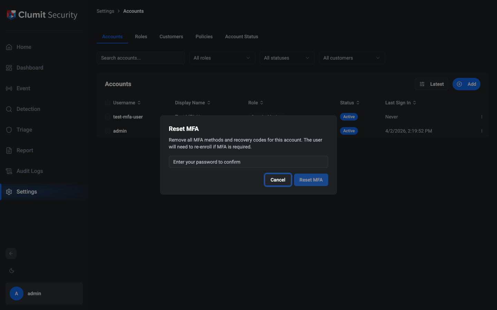

A confirmation dialog asks for **your own password** (step-up
authentication). After confirmation:

- All TOTP credentials, passkeys, and recovery codes are
  removed.
- All active sessions for the account are revoked.
- The user must re-enroll MFA on their next sign-in if their
  role requires it.

**Restrictions:**

- You cannot reset MFA for accounts with a role equal to or
  higher than your own.
- You cannot reset your own MFA through this screen (manage
  your own MFA from **Profile → Two-Factor Authentication**).

### Emergency MFA Reset (break-glass)

If all administrators are locked out by MFA, a server-level
emergency reset is available.

1. Set the environment variable `EMERGENCY_MFA_RESET` to the
   username of the locked-out account.
2. Restart the server.
3. The server removes all MFA credentials and revokes all
   sessions for that account on startup.
4. Remove the environment variable after use.

A per-username marker file
(`$DATA_DIR/.emergency_mfa_reset_consumed_{username}`) prevents
repeated execution on subsequent restarts. An audit event
(`mfa.emergency.reset`) is recorded with actor `system`.

If the same user needs an emergency reset again later, delete
the marker file before restarting:

```bash
rm "$DATA_DIR/.emergency_mfa_reset_consumed_<username>"
```

!!! warning
    This mechanism bypasses all authentication checks. Use it
    only for disaster recovery and remove the environment
    variable immediately after the reset.

### Account Status

| Status | Description |
|--------|-------------|
| Active | Normal operating state |
| Locked | Temporarily locked due to failed sign-in attempts (auto-recovers) |
| Suspended | Permanently locked after repeated lockouts (admin restore required) |
| Disabled | Deactivated by an administrator |

## Roles

Navigate to **Settings → Roles** to manage roles. Requires
`roles:read` to view, `roles:write` to create, edit, and clone,
`roles:delete` to delete.


### Built-In Roles

Three roles are provided out of the box and cannot be edited or
deleted (marked with a **BUILTIN** badge):

- **System Administrator** — full access to all features.
- **Tenant Administrator** — manage operations and Security
  Monitor accounts within assigned customers.
- **Security Monitor** — read-only access to events, dashboards,
  and detection within a single assigned customer.

### Custom Roles

Click the **+** button to create a custom role, or click the
clone icon (copy) on an existing role.


The permission grid shows all available permissions grouped by
resource:

| Group | Permissions |
|-------|-------------|
| Dashboard | `dashboard:read`, `dashboard:write` |
| Detection | `detection:read` |
| Triage | `triage:read`, `triage:policy:write`, `triage:exclusion:write`, `triage:exclusion:global:write` |
| Accounts | `accounts:read`, `accounts:write`, `accounts:delete` |
| Roles | `roles:read`, `roles:write`, `roles:delete` |
| Customers | `customers:read`, `customers:write`, `customers:delete`, `customers:access-all` |
| System Settings | `system-settings:read`, `system-settings:write` |
| Audit Logs | `audit-logs:read` |

### MFA Required

Each role has an **MFA Required** flag. When enabled, users
with that role must enroll at least one MFA method (TOTP or
passkey) before accessing the dashboard. The System
Administrator role has MFA required by default.

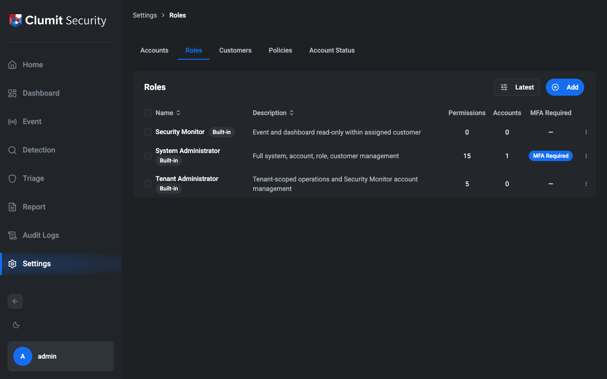

To toggle MFA enforcement for a role, click the dropdown
menu (⋯) on the role row and select **Toggle MFA**. This
works for both built-in and custom roles. The `roles:write`
permission is required.

Individual accounts can override the role default using the
`mfa_override` field:

| Override | Behavior |
|----------|----------|
| *(none)* | Follows the role's MFA Required setting |
| Exempt | MFA is never required, even if the role requires it |
| Required | MFA is always required, even if the role does not require it |

## Customers

Navigate to **Settings → Customers** to manage customers.
Requires `customers:read` to view, `customers:write` to create
and edit, `customers:delete` to delete.


### Creating a Customer

Click the **+** button to open the customer creation dialog.


Fields:

- **Name** — customer display name (required).
- **Description** — optional description.
- **External Key** — optional cross-system bridge identifier paired
  with the matching customer on aimer-web. Globally unique. Leave
  blank if the customer is not yet onboarded for *Send to Aimer*.
  See [External Key](#external-key) below for the agreement and
  validation rules.

When a customer is created, the system provisions a dedicated
database automatically.

<!-- TODO: screenshot - aimer-bridge batch -->

### Editing a Customer

Open the row's kebab menu and choose **Edit** to update the name,
description, or external key. Editing the **external key** to a
different value (or clearing it back to blank) opens a non-dismissable
confirmation dialog before the change is saved — see
[External Key](#external-key) below for why the warning matters.

<!-- TODO: screenshot - aimer-bridge batch -->

### External Key

The external key is the operator-supplied identifier that pairs an
AICE customer with the matching customer on aimer-web. The value is
the same string both sides carry, so the cross-system bridge can map
audit and event traffic back to a single business entity.

- **When to set it.** Only after the value has been agreed with the
  aimer-web System Administrator over an out-of-band secure channel
  (in-house SSO messenger, in person, etc.). The recommended
  identifiers are a domain (e.g. `acmecorp.com`), a business
  registration number, or a contract code.
- **Validation.** Trimmed before storage. Empty / whitespace-only
  inputs clear the value back to blank. Non-empty values are limited
  to 256 characters and may not contain control characters. The
  external key is globally unique — submitting a value already in use
  by another customer returns a typed conflict.
- **Effect of a change.** Setting or changing the external key
  rewrites the cross-system mapping; the matching customer on
  aimer-web must be updated to keep the mapping intact, and a single
  bridge test is recommended right after.
- **Effect of clearing.** Clearing the external key disables
  *Send to Aimer* for the customer until a value is set again. Any
  existing mapping with the aimer-web side is no longer reachable
  from this side.
- **Customers without an external key.** Edits and queries continue
  to work normally; only the *Send to Aimer* button is disabled per
  customer until a value is populated.

For the full operator playbook (agreement workflow, recovery from
mismatches, audit forensics) see the canonical
[Cross-system customer identification](https://github.com/aicers/aimer-web/blob/main/docs/operations/cross-system-customer-identification.md)
guide on aimer-web.

<!-- TODO: screenshot - aimer-bridge batch -->

### Deleting a Customer

Deletion requires the `customers:delete` permission (System
Administrator only). No accounts may be assigned to the customer.
On deletion, the customer's database is dropped.

## Policies

Navigate to **Settings → Policies** to configure system-wide
policies. Requires `system-settings:read` to view,
`system-settings:write` to edit.


Settings are organized into tabs:

### Password Policy

| Setting | Default | Description |
|---------|---------|-------------|
| Minimum length | 12 | Minimum password length |
| Maximum length | 128 | Maximum password length |
| Complexity | Enabled | Require uppercase, lowercase, digits, and symbols |
| Reuse ban count | 5 | Number of previous passwords that cannot be reused |

### Session Policy

| Setting | Default | Description |
|---------|---------|-------------|
| Idle timeout | 30 min | Time before inactive session expires |
| Absolute timeout | 8 hours | Maximum session duration |
| Max sessions | Unlimited | Maximum concurrent sessions per account |

### Lockout Policy

| Setting | Default | Description |
|---------|---------|-------------|
| Stage 1 threshold | 5 | Failed attempts before temporary lock |
| Stage 1 duration | 30 min | Duration of temporary lockout |

Stage 2 (permanent suspension) triggers automatically when an
account is locked a second time.

### JWT Policy

| Setting | Default | Description |
|---------|---------|-------------|
| Token expiration | 15 min | JWT access token lifetime |

### MFA Policy

| Setting | Default | Description |
|---------|---------|-------------|
| WebAuthn (FIDO2) | Enabled | Allow hardware key / platform authenticator |
| TOTP | Enabled | Allow time-based one-time passwords |

### Rate Limits

**Sign-in rate limits:**

| Setting | Default | Description |
|---------|---------|-------------|
| Per-IP count / window | 20 / 5 min | Requests per IP address |
| Per-account-IP count / window | 5 / 5 min | Requests per account + IP |
| Global count / window | 100 / 1 min | Total sign-in requests |

**API rate limits:**

| Setting | Default | Description |
|---------|---------|-------------|
| Per-user count / window | 100 / 1 min | Requests per authenticated user |

All changes to policy settings are recorded in the audit log.

## Triage exclusions

Triage exclusions remove unwanted source addresses, hostnames,
URIs, or domain patterns from the Triage corpus so they neither
score nor surface in the asset list. Two scopes are available:

- **Global exclusions** — managed at **Settings → Triage
  exclusions (global)** (the dedicated tab next to the
  per-customer page). Apply to every active customer. Requires
  the `triage:exclusion:global:write` permission to mutate; the
  tab is visible to anyone with `triage:read`.
- **Customer exclusions** — managed at **Settings → Triage
  exclusions**. Apply only to one customer's tenant database.
  The page accepts a `customer_id` query parameter
  (`/settings/triage-exclusions?customer_id=42`) so a deep link
  loads the requested customer's list directly; out-of-scope ids
  fall back to the first customer the caller can access. Read
  access requires `triage:read`; mutate access requires
  `triage:exclusion:write` plus that the customer is in the
  caller's effective scope.

Both scopes share the same column shape and the same retroactive
behavior: an ADD removes matching rows from the Triage baseline
corpus tables under the customer's cadence advisory lock so
cadence and the retroactive path always agree on the same final
corpus.

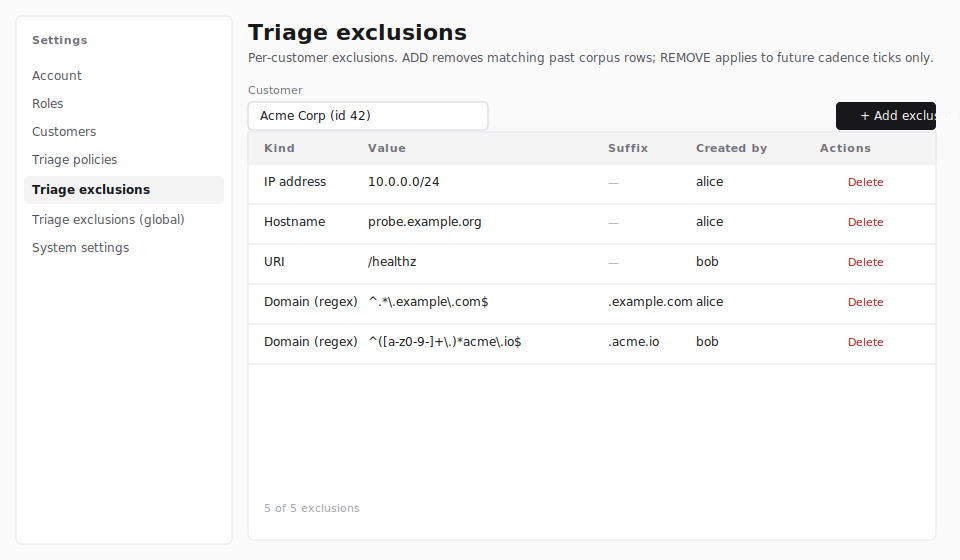

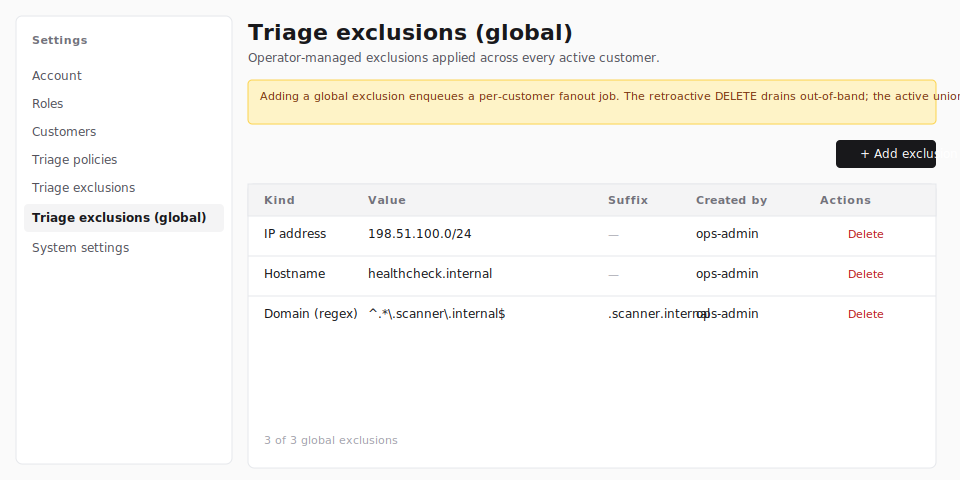

> **Wireframe stand-ins.** The figures above and the Add dialog
> figure below are SVG wireframes per the
> [authoring exception for infrastructure-gated features](../AUTHORING.md#screenshot-exception-for-infrastructure-gated-features).
> The Triage exclusions UI depends on a populated
> `global_triage_exclusion` / per-tenant `triage_exclusion` corpus
> that the worktree's local environment cannot stand up without
> the cadence pager (which lands with aicers/review-web#842).
> They will be replaced with real PNG captures once the
> dependent infrastructure is available.

### Kind and value

Each exclusion has a **kind** (one of four) and a **value**
normalized at creation time:

| Kind | Value semantics |
|---|---|
| **IP address** | Single IP or CIDR. A single IP is upgraded to `/32` (IPv4) or `/128` (IPv6); host bits are zeroed (`192.168.1.5/24` → `192.168.1.0/24`). |
| **Hostname** | DNS name. Lowercased; trailing dot stripped. |
| **URI** | Exact match. Trimmed of leading and trailing whitespace; otherwise byte-preserving. |
| **Domain (regex)** | A regex pattern. Compiled at INSERT time; uncompilable patterns are rejected. |

Maximum length per value is **1024 characters** to bound regex
compile cost and keep the index footprint predictable.

### Domain regex preview

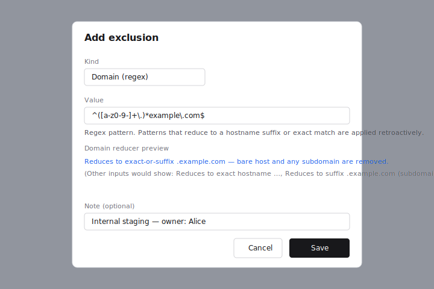

The Add dialog runs a suffix-reducer over the supplied regex and
shows one of four previews. The reducer is conservative: it only
maps a regex to a SQL `host LIKE` predicate when the predicate
matches the regex's exact set of hosts.

- **Reduces to exact hostname `foo.example.com`** — the pattern
  `^foo\.example\.com$` reduces to an exact hostname. Past corpus
  rows with exactly that hostname are removed.
- **Reduces to suffix `.example.com` (subdomains only)** —
  patterns like `^.*\.example\.com$` or `^.+\.example\.com$`
  require at least one label before the literal `.example.com`,
  so the bare host `example.com` is **not** part of the regex's
  match set. The exclusion deletes past corpus rows whose `host`
  or `dns_query` ends with `.example.com`; bare `example.com` is
  left untouched.
- **Reduces to exact-or-suffix `.example.com`** — the
  repeating-label pattern `^([a-z0-9-]+\.)*example\.com$`
  permits zero label prefixes, so both bare `example.com` and
  any `*.example.com` are removed.
- **Full-regex-only** — anything else (alternations, anchored
  prefixes, single-label-only `^[^.]+\.example\.com$`,
  wildcards in the middle, etc.). The exclusion still takes
  effect on **future cadence ticks** but does **not**
  retroactively delete past corpus rows. The dialog calls this
  out so the operator is not surprised.

### Forward and retroactive enforcement

| Path | What happens |
|---|---|
| **Forward (cadence)** | The cadence runner reads the active union (global + customer-scoped) on every page and excludes matching events before they are written to the corpus. |
| **Retroactive (ADD)** | Adding a customer-scoped exclusion runs `DELETE` against `baseline_triaged_event` and `observed_event_meta` (and `policy_triaged_event` once the corpus B table exists), batched at 10,000 rows per statement. The INSERT and the **first** DELETE batch share one transaction so a crashed runner cannot leave a row inserted with no DELETE applied; subsequent batches drain in fresh per-batch transactions to bound lock duration and WAL pressure. The cadence advisory lock releases between the first batch and the drain. If the drain phase fails the dialog reports a hard error: the row is durable (visible on refresh) but past-corpus cleanup is incomplete and must be finished via the admin recovery surface, since cadence does not revisit already-ingested historical rows. Adding a **global** exclusion enqueues per-customer fanout jobs; the worker drains them under each customer's cadence advisory lock following the same first-batch-then-drain protocol, and re-checks the global row between tenant batches so a concurrent global delete cannot leave the worker dropping corpus rows for an exclusion that is no longer in the active set. |
| **Removing** | Future cadence ticks only. Past corpus rows that were excluded stay excluded. |

NTLM events have `host`, `dns_query`, and `uri` set to NULL, so
they only match retroactive **IP address** exclusions. Hostname,
URI, and Domain exclusions cannot retroactively delete NTLM rows
by definition.

### Audit

Each ADD and REMOVE emits an audit row:

- `triage_exclusion.global_add` / `.global_remove` —
  customer-agnostic, recorded against the `auth_db` global table.
- `triage_exclusion.customer_add` / `.customer_remove` — bound to
  the customer dimension. The fanout-driven `customer_add` rows
  carry `details.origin = "global_fanout"` and the originating
  `globalExclusionId` so the spread of a global ADD is visible in
  the audit log viewer.
- `triage_exclusion.fanout_failed` — emitted when a per-customer
  fanout job exhausts its retry budget (5 attempts with
  exponential backoff: 1m → 5m → 25m → 2h → 12h).

## Profile

The Profile page is accessed from **Settings → Profile**. It
allows users to manage personal preferences, two-factor
authentication, and passkeys.

### Preferences

Users can configure their language and timezone preferences.


### Two-Factor Authentication (TOTP)

The TOTP card shows the current enrollment status and allows
users to enable or disable time-based one-time passwords.

The card displays one of four states depending on the TOTP
enrollment status and administrator policy:

| State | Display |
|-------|---------|
| Available, not enrolled | "Disabled" badge with **Enable TOTP** button |
| Available, enrolled | "Enabled" badge with **Disable TOTP** button |
| Disabled by admin, enrolled | "Enabled" badge with admin notice and **Remove TOTP** button |
| Not available | "Disabled" badge with "TOTP is not available" message |


#### Enabling TOTP

1. Click **Enable TOTP** to open the setup wizard.
2. Scan the QR code with your authenticator app (e.g., Google
   Authenticator, Authy). Alternatively, click **Can't scan?
   Enter this key manually** to copy the secret key.
3. Enter the 6-digit code displayed in your authenticator app.
4. Click **Verify** to complete setup.


After successful verification, TOTP is enabled and you will be
prompted for a code on subsequent sign-ins.


#### Disabling TOTP

1. Click **Disable TOTP** (or **Remove TOTP** if disabled by
   admin).
2. Enter your current 6-digit TOTP code to confirm.
3. Click **Disable TOTP** (or **Remove TOTP**) to remove the
   credential.


#### Disabled by Administrator

When an administrator removes TOTP from the allowed MFA
methods while a user still has TOTP enrolled, the card shows
an "Enabled" badge with a notice that TOTP has been disabled
by an administrator. The user can click **Remove TOTP** to
remove the stale credential.


#### Not Available

When the administrator has not enabled TOTP in the MFA policy
and the user has no TOTP credential enrolled, the card shows a
"Disabled" badge with a "TOTP is not available" message. No
action is available to the user.


#### MFA Sign-In

When TOTP is enabled, sign-in requires an additional step after
entering your password. Enter the 6-digit code from your
authenticator app and click **Verify**.


### Passkeys (WebAuthn)

The Passkeys card shows registered passkey credentials and allows
users to register, rename, or remove passkeys for passwordless
sign-in verification.

The card displays one of four states depending on enrollment and
administrator policy:

| State | Display |
|-------|---------|
| Available, not enrolled | "Disabled" badge with **Register Passkey** button |
| Available, enrolled | "Enabled" badge with credential list and **Add Passkey** button |
| Disabled by admin, enrolled | "Enabled" badge with admin notice and credential list (remove only) |
| Not available | "Disabled" badge with "Passkeys are not available" message |


#### Registering a Passkey

1. Click **Register Passkey** (or **Add Passkey** if you already
   have one registered).
2. Optionally enter a display name (e.g., "MacBook Touch ID").
3. Click **Register Passkey** to start the browser prompt.
4. Follow your browser's prompt to create the passkey.


After successful registration, the passkey appears in the
credential list.


#### Renaming a Passkey

Click the pencil icon next to a passkey, enter the new name,
and click **Save**.

#### Removing a Passkey

1. Click the trash icon next to the passkey you want to remove.
2. Enter your account password to confirm.
3. Click **Remove Passkey** to delete the credential.

#### Disabled by Administrator

When an administrator removes WebAuthn from the allowed MFA
methods while a user still has passkeys enrolled, the card shows
an "Enabled" badge with a notice that passkeys have been disabled
by an administrator. The user can still remove credentials but
cannot register new ones.


#### Not Available

When the administrator has not enabled WebAuthn in the MFA policy
and the user has no passkeys enrolled, the card shows a "Disabled"
badge with a "Passkeys are not available" message. No action is
available to the user.


#### MFA Sign-In with Passkey

When a passkey is enrolled, sign-in requires an additional step
after entering your password. Follow your browser's prompt to
verify your identity with the passkey. If both TOTP and WebAuthn
are enrolled, you can switch between methods.


#### Recovery Code Sign-In

If you lose access to your authenticator app or passkey, you
can use a recovery code to sign in. On the MFA verification
step, click **Use a recovery code**, enter one of your saved
codes, and click **Verify**.

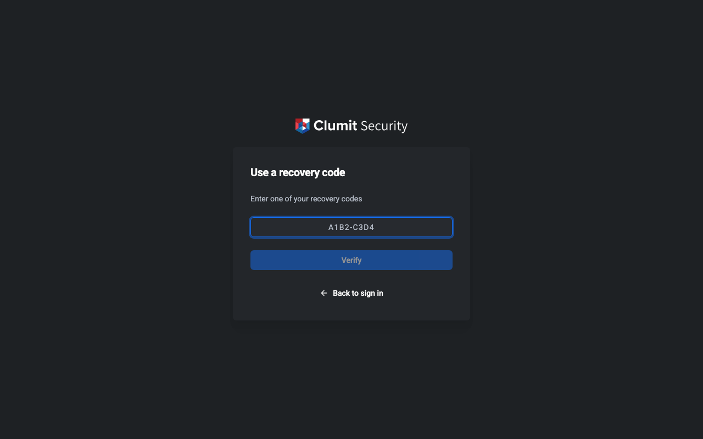

Each recovery code can only be used once.

### Recovery Codes

Recovery codes provide a backup way to sign in when your
primary MFA method (TOTP or passkey) is unavailable. Ten
single-use codes are generated and stored as hashed values.

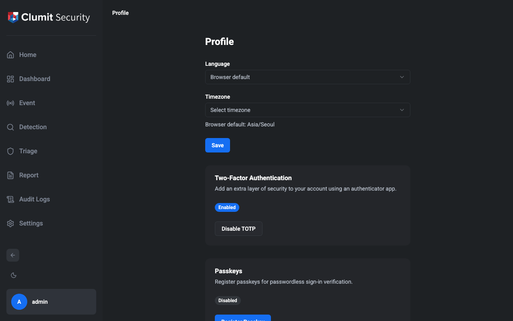

#### Automatic Generation

When you enroll your first MFA method, 10 recovery codes
are automatically generated and displayed. Save these codes
in a secure location — they will not be shown again.

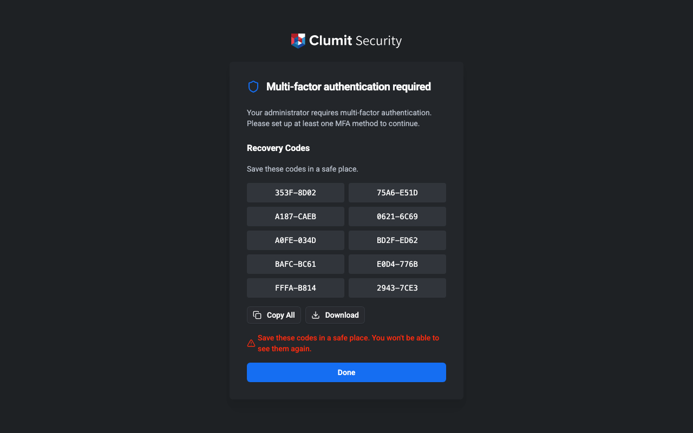

#### Generating Recovery Codes

If you have no recovery codes or want to replace existing
ones:

1. Navigate to **Settings → Profile**.
2. In the Recovery Codes card, click **Generate Recovery
   Codes** (or **Regenerate Codes** if codes already exist).
3. Enter your account password to confirm.
4. Click **Generate Recovery Codes** in the dialog.

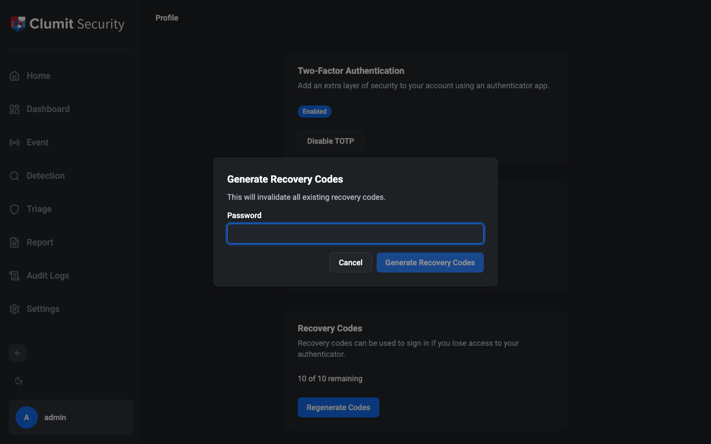

The new codes are displayed once. Use **Copy All** to copy
them to your clipboard or **Download** to save them as a
text file.

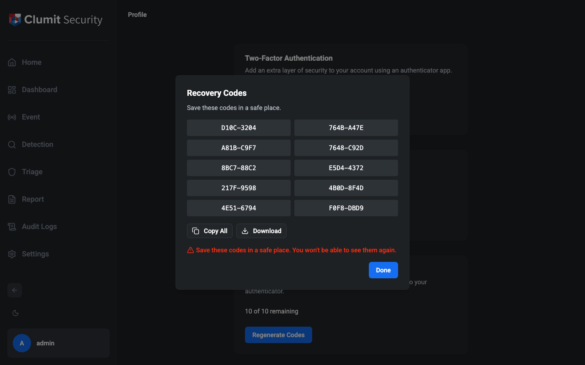

Regenerating codes invalidates all previous codes.

#### Recovery Code Count

The card shows how many unused codes remain (e.g.,
"9/10 remaining"). A warning badge appears when 3 or
fewer codes remain.

### Mandatory MFA Enrollment

When a role has MFA required and a user has not enrolled
any MFA method, the user is redirected to the mandatory
enrollment page after signing in. The user cannot access
any dashboard page until at least one MFA method is enrolled.

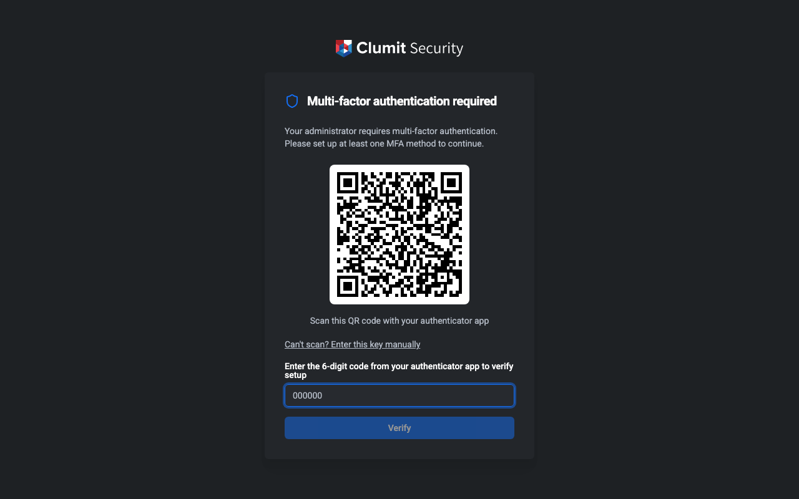

The enrollment page automatically starts the TOTP setup
wizard:

1. Scan the QR code with your authenticator app, or click
   **Enter this key manually** to copy the secret key.
2. Enter the 6-digit code from your authenticator app.
3. Click **Verify** to complete enrollment.

After verification, your recovery codes are displayed.
Save them securely, then click **Done** to proceed to the
dashboard.

## Account Status

Navigate to **Settings → Account Status** to view operational
monitoring cards. Requires `dashboard:read` permission to view.


### Active Sessions

Lists all currently active sessions. Users with the
`dashboard:write` permission can terminate individual sessions
using the **Revoke** button.

### Locked and Suspended Accounts

Shows accounts that are currently locked or suspended. Users
with the `accounts:write` permission can:

- **Unlock** a temporarily locked account.
- **Restore** a suspended account.

### Suspicious Activity

Displays security alerts detected in the last 24 hours,
categorized by severity (critical, high, medium, low). Each
alert shows the rule name, description, occurrence count, and
the most recent timestamp.

### Certificate Expiry

Displays mTLS certificate status with severity indicators:

- **OK** — certificate is valid with plenty of time remaining.
- **Warning** — certificate will expire soon.
- **Critical** — certificate is expired or expiring imminently.

## Aimer Integration

Navigate to **Settings → Aimer Integration** to configure the
system-wide prerequisites for the Send to Aimer flow. This
section is reserved for the **System Administrator** role —
Tenant Administrator and Security Monitor are denied access at
the page route, the public-JWK / thumbprint read endpoint, and
every mutation endpoint, regardless of any custom permission
grants.

<!-- TODO: screenshot - aimer-bridge batch -->

### Setup status

Send to Aimer requires three system-wide prerequisites:

1. **`aice_id`** — the deployment hostname. Used as the JWT
   `iss` claim and as the `aice_id` claim sent to aimer-web.
   aimer-web's `trust_registry` joins on this value, so it must
   match the entry registered there.
2. **`aimer_web_bridge_url`** — the base URL of the aimer-web
   instance whose `/api/auth/bridge` endpoint receives the
   multipart POST. HTTPS only.
3. **Context-token signing keypair** — a dedicated ES256 keypair
   stored under `data/keys/aimer-context-signing.json`.

When all three are set the page shows **Configured (system-wide)**.
Any missing prerequisite turns the badge red and lists what is
missing. Customer-level `external_key` is a per-customer setting
and is intentionally **not** part of system-wide setup status; the
page shows an informational line linking to the customers page.

<!-- TODO: screenshot - aimer-bridge batch -->

### Context-token signing keypair

The signing keypair is **separate** from the JWT signing key and
from mTLS keys, by design — keeping the trust domains independent
prevents a compromise of one from invalidating the others.

#### Thumbprint

After **Generate**, the page shows the public JWK and the RFC 7638
SHA-256 Thumbprint in two formats simultaneously:

- **base64url** (43 characters, no padding) — canonical. Use this
  when accuracy matters; copy and compare it with the value shown
  on aimer-web's environment registration screen.
- **colon-separated hex** — the same SHA-256 (32 bytes / 64 hex
  characters) grouped in 4-byte blocks. Visual aid for verbal or
  mental comparison.

Both formats encode the same bytes; only the rendering differs.
The Thumbprint is computed server-side from the public JWK and
the **private key never leaves the server** — the UI receives only
the public JWK and the thumbprint via API responses.

<!-- TODO: screenshot - aimer-bridge batch -->

#### Rotation lifecycle

The rotation state machine has four states:

| State | Available actions |
| --- | --- |
| Empty | **Generate** |
| Active only | **Rotate** |
| Active + pending | **Switch** (requires confirmation checkbox) |
| Active + previous | **Deactivate** (after the retention window) |

1. **Generate** — first-boot. Creates the active kid.
2. **Rotate** — mints a *pending* kid alongside the active one.
   The active kid keeps signing tokens until you Switch.
3. **Switch** — promotes the pending kid to active and demotes the
   old kid to *previous*. **Required precondition**: the new kid
   must already be registered on aimer-web's trust registry, or
   tokens signed by the new kid will be rejected. The page asks
   you to tick a confirmation checkbox before the button enables.
4. **Deactivate** — drops the previous kid from disk. Auto-eligible
   after a short retention window (default: 5 minutes — sized to
   the context-token TTL plus a clock-skew margin) so in-flight
   verification on aimer-web's side has time to complete via
   redelivery.

A dashboard banner warns when rotation is approaching:

- **Yellow** at 30 days before the recommended rotation date.
- **Red** at 7 days.
- **Gray** after the recommended rotation date has passed.

<!-- TODO: screenshot - aimer-bridge batch -->

#### File permissions

The on-disk file is written with mode `0600` and the parent
`data/keys/` directory with `0700`. If the file mode drifts (for
example, when an operator restores a backup with looser perms),
the page surfaces a permission alert with operator guidance to
fix it before continuing. The boot log also records a warning.

The application **fails closed** if it cannot set `0600` on a
new key file — it refuses to leave a private key with looser
permissions on disk.

### `aice_id`

Hostname (RFC 1123) identifying this AICE instance to aimer-web.
Underscores are intentionally rejected — `aice_id` is also the
JWT `iss` claim, so a strict hostname keeps the trust-registry
join key portable.

Example: `aice-kepco.example.com`.

### `aimer_web_bridge_url`

Base URL of the aimer-web instance, HTTPS-only. The path is
normalized to a canonical form (no trailing slash). Credentials,
query strings, and fragments are rejected.

Example: `https://aimer.example.com`.

### Effect-warning modal

Editing `aice_id` or `aimer_web_bridge_url` triggers a
non-dismissable modal that warns:

> After this change, the operator must re-register this
> environment on aimer-web. Existing registrations are
> invalidated and any context tokens issued in the interim
> will be rejected.

You must explicitly confirm before the change is committed.

<!-- TODO: screenshot - aimer-bridge batch -->

### Audit log

The Aimer integration page records:

- `aimer_signing_key.generated`, `.rotated`, `.switched`,
  `.deactivated` — keypair lifecycle events.
- `aimer_integration_setting.changed` — `aice_id` or
  `aimer_web_bridge_url` change with the `{key, old, new}`
  triple.

The Send to Aimer flow records, on every browser-initiated
context-token request (issued by the `POST /api/aimer/context-token`
endpoint that the Send to Aimer button calls in the background):

- `aimer_context_token.issued` — success. The audit row is bound
  to the resolved customer and carries the issued `jti` and the
  active signing-key `kid` so a forensic analyst can correlate
  the token with the matching record on `aimer-web`.
- `aimer_context_token.denied` — failure. Carries a `reason`
  detail enumerating the gate that rejected the request:
  `aimer_integration_not_configured` (one of the three
  prerequisites in the [Setup status](#setup-status) section is
  missing), `customer_external_key_missing` (the resolved
  customer has no `external_key`), `event_not_found_for_customer`
  (the locator did not resolve under the chosen customer's
  scope — also covers the access-denied branch, which is
  intentionally masked behind the same status to avoid leaking
  customer existence), or `rate_limited` (the per-account+IP
  bridge bucket — 30 requests / 60 seconds — was exhausted).

All actions are part of the closed audit-action union, so the
audit log viewer surfaces them automatically.

### Backup

The signing keypair file (`data/keys/aimer-context-signing.json`)
is included in the on-disk backup target alongside the JWT signing
key. See `decisions/backup-restore.md` for the full backup scope.
