# Settings

The Settings page is accessed from the sidebar. It contains tabs
for managing accounts, roles, customers, policies, and account
status. Each tab is gated by permissions — you only see tabs your
role allows.

## Accounts

Navigate to **Settings → Accounts** to manage user accounts.
Requires `accounts:read` to view, `accounts:write` to create
and edit, `accounts:delete` to disable.

### Account List

The account list shows all accounts with filtering and pagination.

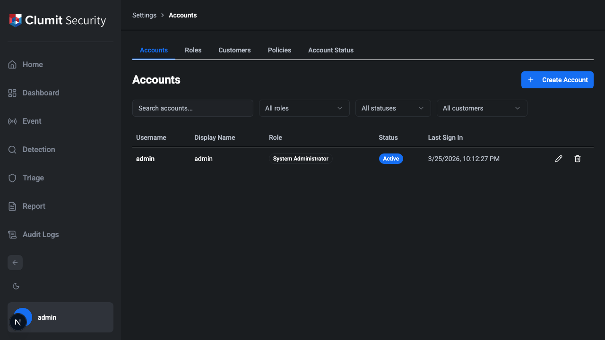

Available filters:

- **Search** — filter by username or display name.
- **Role** — filter by assigned role.
- **Status** — filter by account status (active, locked,
  suspended, disabled).
- **Customer** — filter by assigned customer.

### Creating an Account

Click the **+** button to open the account creation dialog.

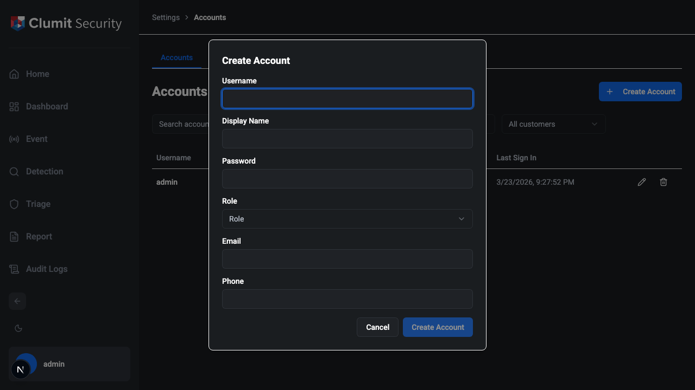

Fields:

- **Username** — unique login identifier (immutable after
  creation).
- **Display name** — shown in the UI (required).
- **Email** — optional contact email.
- **Phone** — optional contact phone.
- **Role** — determines permissions. System Administrators can
  assign any role. Tenant Administrators can only create accounts
  with Security Monitor-equivalent roles.
- **Customer assignment** — required for roles that need customer
  scope.
- **Password** — set the initial password for the account.

### Editing an Account

Click the edit icon (pencil) on an account row. Display name,
email, and phone can be modified. Username, role, and customer
assignments are immutable after creation.

### Disabling Accounts

Click the delete icon (trash) on an account row. A confirmation
dialog appears. Role hierarchy is enforced — you cannot delete
accounts with a role equal to or higher than your own.

### Account Status

| Status | Description |
|--------|-------------|
| Active | Normal operating state |
| Locked | Temporarily locked due to failed sign-in attempts (auto-recovers) |
| Suspended | Permanently locked after repeated lockouts (admin restore required) |
| Disabled | Deactivated by an administrator |

## Roles

Navigate to **Settings → Roles** to manage roles. Requires
`roles:read` to view, `roles:write` to create, edit, and clone,
`roles:delete` to delete.

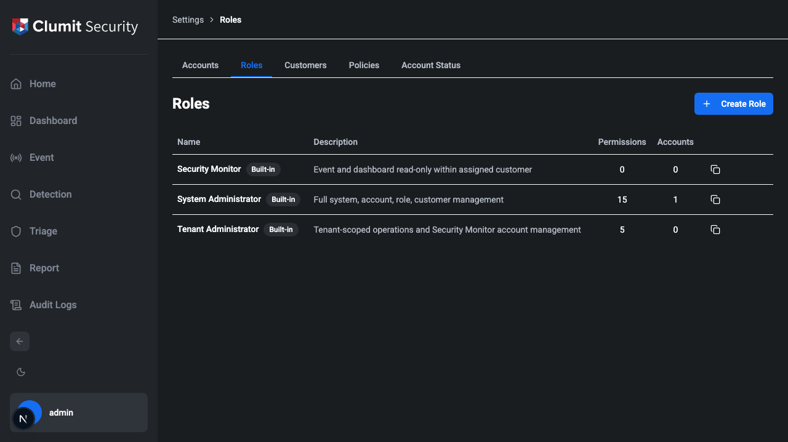

### Built-In Roles

Three roles are provided out of the box and cannot be edited or
deleted (marked with a **BUILTIN** badge):

- **System Administrator** — full access to all features.
- **Tenant Administrator** — manage operations and Security
  Monitor accounts within assigned customers.
- **Security Monitor** — read-only access to events and dashboards
  within a single assigned customer.

### Custom Roles

Click the **+** button to create a custom role, or click the
clone icon (copy) on an existing role.

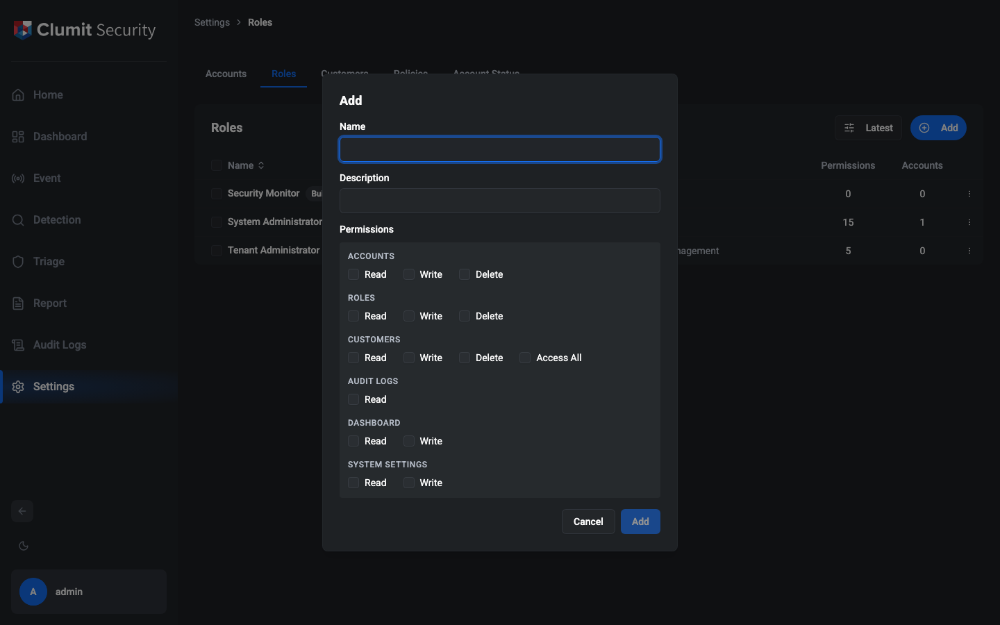

The permission grid shows all available permissions grouped by
resource:

| Group | Permissions |
|-------|-------------|
| Dashboard | `dashboard:read`, `dashboard:write` |
| Accounts | `accounts:read`, `accounts:write`, `accounts:delete` |
| Roles | `roles:read`, `roles:write`, `roles:delete` |
| Customers | `customers:read`, `customers:write`, `customers:delete`, `customers:access-all` |
| System Settings | `system-settings:read`, `system-settings:write` |
| Audit Logs | `audit-logs:read` |

## Customers

Navigate to **Settings → Customers** to manage customers.
Requires `customers:read` to view, `customers:write` to create
and edit, `customers:delete` to delete.

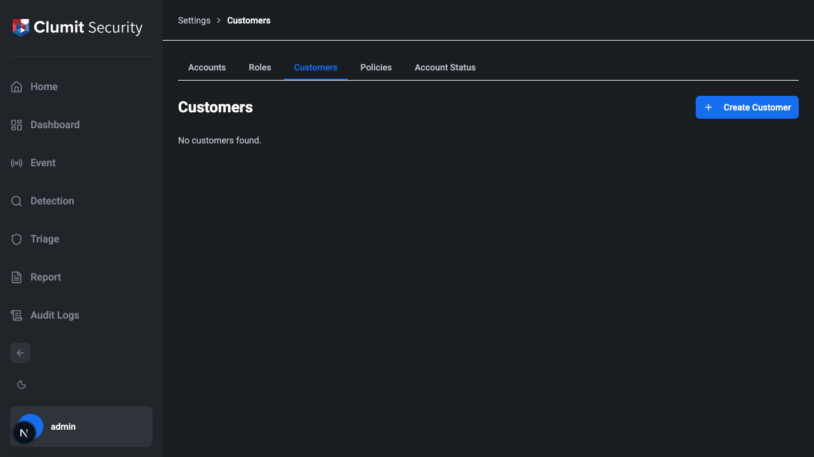

### Creating a Customer

Click the **+** button to open the customer creation dialog.

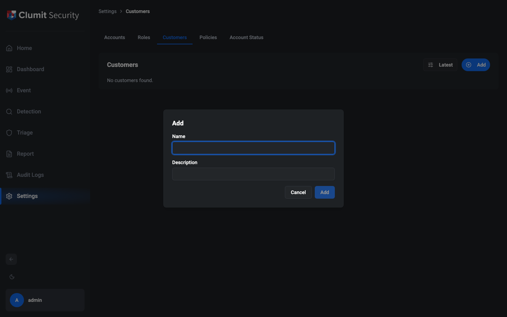

Fields:

- **Name** — customer display name (required).
- **Description** — optional description.

When a customer is created, the system provisions a dedicated
database automatically.

### Deleting a Customer

Deletion requires the `customers:delete` permission (System
Administrator only). No accounts may be assigned to the customer.
On deletion, the customer's database is dropped.

## Policies

Navigate to **Settings → Policies** to configure system-wide
policies. Requires `system-settings:read` to view,
`system-settings:write` to edit.

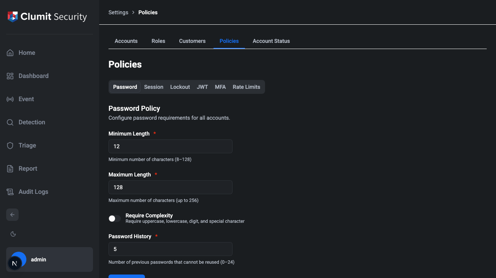

Settings are organized into tabs:

### Password Policy

| Setting | Default | Description |
|---------|---------|-------------|
| Minimum length | 12 | Minimum password length |
| Maximum length | 128 | Maximum password length |
| Complexity | Enabled | Require uppercase, lowercase, digits, and symbols |
| Reuse ban count | 5 | Number of previous passwords that cannot be reused |

### Session Policy

| Setting | Default | Description |
|---------|---------|-------------|
| Idle timeout | 30 min | Time before inactive session expires |
| Absolute timeout | 8 hours | Maximum session duration |
| Max sessions | Unlimited | Maximum concurrent sessions per account |

### Lockout Policy

| Setting | Default | Description |
|---------|---------|-------------|
| Stage 1 threshold | 5 | Failed attempts before temporary lock |
| Stage 1 duration | 30 min | Duration of temporary lockout |

Stage 2 (permanent suspension) triggers automatically when an
account is locked a second time.

### JWT Policy

| Setting | Default | Description |
|---------|---------|-------------|
| Token expiration | 15 min | JWT access token lifetime |

### MFA Policy

| Setting | Default | Description |
|---------|---------|-------------|
| WebAuthn (FIDO2) | Enabled | Allow hardware key / platform authenticator |
| TOTP | Enabled | Allow time-based one-time passwords |

### Rate Limits

**Sign-in rate limits:**

| Setting | Default | Description |
|---------|---------|-------------|
| Per-IP count / window | 20 / 5 min | Requests per IP address |
| Per-account-IP count / window | 5 / 5 min | Requests per account + IP |
| Global count / window | 100 / 1 min | Total sign-in requests |

**API rate limits:**

| Setting | Default | Description |
|---------|---------|-------------|
| Per-user count / window | 100 / 1 min | Requests per authenticated user |

All changes to policy settings are recorded in the audit log.

## Profile

The Profile page is accessed from **Settings → Profile**. It
allows users to manage personal preferences, two-factor
authentication, and passkeys.

### Preferences

Users can configure their language and timezone preferences.

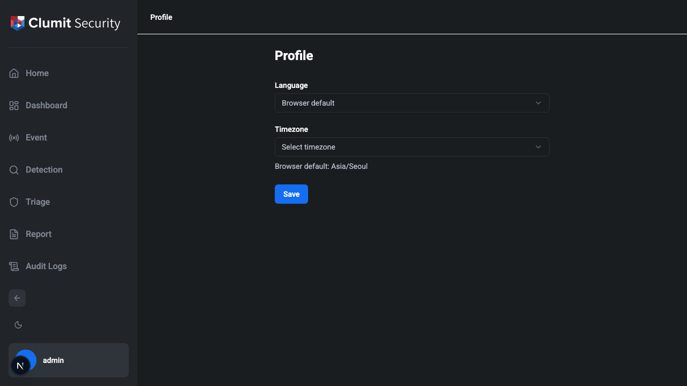

### Two-Factor Authentication (TOTP)

The TOTP card shows the current enrollment status and allows
users to enable or disable time-based one-time passwords.

The card displays one of four states depending on the TOTP
enrollment status and administrator policy:

| State | Display |
|-------|---------|
| Available, not enrolled | "Disabled" badge with **Enable TOTP** button |
| Available, enrolled | "Enabled" badge with **Disable TOTP** button |
| Disabled by admin, enrolled | "Enabled" badge with admin notice and **Remove TOTP** button |
| Not available | "Disabled" badge with "TOTP is not available" message |

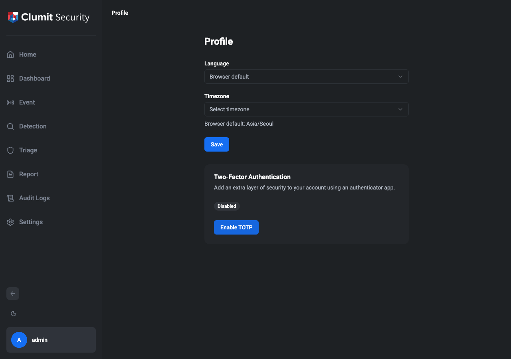

#### Enabling TOTP

1. Click **Enable TOTP** to open the setup wizard.
2. Scan the QR code with your authenticator app (e.g., Google
   Authenticator, Authy). Alternatively, click **Can't scan?
   Enter this key manually** to copy the secret key.
3. Enter the 6-digit code displayed in your authenticator app.
4. Click **Verify** to complete setup.

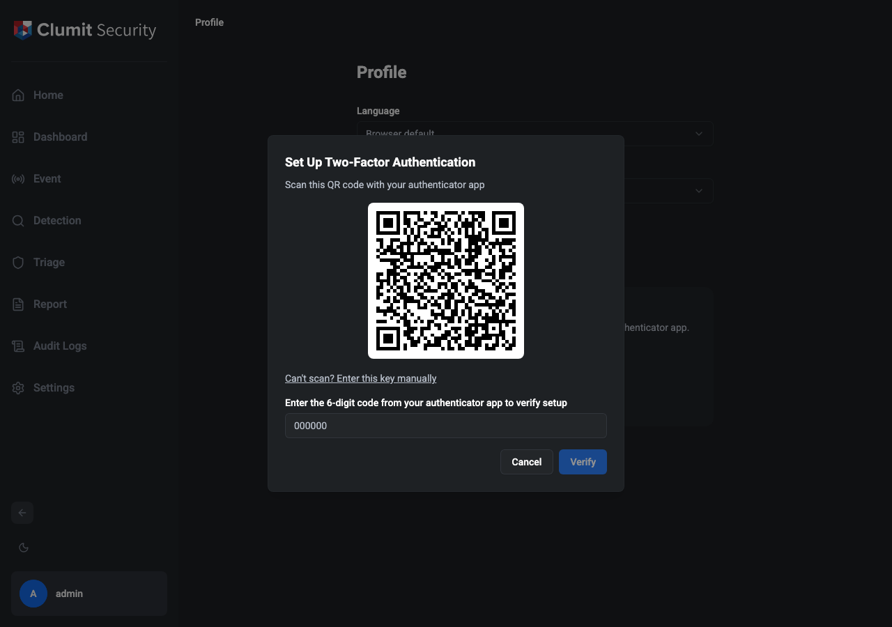

After successful verification, TOTP is enabled and you will be
prompted for a code on subsequent sign-ins.

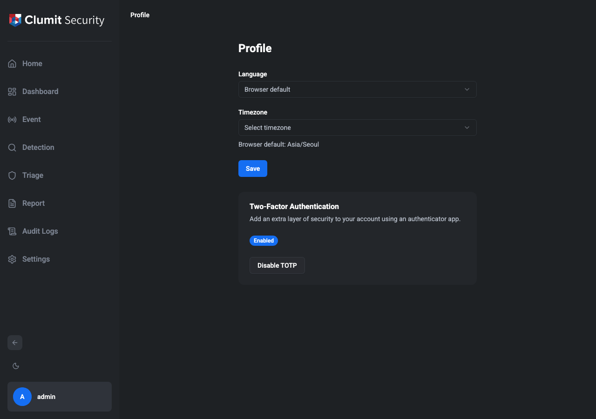

#### Disabling TOTP

1. Click **Disable TOTP** (or **Remove TOTP** if disabled by
   admin).
2. Enter your current 6-digit TOTP code to confirm.
3. Click **Disable TOTP** (or **Remove TOTP**) to remove the
   credential.

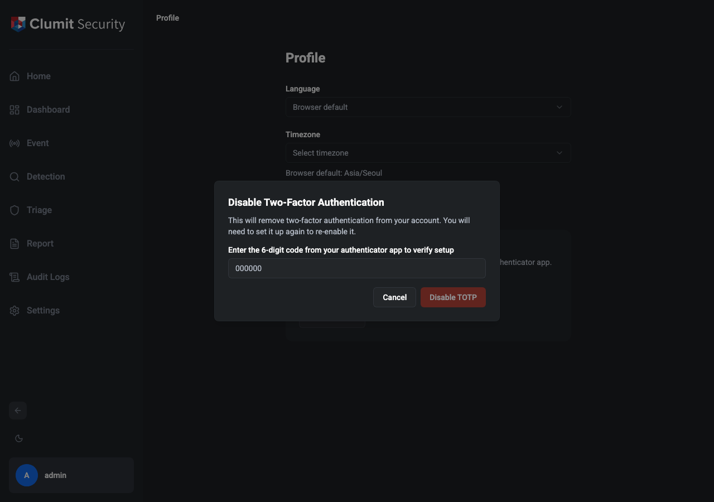

#### Disabled by Administrator

When an administrator removes TOTP from the allowed MFA
methods while a user still has TOTP enrolled, the card shows
an "Enabled" badge with a notice that TOTP has been disabled
by an administrator. The user can click **Remove TOTP** to
remove the stale credential.

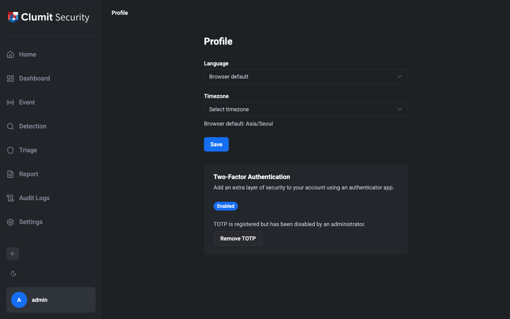

#### Not Available

When the administrator has not enabled TOTP in the MFA policy
and the user has no TOTP credential enrolled, the card shows a
"Disabled" badge with a "TOTP is not available" message. No
action is available to the user.

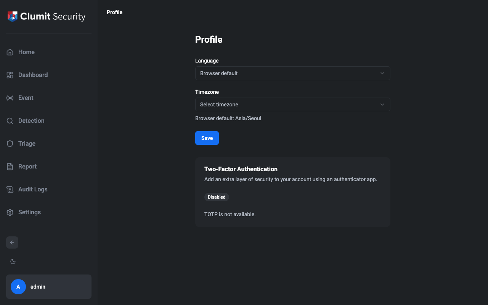

#### MFA Sign-In

When TOTP is enabled, sign-in requires an additional step after
entering your password. Enter the 6-digit code from your
authenticator app and click **Verify**.

### Passkeys (WebAuthn)

The Passkeys card shows registered passkey credentials and allows
users to register, rename, or remove passkeys for passwordless
sign-in verification.

The card displays one of four states depending on enrollment and
administrator policy:

| State | Display |
|-------|---------|
| Available, not enrolled | "Disabled" badge with **Register Passkey** button |
| Available, enrolled | "Enabled" badge with credential list and **Add Passkey** button |
| Disabled by admin, enrolled | "Enabled" badge with admin notice and credential list (remove only) |
| Not available | "Disabled" badge with "Passkeys are not available" message |

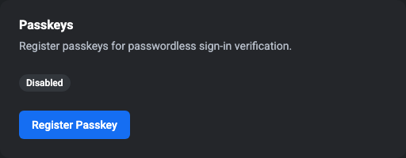

#### Registering a Passkey

1. Click **Register Passkey** (or **Add Passkey** if you already
   have one registered).
2. Optionally enter a display name (e.g., "MacBook Touch ID").
3. Click **Register Passkey** to start the browser prompt.
4. Follow your browser's prompt to create the passkey.

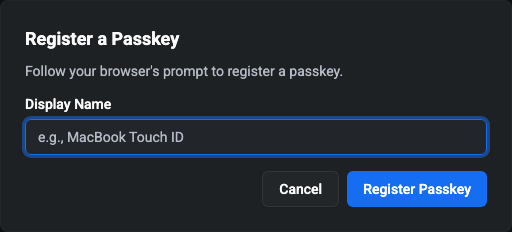

After successful registration, the passkey appears in the
credential list.

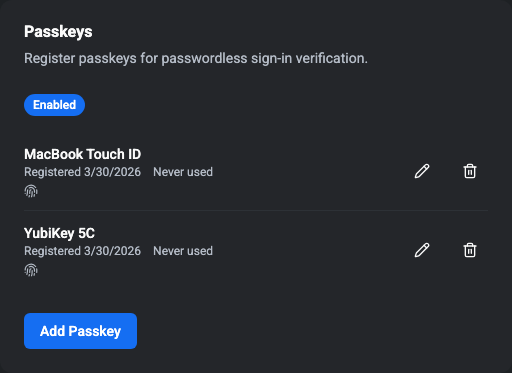

#### Renaming a Passkey

Click the pencil icon next to a passkey, enter the new name,
and click **Save**.

#### Removing a Passkey

1. Click the trash icon next to the passkey you want to remove.
2. Enter your account password to confirm.
3. Click **Remove Passkey** to delete the credential.

#### Disabled by Administrator

When an administrator removes WebAuthn from the allowed MFA
methods while a user still has passkeys enrolled, the card shows
an "Enabled" badge with a notice that passkeys have been disabled
by an administrator. The user can still remove credentials but
cannot register new ones.

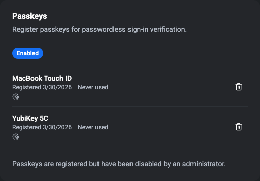

#### Not Available

When the administrator has not enabled WebAuthn in the MFA policy
and the user has no passkeys enrolled, the card shows a "Disabled"
badge with a "Passkeys are not available" message. No action is
available to the user.

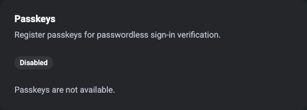

#### MFA Sign-In with Passkey

When a passkey is enrolled, sign-in requires an additional step
after entering your password. Follow your browser's prompt to
verify your identity with the passkey. If both TOTP and WebAuthn
are enrolled, you can switch between methods.

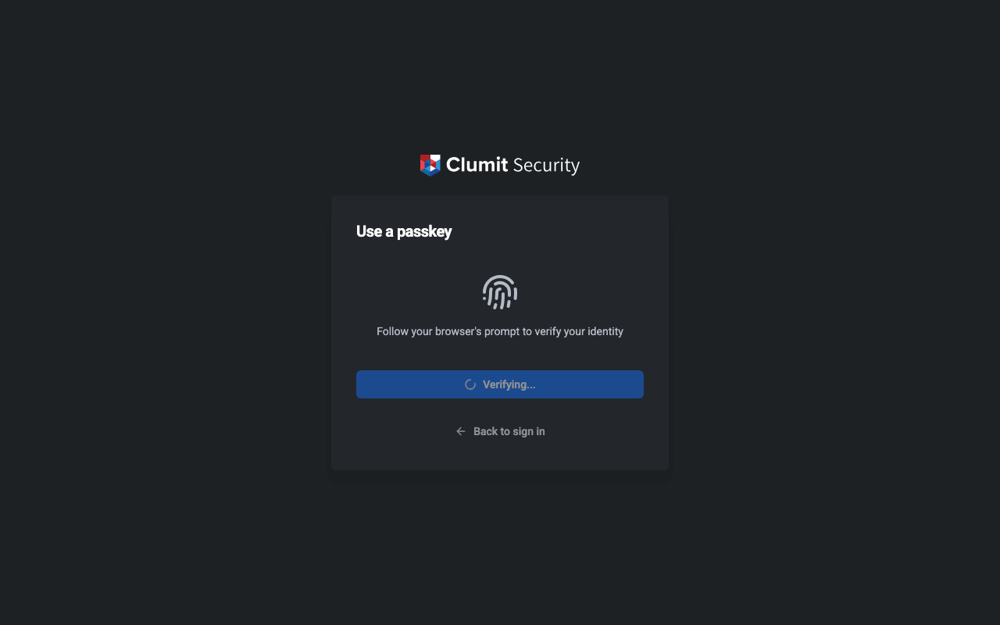

## Account Status

Navigate to **Settings → Account Status** to view operational
monitoring cards. Requires `dashboard:read` permission to view.

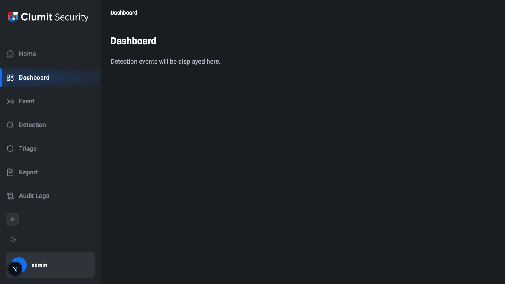

### Active Sessions

Lists all currently active sessions. Users with the
`dashboard:write` permission can terminate individual sessions
using the **Revoke** button.

### Locked and Suspended Accounts

Shows accounts that are currently locked or suspended. Users
with the `accounts:write` permission can:

- **Unlock** a temporarily locked account.
- **Restore** a suspended account.

### Suspicious Activity

Displays security alerts detected in the last 24 hours,
categorized by severity (critical, high, medium, low). Each
alert shows the rule name, description, occurrence count, and
the most recent timestamp.

### Certificate Expiry

Displays mTLS certificate status with severity indicators:

- **OK** — certificate is valid with plenty of time remaining.
- **Warning** — certificate will expire soon.
- **Critical** — certificate is expired or expiring imminently.
