# Triage

The Triage page narrows a high-volume detection feed down to the
assets most likely to need a human eye next. For a chosen period,
it reads the per-tenant `baseline_triaged_event` corpus (rows the
cadence job has already scored), composes a bounded menu of the
highest-priority rows via the slot-bucket quota in
[Baseline scoring algorithm](#baseline-scoring-algorithm), and
ranks source addresses by their score contribution from that menu
so an analyst can work the highest-impact rows first. The
detection-event denominator shown in the funnel is counted
separately from `observed_event_meta`.

Viewing the page requires the `triage:read` permission. The
built-in roles Security Monitor, Tenant Administrator, and System
Administrator receive this permission by default. Custom roles
that grant `triage:read` also qualify.

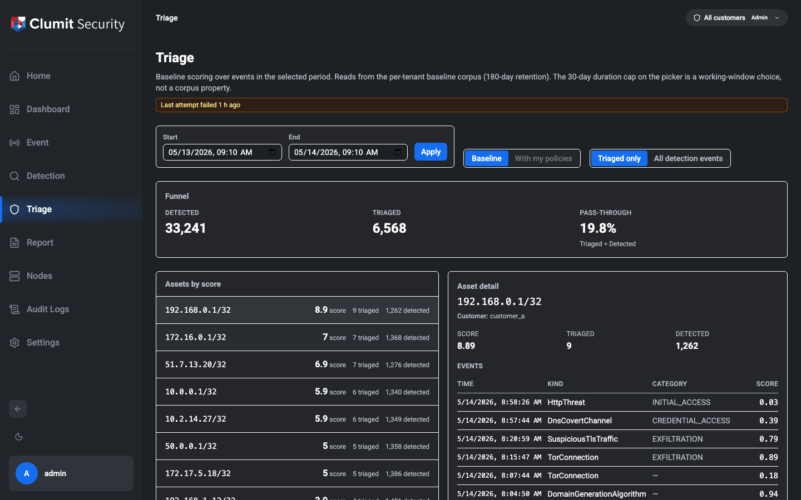

## Layout

The page has five regions:

1. **Header** — title, a one-line description of the menu, and a
   **freshness badge** showing how recently the per-tenant baseline
   corpus was last ingested (see [Freshness header](#freshness-header)).
2. **Period picker, mode toggle, scope toggle, and strictness
   slider** — controls for the period under analysis, the scoring
   mode (only **Baseline** is wired today), the Tier 1 / Tier 2
   pivot scope, and the read-time **strictness** cutoff that dials
   the menu volume up or down. See
   [Strictness slider](#strictness-slider) for the full feature
   page; the stop set is recorded in
   `src/lib/triage/strictness/RFC.md`.
3. **Funnel** — four numbers for the loaded slice: how many events
   were **Detected** (from `observed_event_meta`), how many were
   **Triaged** by cadence + exclusions (corpus floor, independent
   of the slider), how many are actually **Shown** after the
   slider's quota and merge caps, and the pass-through ratio
   (`Shown ÷ Detected`).
4. **Asset list and asset detail** — a two-column workspace.
   The list ranks source addresses by total score across the
   caller's customer scope (composite `(customerId, address)` key);
   selecting a row reveals its score, counts, and most recent
   triaged events on the right.
5. **Pivot panel and breadcrumb** — appears below the workspace
   once the operator pivots from the selected asset into a related
   dimension. Shows the pivot trail along the top and the
   **Related events** grouped by dimension (external IP, registrable
   domain, JA3, SNI) below it. Hidden until the first pivot.

## Period picker

The picker takes a start and an end timestamp at minute
granularity (the browser's `datetime-local` control). The
**Apply** button submits the new range; the page reloads with a
fresh slice loaded server-side.

The selector enforces three rules:

- **Maximum lookback: 180 days.** A start timestamp older than
  180 days ago is rejected. The 180-day floor matches the
  `baseline_triaged_event` corpus retention.
- **Maximum duration: 30 days.** A range whose end minus start
  exceeds 30 days is rejected. The 30-day cap is a working-window
  choice (UI cost, percentile-pass cost) rather than a corpus
  property.
- **End after start.** A range whose end is at or before its
  start is rejected.

If a URL is opened with a `start` / `end` query string that falls
outside these rules, the page clamps the values into range and
shows an amber **"Period adjusted to fit the 180-day lookback /
30-day duration cap."** notice above the funnel so the operator
notices that the rendered window differs from what was requested.

The page defaults to a 24-hour window ending at the current time
when no `start` / `end` is supplied.

Instead of setting start/end by hand, **Quick ranges** chips apply a
common window in one click — **Last 1 day / 3 days / 1 week /
2 weeks / 1 month**. Picking a chip sets the end to now and the start
that far back, applies immediately, and fills the start/end inputs to
match. Every preset stays within the 30-day duration cap; **Last 1
month** is exactly 30 days (the cap itself) — which is why no longer
chip such as "3 months" is offered.

### Detected denominator and the 30-day retention floor

The funnel's **Detected** number is read from `observed_event_meta`,
whose retention is **30 days** — shorter than the 180-day
`baseline_triaged_event` retention. When the selected window's
earliest moment is older than 30 days ago, the observed denominator
covers only the in-retention slice. The funnel then surfaces a
**"Detected counts cover only the last 30 days."** notice above the
asset list, and per-asset rows whose contribution falls entirely in
the out-of-retention slice get a small `(over last 30d)` suffix on
their detected count so the operator can tell apart "denominator
unknown" from "denominator zero". The asset list's score and
triaged count keep reading from the corpus and remain accurate
across the full window.

## Freshness header

A small badge in the page header reports how recently the per-tenant
baseline corpus was last ingested. The badge reads
`baseline_corpus_state.last_ingested_at` from each tenant DB the
caller has scope to and renders one of six states based on the
combination of `last_run_status` and `last_ingested_at`:

| Status      | `last_ingested_at` | Badge                                  |
|-------------|--------------------|----------------------------------------|
| `ok`        | non-NULL           | "Last updated: N min ago"              |
| `running`   | non-NULL           | "Updating now… (previously N min ago)" |
| `running`   | NULL               | "First ingest in progress…"            |
| `failed`    | non-NULL           | "Last attempt failed N min ago"        |
| `failed`    | NULL               | "First ingest failed"                  |
| (no row)    | —                  | "Awaiting first ingest"                |

When the caller's scope spans multiple tenants the badge picks the
**worst** state across the set (failed > running > no row > ok) so
the operator never sees a green header masking one tenant's failure.
A multi-tenant `ok` reads "Last updated: N min ago, across K
customers"; non-`ok` states list the affected customer ids in the
hover tooltip. The `failed` state surfaces `last_error` on hover
for triage; in a multi-customer scope the tooltip combines the
affected-id list with the error detail (`Affected: 1, 2 — <error>`)
so neither piece of triage context is dropped.

The header intentionally does not surface `baseline_version` or any
other corpus metadata. Audit and debugging use the stored
`baseline_version` column directly.

## Force-rebuild a period (admin)

The freshness badge sits next to a small **Rebuild this period**
button visible only to the named **System Administrator** role.
The button is an operational escape hatch out of the natural-
expiry default for corpus A: it deletes every
`baseline_triaged_event` / `observed_event_meta` row in the
currently selected period and re-ingests the same period from the
detector store under the current exclusion set.

When to use it:

- Post-incident corpus repair after a bad exclusion rule has
  retro-DELETEd rows that should not have been removed.
- Urgent refresh of the baseline-version stamp on a window's worth
  of rows ahead of natural expiry.
- Recovery from any other state where the cadence's incremental
  fill cannot produce the desired corpus on its own.

It is **not** a user-facing tuning surface — analysts who want to
see more or fewer events use the strictness controls instead.

### Single-customer scope is required

The button is only enabled when the caller's effective customer
scope contains exactly one customer — the rebuild operates on
exactly one customer-tenant DB per call, and the menu's header has
no in-modal tenant picker. When the scope spans two or more
customers the button is shown disabled with the tooltip **"Switch
to a single-customer scope to enable per-period rebuild"** so the
gate is visible. Switch customer scope and reload the page to
enable the button.

The server enforces the same gate independently of the UI. A
direct POST to `/api/triage/baseline/rebuild` (or
`.../estimate`) is rejected with `RebuildValidation` (HTTP 400)
when the caller's effective scope spans 2+ customers or when the
submitted `customerId` does not match the caller's single
authorized tenant. This blocks a `customers:access-all`
administrator from bypassing the UI guard by hand-crafting a
request for an arbitrary tenant id.

### Confirm modal

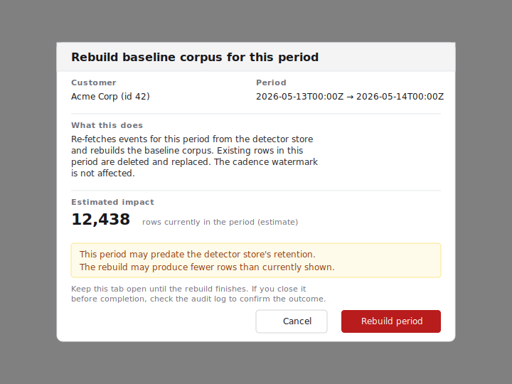

> **Wireframe stand-in.** The admin force-rebuild affordance can
> only be rendered against a System Administrator session paired
> with a Phase 1.B seeded customer-tenant DB. The authoring
> worktree's e2e harness signs in as a separate "E2E Test Admin"
> role and does not include the seeded corpus required for a
> non-zero estimate; the same staging tenant used to refresh the
> rest of the Triage PNGs in #455 is the canonical capture
> environment. The wireframe will be replaced with a real PNG
> capture in a follow-up alongside that staging refresh.

Clicking the button opens a confirmation modal that shows:

- **Customer** — the single resolved customer (name + id) so the
  operator visually confirms which tenant they are mutating.
- **Period** — the menu's currently selected `[from, to)` window.
- **What this does** — "Re-fetches events for this period from the
  detector store and rebuilds the baseline corpus. Existing rows
  in this period are deleted and replaced. The cadence watermark
  is not affected."
- **Estimated impact** — the number of rows currently in
  `baseline_triaged_event` for the period, fetched from
  `GET /api/triage/baseline/rebuild/estimate`. The number is a
  snapshot; if cadence ticks between the modal and confirm, the
  actual rebuild's deletion count may differ slightly. The
  completion toast shows the precise counts.
- **Detector retention warning** — when the period's `to` is older
  than the detector store's retention horizon, the modal warns
  that the rebuild may produce fewer rows than currently shown.
  This is the operator's chance to back out before the existing
  rows are deleted.
- **Tab-and-page note** — the rebuild's completion toast is fired
  only while the originating Triage menu page remains mounted in
  the same tab. Closing the tab, reloading the page, **or
  navigating in-app to another page** all unmount the toast
  surface; the in-flight request may still commit, but the
  operator will not see a toast. The audit log is the canonical
  post-hoc record of the outcome in those cases. (A durable,
  app-level notification surface that survives route unmounts is
  out of scope for this issue.)

### Outcomes

After confirm, the page submits `POST /api/triage/baseline/rebuild`
and replaces the button with a spinner. While the rebuild is in
flight, the menu row list (funnel + asset list) shows a
non-blocking **"Rebuilding this period..."** overlay so the
operator can see that the visible corpus may briefly drop to 0
and refill — not just by the button label. The overlay does not
block clicks; the operator can still navigate or cancel the page
without affecting the in-flight rebuild. On completion:

- **Success** — a toast like *"Rebuilt: deleted N, inserted M
  events"* fires and the page refreshes the menu so the post-
  rebuild corpus is visible.
- **RebuildBusy** (HTTP 409) — the cadence runner or another
  rebuild holds the per-customer advisory lock for this customer.
  The toast surfaces *"cadence or another rebuild is currently
  writing for this customer; retry shortly"*; the operator
  re-clicks once the contender releases.
- **RebuildTimeout** (HTTP 504) — the rebuild exceeded the 300 s
  hard cap. The in-flight transaction is rolled back and the lock
  is released, so the corpus is in its pre-rebuild state. Split
  the period and retry.
- **RebuildIncomplete** (HTTP 504) — review's paginator never
  reported `hasNextPage = false` within the safety cap, or
  returned `hasNextPage = true` with a missing cursor. The
  rebuild aborts **before** the DB transaction begins, so the
  corpus is left exactly as it was. The toast distinguishes this
  case from `RebuildTimeout` because the operator's next step is
  different: split the period and retry, or investigate the
  resolver if the page count was unexpected for the range.
- **Other failures** — the toast surfaces the error message; no
  partial state is left on disk because the DELETE and the
  reinsert share a single DB transaction.

### Audit trail

Every successfully committed rebuild emits one
`triage_baseline.rebuild` audit row carrying the actor account,
the customer id, the `[from, to)` window, the deleted / inserted
row counts, the wall-clock duration, and explicit `startedAt` /
`completedAt` ISO-8601 timestamps so the audit row is a complete
record of the rebuild window — operators can correlate the entry
against external incident timelines without re-deriving timestamps
from the duration. The row is reachable from the standard audit-log
viewer.

If `audit_db` is unreachable when the rebuild commits, the
mutation still returns success and the same payload (actor,
customer id, period, `startedAt`, `completedAt`, duration, and
the full deleted/inserted observed/triaged counts) is emitted as
a structured `[triage_baseline.rebuild] audit log write failed`
app-log line — the secondary persistent record the operator can
follow when no audit row exists.

Failed attempts (`RebuildBusy`, `RebuildTimeout`,
`RebuildIncomplete`, validation rejections, or any error that
rolls back the corpus transaction) leave the corpus unchanged and
do **not** emit an audit row. If the operator's tab is closed or
reloaded mid-rebuild, the absence of an audit row therefore means
either "the rebuild has not committed yet" or "the rebuild
failed"; the structured app log is the operator-side trace of the
failure path. Confirm completion by checking the audit log a few
minutes after the rebuild is expected to finish — a row means the
DB transaction committed; no row means the operator must retry.

## Mode toggle

Two modes are visible:

- **Baseline** (active) — the curated rule described
  in [Baseline scoring algorithm](#baseline-scoring-algorithm)
  below.
- **With my policies** (disabled) — the seam for the future
  per-operator policy subtree. The button is rendered so the
  toggle is in place from day one, but it cannot be selected
  until the policy feature ships. Hovering it reveals a tooltip
  saying **"Available once Triage policies ship."**

## Strictness slider

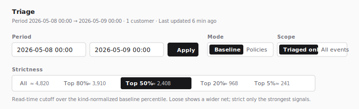

> **Wireframe stand-in.** The slider chrome and the `eligible_top_n`
> preview counts depend on a Phase 1.B seeded customer-tenant DB with
> enough cohort to populate the per-stop "≈ N" hints, which the
> authoring worktree does not provide. The same staging tenant used to
> refresh the rest of the Triage PNGs in #455 is the canonical capture
> environment; the wireframe will be replaced with a real PNG capture
> alongside that staging refresh.

The strictness slider lets an analyst dial the volume of menu results
up or down at read time without changing exclusions, policies, or the
cadence threshold. The slider is a read-time predicate against the
kind-normalized baseline percentile (`cume_dist()` over `raw_score`
within each `(kind, baseline_version)` partition). No re-ingest, no
detector round-trip; moving the slider only re-runs the menu's SELECT
against the per-tenant baseline corpus.

### Stops

Five discrete stops, ordered loose → strict in the toolbar:

| Stop      | Cutoff (`baseline_score >=`) | What it shows                                           |
| --------- | ---------------------------- | ------------------------------------------------------- |
| **All**   | 0                            | Every cutoff-surviving row; the per-bucket quota is lifted (the cadence floor and the SQL candidate cap still apply). |
| **Top 80%** | 0.20                       | Wider net — `defaultN` doubled.                         |
| **Top 50%** (default) | 0.50               | Production default.                                     |
| **Top 20%** | 0.80                       | Tightened — `defaultN` halved.                          |
| **Top 5%**  | 0.95                       | Strongest signals only — `defaultN` × 0.25.             |

The slider chip row shows a cheap **"≈ N"** preview next to each stop
— the eligible row count for that stop before the per-bucket quota is
applied. The Funnel's **Shown** segment is the authoritative
post-quota count (see [Funnel](#funnel)).

### "All" stop semantics

"All" means **no additional user-side cutoff**. Three caps still bound
the rendered set:

- The cadence-threshold floor on the ingest side.
- The per-bucket SQL candidate cap (`MENU_CANDIDATES_PER_BUCKET`,
  currently 500) inside the menu's `ranked` CTE.
- The cross-tenant `TRIAGE_HARD_EVENT_CAP` (5,000) applied at merge
  time.

The per-bucket `composeMenu` quota is **not** a bound at "All" —
under option (b) the multiplier is `null` so every cutoff-surviving
row makes it into the assembled set. The tooltip on the "All" chip
names only the two upstream bounds.

### Story-protected events

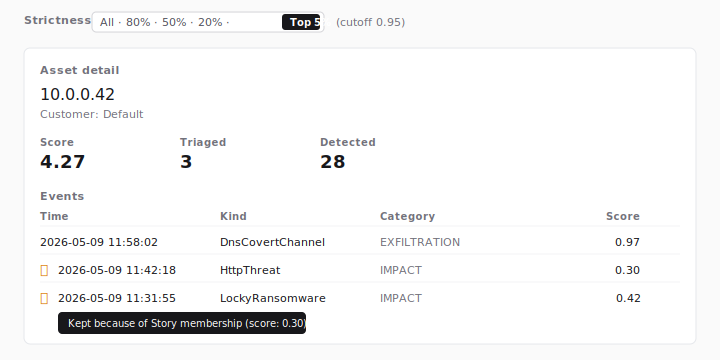

Events that belong to any Story (`event_group_member`) are protected
from the slider's cutoff via a parallel "branch B" SELECT that
bypasses both the per-bucket SQL cap and the `composeMenu` quota.
The protection contract is:

> A row is shown when `baseline_score >= cutoff` **OR** the event is
> a Story member.

Branch B rows carry a per-row marker — a chain-link 🔗 glyph
prepended to the leading cell of the event row. The marker renders
under all four of these conditions, applied at the SQL level:

1. The slider position is not "All".
2. The row has a non-NULL read-time `baseline_score`.
3. `baseline_score < slider_cutoff`.
4. The row is a Story member.

The marker is rendered on per-event surfaces only — the **asset
detail** event rows, the **pivot related-events panel**, and the
**Story detail** member rows. Asset aggregate rows in the asset list
do not show the marker (the marker is per-event; an aggregate row
hides individual scores).

When the marker is hovered, a tooltip and `aria-label` read
**"Kept because of Story membership (score: 0.30)"** with the row's
read-time score. The branch B SELECT is bounded per tenant by
`STORY_PROTECTED_PER_TENANT_LIMIT = 2000`; the cross-tenant merge is
capped at `STORY_PROTECTED_HARD_CAP = 2000`. When that cap fires a
separate **"N Story members truncated"** banner surfaces alongside
the existing `TRIAGE_HARD_EVENT_CAP` truncation banner.

### Persistence and shareable links

Slider position is resolved on first render in this precedence:
`?strictness=<id>` (server-readable, primary) → `#triage.strictness.stop=<id>`
(preserved for hash-link compatibility) → `localStorage` → default
(`top50`). Moving the slider writes the query param via
`router.replace`, mirrors the hash, and updates `localStorage`.
Reloading or sharing a `?strictness=top5` link restores Top 5% without
flashing through the default.

### Keyboard navigation

The slider is rendered as a radiogroup of native
`<input type="radio">` elements inside a `<fieldset>`. Tab focuses the
group, arrow keys move between stops, and Space selects the focused
stop. Screen readers announce the group as **"Strictness"** with the
selected stop's label.

## Baseline scoring algorithm

Phase 1.B replaces the Phase 1.A whitelist + cluster-bonus formula
with a four-selector cadence-time score and a read-time menu
composition pass. The shape is fixed by
[RFC 0001](https://github.com/aicers/aice-web-next/blob/main/rfcs/0001-baseline-algorithm.md);
the analyst-facing summary below covers what the menu surfaces
without restating the RFC's full formula derivation.

### Cadence-time: `raw_score` and `selector_tags`

When the cadence runner ingests a new event, it computes a
`raw_score` from five within-kind selectors and writes the result
to `baseline_triaged_event.raw_score` together with the
`selector_tags` array that records which selectors fired:

- **S1 — High-confidence.** Within-kind percentile rank of the
  event's confidence against the same `kind`'s 7-day / 14-day /
  30-day history. A 0.92 means "this event sits in the top 8% of
  same-kind events in the active window." Emits `S1-high` when
  the rank exceeds the §9 threshold.
- **S2 — Severe.** Binary signal that flips on when the event's
  `category` belongs to the operator-relevant kill-chain set
  (`COMMAND_AND_CONTROL`, `CREDENTIAL_ACCESS`, `EXFILTRATION`,
  `IMPACT`, `INITIAL_ACCESS`). Emits `S2-severe`.
- **S3 — Recurring.** Saturated count of repeats for the same
  `(orig_addr, resp_addr, kind)` triple in the active window;
  beyond the §9 cap, more repeats do not raise the score. NULL on
  either address yields `s3 = 0`. Emits `S3-recurring` past the
  §9 threshold.
- **S4 — Correlated.** Saturated count of distinct categories the
  same `orig_addr` emits under this kind in the active window —
  measures how broadly the asset is implicated under one kind.
  NULL `orig_addr` yields `s4 = 0`. Emits `S4-correlated` past the
  §9 threshold.
- **`UNLABELED_BONUS`.** Binary signal that flips on for
  `HttpThreat` events whose cluster id is the no-cluster sentinel
  (empty / `none` / `null`). Emits `unlabeled-cluster`.

`raw_score` is the weighted sum of the five selectors (§9 weights);
once written it is immutable within its `baseline_version` so a
later peer event does not retroactively re-rank an already-stored
row.

The cadence drops `Blocklist*` events at the very front of the
pipeline before any scoring runs (RFC §1), and the menu read keeps a
defensive `WHERE kind NOT LIKE 'Blocklist%'` filter so a regression
on the cadence side cannot leak those rows back into the menu.

### Read-time: `baseline_score` from `cume_dist()`

The menu does not store `baseline_score`. When the menu loads, the
read query computes

```sql
cume_dist() OVER (
    PARTITION BY kind, baseline_version
    ORDER BY raw_score
) AS baseline_score
```

over the rows in the active window. `baseline_score` is therefore
a cohort-relative value in `[0, 1]` — a 0.95 places the event in
the top of its `(kind, baseline_version)` cohort by cumulative
distribution, with the discrete-step / tied-block boundary
semantics PostgreSQL's `cume_dist` provides (a single-row partition
returns `1.0`, so cold-start needs no special handling, and tied
`raw_score` peers receive identical `baseline_score`).

Partitioning by `(kind, baseline_version)` means rows from
different `baseline_version`s are ranked independently — the menu
never compares a `raw_score` from one calibration to a `raw_score`
from another.

### Slot-bucket composition

After `baseline_score` is attached, the menu composes its output
per RFC §4:

- **`slot_bucket`.** Every row maps to a bucket key:
  `('HttpThreat', true)` when the row is an `HttpThreat` carrying
  the `unlabeled-cluster` tag, `(kind, false)` everywhere else.
  Unlabeled HttpThreat thus competes for slots as its own virtual
  kind and a labeled HttpThreat row goes to its own bucket.
- **Per-bucket quota.** Each bucket's share of the menu is
  `base_share + α · normalized_volume · normalized_top_confidence
  + favored_bonus`, where `normalized_top_confidence` is
  `avg(cardinality(selector_tags)) / MAX_TAGS` and `favored_bonus`
  is the §9 constant `β` for the five empirically-useful buckets
  (`DnsCovertChannel`, unlabeled `HttpThreat`, `LockyRansomware`,
  `RepeatedHttpSessions`, `SuspiciousTlsTraffic`). Shares are
  distributed across `default_N` slots via the largest-remainder
  method with a lexicographic `(kind, is_unlabeled)` tie-breaker,
  so the per-bucket quotas always sum to exactly `default_N`.
- **`default_N`.** The cognitive-limit cap on menu size:
  `round(LOWER_FLOOR + scale · log10(1 + post_exclusion_count))`.
  Log10 keeps the menu analyst-readable across activity bands —
  a quiet day still surfaces something, a noisy day does not flood
  the menu.
- **Cutoff + quota.** Within each bucket, rows passing the cutoff
  are sorted by `baseline_score DESC` with the `(event_time DESC,
  event_key DESC)` tie-breaker, and the top `quota[b]` rows
  survive. A bucket's quota applies once across `baseline_version`s
  in the active window — when two versions co-exist, their cohorts
  are merged by `baseline_score DESC` before the cap.
- **`MIN_NONZERO_FLOOR` fallback.** When the slider is strict
  enough that the assembled count falls below the floor (and the
  active window still has at least one post-exclusion row), the
  menu replaces the bucket-composed result with the top
  `MIN_NONZERO_FLOOR` rows globally by `baseline_score DESC`,
  bypassing the per-bucket quota. The fallback still respects the
  slider cutoff — a strict stop promises "no row below
  `baseline_score >= cutoff`", and surfacing a sub-cutoff row at e.g.
  Top 5% would contradict that promise — so when every row sits below
  the cutoff the fallback returns empty rather than dipping under the
  user's selection.

The strictness slider drives the cutoff
([#471](https://github.com/aicers/aice-web-next/issues/471)). Stop
positions map to a cutoff against the read-time `cume_dist()`
projection by identity: "Top X%" applies `baseline_score >= 1 - X/100`,
and the "All" stop applies `0` (no additional user-side cutoff — at
the "All" stop the cadence-threshold floor and the per-bucket SQL
candidate cap still bound the result, but the per-bucket `composeMenu`
quota is lifted under RFC §6 option (b)). Each stop also carries a
`defaultN` multiplier so a strict stop tightens the per-bucket quota
and a loose stop widens it. Story-protected events are force-unioned
into the assembled set via a parallel branch B SELECT (see
[Story-protected events](#story-protected-events) for the contract).
The asset-detail panel also obeys the selected stop — its SELECT
applies the cutoff inside the `filtered` CTE, before the per-address
newest-N `ROW_NUMBER()`, so an asset surfaced at a strict stop does
not show sub-cutoff events in its detail rows (Story members survive
via the `baseline_score >= cutoff OR in_story` predicate). See
`src/lib/triage/strictness/RFC.md` for the stop set and the
hash/query-param persistence contract.

### `baseline_version` semantics

Every corpus row carries a `baseline_version` string identifying
the algorithm that produced it. Phase 1.A rows carry
`phase1a-simple`; Phase 1.B rows carry `phase1b-four-selector`.
Two implications matter for analysts:

- **Per-cohort ranking is preserved across upgrades.** The menu's
  `cume_dist()` partitions on `(kind, baseline_version)`, so an
  older-version row keeps its relative position within its own
  cohort instead of being silently re-ranked against the new
  scale.
- **Version mix is invisible in the UI.** The header does not
  surface `baseline_version`; natural turnover resolves the
  cross-version mix within the menu's typical 30-day window
  (corpus retention is 180 days, so a long lookback may still
  span more than one version). Audit and debugging read the
  stored `baseline_version` column directly.

A `baseline_version` bump follows any change to:

- the §9 tunables (weights, caps, thresholds, slot-allocation
  constants, `default_N` curve, `MIN_NONZERO_FLOOR`),
- the membership lists (`CRITICAL_CATEGORIES`,
  `FAVORED_BUCKETS`),
- the algorithm's shape (selector addition / removal, scoring
  formula).

Tuning post-merge is therefore a coordinated change — bump the
version constant, redeploy, let the cadence write new-version
rows, and let old-version rows turn over within their retention
window.

## Funnel

The funnel summarises the loaded slice. Sources after the corpus
switch:

| Stat | Source | Meaning |
|---|---|---|
| **Detected** | `observed_event_meta` | Events surviving the cadence's exclusion re-application across the period (clamped lower bound: `max(:from, now() − 30d)` — see [Detected denominator and the 30-day retention floor](#detected-denominator-and-the-30-day-retention-floor)). |
| **Triaged** | `baseline_triaged_event` | Events the baseline rule kept across the full period (180-day retention). Slider-independent — the count does not move when the strictness slider moves. |
| **Shown** | merge layer | The post-quota, post-merge-cap union of branch A and branch B rows that actually reach the screen. Moves with the strictness slider. |
| **Pass-through** | derived | `Shown ÷ Detected`, expressed as a percentage. Redefined by the strictness slider — was `Triaged ÷ Detected` in earlier slices. |

The funnel is recomputed on every period change, customer change,
or kind-filter change.

## Asset list

Each row groups events by the composite asset key
**`(customerId, originator IP)`**. Two customers can legitimately
host the same RFC1918 address on different perimeters; the
composite key keeps them distinct end-to-end. Single-customer scope
(the common case) renders identically to a per-tenant view —
`customerId` is just constant across the page. Rows are sorted by
total score (highest first); the first tie-breaker is
`last_event_time` (most recent first). Remaining ties break on
triaged count, then detected count, then address, then customer
id — those are not part of the issue contract but keep the page
deterministic when two rows are tied on both `score` and
`last_event_time`. The sort runs in JavaScript over the
aggregated `TriageAsset` list (`compareAssets` in
`src/lib/triage/aggregate.ts`) after the cross-tenant cap; there
is no per-tenant SQL aggregate SELECT against `baseline_triaged_event`
on the read path.

Events without a usable originator IP — for example, aggregate
threat subtypes that emit a plural `origAddrs` field — still
count toward the funnel's **Detected** total but do not
contribute to any asset row.

The asset list is **derived from the §4 `final_menu_rows`** — the
same set the [Baseline scoring algorithm](#baseline-scoring-algorithm)
composes for the pivot corpus. Each tenant's slice runs one
`cume_dist()` pass over the post-`Blocklist*` window and applies the
§4 slot-bucket / largest-remainder / quota composition (and the §6
`MIN_NONZERO_FLOOR` fallback when assembly is below the floor) to
produce per-tenant `final_menu_rows`. Multi-customer scopes issue
one menu-cohort SELECT per customer, merge the per-tenant
`final_menu_rows`, apply the cross-tenant `final_menu_rows` cap in
§3 priority order — `baseline_score DESC, event_time DESC,
event_key DESC` — and then aggregate the visible asset list from
the **surviving capped rows** by grouping on the composite
`(customerId, orig_addr)` key (the same multi-tenant key the rest
of the menu uses, since two tenants can legitimately host the same
private address). Per-asset score, triaged count, and
`last_event_time` reflect only the rows
that survived both the per-tenant menu composition and the
cross-tenant cap: an asset whose menu rows are all evicted by the
cap does not appear on the list, and an asset whose rows are
partially evicted has its score / triaged count / `last_event_time`
recomputed from the surviving slice. An asset cannot rank highly
from rows that did not survive the menu composition — quota,
cutoff, the `MIN_NONZERO_FLOOR` fallback, and the cross-tenant cap
determine the analyst-facing list end-to-end. No `OFFSET` is issued
in the multi-customer code path so the §3 ordering used by the cap
is stable across tenants.

The per-tenant menu-cohort SELECT is a single SQL round-trip — the
`cume_dist()` CTE attaches the §3 `baseline_score`, a `ranked` CTE
adds three window aggregates over the full cohort (`bucket_count`
and `bucket_tag_sum` per `(kind, is_unlabeled)` partition for the
§4 `normalized_volume` / `normalized_top_confidence`, and
`cohort_count` over the entire cohort for `default_N`), and the
outer select returns the top candidates per bucket. The per-bucket
cap is a strict superset of any quota the §6 curve can produce, so
the algorithm composes its output against full-cohort aggregates
even though the row payload is bounded.

Clicking a row populates the **Asset detail** panel on the
right; the first row is preselected when the page loads.

The list shows up to one row per distinct `(customerId, address)`
— a multi-customer scope can legitimately render two rows with the
same private address from different tenants. If no events in the
period pass the baseline rule, the list reads
**"No assets matched the baseline rule in this period."**

## Asset detail

The detail panel for the selected asset shows:

- The asset's source address.
- The asset's **customer name** (the row from `customers.name` for
  the tenant the asset belongs to). Multi-customer scopes commonly
  surface two rows sharing the same RFC1918 address; the customer
  line in the detail header keeps them distinguishable after
  selection.
- **Score**, **Triaged**, and **Detected** counts for the asset.
- The asset's most recent **50 events**, newest first, with each
  event's time, kind (`__typename`), category, and the per-event
  read-time `baseline_score` (the §3 `cume_dist()` value computed
  against the active window's `(kind, baseline_version)` cohort —
  the same partition the menu composition uses, so a detail-panel
  row's score matches the score it would carry in the menu). The
  detail panel for every asset on the list is fetched in a single
  batched SELECT that runs the `cume_dist()` pass once over the
  full cohort and then keeps the newest 50 rows per address — the
  read path never recomputes the window function per asset.

Times are formatted in the session's preferred timezone (set
under **Settings**).

### Open the full investigation from a row

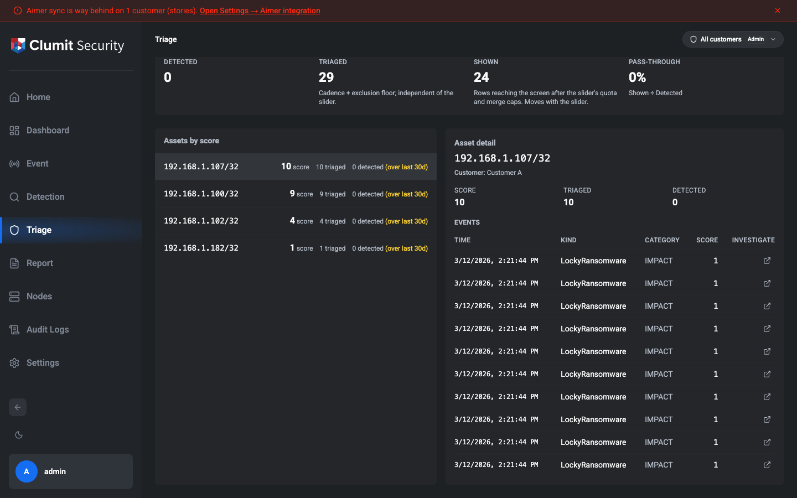

Each event row deep-links to the same **Event Investigation** view
the Detection menu's "Open full investigation" action opens, so a
suspicious row can be promoted to a full investigation without
re-finding the event by hand. There are two affordances for the
same destination:

- **Whole-row link.** Clicking anywhere on a row — or focusing it
  with the keyboard and pressing **Enter** or **Space** — opens the
  event's investigation view.
- **Per-row action button.** A trailing **Investigate** column
  renders an external-link button on every row, mirroring the
  Detection inspector's explicit action.

Both open the view **in a new browser tab**, so the triage page —
your current asset selection, pivot trail, and period — stays
intact in the original tab. The link target is
`/detection/events/<token>`, where the token is derived from the event's
stable identifier; no triage filter state is encoded into it.

The deep link is offered on the **asset detail** event rows only.
The Story detail member table keeps its existing pivot affordances
and does not turn its rows into investigation links.

### Field availability in Baseline mode

The Baseline-mode detail panel reads from `baseline_triaged_event`
columns only; subtype-specific fields that are not present on the
corpus row are omitted from the panel. Fields **not** available
in Baseline mode (and the dimensions they would have powered):

- `level` (ThreatLevel) — the level chip and any level filter are
  hidden in Baseline mode.
- `origCountry` / `respCountry` — the **Country** pivot dimension
  is hidden in Baseline mode.
- `origNetwork` / `respNetwork` — the customer-network membership
  classifier falls back to RFC1918 / IPv6 special-use ranges (the
  IP pivot dimensions still work).
- HTTP `userAgent`, DNS `answer`, TLS subtype fields (JA3, JA3S,
  SNI, certificate serial, certificate subject CN), `clusterId` —
  the corresponding **User agent**, **DNS answer**, and **TLS**
  pivot dimensions, plus the **Cluster ID** pivot, are hidden in
  Baseline mode.

These fields all return automatically in the future "With my
policies" mode (corpus B) which retains the full `eventList`
payload through a snapshot JSONB. Inside the Baseline-mode pivot
panel, the dimensions above appear as no-ops because the index
builder skips them when reading from corpus A.

## Hard cap and truncation

The menu read is bounded in two layers:

1. **Per-tenant per-bucket candidate cap.** The §4 menu-cohort
   SELECT returns at most a few hundred candidate rows per
   `slot_bucket` — a strict superset of any quota the §6 curve can
   produce. Full-cohort `bucket_count`, `bucket_tag_sum`, and
   `cohort_count` ride along as window-function columns so the
   algorithm's `normalized_volume`, `normalized_top_confidence`,
   and `default_N` are computed against the active window and not
   the candidate slice.
2. **Cross-tenant `final_menu_rows` cap.** After the per-tenant
   §4 / §6 composition runs, the merged list of `final_menu_rows`
   across the caller's scope is bounded above by **5,000 events**
   before the pivot index is built. The cap is applied in §3
   priority order — `baseline_score DESC, event_time DESC,
   event_key DESC` (numeric-string DESC: `"10"` before `"9"`,
   matching the per-tenant menu composition) — so when a
   multi-tenant scope exceeds the ceiling, the lowest-priority
   rows are dropped first rather than the oldest.
   The visible asset list is then aggregated from the **capped**
   event set, so the asset list and the pivot corpus are derived
   from the same row set: an asset whose menu rows are all evicted
   by the cap does not appear on the asset list, and an asset whose
   rows are partially evicted has its score, triaged-event count,
   and last-event time reflect only the surviving rows. In practice
   the upstream `default_N` cap keeps a single tenant's slice well
   under that ceiling (the §6 curve grows logarithmically with
   cohort size), so this cap is a defense-in-depth safety net
   rather than a routinely-hit limit.

When the cross-tenant cap is hit, the page renders an amber banner
above the funnel:

> Partial: showing 5,000 events of period (truncated at 5,000).

To work a wider period without the truncation banner, narrow the
range with the period picker and apply again.

## Error states

If the BFF cannot fetch events for the chosen period, the page
renders the empty shell with one of these banners:

- **"Could not load events for this period. Try a different
  range."** — the BFF reached REview but the response was an
  unrecognised error.
- **"You are not authorized to view triage results."** — the
  caller lacks `triage:read`. (In practice this is unreachable
  because the page-level permission check redirects first; the
  banner exists as defense in depth.)
- **"You have no customers in scope. Contact an
  administrator."** — the caller holds `triage:read` but no
  customers are assigned to their account.

## Stories tab

Inside Baseline mode the Triage page exposes three peer views
through a tab strip above the workspace: **Asset list** (the
default landing tab described above), **Stories**, and **Pivot**.
Stories surfaces clusters that the cadence-side correlator (see
the Story RFC and `event_group` schema) has already grouped, plus
clusters the analyst has saved by hand from a pivot focus.

The Stories tab is hidden in "With my policies" mode. Story v1
runs on the baseline corpus only; the policy corpus has no
`event_group` rows, so a tab there would always be empty.

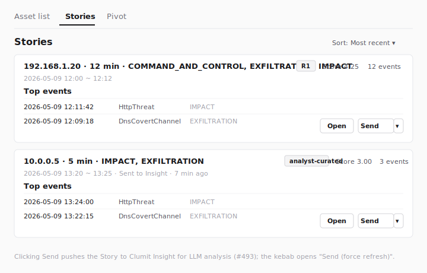

> **Note:** The figure above is a wireframe stand-in. Live PNG
> captures land once a staging tenant with a representative Story
> fixture is available; the screenshot debt is folded into the
> Phase 1.B manual-screenshot rollout tracked under [issue
> #463](https://github.com/aicers/aice-web-next/issues/463).

### Stories list

The list reverse-chronologically renders every `event_group` row
whose time window **overlaps** the menu's selected period — a
Story that started before `period.start` but extends into it
appears here, not only Stories that started inside the period.
The default sort is `time_window_end DESC`; a small toggle in the
header swaps to `score DESC`.

The list fans out one bounded query per tenant in the caller's
effective customer scope, so a single-customer session keeps the
existing fast path and a multi-customer session issues one query
per tenant. Results are merged on
`(time_window_end DESC, score DESC, customerId, storyId)` so the
secondary sort key is stable across both orderings. When any
per-tenant slice hits the per-page cap a small muted hint above
the cards reads "Some Stories were not loaded — narrow the period
to see the rest."

A **Show only unsent** checkbox filters out Stories whose
`last_sent_at` column has been written. The column is populated
by a follow-up issue (#493); until that ships every Story is
"unsent" and the filter is effectively a no-op. The toggle is
included now so the UI surface does not need a second pass once
#493 lands.

### Story card

Each Story renders as one card with:

- **Title** — auto-generated from the stored `summary_payload`:
  `<primary asset> · <duration> · <top-3 categories>`. For an
  analyst-curated Story that supplied a title at save time the
  card renders the analyst's title verbatim instead.
- **Rule badge** — the correlation rule for auto-correlated
  Stories, `analyst-curated` for the curated kind. Auto rules are:
  - `R1` — one asset, multiple critical categories in a short window.
  - `R3` — one asset, repeated critical-selector activity.
  - `R4` — fan-in: many source IPs converging on one victim with the
    same attack signature.
  - `R5` — campaign: the same attack signature from many source IPs
    across multiple victims (this Story has no single primary asset).
- **Score** — `event_group.score`, two decimal places.
- **Member count** — the stored
  `summary_payload.memberCount` (NOT the runtime-joined count);
  the value stays stable as members age out of the underlying
  corpus.
- **Time window** — start and end timestamps.
- **Top-3 event preview** — three rows from the
  `event_group_member` ⨝ `baseline_triaged_event` join sorted by
  `raw_score DESC, event_time DESC`. Aged-out members are
  silently absent. The list query computes the whole page's
  previews in a single CTE rather than issuing N small joins.
- **β submission indicator** — when `last_sent_at` is not null,
  a small muted line `"Sent to Insight · <time-ago>"` plus an
  optional `<send_count>×` suffix. Re-clicking the send button
  is allowed; the indicator is awareness-only.

### Send to Insight

Each Story card carries a **Send to Insight** button and an
adjacent kebab menu. Clicking the primary button sends the
focused Story through the Phase 2 contract to Clumit Insight for
LLM analysis. The flow makes three calls in sequence:

1. The browser asks aice-web-next to mint a Phase 2 envelope
   for the focused Story.
2. The browser POSTs the multipart envelope (two ES256-signed
   JWSes + the JSON payload) to the configured Clumit Insight bridge
   URL.
3. On 2xx from Clumit Insight, the browser asks aice-web-next to
   commit the β-tracking update (`last_sent_at`, `last_sent_by`,
   `send_count`) and emit a `triage.story.send` audit row.

A "Sent to Insight" toast confirms success and the card
re-renders its β indicator immediately, without a full menu
refresh. Failed sends surface an error toast carrying the
structured failure code; β columns are left untouched so the
next click re-attempts cleanly (Clumit Insight de-duplicates on its
side if the row eventually lands).

The kebab menu next to the Send button offers **Send (force
refresh)**. Selecting it prompts the analyst to confirm
("Bypass Clumit Insight's cache and run the LLM fresh on this
Story?") before sending; on confirm the same three-call flow
runs with a `force_refresh: true` flag so Clumit Insight re-runs
the LLM rather than serving its cached narrative. Force-refresh
applies to manual Send only; the opportunistic background push
never force-refreshes.

The Send button is disabled when the Clumit Insight integration is
not configured (no active signing key, no `aice_id`, or no
`aimer_web_bridge_url`). Configure the integration on the
Settings → Clumit Insight integration page first.

### Opportunistic background push

While the Stories tab is open and visible, aice-web-next
automatically pushes any Stories that have not yet been sent
since the per-customer cursor, plus any queued window-replace
notices (refresh / backfill) and withdraw notices for stories.
The drain ticks every five minutes per in-scope customer; it
auto-pauses when the tab is hidden and resumes on
`visibilitychange`. Each opportunistically pushed Story has its
β indicator updated on the next menu refresh and produces a
`triage.story.send` audit row attributed to the system actor
(rendered as **System** in the audit-log viewer).

Curated Stories (`kind = 'analyst_curated'`) are NEVER
opportunistically pushed. Manual Send remains available for
both kinds.

The push respects a per-customer pause toggle owned by
operators (Settings → Clumit Insight integration); when paused, manual
Send is unaffected.

The card carries a stable HTML identity attribute
`data-story-id="<customerId>/<storyId>"` so two tenants hosting
the same per-DB `event_group.id` produce two distinguishable
entries.

### Open: Story detail panel

Clicking **Open** drills into a detail panel whose header
mirrors the Story identity the analyst clicked: the same auto-
generated (or `manualTitle`) title, the rule badge, the score,
the stored member count from `summary_payload.memberCount`, the
customer, and the Story time window. The body renders the full
member table. The same row source is used as the asset detail
(the `event_group_member` join), with read-time `baseline_score`
computed via `cume_dist()` over the menu's `(kind,
baseline_version)` cohort so a row's score matches what it would
show in the asset list. The optional Source / Destination columns
reuse the same address rendering as the asset detail.

When `summary_payload.memberCount` exceeds the runtime joined
count, the detail panel renders a one-line muted notice:
`"<shown> of <stored> events shown — <aged> aged past corpus A
retention."` The notice is purely informational; the stored
member count remains the authoritative shape of the Story.

### Save as Story

When the operator has pivoted away from the asset root, a small
**Save as Story** button appears next to the pivot breadcrumb.
Clicking it opens a modal pre-seeded with the events visible at
the current pivot focus. The analyst can:

- Toggle individual events off before saving.
- Optionally provide a title (otherwise the auto-generated
  title is used).
- Confirm to create an `event_group` row of `kind =
  'analyst_curated'`.

The button is **disabled** whenever the pivot focus spans events
from more than one customer; a curated Story is single-tenant by
contract. Narrowing the focus to one customer re-enables it.

Server-side validation enforces:

- The caller's session has the chosen `customerId` in scope.
- Every selected event key resolves in that customer's
  `baseline_triaged_event`.
- The chosen primary asset matches at least one selected
  member's `orig_addr`.
- The member count is between 1 and 50.

On success the new Story is recorded in `event_group`, a
corresponding member set in `event_group_member`, and an audit
event `triage.story.create` (target type `triage_story`) is
written with the composite `(customerId, storyId)` identity, the
saved member count, and the analyst-provided title (or `null`
when blank). The UI redirects to the Stories tab and focuses the
new row.

### Pivot from a Story

Each row in the Story detail member table carries inline **Pivot**
buttons in a trailing actions column. Each button advertises one
pivot dimension that the underlying member event actually carries
(host, port, source / destination IP, URI pattern, DNS query, or
sensor); the button is hidden for any dimension whose extractor
finds no value on that row, so the affordance is always backed by
a value the index can group on.

Clicking a button switches into the Pivot peer view with the trail
seeded by the chosen dimension. The view differs from the
asset-rooted Pivot in three ways:

- The breadcrumb reads **`Story #<customerId>/<storyId> > <pivot
  dim>`**. Clicking the Story segment returns to the Story
  detail panel.
- The Pivot panel and the dimension-focus detail card read from
  the **Story's member set** as their corpus rather than the
  period-wide events. The left-hand asset list keeps showing the
  period-wide asset rows so the analyst keeps situational
  context.
- The trail has **no asset crumb**. The Story origin acts as the
  root.

#### Tier 2 over a Story

Tier 2 (server-filtered) dimensions are reachable from a
Pivot-from-Story state and resolve against the Story's member
event-key set rather than the asset's period-wide events. The
following Tier 2 sections appear under a Story-origin trail when
the scope toggle is set to **Tier 2**:

- `kinds`, `categories`
- `externalIp`, `internalIp`
- `sameSensor`
- The static-options sections **Learning method** and
  **Keywords**

Each click bounds the Tier 2 fetch to the ≤50 member events the
Story carries. The cohort's `totalCount` reflects the matched
member count, not REview's universe count, and the per-dimension
truncation cap does not apply at the cohort universe level.

The `policyOnly` Tier 2 dimensions — `country`, `levels`, and
the per-protocol identifier rows (`sshClient`, `userAgent`,
`dnsAnswer`, `ftpCommand`, `ldapOpcode`, `mqttSubscribe`,
`clusterId`, …) — stay hidden under both asset and Story origin.
Their backing fields are absent from `baseline_triaged_event`
and from the Story member-detail row, so opening them would
require precursor data plumbing that is tracked as a separate
follow-up.

The **weak-signal classifier** that the Tier 2 panel surfaces
under asset origin is intentionally suppressed for Story origin.
Over a ≤50-event curated Story member set the classifier's
"weak signal beyond Tier 1" framing loses its statistical
footing — every member arrives via the correlator's curation
rather than from a period-wide universe — so the affordance
would highlight rows whose label no longer carries the same
meaning. Re-enabling is deferred to a separate UX decision.

Same-Story re-pivots reuse the cached Tier 2 result: the cache
key adds a `(customerId, storyId)` namespace segment alongside
the existing period / dimension / value / scope segments, so a
Story → Asset list → back-to-same-Story sequence does not
re-issue the fetch. Two distinct Stories under the same tenant
keep their entries isolated for the same reason.

[screenshot pending follow-up]

The Pivot panel's "truncated" hint reports the period-wide
5,000-event asset corpus cap. Because the Story-origin Pivot
panel reads from the Story's complete member set, the hint is
suppressed while the origin is a Story — it would otherwise
falsely imply that the Story-scoped grouping was partial.

`baseline_score` is `null` for members whose `event_time` falls
outside the menu period (the period-scoped LEFT JOIN behaviour
documented in [#547](https://github.com/aicers/aice-web-next/pull/547)).
Null-scored members still participate in Tier 1 grouping — the
adapter maps null to score `0` so the row sorts to the bottom of
its (dimension, value) bucket rather than being dropped.

### URL hash routing

The Stories tab participates in the same URL-hash routing as
the rest of the Triage menu. The active tab is encoded under
`triage.tab=stories` and the focused Story under
`triage.story=<customerId>/<storyId>`. Existing
`triage.pivot.*` and `triage.strictness.*` keys are preserved
across writes (the latter holds the strictness slider stop id;
see [#471](https://github.com/aicers/aice-web-next/issues/471)).

A `triage.story=<id>` segment that omits the `customerId/`
prefix is treated as stale because `event_group.id` is per
tenant: the UI falls back to the Stories list root with a
"Stale Story link — open from the list" toast.

The Pivot-from-Story state uses a **separate**
`triage.pivot.story=<customerId>/<storyId>` marker. This key
lives in the `triage.pivot.*` namespace so it survives a
Stories↔Pivot tab swap — the Stories-tab focus key
(`triage.story`) clears on swap by design, but the pivot origin
must persist. A URL carrying
`triage.tab=pivot&triage.pivot.story=<id>&triage.pivot.step=<dim>:<value>`
reloads into the Pivot tab with the Story origin in the
breadcrumb and the dimension step applied; a momentary
"loading" empty panel appears while the Story's member set
fetches, but no asset-rooted breadcrumb or asset-corpus pivot
panel is ever rendered during restore.

`triage.tab` stays authoritative on restore: a URL carrying
`triage.tab=stories&triage.pivot.story=<id>` (the shape a
bookmark from the Stories tab takes after a Pivot drill-in,
because the pivot-origin marker survives the swap) reloads
into the **Stories** tab. The Pivot-origin marker is seeded
in the background so a manual swap to the Pivot tab restores
the same Story-origin breadcrumb without re-parsing the
hash — the active-tab key always wins over the pivot-origin
key during restore.

Switching from a Pivot-from-Story state to the **Asset list**
tab strips `triage.pivot.story` from the hash. The Asset list
tab is encoded by omitting `triage.tab` entirely (it is the
default landing tab); leaving the pivot-origin marker behind
would produce a URL with no `triage.tab` but a
`triage.pivot.story` segment, which on reload would forcibly
route the analyst back to the Pivot tab they had explicitly
left. The marker only persists while the visible tab is one
that the Pivot origin is meaningful to (Pivot itself, or
Stories — preserving the swap path back to Pivot). The
in-memory Pivot origin is unchanged, so swapping back to the
Pivot tab during the same session re-serializes the marker.

### Permission

The Stories tab requires `triage:read`, the same gate as the
rest of the Triage menu. The Save-as-Story action requires no
additional permission because the saved row is scoped to a
single tenant that the caller can already read.

## AI narrative analysis

Selected entities can carry a deep link into the matching LLM analysis
in Clumit Insight. AICE Web never fetches or renders the analysis
text itself — each surface shows only a compact **tier badge** (the
`CRITICAL` / `HIGH` priority tier, with the severity and likelihood
scores in the badge tooltip) that links out to Clumit Insight in a new
tab. Lower tiers (`LOW` / `MEDIUM`), a missing analysis, or an
unconfigured Clumit Insight integration all render **nothing** — no
badge, no card, no placeholder.

The badge appears only for viewers who hold `triage:read`; the link
target and the score thresholds are validated server-side, so the
badge cannot point anywhere other than the analysis page Clumit Insight
returned.

### Story badge (Stories tab)

On the **Stories** tab, a Story whose latest analysis is `CRITICAL` or
`HIGH` shows the badge twice: once in the card header next to the rule
badge, and again in the detail panel header when the Story is opened.
Both use the same badge component, so the tier color and the
tooltip scores match across the two surfaces.

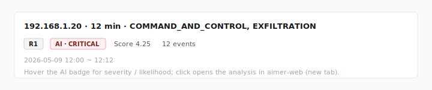

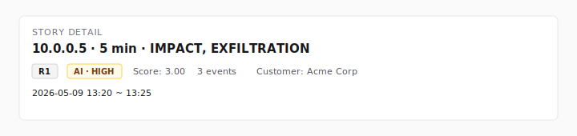

A successful **Send to Insight** may produce a fresh analysis; the
badge re-fetches eagerly after a send so a newly available
`CRITICAL` / `HIGH` badge appears without waiting for a list refresh.

### Dashboard report cards (LIVE + Today)

The **Dashboard** surfaces two per-customer report cards under an
**AI analyses** section:

- **Latest digest** — the LIVE (rolling, minute-cadence) report
  summary. Its badge links to the Clumit Insight LIVE report page.
- **Today's report** — the DAILY report summary for the viewer's
  current calendar day. The day is derived from the viewer's timezone,
  so a tab in a different timezone fetches that tab's local day, not
  the server's. Its badge links to that day's Clumit Insight report. If
  you leave the dashboard open past your local midnight, the card rolls
  over to the new day on its own — it drops the previous day's report
  and fetches the new day's, so it never keeps showing yesterday's
  report as "today's".

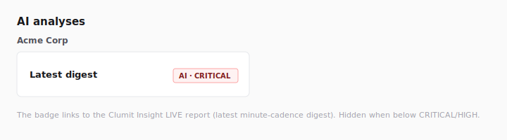

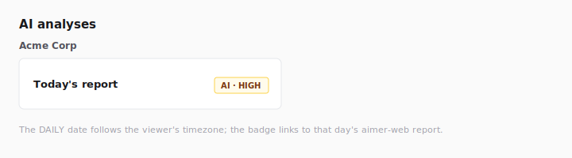

Both cards are per-customer and follow the same hide-on-negative rule
as the Story badge: only a card backed by a `CRITICAL` / `HIGH`
summary renders. A customer whose LIVE *and* DAILY summaries are both
negative produces no output at all — no per-customer header and no
empty section. On an admin's all-customer dashboard this keeps the
section to just the customers that actually have something to show.

A card that is currently hidden is re-checked in the background while
the dashboard stays open — about once a minute for **Latest digest**
(LIVE) and on a coarser cadence for **Today's report** (DAILY),
matching how often each report is produced upstream — so a report that
becomes available after you opened the page appears without a manual
reload. A card that is already showing is not re-fetched.

A global-nav **Open AI analyses →** link opens the full Clumit Insight
analysis surface; it is hidden when the Clumit Insight integration is
unconfigured.

> **Wireframe stand-ins.** The four figures above are SVG wireframe
> stand-ins, not real screenshots: the analysis surfaces only render
> for live `CRITICAL` / `HIGH` data, which depends on the Clumit
> Insight report summary endpoint
> ([aicers/aimer-web#297](https://github.com/aicers/aimer-web/issues/297))
> and the Phase 2 worker producing results. They are replaced with real
> PNG captures once that infrastructure is live, per
> `docs/AUTHORING.md` §"Screenshot exception for infrastructure-gated
> features".

## Related events panel and pivot

When an asset is selected, the page also renders a **Related events**
panel below the asset list. The panel groups other events from the
loaded corpus by pivot dimension so the operator can see what else
the focused asset has in common with the rest of the slice — without
issuing any additional network requests.

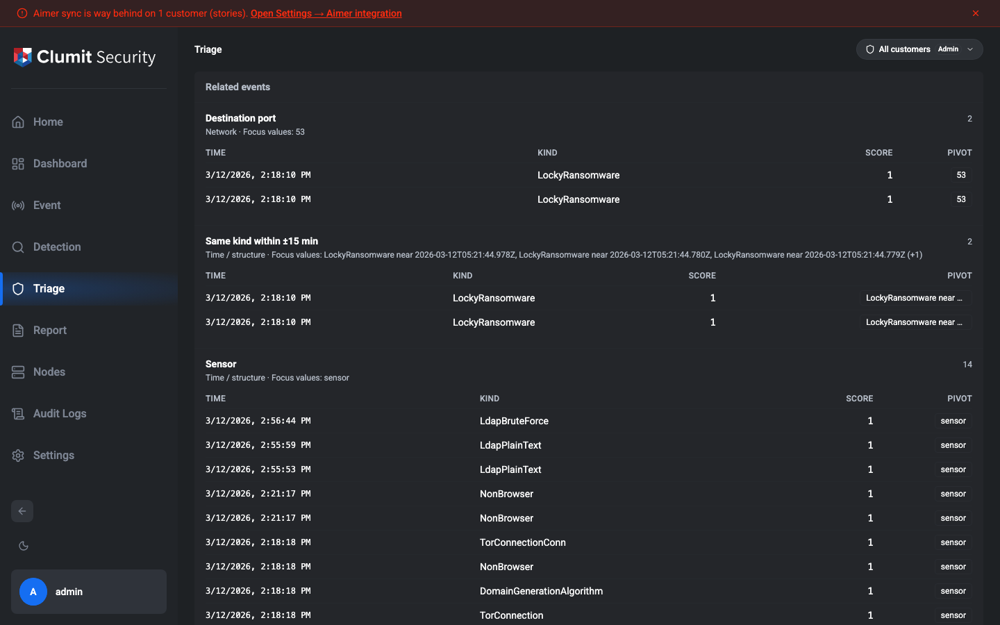

### Pivot dimensions

The panel surfaces events grouped by:

- **Network** — external IP, internal IP, destination port, country.
  External vs internal is decided by the same per-side classifier
  used elsewhere in Triage (customer-defined network membership wins;
  RFC1918 / IPv6 special-use ranges are the fallback).
- **Application** — registrable domain (Public Suffix List), host
  header, URI pattern, user-agent, plus per-protocol identifiers
  for SSH, SMB, FTP, LDAP, and MQTT (Policy mode only — the
  Baseline corpus row does not carry these subtype-specific
  fields). The URI is normalized to a pattern: query and fragment
  stripped; numeric segments templated to `{id}`, canonical UUIDs
  to `{uuid}`, long pure-hex segments to `{hex}`. So
  `/api/v1/users/42?token=…` and `/api/v1/users/99?token=…`
  collapse into the same pivot value `/api/v1/users/{id}`. The
  per-protocol identifiers share the Application family label in
  the panel header but render as separate per-dimension sections:
  - **SSH** — client / server version strings (e.g.,
    `SSH-2.0-OpenSSH_8.4`) and the HASSH client / server
    fingerprints. HASSH is the SSH analogue of JA3 / JA3S, so the
    fingerprint pivots answer "find every event sharing this SSH
    stack" the same way the TLS JA3 pivots do.
  - **SMB** — path, service, file name.
  - **FTP** — command (one pivot value per element of the
    per-session `commands` list; e.g., `RETR`, `STOR`, `LIST`).
    `FtpBruteForce` events do not carry commands and stay outside
    this section.
  - **LDAP** — opcode, object, argument (each is a string list per
    event; one pivot value per element).
    `LdapBruteForce` events do not carry these fields.
  - **MQTT** — subscribe (one pivot value per element of the per-
    session topic subscription list).
- **TLS** — JA3, JA3S, SNI (server name), certificate serial,
  certificate subject CN.
- **DNS** — DNS query, DNS answer (multi-answer rows are split, and
  only IPv4 / IPv6 literal tokens are kept; CNAMEs and status text
  such as `NXDOMAIN` that REview sometimes surfaces in the same
  field are filtered out so the dimension stays a "DNS answer IP"
  pivot, not a generic "answer string").
- **Time / structure** — same kind within ±15 minutes (events of
  the same `__typename` whose timestamp falls within fifteen
  minutes of the focused event's timestamp on either side), same
  sensor, cluster ID. Earlier revisions used a fixed 30-minute
  bucket and could call neighbors that were two minutes apart a
  miss when they straddled a bucket boundary; the dimension now
  resolves the window relative to the focus event itself.

Dimensions where the focused asset carries no value, or where the
loaded corpus has no other matching events, are hidden — never shown
empty.

### Per-section behavior

Each section ranks its rows by per-event score, descending; ties
break newest-first. The default view shows up to **10 rows** per
section. A **Show more** affordance expands to **50 rows**. Once the
section is expanded and the underlying match set is larger than the
50 rows on screen, a `Showing 50 of N` hint appears alongside the
**Show less** affordance. The hint is suppressed while the section
is collapsed (the visible row count is 10, not 50, so a "Showing 50"
hint there would contradict what is on screen) and when the expanded
view fits the entire match set.

The events that drive the focus (i.e., the events whose origAddr is
the asset's address, or that share the breadcrumb's pivot value) are
not listed in their own related-events rows — the panel surfaces the
*other* events that share a dimension with them.

When the period banner reads
`Partial: showing N events of period (truncated at 5,000)`, the
panel surfaces the same hint at its top so a missing match is not
read as confirmed absence.

### Breadcrumb (multi-step pivot)

Pivoting from a row appends a breadcrumb step. The breadcrumb (asset
focus, every dimension/value pivot step, and the current scope toggle)
is encoded in the URL hash under the `triage.pivot.*` namespace, so a
shared link or browser reload restores the trail against the
freshly-loaded corpus. See [URL hash persistence](#url-hash-persistence)
for the full hash layout and stale-fallback behavior.

- The first crumb is the asset (e.g., `Asset 10.0.0.1`).
- Each subsequent crumb names the dimension and value pivoted to
  (e.g., `JA3: 7e29c8…b4`). Clicking an earlier crumb restores the
  view to that step. Clicking the asset crumb collapses every
  dimension step back to the asset focus.

When a dimension crumb is the active step, the asset-detail card
relabels itself as **Pivot focus** and renders the events that
share the pivoted-to value rather than the originally-selected
asset's stats. The asset list keeps the original asset highlighted
so the operator can backtrack by clicking the asset crumb or
re-selecting from the list.

A new asset selection from the asset list resets the breadcrumb to
that asset; it does not append.

### Period change confirmation

When the breadcrumb has at least one dimension step, applying a new
period surfaces a confirmation modal:

> **Discard pivot trail?** Changing the period will reload the
> corpus and clear your current pivot trail. Continue?

Confirming reloads with the new period and clears the trail.
Cancelling keeps the existing period.

## Pivot scope toggle (Tier 1 / Tier 2)

A second toggle next to the period picker controls the pivot scope:

- **Triaged only** (default — Tier 1) reads only the events already
  loaded in the corpus. Clicking a dimension never issues a fresh
  fetch, so navigation is instant but the panel can only surface
  matches that pass the baseline rule.
- **All detection events** (Tier 2) keeps the same panel layout but
  switches certain dimensions to a server-side fetch on click. This
  widens the pivot into events outside the baseline slice — useful
  when the loaded corpus is too narrow to show enough context.

The default is **Triaged only** for every fresh menu entry; the
toggle is *not* persisted in account settings. A sticky default
risks an analyst returning to a 5,000-row fetch they did not intend.
Sharing the URL of a Tier 2 view does carry the toggle through —
the breadcrumb and toggle state are encoded in the URL hash so a
shared link is reload-stable.

### Server-filtered Tier 2 dimensions

Toggling to **All detection events** does not issue any fetches by
itself. Round-trips fire only when the operator clicks one of these
dimensions:

- `kinds`, `categories`, `levels` (Tier 2 only — surfaced in a
  separate "Tier 2 only" group that appears once the toggle is on).
- `learningMethods` (Tier 2 only — surfaced as a **static-options**
  section in the same "Tier 2 only" group). The two
  `LearningMethod` enum values are hard-coded so the section appears
  whenever the scope is Tier 2, regardless of whether the loaded
  corpus carries the field. Clicking a row issues a Tier 2 fetch
  filtered by `EventListFilterInput.learningMethods`.

  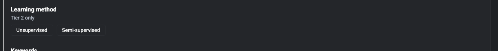

  - **Unsupervised** — events flagged by REview's unsupervised
    detection models. Pivoting here surfaces every Tier 2 event in
    the period whose `learningMethod` is `UNSUPERVISED`.
  - **Semi-supervised** — events flagged by REview's
    semi-supervised detection models. Pivoting here surfaces every
    Tier 2 event in the period whose `learningMethod` is
    `SEMI_SUPERVISED`.

- `keywords` (Tier 2 only — surfaced as a **free-form input chip**
  section in the same "Tier 2 only" group). Unlike the enum-shaped
  Tier-2-only dimensions, `keywords` accepts an operator-typed value
  rather than a fixed list of clickable rows. The section renders a
  single text input plus a **Search** button.

  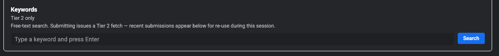

  - **Submit is explicit.** Typing alone does not trigger a fetch.
    Pressing **Enter** or clicking **Search** dispatches a Tier 2
    fetch filtered by `EventListFilterInput.keywords`. **Escape**
    clears the input.
  - **Input rules.** The submitted value is trimmed. Whitespace-only
    or empty input is rejected with an inline validation message; so
    is input longer than **256 characters** (the cap keeps the URL
    hash and the LRU cache key from blowing up).
  - **Recent chips.** The five most-recent submissions appear below
    the input as clickable chips. Clicking one re-fires the same
    Tier 2 fetch. Submitting a value already in the recents list
    moves the chip to the most-recent position rather than adding a
    duplicate.
  - **Recents are page-session only.** They are not encoded in the
    URL hash, not stored in `localStorage`, and not synced to the
    account profile. Changing the period or customer scope clears
    the recent-chips strip alongside the Tier 2 cache. Reloading the
    page with no hash content shows empty recents.
  - **Shared URL.** A breadcrumb step with a `keywords` value is
    encoded into the URL hash like any other Tier-2-only step
    (`triage.pivot.step=keywords:<encoded value>`). Restoring the
    URL queues the same Tier 2 fetch; the typed string is rendered
    verbatim as the breadcrumb label. A `keywords` fetch that
    returns zero events renders an empty pivot focus rather than
    falling back to the asset root — the corpus carries no
    `keywords` field, so the synchronous staleness check used by
    other dimensions is intentionally skipped.

- `externalIp`, `internalIp`, `country`, `sameSensor` (the same row
  the operator sees in Tier 1, but the click action issues a fresh
  fetch instead of looking up the loaded index).

Other dimensions — JA3, JA3S, SNI, host, URI pattern, certificate
fields, user-agent — are intersected client-side against whatever is
already loaded (the corpus plus every prior Tier 2 result on the
breadcrumb trail), so they remain instant in both modes.

### Fetch progress

Once a Tier 2 fetch fires, a non-blocking progress notice appears
near the panel header naming the dimension and value being fetched.
The notice clears when the fetch resolves (or surfaces as the error
notice when the fetch fails).

### Per-dimension cap and pre-fetch confirmation

A single Tier 2 dimension fetch walks at most **5,000 events**, in
pages of 100 (REview's hard `[0, 100]` cap on `first` / `last`). At
the cap the panel shows a truncation hint similar to the Tier 1
banner. The hint stays visible while any server-filtered Tier 2 step
on the breadcrumb is capped, including after the operator pivots
from a capped ancestor (e.g. `country=KR`) into a client-intersection
descendant (e.g. JA3) whose panel is still computed against that
partial 5,000-row result.

When the projected match count exceeds **20,000 events** (read from
`EventConnection.totalCount`), a confirmation modal blocks the fetch
until the operator approves it:

> **Fetch large result set?** This dimension projects to N events,
> above the 20,000 threshold. The fetch may take a while.

When `totalCount` is unavailable for the filter but the cursor
walk's first page filled, the projection cannot be compared to the
20,000 threshold. The modal opens defensively, surfaces the
first-page lower bound, and is explicit that the total is unknown:

> **Fetch large result set?** Projected size could not be verified
> — the first page returned at least N events, but the total
> against the 20,000 threshold is unknown. Confirming continues the
> fetch up to the per-dimension cap.

Cancelling the modal aborts the fetch; the operator can pick a
different dimension or narrow the period.

### Cache and eviction

Tier 2 results are cached client-side, keyed on
`(periodStart, periodEnd, dimensionId, valueKey, customerScope)`.
Cumulative cache size is capped at **100 MB** of raw event payload
(`JSON.stringify(events).length` summed across dimensions). When an
insertion would exceed the cap, the cache evicts the
least-recently-used dimension result (whole result set, not
individual events) and shows a non-blocking notice naming the
evicted dimension. Re-pivoting on the evicted dimension refetches
from REview.

If a single dimension result is itself larger than the 100 MB cap,
the cache rejects the candidate up front without disturbing other
in-budget entries — the operator sees the same non-blocking notice
naming the rejected dimension, and re-pivoting that dimension
refetches.

The customer scope is part of the cache key so a Tier 2 result for
one customer is never reused after the operator switches to a
different customer in the same browser session.

### Fetch failures

If the BFF cannot complete a Tier 2 fetch (REview timeout, transport
error, or a forbidden response), the page surfaces a dismissible
red notice naming the dimension and value, and the failed pivot is
released so the operator can retry by clicking the row again. The
loaded corpus and the Tier 1 panel are unaffected.

### Weak-signal rendering

A row that came from a Tier 2 fetch and is *not* present in the
Tier 1 corpus (compared via REview's stable per-event `Event.id`)
renders with reduced opacity and a small **weak** badge. Rows that are in
both — including non-baseline `score === 0` corpus members — render
without the badge so the operator can tell at a glance whether a
row was already in the loaded slice or freshly pulled.

### Sensor pivot

`EventListFilterInput.sensors` requires REview's opaque sensor
**ID**, but Triage events carry only the sensor **name**. The Tier 2
sensor pivot resolves the clicked name to that opaque ID against the
shared sensor lookup (now callable with `triage:read` or
`detection:read`) and keys the match on the asset root's
`(name, customerId)` so a sensor named `edge-01` under one tenant
cannot accidentally select the same-named sensor under another.

If the name no longer maps to an accessible sensor the trail reverts
to the asset root and the page surfaces a non-blocking notice. The
two reasons render distinct copy so the operator can tell them apart:

- **Stale name** — zero matches under the asset's customer scope.
  The page renders the same notice as a stale shared URL ("Pivot
  trail in the URL no longer matches the loaded period — showing the
  asset root.").
- **No longer accessible** — REview tightened scope mid-session and
  rejected the resolved `nodeId`. The page renders a dedicated
  notice ("Sensor pivot is no longer accessible in your customer
  scope — showing the asset root.") so the operator can recognise
  the access change rather than mistake it for a stale URL.

Transport / generic failures still surface as the red error notice
so the operator can tell either fallback above apart from "lookup
did not run".

### URL hash persistence

The asset focus, every dimension step in the breadcrumb, and the
Tier 1 / Tier 2 toggle state are encoded in the URL hash under the
`triage.pivot.*` namespace:

```text
#triage.pivot.asset=42/10.0.0.1&triage.pivot.step=ja3:abc123&triage.pivot.mode=tier2
```

The asset focus is the composite `customerId/address`, so two
customers that share an RFC1918 address remain distinct on restore.
URLs produced before the composite key landed encoded only the
address; the page treats those as stale and falls back to the asset
root with the non-blocking notice rather than guessing which
customer's row to focus.

Loading the page with a populated hash restores the breadcrumb to
that step against the freshly loaded corpus. If a step's value is
no longer reachable in the new period (e.g. a JA3 that no longer
matches any event), the page falls back to the asset root with a
non-blocking notice and clears the stale steps from the breadcrumb.

When the restored hash is in Tier 2 mode and contains a
client-intersection step (e.g. JA3) below a server-filtered
ancestor (e.g. `country=KR`), the page first dispatches the queued
Tier 2 ancestor fetches, then validates the descendant against the
expanded corpus. The descendant is treated as stale only if the
value is still missing once those fetches resolve, so a shared URL
remains reload-stable even when the descendant value lives only in
the ancestor's fetched result.

The hash is namespaced under `triage.pivot.*` so it coexists
with other Triage hash extensions (e.g. the strictness slider
under `triage.strictness.*`) without collision.

## Limitations

- Period start may go back as far as **180 days**; the duration of
  any one window is capped at 30 days.
- The baseline rule is fixed; per-operator policies are not yet
  available.
- The asset key is the composite `(customerId, originator IP)`;
  events that emit plural address fields are not assigned to an
  asset row.
- Up to 5,000 `final_menu_rows` per period are returned across the
  caller's scope; wider periods show a truncation banner.
- The mode toggle, period choices, and per-asset state do not
  persist across sessions. The pivot breadcrumb and Tier 1 / Tier 2
  scope are encoded in the URL hash so a shared / reloaded URL
  restores them, but they reset on every fresh menu entry.
- In Baseline mode the **Country**, **User agent**, **TLS** (JA3 /
  JA3S / SNI / cert serial / cert subject CN), **DNS answer**,
  **Cluster ID**, and **Threat level** pivot dimensions are
  hidden — the corresponding columns are not present on
  `baseline_triaged_event`. They return in the future "With my
  policies" mode (corpus B).
