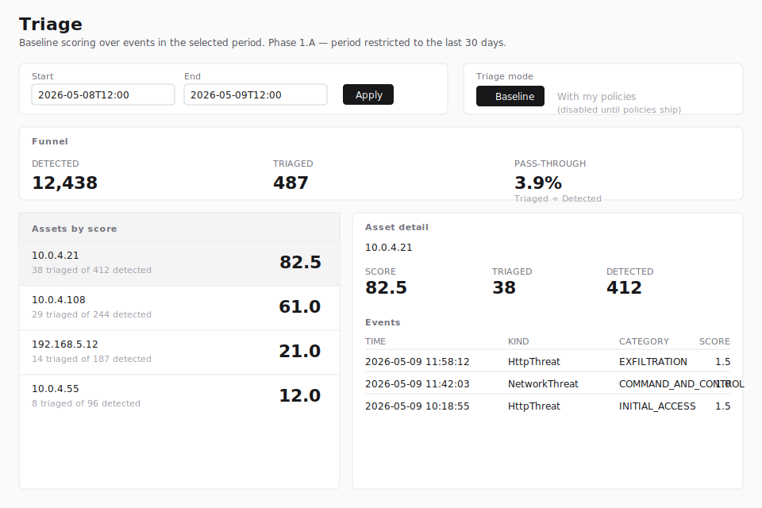

# Triage

The Triage page narrows a high-volume detection feed down to the
assets most likely to need a human eye next. It loads every
detection event for a chosen period, applies a baseline scoring
rule, and ranks source addresses by total score so an analyst can
work the highest-impact rows first.

Viewing the page requires the `triage:read` permission. The
built-in roles Security Monitor, Tenant Administrator, and System
Administrator receive this permission by default. Custom roles
that grant `triage:read` also qualify.

> **Note:** The figure above is a wireframe stand-in. Phase 1.A
> ships before the live REview screenshot environment is wired up
> for Triage; the wireframe will be replaced with a real PNG
> capture in a follow-up once a representative dataset is
> available against the local-REview procedure documented in the
> [Authoring guide](../AUTHORING.md).

## Layout

The page has four regions:

1. **Header** — title and a one-line description of the current
   phase (Phase 1.A: corpus retention isn't yet available, so the
   period is restricted to the last 30 days).
2. **Period picker and mode toggle** — controls for the period
   under analysis and the scoring mode (only **Baseline** is
   wired today).
3. **Funnel** — three numbers for the loaded slice: how many
   events were detected, how many passed the baseline rule, and
   the ratio between them.
4. **Asset list and asset detail** — a two-column workspace.
   The list ranks source addresses by total score; selecting a row
   reveals its score, counts, and most recent triaged events on
   the right.

## Period picker

The picker takes a start and an end timestamp at minute
granularity (the browser's `datetime-local` control). The
**Apply** button submits the new range; the page reloads with a
fresh slice loaded server-side.

The selector enforces three rules:

- **Maximum lookback: 30 days.** A start timestamp older than
  30 days is rejected. Phase 1.A only supports the last-30-days
  window because corpus retention isn't yet available; when
  retention lands, the lower bound shifts.
- **Maximum duration: 30 days.** A range whose end minus start
  exceeds 30 days is rejected.
- **End after start.** A range whose end is at or before its
  start is rejected.

If a URL is opened with a `start` / `end` query string that falls
outside these rules, the page clamps the values into range and
shows an amber **"Period adjusted to fit the last 30 days."**
notice above the funnel so the operator notices that the rendered
window differs from what was requested.

The page defaults to a 24-hour window ending at the current time
when no `start` / `end` is supplied.

## Mode toggle

Two modes are visible:

- **Baseline** (active) — the curated rule described
  in [Baseline scoring rule](#baseline-scoring-rule) below.
- **With my policies** (disabled) — the seam for the future
  per-operator policy subtree. The button is rendered so the
  toggle is in place from day one, but it cannot be selected
  until the policy feature ships. Hovering it reveals a tooltip
  saying **"Available once Triage policies ship."**

## Baseline scoring rule

The baseline scorer is intentionally narrow:

- **Category whitelist.** An event scores **1.0** when its
  category is one of the operator-relevant kill-chain stages:
  `COMMAND_AND_CONTROL`, `EXFILTRATION`, `IMPACT`,
  `INITIAL_ACCESS`, or `CREDENTIAL_ACCESS`.
- **Cluster bonus.** An `HttpThreat` event whose `clusterId` is
  the no-cluster sentinel (empty, `none`, or `null`, case-
  insensitive) adds another **0.5** on top of the whitelist
  score. These rows correlate with novel HTTP traffic the
  upstream model couldn't bucket and are worth surfacing earlier.

An event whose category is outside the whitelist scores **0** and
is counted in the **Detected** funnel total but not in
**Triaged**, and contributes nothing to its asset's score.

There are no exclusions, no per-operator policies, and no
persistence in Phase 1.A.

## Funnel

The funnel summarises the loaded slice:

| Stat | Meaning |
|---|---|
| **Detected** | Total events loaded for the period (after the 5,000-event hard cap, see [Hard cap and truncation](#hard-cap-and-truncation)). |
| **Triaged** | Events whose baseline score is greater than zero. |
| **Pass-through** | `Triaged ÷ Detected`, expressed as a percentage. |

## Asset list

Each row groups events by the originator IP address (`origAddr`).
Rows are sorted by total score (highest first); ties break on
triaged count, then detected count, then address.

Events without a usable originator IP — for example, aggregate
threat subtypes that emit a plural `origAddrs` field — still
count toward the funnel's **Detected** total but do not
contribute to any asset row.

Clicking a row populates the **Asset detail** panel on the
right; the first row is preselected when the page loads.

The list shows up to one row per distinct address. If no events
in the period pass the baseline rule, the list reads
**"No assets matched the baseline rule in this period."**

## Asset detail

The detail panel for the selected asset shows:

- The asset's source address.
- **Score**, **Triaged**, and **Detected** counts for the asset.
- The asset's most recent **50 events**, newest first, with each
  event's time, kind (`__typename`), category, and per-event
  baseline score.

Times are formatted in the session's preferred timezone (set
under **Settings**).

## Hard cap and truncation

Triage paginates `eventList` cursor-by-cursor until either every
event in the period is loaded or **5,000 events** have been
collected, whichever comes first. The 5,000-event cap is a
demo-stage safety net so a wide period over a noisy day cannot
silently load tens of thousands of rows.

When the cap is hit while REview still reports more rows, the
page renders an amber banner above the funnel:

> Partial: showing 5,000 events of period (truncated at 5,000).

If the cap is reached on the final page (i.e., REview reports no
further rows), the banner does not appear — the operator did see
every event in the period.

To work a wider period without the truncation banner, narrow the
range with the period picker and apply again.

## Error states

If the BFF cannot fetch events for the chosen period, the page
renders the empty shell with one of these banners:

- **"Could not load events for this period. Try a different
  range."** — the BFF reached REview but the response was an
  unrecognised error.
- **"You are not authorized to view triage results."** — the
  caller lacks `triage:read`. (In practice this is unreachable
  because the page-level permission check redirects first; the
  banner exists as defense in depth.)
- **"You have no customers in scope. Contact an
  administrator."** — the caller holds `triage:read` but no
  customers are assigned to their account.

## Limitations in Phase 1.A

- Only the last 30 days are loadable.
- The baseline rule is fixed; per-operator policies are not yet
  available.
- The asset key is a single originator IP; events that emit
  plural address fields are not assigned to an asset row.
- Up to 5,000 events per period are aggregated; wider periods
  show a truncation banner.
- The page does not persist period choices, mode selection, or
  any per-asset state.
