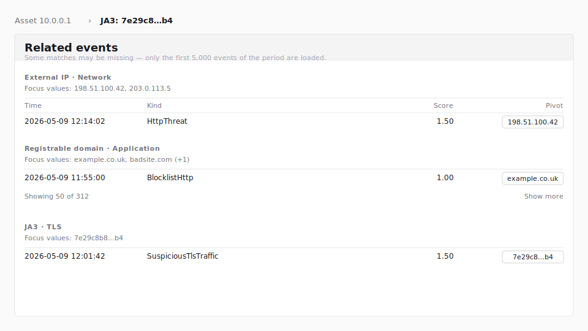

# Triage

The Triage page narrows a high-volume detection feed down to the
assets most likely to need a human eye next. It loads every
detection event for a chosen period, applies a baseline scoring
rule, and ranks source addresses by total score so an analyst can
work the highest-impact rows first.

Viewing the page requires the `triage:read` permission. The
built-in roles Security Monitor, Tenant Administrator, and System
Administrator receive this permission by default. Custom roles
that grant `triage:read` also qualify.


> **Note:** The figure above is a wireframe stand-in. Phase 1.A
> ships before the live REview screenshot environment is wired up
> for Triage; the wireframe will be replaced with a real PNG
> capture in a follow-up once a representative dataset is
> available against the local-REview procedure documented in the
> [Authoring guide](../AUTHORING.md).

## Layout

The page has four regions:

1. **Header** — title and a one-line description of the current
   phase (Phase 1.A: corpus retention isn't yet available, so the
   period is restricted to the last 30 days).
2. **Period picker and mode toggle** — controls for the period
   under analysis and the scoring mode (only **Baseline** is
   wired today).
3. **Funnel** — three numbers for the loaded slice: how many
   events were detected, how many passed the baseline rule, and
   the ratio between them.
4. **Asset list and asset detail** — a two-column workspace.
   The list ranks source addresses by total score; selecting a row
   reveals its score, counts, and most recent triaged events on
   the right.

## Period picker

The picker takes a start and an end timestamp at minute
granularity (the browser's `datetime-local` control). The
**Apply** button submits the new range; the page reloads with a
fresh slice loaded server-side.

The selector enforces three rules:

- **Maximum lookback: 30 days.** A start timestamp older than
  30 days is rejected. Phase 1.A only supports the last-30-days
  window because corpus retention isn't yet available; when
  retention lands, the lower bound shifts.
- **Maximum duration: 30 days.** A range whose end minus start
  exceeds 30 days is rejected.
- **End after start.** A range whose end is at or before its
  start is rejected.

If a URL is opened with a `start` / `end` query string that falls
outside these rules, the page clamps the values into range and
shows an amber **"Period adjusted to fit the last 30 days."**
notice above the funnel so the operator notices that the rendered
window differs from what was requested.

The page defaults to a 24-hour window ending at the current time
when no `start` / `end` is supplied.

## Mode toggle

Two modes are visible:

- **Baseline** (active) — the curated rule described
  in [Baseline scoring rule](#baseline-scoring-rule) below.
- **With my policies** (disabled) — the seam for the future
  per-operator policy subtree. The button is rendered so the
  toggle is in place from day one, but it cannot be selected
  until the policy feature ships. Hovering it reveals a tooltip
  saying **"Available once Triage policies ship."**

## Baseline scoring rule

The baseline scorer is intentionally narrow:

- **Category whitelist.** An event scores **1.0** when its
  category is one of the operator-relevant kill-chain stages:
  `COMMAND_AND_CONTROL`, `EXFILTRATION`, `IMPACT`,
  `INITIAL_ACCESS`, or `CREDENTIAL_ACCESS`.
- **Cluster bonus.** An `HttpThreat` event whose `clusterId` is
  the no-cluster sentinel (empty, `none`, or `null`, case-
  insensitive) adds another **0.5** on top of the whitelist
  score. These rows correlate with novel HTTP traffic the
  upstream model couldn't bucket and are worth surfacing earlier.

An event whose category is outside the whitelist scores **0** and
is counted in the **Detected** funnel total but not in
**Triaged**, and contributes nothing to its asset's score.

There are no exclusions, no per-operator policies, and no
persistence in Phase 1.A.

## Funnel

The funnel summarises the loaded slice:

| Stat | Meaning |
|---|---|
| **Detected** | Total events loaded for the period (after the 5,000-event hard cap, see [Hard cap and truncation](#hard-cap-and-truncation)). |
| **Triaged** | Events whose baseline score is greater than zero. |
| **Pass-through** | `Triaged ÷ Detected`, expressed as a percentage. |

## Asset list

Each row groups events by the originator IP address (`origAddr`).
Rows are sorted by total score (highest first); ties break on
triaged count, then detected count, then address.

Events without a usable originator IP — for example, aggregate
threat subtypes that emit a plural `origAddrs` field — still
count toward the funnel's **Detected** total but do not
contribute to any asset row.

Clicking a row populates the **Asset detail** panel on the
right; the first row is preselected when the page loads.

The list shows up to one row per distinct address. If no events
in the period pass the baseline rule, the list reads
**"No assets matched the baseline rule in this period."**

## Asset detail

The detail panel for the selected asset shows:

- The asset's source address.
- **Score**, **Triaged**, and **Detected** counts for the asset.
- The asset's most recent **50 events**, newest first, with each
  event's time, kind (`__typename`), category, and per-event
  baseline score.

Times are formatted in the session's preferred timezone (set
under **Settings**).

## Hard cap and truncation

Triage paginates `eventList` cursor-by-cursor until either every
event in the period is loaded or **5,000 events** have been
collected, whichever comes first. The 5,000-event cap is a
demo-stage safety net so a wide period over a noisy day cannot
silently load tens of thousands of rows.

When the cap is hit while REview still reports more rows, the
page renders an amber banner above the funnel:

> Partial: showing 5,000 events of period (truncated at 5,000).

If the cap is reached on the final page (i.e., REview reports no
further rows), the banner does not appear — the operator did see
every event in the period.

To work a wider period without the truncation banner, narrow the
range with the period picker and apply again.

## Error states

If the BFF cannot fetch events for the chosen period, the page
renders the empty shell with one of these banners:

- **"Could not load events for this period. Try a different
  range."** — the BFF reached REview but the response was an
  unrecognised error.
- **"You are not authorized to view triage results."** — the
  caller lacks `triage:read`. (In practice this is unreachable
  because the page-level permission check redirects first; the
  banner exists as defense in depth.)
- **"You have no customers in scope. Contact an
  administrator."** — the caller holds `triage:read` but no
  customers are assigned to their account.

## Related events panel and pivot

When an asset is selected, the page also renders a **Related events**
panel below the asset list. The panel groups other events from the
loaded corpus by pivot dimension so the operator can see what else
the focused asset has in common with the rest of the slice — without
issuing any additional network requests.



> **Note:** The figure above is a wireframe stand-in. Phase 1.A
> ships before the live REview screenshot environment is wired up
> for Triage; the wireframe will be replaced with a real PNG capture
> as part of the EN/KR Triage manual screenshot pass tracked by
> [issue #455](https://github.com/aicers/aice-web-next/issues/455).

### Pivot dimensions

The panel surfaces events grouped by:

- **Network** — external IP, internal IP, destination port, country.
  External vs internal is decided by the same per-side classifier
  used elsewhere in Triage (customer-defined network membership wins;
  RFC1918 / IPv6 special-use ranges are the fallback).
- **Application** — registrable domain (Public Suffix List), host
  header, URI pattern, user-agent. The URI is normalized to a
  pattern: query and fragment stripped; numeric segments templated
  to `{id}`, canonical UUIDs to `{uuid}`, long pure-hex segments to
  `{hex}`. So `/api/v1/users/42?token=…` and
  `/api/v1/users/99?token=…` collapse into the same pivot value
  `/api/v1/users/{id}`.
- **TLS** — JA3, JA3S, SNI (server name), certificate serial,
  certificate subject CN.
- **DNS** — DNS query, DNS answer (multi-answer rows are split, and
  only IPv4 / IPv6 literal tokens are kept; CNAMEs and status text
  such as `NXDOMAIN` that REview sometimes surfaces in the same
  field are filtered out so the dimension stays a "DNS answer IP"
  pivot, not a generic "answer string").
- **Time / structure** — same kind within ±15 minutes (events of
  the same `__typename` whose timestamp falls within fifteen
  minutes of the focused event's timestamp on either side), same
  sensor, cluster ID. Earlier revisions used a fixed 30-minute
  bucket and could call neighbors that were two minutes apart a
  miss when they straddled a bucket boundary; the dimension now
  resolves the window relative to the focus event itself.

Dimensions where the focused asset carries no value, or where the
loaded corpus has no other matching events, are hidden — never shown
empty.

### Per-section behavior

Each section ranks its rows by per-event score, descending; ties
break newest-first. The default view shows up to **10 rows** per
section. A **Show more** affordance expands to **50 rows**. Once the
section is expanded and the underlying match set is larger than the
50 rows on screen, a `Showing 50 of N` hint appears alongside the
**Show less** affordance. The hint is suppressed while the section
is collapsed (the visible row count is 10, not 50, so a "Showing 50"
hint there would contradict what is on screen) and when the expanded
view fits the entire match set.

The events that drive the focus (i.e., the events whose origAddr is
the asset's address, or that share the breadcrumb's pivot value) are
not listed in their own related-events rows — the panel surfaces the
*other* events that share a dimension with them.

When the period banner reads
`Partial: showing N events of period (truncated at 5,000)`, the
panel surfaces the same hint at its top so a missing match is not
read as confirmed absence.

### Breadcrumb (multi-step pivot)

Pivoting from a row appends a breadcrumb step. The breadcrumb (asset
focus, every dimension/value pivot step, and the current scope toggle)
is encoded in the URL hash under the `triage.pivot.*` namespace, so a
shared link or browser reload restores the trail against the
freshly-loaded corpus. See [URL hash persistence](#url-hash-persistence)
for the full hash layout and stale-fallback behavior.

- The first crumb is the asset (e.g., `Asset 10.0.0.1`).
- Each subsequent crumb names the dimension and value pivoted to
  (e.g., `JA3: 7e29c8…b4`). Clicking an earlier crumb restores the
  view to that step. Clicking the asset crumb collapses every
  dimension step back to the asset focus.

When a dimension crumb is the active step, the asset-detail card
relabels itself as **Pivot focus** and renders the events that
share the pivoted-to value rather than the originally-selected
asset's stats. The asset list keeps the original asset highlighted
so the operator can backtrack by clicking the asset crumb or
re-selecting from the list.

A new asset selection from the asset list resets the breadcrumb to
that asset; it does not append.

### Period change confirmation

When the breadcrumb has at least one dimension step, applying a new
period surfaces a confirmation modal:

> **Discard pivot trail?** Changing the period will reload the
> corpus and clear your current pivot trail. Continue?

Confirming reloads with the new period and clears the trail.
Cancelling keeps the existing period.

## Pivot scope toggle (Tier 1 / Tier 2)

A second toggle next to the period picker controls the pivot scope:

- **Triaged only** (default — Tier 1) reads only the events already
  loaded in the corpus. Clicking a dimension never issues a fresh
  fetch, so navigation is instant but the panel can only surface
  matches that pass the baseline rule.
- **All detection events** (Tier 2) keeps the same panel layout but
  switches certain dimensions to a server-side fetch on click. This
  widens the pivot into events outside the baseline slice — useful
  when the loaded corpus is too narrow to show enough context.

The default is **Triaged only** for every fresh menu entry; the
toggle is *not* persisted in account settings. A sticky default
risks an analyst returning to a 5,000-row fetch they did not intend.
Sharing the URL of a Tier 2 view does carry the toggle through —
the breadcrumb and toggle state are encoded in the URL hash so a
shared link is reload-stable.

### Server-filtered Tier 2 dimensions

Toggling to **All detection events** does not issue any fetches by
itself. Round-trips fire only when the operator clicks one of these
dimensions:

- `kinds`, `categories`, `levels` (Tier 2 only — surfaced in a
  separate "Tier 2 only" group that appears once the toggle is on).
  `learningMethods` and `keywords` are also Tier 2-only filter
  fields, but their values are not derivable from the loaded corpus,
  so the panel does not yet surface a click affordance for them.
  Tracked as follow-ups: a static-options group for `learningMethods`
  (issue #498) and a free-form chip input for `keywords` (issue #499).
- `externalIp`, `internalIp`, `country`, `sameSensor` (the same row
  the operator sees in Tier 1, but the click action issues a fresh
  fetch instead of looking up the loaded index).

Other dimensions — JA3, JA3S, SNI, host, URI pattern, certificate
fields, user-agent — are intersected client-side against whatever is
already loaded (the corpus plus every prior Tier 2 result on the
breadcrumb trail), so they remain instant in both modes.

### Fetch progress

Once a Tier 2 fetch fires, a non-blocking progress notice appears
near the panel header naming the dimension and value being fetched.
The notice clears when the fetch resolves (or surfaces as the error
notice when the fetch fails).

### Per-dimension cap and pre-fetch confirmation

A single Tier 2 dimension fetch walks at most **5,000 events**, in
pages of 100 (REview's hard `[0, 100]` cap on `first` / `last`). At
the cap the panel shows a truncation hint similar to the Tier 1
banner. The hint stays visible while any server-filtered Tier 2 step
on the breadcrumb is capped, including after the operator pivots
from a capped ancestor (e.g. `country=KR`) into a client-intersection
descendant (e.g. JA3) whose panel is still computed against that
partial 5,000-row result.

When the projected match count exceeds **20,000 events** (read from
`EventConnection.totalCount`), a confirmation modal blocks the fetch
until the operator approves it:

> **Fetch large result set?** This dimension projects to N events,
> above the 20,000 threshold. The fetch may take a while.

When `totalCount` is unavailable for the filter but the cursor
walk's first page filled, the projection cannot be compared to the
20,000 threshold. The modal opens defensively, surfaces the
first-page lower bound, and is explicit that the total is unknown:

> **Fetch large result set?** Projected size could not be verified
> — the first page returned at least N events, but the total
> against the 20,000 threshold is unknown. Confirming continues the
> fetch up to the per-dimension cap.

Cancelling the modal aborts the fetch; the operator can pick a
different dimension or narrow the period.

### Cache and eviction

Tier 2 results are cached client-side, keyed on
`(periodStart, periodEnd, dimensionId, valueKey, customerScope)`.
Cumulative cache size is capped at **100 MB** of raw event payload
(`JSON.stringify(events).length` summed across dimensions). When an
insertion would exceed the cap, the cache evicts the
least-recently-used dimension result (whole result set, not
individual events) and shows a non-blocking notice naming the
evicted dimension. Re-pivoting on the evicted dimension refetches
from REview.

If a single dimension result is itself larger than the 100 MB cap,
the cache rejects the candidate up front without disturbing other
in-budget entries — the operator sees the same non-blocking notice
naming the rejected dimension, and re-pivoting that dimension
refetches.

The customer scope is part of the cache key so a Tier 2 result for
one customer is never reused after the operator switches to a
different customer in the same browser session.

### Fetch failures

If the BFF cannot complete a Tier 2 fetch (REview timeout, transport
error, or a forbidden response), the page surfaces a dismissible
red notice naming the dimension and value, and the failed pivot is
released so the operator can retry by clicking the row again. The
loaded corpus and the Tier 1 panel are unaffected.

### Weak-signal rendering

A row that came from a Tier 2 fetch and is *not* present in the
Tier 1 corpus (compared via REview's stable per-event `Event.id`)
renders with reduced opacity and a small **weak** badge. Rows that are in
both — including non-baseline `score === 0` corpus members — render
without the badge so the operator can tell at a glance whether a
row was already in the loaded slice or freshly pulled.

### Sensor-pivot limitation

`EventListFilterInput.sensors` requires REview's opaque sensor
**ID**, but Triage events carry only the sensor **name**. The shared
sensor lookup that resolves names to IDs is currently gated on
`detection:read`, which `triage:read`-only operators may not hold.
Until a `triage:read`-compatible lookup ships, Tier 2 sensor pivot
is unavailable; the panel hides the row with a "requires sensor
index" tooltip in Tier 2 mode. The Tier 1 sensor pivot is
unaffected. A shared URL with a `sameSensor` step under
`mode=tier2` is treated as a stale step on restore (the page falls
back to the asset root with a non-blocking notice) so the Tier 1
sensor name is never sent as a literal `sensors: [ID!]` value to
REview.

### URL hash persistence

The asset focus, every dimension step in the breadcrumb, and the
Tier 1 / Tier 2 toggle state are encoded in the URL hash under the
`triage.pivot.*` namespace:

```text
#triage.pivot.asset=10.0.0.1&triage.pivot.step=ja3:abc123&triage.pivot.mode=tier2
```

Loading the page with a populated hash restores the breadcrumb to
that step against the freshly loaded corpus. If a step's value is
no longer reachable in the new period (e.g. a JA3 that no longer
matches any event), the page falls back to the asset root with a
non-blocking notice and clears the stale steps from the breadcrumb.

When the restored hash is in Tier 2 mode and contains a
client-intersection step (e.g. JA3) below a server-filtered
ancestor (e.g. `country=KR`), the page first dispatches the queued
Tier 2 ancestor fetches, then validates the descendant against the
expanded corpus. The descendant is treated as stale only if the
value is still missing once those fetches resolve, so a shared URL
remains reload-stable even when the descendant value lives only in
the ancestor's fetched result.

The hash is namespaced under `triage.pivot.*` so it can coexist
with future Triage hash extensions (e.g. strictness controls under
`triage.strictness.*`) without collision.

## Limitations in Phase 1.A

- Only the last 30 days are loadable.
- The baseline rule is fixed; per-operator policies are not yet
  available.
- The asset key is a single originator IP; events that emit
  plural address fields are not assigned to an asset row.
- Up to 5,000 events per period are aggregated; wider periods
  show a truncation banner.
- The mode toggle, period choices, and per-asset state do not
  persist across sessions. The pivot breadcrumb and Tier 1 / Tier 2
  scope are encoded in the URL hash so a shared / reloaded URL
  restores them, but they reset on every fresh menu entry.
- Tier 2 sensor pivot is hidden until a `triage:read`-compatible
  sensor lookup ships.
