# 관리

이 페이지에서는 계정, 역할, 고객, 시스템 관리를 다룹니다.
이들은 관리 기능이며, 핵심 위협 탐지 기능은 구현이 완료되는
대로 별도로 문서화됩니다.

## 내비게이션

사이드바에서 애플리케이션의 모든 영역에 접근할 수 있습니다.
**설정** 메뉴에는 권한에 따라 표시되는 관리 페이지가
포함되어 있습니다:

| 설정 페이지 | 필요 권한 |
|-------------|-----------|
| 계정 | `accounts:read` |
| 역할 | `roles:read` |
| 고객 | `customers:read` |
| 시스템 | `system-settings:read` |

프로필 환경 설정은 사이드바 사용자 메뉴에서 항상 접근할 수
있습니다. 사이드바 하단에 다크/라이트 테마 토글이 있습니다.

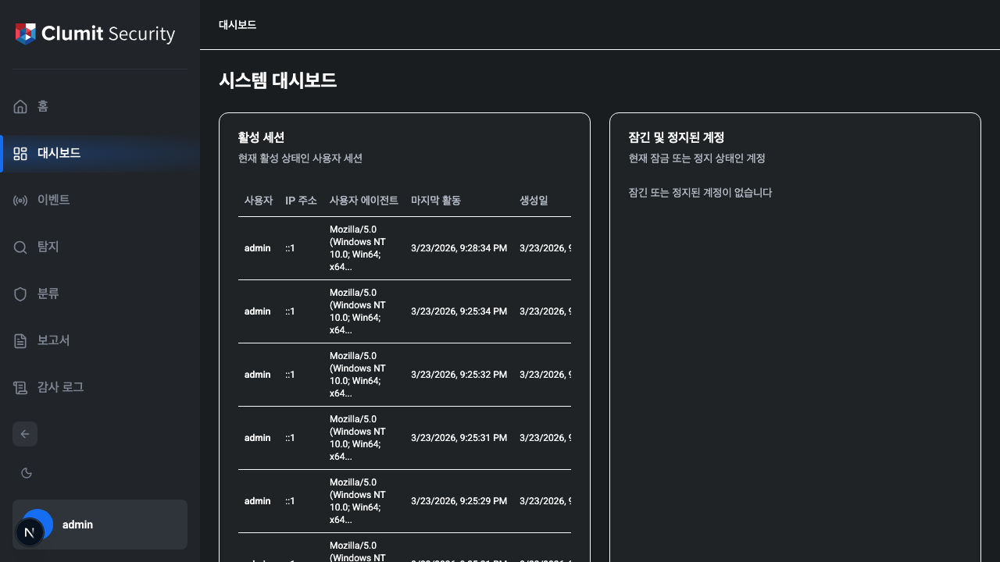

## 로그인

로그인 페이지에서 사용자명과 비밀번호를 입력합니다. 시스템이
속도 제한을 적용하므로 실패가 너무 많으면 폼이 일시적으로
잠깁니다.

발생할 수 있는 오류 상황:

- **잘못된 자격 증명** — 사용자명 또는 비밀번호가
  올바르지 않습니다.
- **계정 잠김** — 로그인 실패가 너무 많아 일시적으로
  잠겼습니다(1단계).
- **계정 정지** — 반복된 잠금으로 영구 정지되었습니다(2단계).
  관리자가 계정을 복원해야 합니다.
- **계정 비활성화** — 관리자가 계정을 비활성화했습니다.
- **IP 제한** — 이 IP 주소에서는 로그인이 허용되지 않습니다.
- **최대 세션 도달** — 계정별 세션 제한에 도달했습니다. 다른
  세션에서 먼저 로그아웃하세요.

## 로그아웃

사이드바 좌측 하단의 사용자 메뉴를 클릭하고 **로그아웃**을
선택합니다. 현재 세션이 폐기됩니다.

로그아웃 후(또는 세션 만료 시) 다시 로그인해야 하는 이유를
설명하는 화면으로 리디렉션됩니다:

- **로그아웃됨** — 수동으로 로그아웃한 경우.
- **세션 종료** — 비활성 또는 절대 타임아웃으로 세션이
  만료된 경우.

## 비밀번호 관리

### 비밀번호 변경

비밀번호 변경 페이지로 이동합니다(계정에
`must_change_password`가 설정되어 있으면 자동으로
리디렉션됩니다).

현재 비밀번호를 입력하고 새 비밀번호를 선택합니다. 새
비밀번호는 시스템의 비밀번호 정책을 충족해야 합니다:

- **최소 길이** — 설정 가능(기본값: 12자).
- **최대 길이** — 설정 가능(기본값: 128자).
- **복잡도** — 활성화 시 대문자, 소문자, 숫자, 기호가
  필요합니다.
- **재사용 금지** — 최근 N개의 비밀번호를 재사용할 수
  없습니다(기본값: 5).
- **차단 목록** — 내장된 차단 목록에 포함된 일반적인
  비밀번호는 거부됩니다.

### 관리자 비밀번호 초기화

`accounts:write` 권한이 있는 관리자가 다른 사용자의
비밀번호를 초기화할 수 있는 API가 제공됩니다. 비밀번호
초기화 시 대상 계정에 `must_change_password`가 설정되어
다음 로그인 시 비밀번호 변경이 강제됩니다. 이 기능은
아직 UI에 노출되지 않았습니다.

## 세션 관리

### 타임아웃

세션에는 두 가지 타임아웃 메커니즘이 있습니다:

- **유휴 타임아웃** — 비활성 상태가 일정 시간 지속되면
  세션이 만료됩니다(기본값: 30분).
- **절대 타임아웃** — 활동 여부와 관계없이 고정된 시간이
  지나면 세션이 만료됩니다(기본값: 8시간).

### 세션 연장 대화상자

남은 세션 시간이 토큰 전체 유효 기간의 1/5 이하가 되면
카운트다운 타이머가 있는 대화상자가 나타납니다(예: 토큰
유효 기간이 15분이면 남은 시간 3분에 대화상자가 표시됩니다).
세션을 연장하거나 로그아웃할 수 있습니다.

### 다중 세션

시스템은 계정당 동시 세션 수를 제한할 수 있습니다. 제한에
도달하면 기존 세션이 만료되거나 폐기될 때까지 새 로그인
시도가 거부됩니다.

## 계정 관리

**설정 → 계정**으로 이동하여 사용자 계정을 관리합니다.
조회하려면 `accounts:read`, 생성 및 편집하려면
`accounts:write`, 비활성화 및 삭제하려면 `accounts:delete`
권한이 필요합니다.

### 계정 목록

계정 목록은 필터링과 페이지네이션을 지원합니다.

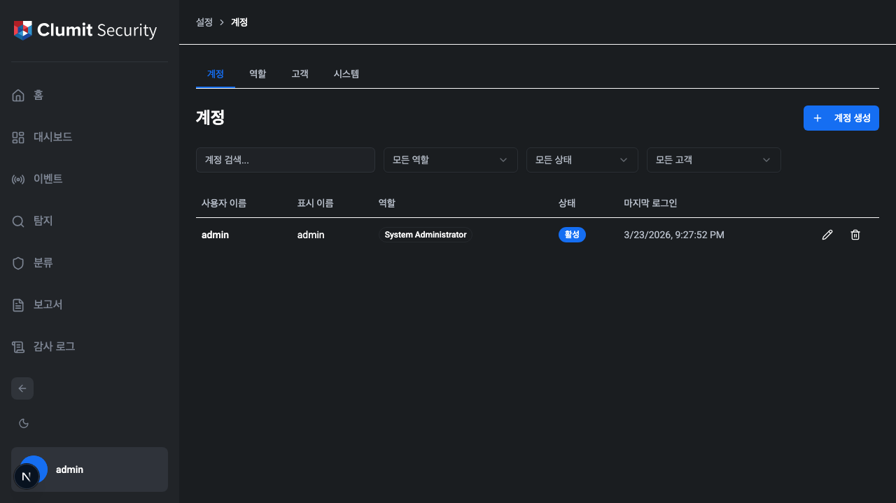

사용 가능한 필터:

- **검색** — 사용자명 또는 표시 이름으로 필터링합니다.
- **역할** — 할당된 역할로 필터링합니다.
- **상태** — 계정 상태(활성, 잠김, 정지, 비활성화)로
  필터링합니다.
- **고객** — 할당된 고객으로 필터링합니다.

### 계정 생성

**+** 버튼을 클릭하여 계정 생성 대화상자를 엽니다.

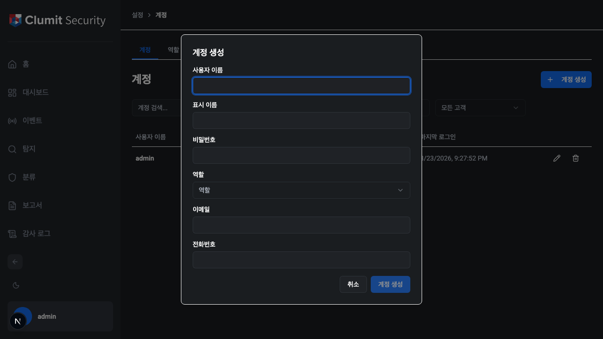

필드:

- **사용자명** — 고유한 로그인 식별자(생성 후 변경
  불가).
- **표시 이름** — UI에 표시되는 이름(필수).
- **이메일** — 선택적 연락처 이메일.
- **전화번호** — 선택적 연락처 전화번호.
- **역할** — 권한을 결정합니다. System Administrator는 모든
  역할을 할당할 수 있습니다. Tenant Administrator는 Security
  Monitor 동급 역할(권한이 0개인 역할, 즉 기본 제공 Security
  Monitor 및 권한 없는 커스텀 역할)의 계정만 생성할 수
  있습니다.
- **고객 할당** — 고객 범위가 필요한 역할에 필수입니다.
  할당 가능한 고객 수는 역할의 `max_customer_assignments`
  설정에 따라 다릅니다.
- **비밀번호** — 계정의 초기 비밀번호를 설정합니다.

### 계정 편집

계정 행의 편집 아이콘(연필)을 클릭합니다. 표시 이름, 이메일,
전화번호를 수정할 수 있습니다. 사용자명, 역할, 고객 할당은
생성 후 변경할 수 없습니다.

### 계정 비활성화 및 삭제

계정 행의 삭제 아이콘(휴지통)을 클릭합니다. 확인 대화상자가
나타납니다. 역할 계층이 적용되어 자신과 같거나 높은 역할의
계정은 삭제할 수 없습니다.

System Administrator 계정에는 제약이 있습니다: 최소 1개는
항상 존재해야 하며 최대 5개까지 허용됩니다.

### 계정 상태

| 상태 | 설명 |
|------|------|
| 활성 | 정상 운영 상태 |
| 잠김 | 로그인 실패로 인한 일시적 잠금(자동 해제됨) |
| 정지 | 반복된 잠금으로 인한 영구 잠금(관리자 복원 필요) |
| 비활성화 | 관리자에 의해 비활성화됨 |

## 역할 관리

**설정 → 역할**로 이동하여 역할을 관리합니다.
조회하려면 `roles:read`, 생성·편집·복제하려면
`roles:write`, 삭제하려면 `roles:delete` 권한이 필요합니다.

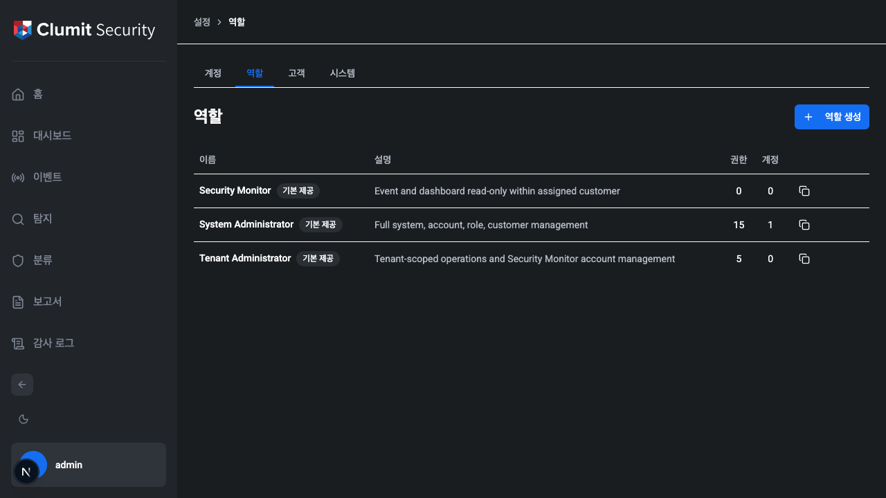

### 기본 제공 역할

세 가지 역할이 기본 제공되며 편집하거나 삭제할 수 없습니다
(**BUILTIN** 배지로 표시):

- **System Administrator** — 모든 기능에 대한 전체 접근
  권한.
- **Tenant Administrator** — 할당된 고객 내 운영 및 Security
  Monitor 계정 관리.
- **Security Monitor** — 할당된 단일 고객 내 이벤트 및
  대시보드 읽기 전용 접근.

### 커스텀 역할

**+** 버튼을 클릭하여 커스텀 역할을 생성하거나, 기존 역할의
복제 아이콘(복사)을 클릭하여 시작점으로 사용합니다.

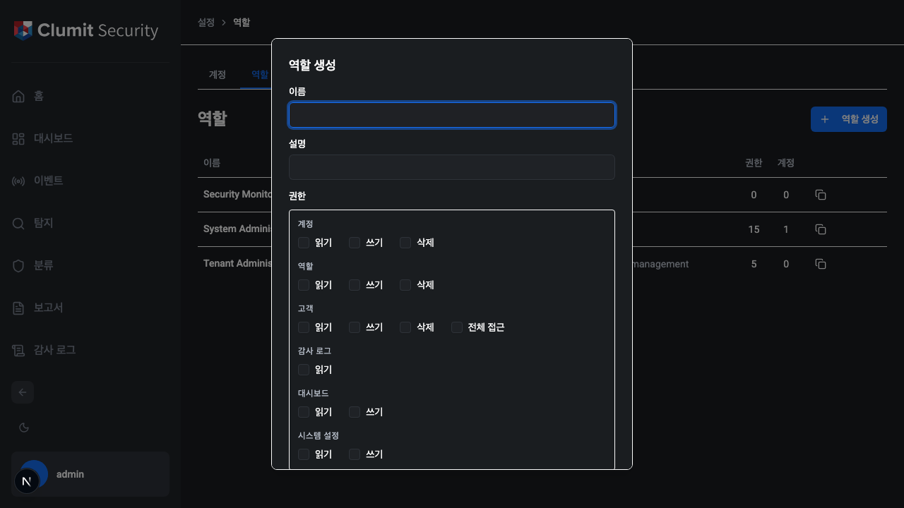

권한 그리드는 리소스별로 그룹화된 모든 사용 가능한 권한을
보여줍니다:

| 그룹 | 권한 |
|------|------|
| 대시보드 | `dashboard:read`, `dashboard:write` |
| 계정 | `accounts:read`, `accounts:write`, `accounts:delete` |
| 역할 | `roles:read`, `roles:write`, `roles:delete` |
| 고객 | `customers:read`, `customers:write`, `customers:delete`, `customers:access-all` |
| 시스템 설정 | `system-settings:read`, `system-settings:write` |
| 감사 로그 | `audit-logs:read` |

## 고객 관리

**설정 → 고객**으로 이동하여 고객을 관리합니다.
조회하려면 `customers:read`, 생성 및 편집하려면
`customers:write`, 삭제하려면 `customers:delete` 권한이
필요합니다.

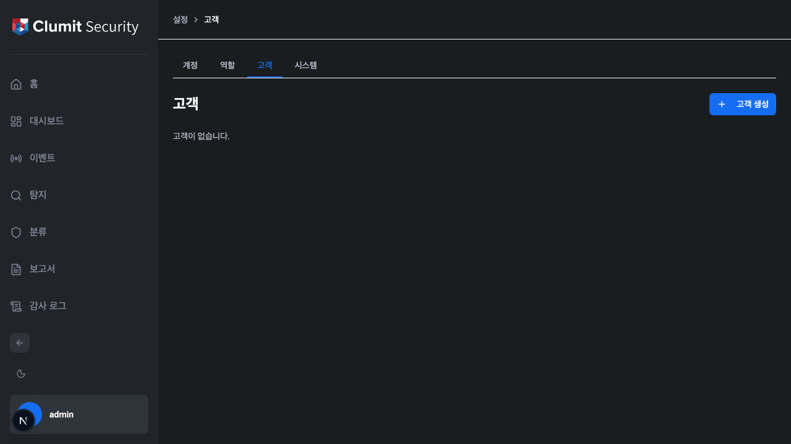

### 고객 생성

**+** 버튼을 클릭하여 고객 생성 대화상자를 엽니다.

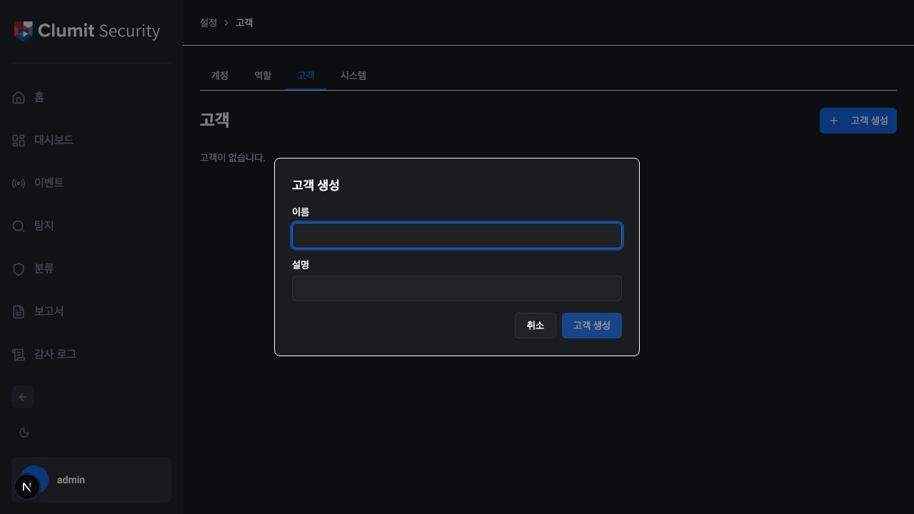

필드:

- **이름** — 고객 표시 이름(필수).
- **설명** — 선택적 설명.

고객이 생성되면 시스템이:

1. `status='provisioning'`으로 고객 레코드를 삽입합니다.
2. 전용 데이터베이스를 생성하고 마이그레이션을 실행합니다.
3. 상태를 `active`로 업데이트합니다.

프로비저닝이 실패하면 레코드와 데이터베이스가 자동으로
정리됩니다.

### 고객 삭제

삭제하려면 `customers:delete` 권한이 필요합니다(System
Administrator 전용). 시스템은 삭제 전에 해당 고객에 할당된
계정이 없는지 확인합니다. 삭제 시 고객의 데이터베이스가
드롭됩니다.

## 시스템 설정

**설정 → 시스템**으로 이동하여 시스템 전체 정책을
구성합니다. 조회하려면 `system-settings:read`, 편집하려면
`system-settings:write` 권한이 필요합니다.

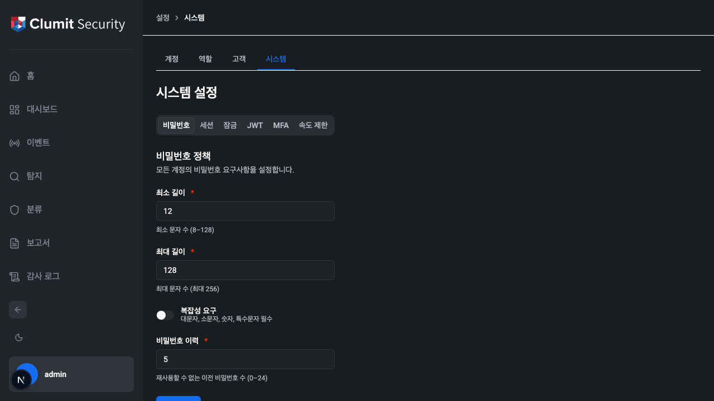

설정은 탭으로 구성되어 있습니다:

### 비밀번호 정책

| 설정 | 기본값 | 설명 |
|------|--------|------|
| 최소 길이 | 12 | 최소 비밀번호 길이 |
| 최대 길이 | 128 | 최대 비밀번호 길이 |
| 복잡도 | 활성화 | 대문자, 소문자, 숫자, 기호 필수 |
| 재사용 금지 횟수 | 5 | 재사용할 수 없는 이전 비밀번호 수 |

### 세션 정책

| 설정 | 기본값 | 설명 |
|------|--------|------|
| 유휴 타임아웃 | 30분 | 비활성 세션 만료 시간 |
| 절대 타임아웃 | 8시간 | 최대 세션 지속 시간 |
| 최대 세션 수 | 무제한 | 계정당 최대 동시 세션 수 |

### 잠금 정책

| 설정 | 기본값 | 설명 |
|------|--------|------|
| 1단계 임계값 | 5 | 일시적 잠금 전 실패 횟수 |
| 1단계 지속 시간 | 30분 | 일시적 잠금 지속 시간 |

2단계(영구 정지)는 계정이 두 번째로 잠길 때 자동으로
발생합니다.

### JWT 정책

| 설정 | 기본값 | 설명 |
|------|--------|------|
| 토큰 만료 시간 | 15분 | JWT 액세스 토큰 유효 기간 |

### MFA 정책

| 설정 | 기본값 | 설명 |
|------|--------|------|
| WebAuthn (FIDO2) | 활성화 | 하드웨어 키 / 플랫폼 인증기 허용 |
| TOTP | 활성화 | 시간 기반 일회용 비밀번호 허용 |

### 속도 제한

**로그인 속도 제한:**

| 설정 | 기본값 | 설명 |
|------|--------|------|
| IP당 횟수 / 윈도우 | 20 / 5분 | IP 주소당 요청 수 |
| 계정+IP당 횟수 / 윈도우 | 5 / 5분 | 계정 + IP당 요청 수 |
| 전역 횟수 / 윈도우 | 100 / 1분 | 전체 로그인 요청 수 |

**API 속도 제한:**

| 설정 | 기본값 | 설명 |
|------|--------|------|
| 사용자당 횟수 / 윈도우 | 100 / 1분 | 인증된 사용자당 요청 수 |

모든 시스템 설정 변경 사항은 감사 로그에 기록됩니다.

## 대시보드

대시보드는 관리자에게 실시간 운영 현황을 제공합니다.
사이드바에서 **대시보드**로 이동합니다.

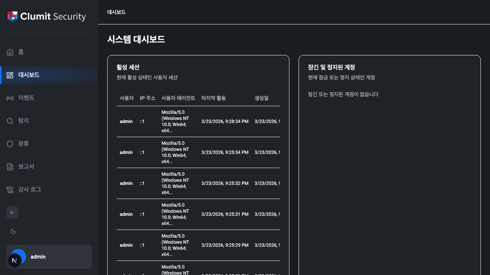

### 활성 세션

현재 활성 중인 모든 세션을 나열합니다. `dashboard:write`
권한이 있는 관리자는 **폐기** 버튼으로 개별 세션을 종료할
수 있습니다. 재인증이 필요한 세션에는 배지가 표시됩니다.

### 잠긴 계정 및 정지된 계정

현재 잠기거나 정지된 계정을 표시합니다. `accounts:write`
권한이 있는 관리자는:

- 일시적으로 잠긴 계정을 **잠금 해제**할 수 있습니다.
- 정지된 계정을 **복원**할 수 있습니다.

### 인증서 만료

mTLS 인증서 상태를 심각도 표시기와 함께 표시합니다:

- **정상** — 인증서가 유효하며 남은 시간이 충분합니다.
- **경고** — 인증서가 곧 만료됩니다.
- **위험** — 인증서가 만료되었거나 곧 만료됩니다.

인증서 주체, 발급자, 유효 기간, 남은 일수를 표시합니다.

### 의심스러운 알림

시스템이 감지한 보안 알림을 심각도별(위험, 높음, 중간,
낮음)로 표시합니다. 각 알림은 규칙 이름, 설명 메시지, 발생
횟수, 가장 최근 발생 시간을 보여줍니다.

## 감사 로그

사이드바에서 **감사 로그**로 이동합니다. `audit-logs:read`
권한이 필요합니다.

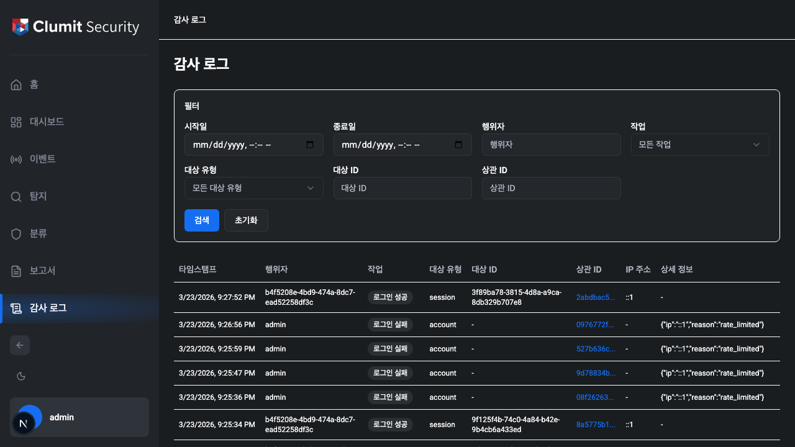

감사 로그는 시스템의 모든 중요한 활동을 기록합니다. 각
항목에는 다음이 포함됩니다:

- **타임스탬프** — 활동이 발생한 시간(사용자의 시간대로
  표시).
- **행위자** — 활동을 수행한 사람.
- **액션** — 수행된 작업(예: `account.create`,
  `sign-in.success`).
- **대상 유형** — 영향을 받은 객체의 유형.
- **대상 ID** — 특정 객체 식별자.
- **상관 ID** — 단일 작업에서 관련된 로그 항목을 연결합니다.
  상관 ID를 클릭하면 해당 작업으로 뷰가 필터링됩니다.
- **IP 주소** — 요청의 소스 IP.
- **상세 정보** — JSON 형식의 추가 구조화된 데이터.

### 필터링

필터 패널을 사용하여 날짜 범위, 행위자, 액션, 대상 유형,
대상 ID, 상관 ID의 조합으로 결과를 좁힐 수 있습니다.

## 언어 및 시간대 환경 설정

사이드바 사용자 메뉴를 통해 프로필 페이지로 이동하여 언어와
시간대 환경 설정을 변경합니다.

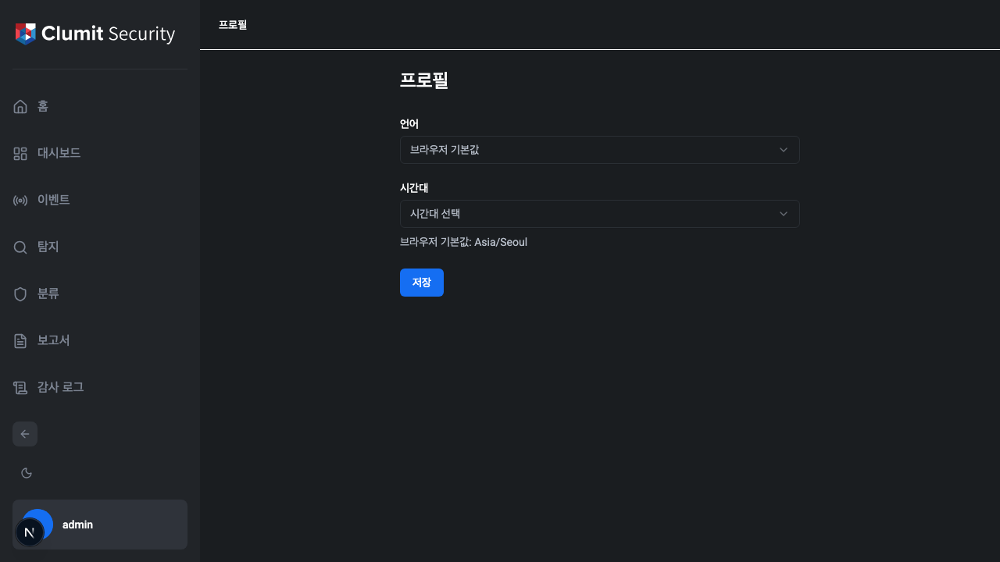

- **언어** — 영어와 한국어 중 선택합니다. UI 언어가 즉시
  업데이트됩니다.
- **시간대** — 드롭다운에서 시간대를 선택합니다.
  애플리케이션의 모든 타임스탬프가 이 시간대로 표시됩니다.
  설정하지 않으면 브라우저의 시간대가 자동으로 사용됩니다.
