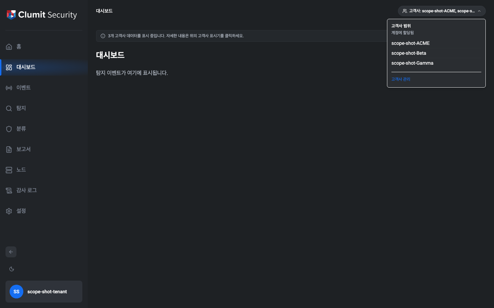
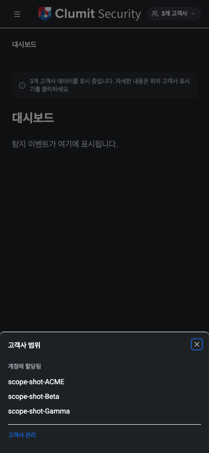
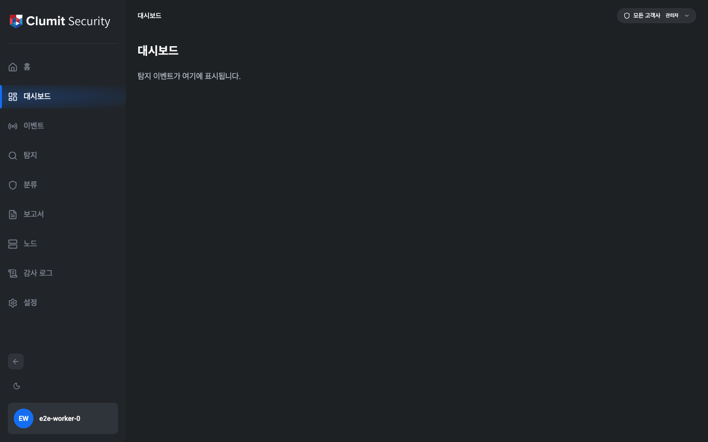

# 고객사 범위 표시기

고객사 범위 표시기는 세션의 고객사 접근 범위를 애플리케이션
헤더에 표시하여, 다중 테넌트 운영자가 현재 어느 영역의
데이터를 보고 있는지를 항상 인식할 수 있도록 합니다. 이
표시기는 읽기 전용이며, 세션 범위를 좁히거나 전환하지
않습니다. 전환 기능은 별도의 향후 개선 사항으로 추적됩니다.

## 표시 위치

표시기는 인증된 모든 페이지에 표시됩니다.

- **데스크톱** — 페이지 상단 브레드크럼 바의 오른쪽에
  정렬되어 브레드크럼 경로와 같은 줄에 배치됩니다.
- **모바일** — 모바일 헤더의 메뉴 트리거와 로고 오른쪽에
  표시됩니다. 단일 고객사인 경우 고객사 이름만 표시하는
  알약(`ACME`)으로, 다중 고객사 또는 관리자 범위인 경우
  개수 알약(`3개 고객사`, `전체`)으로, 고객사 접근 권한이
  없는 경우 짧은 경고 알약으로 축소됩니다. 알약을 탭하면
  데스크톱 팝오버 대신 하단 시트가 열려 좁은 화면에서도
  전체 고객사 목록과 관리 링크가 헤더를 넘어가지 않고
  표시됩니다.

알약을 클릭(데스크톱) 또는 탭(모바일)하면 범위에 포함된
전체 고객사 목록과 접근 권한의 출처를 보여주는 팝오버 또는
시트가 열립니다.

## 표시기 라벨

라벨 형식은 세션이 접근할 수 있는 고객사의 수에 따라
달라집니다. *"관리자"* 와 *"할당됨"* 출처의 구분은 크기와
무관합니다. 모든 고객사에 할당된 비관리자 운영자는
**관리자** 가 아니라 **할당됨** 으로 표시되며, 팝오버에서
출처를 명확히 구분합니다.

| 범위 | 라벨 |
|---|---|
| 단일 고객사 | `고객사: ACME` |
| 2 – 3개 고객사 | `고객사: ACME, Beta, Gamma` |
| 4개 이상 | `고객사: ACME 외 N개` (팝오버에 전체 목록 표시) |
| `customers:access-all` 관리자 | `모든 고객사` (관리자 배지) |
| 0개 (예외 상태) | `고객사 접근 권한 없음` (경고 스타일) |

빈 상태는 해당 세션에 `account_customer` 할당이 없으며 관리자
권한도 없는 경우를 의미합니다. 페이지는 정상적으로 렌더링
되지만, 경고 스타일의 알약을 통해 고객사 데이터에 접근할 수
없음을 운영자에게 알립니다.

## 팝오버

표시기 아래에 고정되는 팝오버에는 다음 정보가 포함됩니다.

- **출처** — 일반 운영자에게는 *계정에 할당됨*, 관리자에게는
  *관리자 범위 (`customers:access-all`)* 가 표시됩니다.
  빈 세션에서는 *이 계정에 할당된 고객사가 없습니다.* 가
  표시됩니다.
- **고객사 목록** — 범위에 포함된 모든 고객사 이름을 나열
  합니다. 4개 이상 케이스에서는 팝오버가 전체 목록을 확인할
  수 있는 유일한 위치입니다.
- **고객사 관리 링크** — `customers:read` 권한이 있는
  운영자에게만 표시됩니다. **설정 → 고객사** 로
  이동합니다.

## 페이지 단위 안내문

세션이 여러 고객사에 접근할 수 있고 관리자가 아닌 경우,
주요 페이지(대시보드, 탐지, 노드 상태, 노드 상세, 노드
설정)는 페이지 콘텐츠 위에 다음과 같은 작은 안내문을
렌더링합니다.

> N개 고객사 데이터를 표시 중입니다. 자세한 내용은 위의
> 고객사 표시기를 클릭하세요.

단일 고객사 세션과 관리자 세션에서는 이 안내문이 생략됩니다
(단일 고객사는 자명하고, 관리자는 이미 인지하고 있기
때문입니다).

## 범위가 변경되는 경우

범위는 페이지 이동 시마다 서버 측에서 다시 계산됩니다.
운영자의 고객사 할당이 세션 도중에 변경되면(예: 관리자가
고객사 할당을 해제) 해당 세션은 다음 요청 시 강제로 다시
로그인하게 됩니다. 고객사 할당 API가 계정의 세션 토큰 버전을
증가시키기 때문에 기존 JWT가 더 이상 유효하지 않으며,
운영자는 *세션이 종료되었습니다* 안내와 함께 로그인 페이지로
이동합니다. 다시 로그인한 후에는 표시기와 필터링된 결과가
새로운 범위를 반영합니다.

이미 마운트된 화면(탐지 결과, 센서 드로어, 노드 상태 페이지)
역시 메모리 캐시에서 데이터를 표시하기 전에 간단한 인증
프로브를 실행하므로, 페이지 이동 사이에도 운영자가 더 이상
접근할 수 없는 고객사의 데이터가 표시되지 않습니다.
