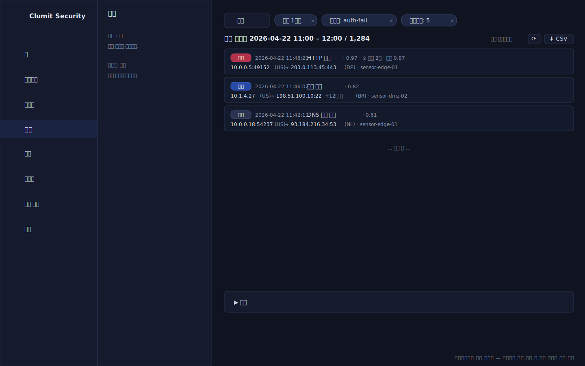
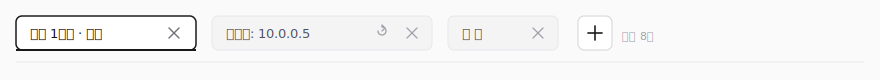
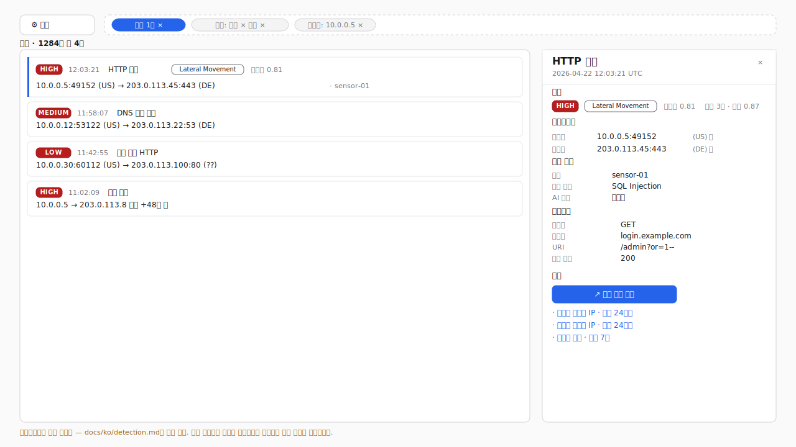
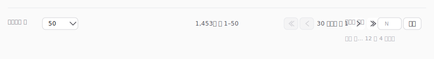
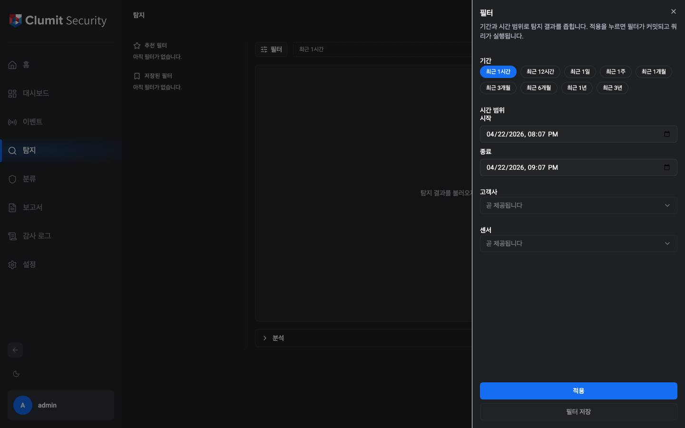
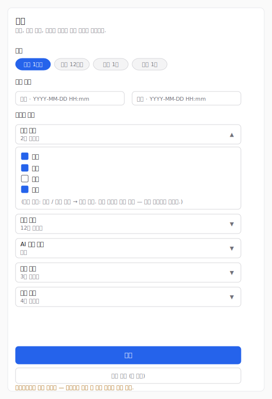
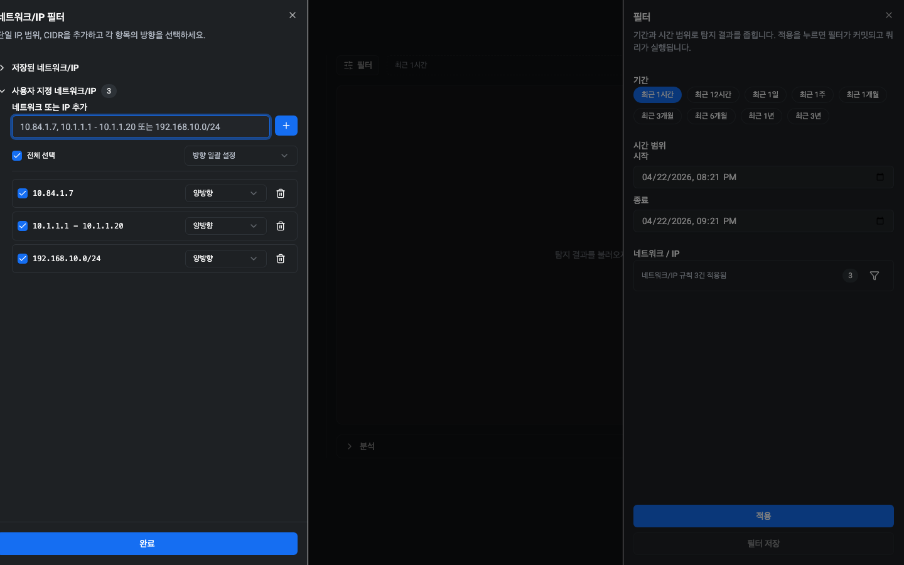
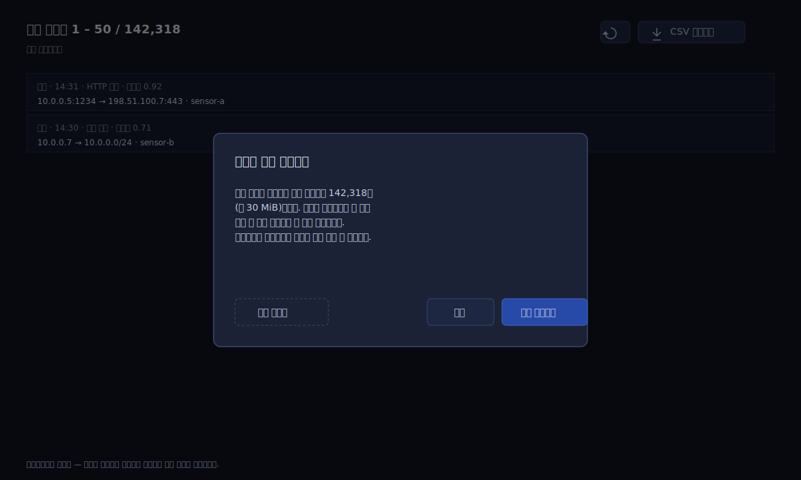

# 탐지

탐지 페이지는 사이드바에서 접근합니다. 백엔드에서 생성된 탐지 결과를
필터링하고 검토하며 개별 항목을 자세히 살펴보는 허브입니다.

페이지 조회에는 `detection:read` 권한이 필요합니다. 기본 제공 역할인
Security Monitor, Tenant Administrator, System Administrator는 이
권한을 기본으로 부여받습니다. `detection:read`를 부여한 사용자 정의
역할도 접근할 수 있습니다.

!!! note "와이어프레임 대체 이미지"

    위 페이지 일러스트는 실제 캡처가 아닌 SVG 와이어프레임입니다. 탐지
    페이지의 결과 카운트는 REview 쿼리 결과를 실시간으로 렌더링하며,
    현재 매뉴얼 작업용 워크트리에는 시드 데이터가 포함된 스테이징
    백엔드가 없기 때문에 PNG를 캡처하면
    `탐지 결과를 불러오지 못했습니다.` 오류 상태가 찍히게 됩니다.
    `docs/AUTHORING.md`의 "인프라 의존 기능에 대한 스크린샷 예외"
    규정에 따라 이 페이지는 언어별 SVG 와이어프레임을 제공하며,
    샘플 데이터가 포함된 스테이징 환경이 준비되는 대로 실제
    스크린샷으로 교체됩니다. 아래 필터 드로어 캡처는 실제 PNG로,
    드로어는 클라이언트 렌더링이라 백엔드 데이터에 의존하지 않습니다.

## 레이아웃

페이지는 네 개의 영역으로 구성됩니다. 결과(Results) 영역이 작업
공간의 중심이며, 보조 영역은 결과에 집중할 수 있도록 간결하게
유지됩니다.

### 추천 / 저장된 필터 레일

왼쪽의 슬림 레일은 두 섹션으로 구성됩니다.

- **추천 필터** — 선별된 시작점.
- **저장된 필터** — 사용자가 직접 저장한 필터.

좁은 뷰포트에서는 레일이 아이콘만 표시되도록 축소되고, 데스크톱
너비에서는 섹션 제목이 함께 나타납니다.

### 탭 바

모든 Detection 세션은 하나 이상의 **탭**으로 구성됩니다. 각 탭은
자체 필터, 결과 슬라이스, 드로어 초안, UI 상태(분석 스트립 확장,
Quick peek 선택)를 갖고 있으므로, 여러 조사 흐름을 한 번에
유지한 채 컨텍스트를 잃지 않고 빠르게 전환할 수 있습니다.

!!! note "와이어프레임 스탠드인"

    위의 탭 바 그림은 실제 캡처가 아닌 SVG 와이어프레임입니다.
    탭 바는 필터 칩 바 위에 위치하며, 라이브 REview 쿼리 결과와
    함께 렌더링됩니다. 본 작업 트리에는 시드 데이터가 포함된
    스테이징 백엔드가 없어 실제 PNG로 캡처할 경우 결과 목록이
    비어 있는 상태가 보입니다. `docs/AUTHORING.md`의
    "인프라 의존 기능의 스크린샷 예외" 규정에 따라 이 섹션은
    로컬라이즈된 SVG 와이어프레임으로 배포되며, 스테이징
    환경이 준비되면 실제 스크린샷으로 대체됩니다.

#### 탭 만들기

페이지 진입 시 Detection은 **최근 1시간** 필터로 **기본 탭**
하나를 만들고 자동 실행하므로, 첫 화면이 비어 있지 않습니다.

- 탭 바 오른쪽의 `+` 어포던스는 동일한 기본 필터로 새 탭을
  만들지만 **자동 실행하지 않습니다**. 새 탭은 "필터를 만들어
  시작하세요" 상태로 열리고, 사용자가 Apply를 눌러야 결과가
  채워집니다.
- 저장된/추천 필터 활성화(추후 Detection 단계)나 피벗 링크
  이동(Phase Detection-12)도 현재 탭을 덮어쓰는 대신 대상
  필터로 사전 구성된 새 탭을 만듭니다.

탭 개수 상한은 **동시 8개**입니다. 상한에 도달하면 `+` 버튼이
비활성화되고, 기존 탭을 먼저 닫아야 한다는 툴팁이 표시됩니다.

#### 탭 전환

탭을 클릭하면 즉시 활성화됩니다. 필터 드로어와 활성 칩 바는
선택한 탭의 필터로 다시 동기화되고, 결과 목록에는 그 탭의
캐시된 결과가 표시됩니다. 탭 전환은 **네트워크를 호출하지
않습니다** — 보이는 결과는 해당 탭에서 마지막으로 가져온 것과
동일합니다. 결과 헤더의 **새로고침** 버튼을 누르거나 드로어를
다시 열어 Apply하면 쿼리를 다시 실행할 수 있습니다.

**Apply는 활성 탭에만** 영향을 미칩니다. 각 탭은 독립적인 결과
슬라이스를 갖습니다.

#### 탭 닫기

각 탭에는 호버 시 `×` 닫기 버튼이 나타납니다. 활성 탭을 닫으면
오른쪽 이웃 탭이 활성화되고(맨 오른쪽 탭이었다면 왼쪽 이웃),
마지막 탭을 닫으면 작업 공간이 비지 않도록 기본 탭이 새로
만들어집니다. 새로 만들어진 탭은 `+`와 마찬가지로 사전 쿼리 빈
상태로 열리므로, Apply를 눌러 쿼리를 실행해야 결과가 채워집니다.

#### 탭 이름

탭 이름은 탭의 필터 요약에서 자동 생성됩니다. 첫 두 칩의 값을
가운뎃점으로 연결한 짧은 라벨로(예: `최근 1시간 · 높음`) 필터가
바뀌면 이름도 따라 업데이트되어, 탭 바를 훑어보며 각 탭을 바로
구분할 수 있습니다.

탭 라벨을 더블 클릭(또는 `Enter`)하면 이름을 수정할 수 있습니다.
`Enter`로 저장하거나 `Esc`로 취소하세요. 수동으로 이름을 지정한
탭에는 작은 **이름 초기화** 어포던스가 나타납니다 — 클릭하면
수동 오버라이드가 해제되고 자동 라벨이 다시 적용됩니다. 수동
이름은 필터 수정에도 유지되므로, 뒤의 필터가 바뀌어도 지정한
이름은 그대로 유지됩니다.

#### 새로고침 표시

활성 탭의 결과 헤더에는 **N 전 업데이트됨** 상대 시간이 표시되며,
그 옆에 **새로고침** 버튼이 있습니다. 이 표시는 탭별로 독립적
입니다 — 비활성 탭도 다시 활성화될 때까지 자체 `업데이트됨`
타임스탬프와 새로고침 상태를 유지합니다.

#### 새로고침 시 유지되는 상태

브라우저 새로고침이나 실수로 이동해도 탭 상태가 보존됩니다.

- **URL 검색 파라미터**는 **활성 탭의 필터**와 페이지네이션
  (공유 가능한 표면)을 담습니다. `?tab=<id>` 파라미터가 어느
  탭이 활성인지 고정하고, 링크 수신자는 해당 탭 하나를
  부트스트랩 탭으로 엽니다. URL에는 다른 탭 정보가 담기지
  않습니다 — 그 외 탭은 세션 전용 상태입니다.
- **`sessionStorage`** 는 나머지 — 전체 탭 목록(필터, 이름,
  수동 이름 여부, 엔드포인트, 페이지네이션, 드로어 초안, 분석
  스트립 확장 여부) — 를 담습니다. 덕분에 새로고침 후에도
  열려 있던 모든 탭이 복원됩니다. 이벤트 캐시는 저장되지
  않으며, 비활성 탭은 새로고침 후 사전 쿼리 빈 상태로
  돌아오므로 Apply / 새로고침을 눌러 다시 채워야 합니다.

공유 가능한 URL 상태가 세션 전용 상태보다 좁기 때문에, 이
구분은 영속화 모듈의 주석에도 기록되어 있어 후속 기여자가 각
저장소의 계약을 명확히 구분해서 이해할 수 있습니다.

### 상단 바

메인 영역 상단에는 **필터** 버튼과 활성 필터 칩 바가 있습니다.
**필터** 버튼을 클릭하면 오른쪽에 필터 드로어가 열리고, 그 옆의 칩
바는 현재 탭에 적용된 필터를 요약해 보여 줍니다.

칩 바는 공유 헬퍼 `summarizeFilter(filter: Filter)` 하나로
만들어집니다. 그래서 활성 칩 바와 향후 파생될 모든 칩 렌더링
지점이 동일한 집계 규칙을 따릅니다.

- 커밋된 기간(또는 명시적 시간 범위)은 `기간: …` 칩으로
  표시되며 다른 필터와 같이 `×`로 제거할 수 있습니다.
- 단일 값 필드(`출발지`, `목적지`)는 값 하나가 담긴 칩 하나로
  표시됩니다(예: `출발지: 10.0.0.5`).
- 태그 필드 값이 **1–3개**일 때는 값마다 칩이 한 개씩 표시됩니다.
- 태그 필드 값이 **3개를 초과**하면 카운트 토큰 하나로 축약됩니다
  (예: `키워드: 12`). 카운트 칩을 클릭하면 드로어가 다시 열려
  해당 목록을 편집할 수 있습니다.
- 방향, 신뢰도, 센서, 그리고 모든 범주형 다중 선택(위협 레벨 /
  국가 / AI 모델 유형 / 위협 분류 / 위협 이름)은 동일한 ≤ 3 /
  집계 규칙을 따릅니다.

향후 검색 쿼리 필터 모드(`Filter.mode === "query"`)가 활성화
되면 공유 헬퍼는 칩을 하나도 반환하지 않으며, 칩 바 대신 쿼리
문자열을 편집 가능한 단일 pill로 렌더링합니다. 쿼리 언어는
구조화된 칩이 표현할 수 없는 OR / NOT / 정규식을 포함할 수
있으므로, v1에서는 쿼리 모드 필터의 필드별 분해를 시도하지
않습니다. pill의 쿼리 에디터는 이후 단계에서 제공됩니다.

모든 칩에는 `×` 버튼이 함께 표시됩니다. `×`를 누르면 그 자체가
하나의 커밋이 됩니다. 해당 필드가 즉시 활성 필터에서 제거되고,
쿼리가 다시 실행되며, 칩이 사라집니다. 집계 칩(예: `호스트명: 7`)
의 `×`는 필드 전체를 지웁니다. 단일 값 제거는 원자적이고 명시적
이므로 드로어의 Apply 중심 모델과 충돌하지 않습니다 — Apply는
여러 필드를 묶어 한 번에 적용하기 위해 존재합니다. 칩 본문(× 외
영역)을 활성화하면 해당 섹션이 스크롤된 상태로 필터 드로어가
열립니다(텍스트/태그 칩은 입력에 포커스가 맞춰지고, 기간 / 방향
/ 신뢰도 / 센서 / 네트워크·IP / 범주형 칩은 해당 섹션이 화면에
나타나도록 스크롤됩니다). 그 상태에서 값을 수정한 뒤 다시
적용할 수 있습니다.

태그 필드와 `출발지` / `목적지` 값은 URL에 쉼표로 구분된 값으로
저장됩니다(`?keywords=alpha,beta`). 새로고침 시 이러한 자유
입력 필드는 복원되며, 모든 값을 지우면 해당 파라미터가 URL에서
제거됩니다. 시간 범위는 URL에 저장되지 않으므로 새로고침 시
기본 기간으로 되돌아갑니다.

### 결과

결과 영역은 메인 작업 영역의 **히어로**입니다. 지원하는 모든
너비에서 화면의 가장 큰 부분을 차지합니다. 페이지에 진입하면
기본 필터(**최근 1시간**)로 쿼리가 자동 실행되어 결과 영역이
비어 있는 상태로 남지 않습니다.

#### 헤더 줄

리스트 위의 단일 헤더 줄에는 다음이 표시됩니다.

- 결과 수와 시간 범위
  (`탐지 이벤트 <범위> / <전체수>`). 전체 카운트는 64비트
  안전합니다 — REview는 정밀도 손실을 피하기 위해 문자열로
  반환하며, UI는 그대로 표시합니다.
- **N분 전 업데이트** 라벨이 백그라운드에서 자동 갱신되어
  현재 화면이 얼마나 오래된 결과인지 알려줍니다.
- **새로고침** 버튼은 드로어를 거치지 않고 활성 필터를 다시
  실행합니다.
- **CSV 내보내기** 버튼은 활성 탭의 필터링된 결과를 CSV 파일로
  내보냅니다. 컬럼 구성, 파일명, 대용량 내보내기 확인 절차는
  아래 [CSV 내보내기](#csv-내보내기) 섹션을 참고하세요.

#### 결과 행

각 탐지 이벤트는 두 줄짜리 항목으로 표시됩니다.

- **첫 번째 줄** — 심각도 배지(낮음 / 중간 / 높음), 이벤트
  시간(로캘 적용), 이벤트 종류(예: `HTTP 위협`), ML 서브타입의
  선택적 공격 종류, 위협 분류, 탐지 신뢰도 점수, 트리아지 점수가
  있을 때의 트리아지 요약(최대 점수 + 정책 수)이 표시됩니다.
- **두 번째 줄** — `출발지 → 목적지` 형식의 엔드포인트가
  `IP[:포트] (국가)` 형태로, 그 다음에 센서 이름이 표시됩니다.
  출발지 또는 목적지가 배열인 서브타입은 첫 항목과 `+N개 더`
  버튼을 함께 표시합니다. 버튼을 클릭하면 숨겨진 모든 IP 또는
  포트를 나열하는 인라인 팝오버가 열립니다.

심각도, 시간, 종류는 모든 이벤트 서브타입에서 표시됩니다.
출발지 IP+포트와 목적지 IP+포트는 벤더된 스키마가 네트워크 측
필드로 노출하는 모든 서브타입에서 표시됩니다 — 호스트/에이전트
측 서브타입 두 가지(`ExtraThreat`, `WindowsThreat`)는 주소 필드를
전혀 제공하지 않아 출발지 → 목적지 줄이 통째로 생략됩니다(아래
스키마 제한 안내 참고). 좁은 화면에서는 행이 더 빽빽해지고
(국가 라벨 축약, 공격 종류 잘림 + 툴팁, 공격 종류 / 분류 /
신뢰도 / 트리아지 요약 등 보조 라벨 숨김), 가장 좁은 화면에서는
출발지와 목적지가 세로로 쌓입니다. 출발지 → 목적지 줄이
렌더링될 때에는 목적지와 심각도 표시는 절대 숨겨지지 않습니다.

#### 빈 상태, 로딩, 오류 상태

결과 영역은 준비되지 않은 상태마다 별도의 패널을 사용합니다.

- **로딩** — 활성 필터가 실행되는 동안 스피너와 함께
  `쿼리 실행 중…`이 표시됩니다.
- **오류** — `탐지 결과를 불러오지 못했습니다`와 짧은 안내,
  인라인 **다시 시도** 버튼이 표시됩니다. 일시적 오류 시
  드로어를 다시 열 필요가 없습니다.
- **일치하는 결과 없음** — 쿼리는 성공했지만 0건이 반환된
  경우 표시됩니다. 필터를 완화하거나 시간 범위를 더 넓게
  잡도록 안내합니다.
- **필터를 구성해 시작하세요** — 새 탭이거나 필터가 완전히
  비워진 드물게 발생하는 사전 쿼리 빈 상태입니다. 드로어를
  여는 버튼이 함께 제공됩니다.

#### 행 상호작용

행 본문을 클릭하면 **간단 미리보기** 인스펙터가 열립니다
(아래의 전용 섹션 참고). 행 끝의 `›` 아이콘은 간단 미리보기를
건너뛰고 바로 **조사 보기**를 엽니다. 조사 보기로의 이동은
로캘을 존중하며, 뒤로 가기가 활성 필터의 칩 상태까지 포함해
원래 Detection 탭으로 돌아가도록 `returnTo` URL 파라미터를
함께 전달합니다.

벤더된 스키마의 두 서브타입 — `ExtraThreat`와 `WindowsThreat`
— 은 호스트/에이전트 측 위협을 모델링하므로 네트워크 주소
정보를 전혀 제공하지 않습니다. 이 행들은 출발지 → 목적지
줄이 생략되고 심각도, 시간, 종류, 신뢰도, 트리아지 요약,
센서는 정상적으로 표시됩니다. 한쪽 또는 포트 한쪽만 제공하는
서브타입(예: 응답자 측 배열만 제공하는
`UnusualDestinationPattern`, 출발지 포트가 없는
`RdpBruteForce`)의 경우 해당 슬롯은 `—`로 대체됩니다.

어떤 행이든 선택하면 간단 미리보기 인스펙터가 열립니다.
인코딩 불가능한 스키마 제약 서브타입(`ExtraThreat`,
`WindowsThreat`, 또는 출발지와 목적지 IP가 모두 없는 행)도
스키마가 제공하는 필드를 인스펙터에서 그대로 확인할 수
있습니다. 조사 보기 화살표만 이 행들에서 숨겨지는데, 이는
조사 페이지가 로케이터 토큰을 필요로 하기 때문입니다 — 간단
미리보기 자체는 계속 사용할 수 있습니다. 이런 선택은 토큰이
인코딩되지 않아 URL 미러에서 제외되므로, 새로고침이나 공유
링크로 복원되는 것은 로케이터로 왕복 가능한 선택뿐입니다.

## 간단 미리보기 인스펙터

행을 선택하면 **간단 미리보기** 인스펙터가 열립니다. 결과
목록의 문맥을 벗어나지 않으면서 이벤트의 가장 중요한 정보를
요약해 보여주는 패널입니다.

!!! note "와이어프레임 대체 이미지"

    위 그림은 실제 캡처가 아닌 SVG 와이어프레임입니다. 간단
    미리보기는 REview가 반환한 실제 탐지 이벤트를 읽어 내용을
    구성하지만, 작성 환경의 워크트리에는 샘플 데이터가 심어진
    스테이징 백엔드가 없습니다. `docs/AUTHORING.md`의
    "인프라에 의존하는 기능을 위한 예외" 규정에 따라 현재는
    로캘별 SVG 와이어프레임을 제공하며, 스테이징이 준비되면
    실제 캡처로 교체합니다.

### 반응형 배치

- **넓은 뷰포트(≥ 1280 px)**: 간단 미리보기는 결과 목록
  오른쪽에 인라인 **인스펙터 패널**로 도킹됩니다. 결과 목록은
  폭이 줄어 인스펙터와 나란히 표시됩니다.
- **좁은 뷰포트**: 간단 미리보기는 결과 목록 위에 뜨는
  **오버레이 드로어**로 표시됩니다. 목록은 원래 너비를 유지해
  좁은 화면에서 억지로 두 열을 맞추려 하지 않습니다.

브레이크포인트는 페이지의 슬림 레일 브레이크포인트와 동일하게
맞춰져 있습니다.

### 닫기

간단 미리보기는 닫기 어포던스(데스크톱의 인라인 Close 버튼
또는 오버레이 Sheet가 제공하는 닫기 버튼), `Escape` 키,
또는 다른 행을 선택하는 것으로 닫을 수 있습니다 — 다른 행을
누르면 기존 미리보기의 내용이 교체될 뿐 또 하나의 인스펙터가
열리지 않습니다. 또한 커밋된 쿼리 전환(적용, 칩 제거,
새로고침)이 디스패치되는 순간 즉시 닫혀, 왕복 중에 인스펙터가
새로 커밋된 필터가 더 이상 반환하지 않는 행을 가리키는 상황이
생기지 않습니다.

### 내용

인스펙터는 이벤트의 핵심 정보를 짧은 섹션으로 묶어 보여
줍니다. 비어 있는 필드는 `(Not Provided)` 같은 자리표시자
대신 **숨김** 처리됩니다. 그래서 해당 서브타입이 특정 필드를
제공하지 않는 경우 인스펙터는 단순히 그 행을 생략합니다.

- **요약** — 위협 수준, 위협 분류, 탐지 신뢰도, 그리고 트리아지
  점수가 있는 경우 요약(최고 점수와 정책 수).
- **엔드포인트** — 출발지와 목적지. 각각 `IP[:포트] (국가)`
  형식으로 표시됩니다. 국가 라벨은 비활성 텍스트입니다 —
  이슈의 **피벗 어포던스** 항목에 따라 국가 피벗은 v1 범위
  밖이기 때문입니다. 센티넬 코드(`??`, `—`)는 각각
  `location unknown` / `location unavailable`를 의미합니다.
  배열형 엔드포인트 — `origAddrs` (`ExternalDdos`),
  `respAddrs` (`MultiHostPortScan`, `RdpBruteForce`,
  `UnusualDestinationPattern`), `respPorts` (`PortScan`) —
  는 최대 3개까지 인라인으로 표시되고 나머지는 `+N more`
  버튼으로 요약됩니다. 인라인으로 표시되는 각 튜플은
  항목별 국가 라벨을 그대로 유지하므로(예: 네 개의 호스트가
  잡힌 `MultiHostPortScan`에서는 세 개의 호스트 옆에 각기
  다른 국가 플래그가 함께 표시됩니다) 첫 항목 이후의 국가가
  누락되지 않습니다. `PortScan` 형태(공유 목적지 IP + 포트
  배열)에서는 공유 IP와 국가가 각 인라인 튜플에 보충되어
  포트만 노출되지 않고 `IP:포트 (국가)` 형식이 유지됩니다.
  `+N more` 버튼을 누르면 인라인 팝오버가 열려 남은 튜플도
  같은 형식으로 확인할 수 있습니다. 팝오버는 외부 클릭이나
  `Escape` 키로 닫히며 결과 목록과 동일한 컨트롤을 사용합니다.
  팝오버가 열린 상태에서 누른 `Escape`는 팝오버만 닫고,
  감싸고 있는 간단 미리보기 인스펙터는 그대로 유지되어 이어지는
  `Escape`로 닫힙니다.
  각 인라인 IP 옆의 작은 클립보드 아이콘을 누르면 해당 값이
  클립보드로 복사됩니다. `+N more` 팝오버 안의 각 항목에도
  같은 복사 아이콘이 유지되어, 4번째 이후 오버플로된 응답자
  IP도 한 번의 클릭으로 클립보드에 담을 수 있습니다. 팝오버
  내부의 복사 버튼은 화면에 보이는 `IP:포트 (국가)` 문자열이
  아니라 순수한 IP를 복사하므로 다른 도구에 그대로 붙여 넣을
  수 있습니다.
- **탐지 정보** — 이벤트를 만든 센서, ML 서브타입의
  `attackKind`(있을 때), 그리고 ML 위협 타입의
  `learningMethod`(비지도 / 준지도).
- **프로토콜** — 한눈에 보기 좋은 서브타입별 주요 필드.
  서브타입당 10개 미만으로 유지하고, 나머지는 조사 보기에
  남겨 둡니다. 현재 노출되는 필드에는 HTTP 계열
  (`HttpThreat`, `BlocklistHttp`)의 메서드 / 호스트 / URI /
  상태 코드, DNS 계열(`DnsCovertChannel`, `BlocklistDns`)의
  쿼리 / 타입 / 응답 코드, TLS 계열
  (`SuspiciousTlsTraffic`, `BlocklistTls`)의 서버 이름 /
  버전 / JA3, `FtpBruteForce`의 사용자 목록 / 내부 플래그 및
  탐지 구간, 그리고 `RdpBruteForce`, `PortScan`,
  `MultiHostPortScan`, `ExternalDdos`의 탐지 구간이 포함됩니다.
  하이라이트가 정의되지 않은 서브타입은 프로토콜 섹션을
  표시하지 않습니다. 호스트, URI, DNS 쿼리, JA3, 사용자
  식별자처럼 검색에 자주 쓰이는 값에는 호버 시 드러나는 복사
  아이콘이 함께 표시되어 한 줄짜리 리터럴을 클립보드로 바로
  옮길 수 있습니다. `userList`처럼 배열로 표시되는 식별자는
  `+N more` 팝오버 안에서도 복사 아이콘이 유지되어 4번째
  이후의 항목도 한 번의 클릭으로 클립보드에 담을 수 있습니다.
- **동작**:
  - **전체 조사 열기**는 조사 보기(`/events/<eventToken>`)로
    이동합니다. 실제 앵커 태그이므로 **가운데 클릭** 또는
    **Cmd/Ctrl-클릭**으로 새 탭에서 열면 현재 Detection
    탭의 필터와 미리보기 상태를 그대로 둔 채 전체 페이지를
    별도 탭에서 열 수 있습니다. 인코딩 가능한 로케이터가
    없는 서브타입(`ExtraThreat`, `WindowsThreat` 등)에서는
    링크가 **비활성화되지 않고 아예 표시되지 않습니다** —
    유효한 조사 페이지로 이어지지 않기 때문입니다.
  - **피벗 링크** — `동일한 출발지 IP · 최근 24시간`,
    `동일한 목적지 IP · 최근 24시간`,
    `동일한 종류 · 최근 7일` — 역시 `/detection?…` 페이지로
    연결되는 실제 앵커 태그이므로 가운데 클릭으로 새 탭에서
    열 수 있습니다. 이벤트에 존재하지 않는 피벗 대상(예:
    응답만 있는 서브타입의 출발지 IP)은 죽은 컨트롤로
    렌더되지 않고 목록에서 생략됩니다.

### 선택된 이벤트의 URL 상태

선택된 이벤트의 로케이터 토큰(조사 보기가 사용하는 것과 동일한
base64url 토큰)은 탭의 URL에 `event` 쿼리 파라미터로
저장됩니다. 페이지 새로 고침이나 공유 링크는 같은 행에서
미리보기를 복원합니다 — 현재 결과 슬라이스에 해당 토큰과
일치하는 이벤트가 여전히 존재하는 경우에 한합니다. 복원
시점에 해당 이벤트가 슬라이스에 없으면(페이지네이션 이동,
필터 축소, 보존 기간 초과 등) 토큰은 URL에서 조용히 제거되고
미리보기는 열리지 않은 상태로 유지됩니다 — 임의의 행을
붙잡지 않습니다. 새로고침을 클릭하거나 새 쿼리를 실행하면
`event` 파라미터가 URL에서 제거되어 이어지는 새로고침은
오래된 선택을 되살리지 않고 깨끗한 상태에서 시작합니다.
URL 쓰기는 `history.replaceState`를 사용하므로 뒤로 가기가
미리보기를 되감지 않으며, 클릭마다 내비게이션 항목이 쌓이지도
않습니다.

한 번에 하나의 이벤트만 선택됩니다. 다른 행을 선택하면 URL의
토큰이 교체되어 미리보기가 중첩되지 않습니다. 로케이터로
인코딩되지 않는 이벤트(`ExtraThreat`, `WindowsThreat`, 또는
출발지와 목적지 IP가 모두 없는 행)의 행을 선택하면 간단
미리보기는 열리지만 URL의 `event` 파라미터는 그 선택에서
제거됩니다 — 현재 탭에서만 유효하고 새로고침이나 공유 링크로는
복원되지 않습니다.

#### 페이지네이션

결과 목록 바로 아래에는 Gmail 스타일의 페이지네이터가 자리합니다.
왼쪽부터 페이지당 행 수 선택기, 로케일에 맞춰 자릿수 구분자가 적용된
범위와 전체 건수 표시(`1,453개 중 1–50`), **처음** / **이전** / 현재
페이지 표기 / **다음** / **마지막** 컨트롤, 그리고 드물게 사용하는
**페이지 이동** 입력과 이동 버튼 순으로 배치됩니다.

!!! note "와이어프레임 대체"

    위 그림은 실제 캡처가 아닌 SVG 와이어프레임입니다. 페이지네이터의
    건수는 REview의 라이브 쿼리에서 가져오는데, 저술 환경에는 탐지
    데이터가 시드된 스테이징 백엔드가 없기 때문에 `docs/AUTHORING.md`의
    "인프라 제약 기능의 스크린샷 예외" 규정에 따라 각 언어별 SVG
    와이어프레임을 동봉하고, 실제 데이터가 확보되면 PNG 캡처로 교체
    합니다.

- **페이지당 행**은 `25`, `50`, `100`, `200` 중에서 고를 수 있으며
  기본값은 `50`입니다. 페이지 크기를 바꾸면 현재 창의 시작 근처가
  유지되도록 이동합니다. 예를 들어 `50/페이지`의 3페이지(101–150행)
  에서 `100/페이지`로 바꾸면 1페이지로 되돌아가지 않고 2페이지
  (101–200행)로 이동합니다. REview의 커서는 페이지 크기에 종속적이기
  때문에 실제로는 새 크기로 머리부터 앞으로 걸어가는 방식으로 구현
  되어 있어, 깊은 창일수록 페이지 수만큼 요청이 발생합니다.
- **범위 표시**는 합계와 페이지 경계를 로케일 자릿수 구분으로
  포맷합니다(예: `1,453개 중 1–50`). 합계는 BigInt에 안전합니다 —
  REview는 합계를 문자열로 반환하고 UI는 그 정밀도를 끝까지 보존하므로,
  `2^53`을 넘는 건수도 반올림 없이 표시됩니다.
- **처음 / 이전 / 다음 / 마지막** 버튼은 인접한 페이지 창을 이동합니다.
  **처음**은 `first: pageSize`를 사용합니다. **이전**과 **다음**은 현재
  페이지의 `startCursor` / `endCursor`를 이용해 한 창씩 이동합니다.
  **마지막**은 합계를 알고 있을 때 마지막 부분 페이지의 실제 행 수로
  요청을 좁힙니다. 예를 들어 100/페이지에서 1,453행이면 `last: 53`을
  요청하여 `15 페이지 중 15` 라벨과 함께 1,401–1,453행이 나타나도록
  하며, Relay 스펙이 기본으로 반환하는 1,354–1,453의 걸친 창을 피합니다.
  현재 창이 로드된 뒤 합계가 드리프트한 경우(예: 배경에서 새 이벤트가
  도착) 페이지네이터는 응답에 포함된 최신 `totalCount`로 한 번 더
  재질의하여 행, 페이지 라벨, 범위 표시가 모두 같은 최신 합계를 반영
  하도록 보정합니다. 경계에 도달하면 해당 버튼은 자동으로 비활성화
  됩니다.
- **페이지 이동** 입력은 명시적인 페이지 번호로 점프합니다. 입력은
  양의 정수만 허용하며, 지수 표기(`1e3`) · 소수 · 부호 있는 값은
  거부되어 입력한 그대로 이동합니다. 목표가 1 또는 마지막 페이지가
  아닐 경우 입력은 커서를 한 번에 한 요청씩 앞으로 걸어가며, 예를
  들어 1페이지에서 50페이지로 이동하려면 49번의 순차 요청이 필요
  합니다 — Relay 커서에는 O(1) 점프가 없기 때문입니다. 이동 중에는
  입력 아래에 `이동 중… M 중 N 페이지` 같은 안내가 나타나 작업이
  멈춘 것이 아님을 알려줍니다. 계산된 전체 페이지 수를 넘어선 목표
  값은 무한히 걸어가지 않고 마지막 페이지로 제한되며, 이때 **마지막**
  버튼과 동일하게 부분 최종 페이지 보정과 드리프트 재질의가 적용
  됩니다.

탭별 페이지네이션 상태 — 페이지 크기, 페이지 번호, 앵커 커서 — 는
필터와 함께 URL에 직렬화됩니다. 페이지를 새로 고치거나 URL을
공유하면 보고 있던 정확한 슬라이스가 복원됩니다. 새 필터를 적용하거나
칩을 제거하면 앵커는 새 컬렉션의 머리로 초기화됩니다. 커서는 커밋된
하나의 필터에 범위가 한정되어 있기 때문에 필터를 가로질러 커서를
가져가면 오래된 위치를 가리키게 됩니다.

### 분석 스트립

결과 아래에는 현재 결과 집합의 집계 정보를 위한 분석 스트립이
마련되어 있습니다. 기본적으로 접혀 있으며, 이번 단계에서는 `▸`
버튼을 클릭하면 비어 있는 플레이스홀더 패널이 나타납니다.

## 필터 드로어

필터 드로어는 조회할 탐지 이벤트의 시간 창을 지정하는 곳입니다.
상단 바의 **필터** 버튼으로 열면 오른쪽에서 슬라이드되어
나타납니다.

### 기간

**기간** 섹션은 흔히 쓰는 상대 시간 창을 칩으로 제공합니다:
`최근 1시간`, `최근 12시간`, `최근 1일`, `최근 1주`, `최근 1개월`,
`최근 3개월`, `최근 6개월`, `최근 1년`, `최근 3년`. 칩을 선택하면
해당 창의 시작과 끝이 **시간 범위** 입력에 채워집니다.

### 시간 범위

두 개의 `datetime-local` 입력으로 시작과 종료 시각을 명시적으로
지정할 수 있습니다. 어느 한쪽이라도 편집하면 기간 칩 선택이
해제됩니다. 사용자가 직접 편집한 범위는 더 이상 퀵 셀렉트
창이 아니기 때문입니다.

### 방향

**방향** 섹션은 백엔드의 `FlowKind` 값에 대응하는 3지선다 다중
선택입니다.

- `내부 → 외부` (아웃바운드 트래픽)
- `내부 → 내부` (내부 트래픽)
- `외부 → 내부` (인바운드 트래픽)

기본값으로 세 가지가 모두 선택되어 있으며, 이는 "필터 없음"과
동일합니다. 이 경우 제출되는 필터에서 `directions` 항목은
생략됩니다. 특정 방향을 제외하려면 해당 칩을 해제하면 됩니다.
드로어는 선택 집합이 비어 있는 상태를 허용하지 않으며, 마지막으로
남은 항목을 해제하려고 하면 조용히 세 가지가 모두 선택된 상태로
되돌아갑니다. 모든 항목을 해제하면 "결과 없음"을 의미하기
때문입니다.

세 개 미만이 선택된 상태에서는 활성 필터 칩 바에 선택된 방향별로
칩이 하나씩 표시됩니다(예: `방향: 외부 → 내부`,
`방향: 내부 → 내부`).

### 신뢰도

**신뢰도** 섹션은 탐지 점수가 `[min, max]` 범위에 속하는
이벤트로 결과를 좁힙니다. 범위는 `0.00`–`1.00`이고 소수점 두
자리 정밀도를 사용합니다. 포커스된 입력에서 방향키는 `0.01`씩
값을 조정하며, `Home`은 해당 입력의 하한(최소 입력은 `0.00`,
최대 입력은 현재 최소값)으로, `End`는 해당 입력의 상한(최소
입력은 현재 최대값, 최대 입력은 `1.00`)으로 이동시킵니다.

두 입력은 역전된 범위를 만들어낼 수 없습니다. 현재 최대값을
넘는 최소값을 입력하면 최대값이 함께 올라가고, 그 반대도
마찬가지입니다. 두 입력을 `0.00` / `1.00`에 둔 상태가 "필터
없음" 기본값이며 이 경우 `confidenceMin` / `confidenceMax`는
전송되는 필터에서 제외됩니다. 기본값이 아닌 범위로 설정하면
활성 필터 바에 `신뢰도 0.70 – 1.00` 같은 단일 칩이 표시됩니다.

### 고객사

**고객사**는 **곧 제공됩니다**로 표시된 비활성 자리표시자입니다.
고객사 범위 지정은 현재도 자동으로 적용되어 계정이 접근 가능한
고객사의 결과만 표시되지만, UI에서 고객사 일부만 선택하는
기능은 이후 고객사 디렉터리와 함께 제공됩니다. 이 필드는 필터와
함께 전송되지 않으며 칩 바에도 표시되지 않습니다.

### 센서

**센서**는 접근 가능한 고객사에 대해 탐지 백엔드가 보유한 센서
인벤토리를 기반으로 하는 다중 선택 컨트롤입니다. 컨트롤을 펼치면
검색 입력, **전체 / 선택 해제** 토글, 스크롤 가능한 센서 목록이
나타나며 선택한 센서는 컨트롤 바로 아래에 제거 가능한 칩으로도
표시됩니다.

필터를 적용하면 선택된 센서 ID가 전송되고 페이지 상단의 활성 칩
바에 반영됩니다. 1~3개 선택 시에는 센서별로 개별 칩이
표시되며, 4개 이상을 선택하면 바가 예기치 않게 줄바꿈되지 않도록
`센서: N개 선택됨`과 같은 단일 집계 토큰으로 축약됩니다.

연결된 탐지 백엔드가 아직 센서 목록 엔드포인트를 제공하지 않는
전환기 빌드에서는 센서 컨트롤이 고객사와 동일한 **곧 제공됩니다**
비활성 상태로 대체되고 필터에도 포함되지 않습니다. 이 대체
상태는 과도기에만 보이며 백엔드가 엔드포인트를 제공하면 별도
수정 없이 자동으로 활성화됩니다.

드로어를 처음 열어 센서 목록을 가져오는 동안에는 **곧 제공됩니다**
대신 **센서 목록을 불러오는 중…** 안내가 표시되어 엔드포인트
부재 상태와 혼동되지 않습니다. 일시적인 요청 실패 시에는 **센서
목록을 불러오지 못했습니다** 메시지와 함께 **다시 시도** 버튼이
노출되며, 드로어를 닫았다 다시 열지 않고도 한 번의 클릭으로
재요청할 수 있습니다.

### 출발지, 목적지, 사용자 속성

센서 컨트롤 아래에는 자유 형식 문자열로 쿼리를 좁히는 전용 **속성**
섹션이 있습니다.

- **출발지**와 **목적지**는 단일 값 텍스트 입력입니다. 활성 필터는
  한 번에 하나의 출발지 문자열과 하나의 목적지 문자열만 가집니다.
  여기서는 관대한 검증만 수행합니다. 형식이 잘못된 값은 백엔드가
  거부하므로 REview가 허용하는 값이면 무엇이든 입력할 수 있습니다.
- **키워드**, **호스트명**, **사용자 ID**, **사용자 이름**,
  **사용자 부서**는 태그 입력입니다. `Enter`를 누르거나 쉼표를
  입력하면 현재 항목이 칩으로 커밋되고, 비어 있는 입력에서
  `Backspace`를 누르면 가장 최근 태그가 제거됩니다. 쉼표 또는
  줄바꿈으로 구분된 목록을 붙여 넣으면 여러 값을 한 번에 추가할 수
  있습니다. 값은 자동으로 앞뒤 공백이 제거되고 중복이 제거됩니다.

어떤 필드에서 모든 태그를 지우면 제출되는 필터에서 해당 필드가
완전히 제외됩니다. 적용 시 자유 형식 필드는 URL에도 반영되어
새로 고침 후에도 활성 탭의 필터 상태가 유지됩니다.

### 범주형 필터

시간 범위 아래의 **범주형 필터** 섹션은 이벤트별 차원을 기준으로
결과를 좁히는 다중 선택 필드를 묶어 놓은 영역입니다. 각 필드는
같은 상호작용 패턴을 따릅니다.

- 트리거에는 현재 요약이 표시됩니다. 닫힌 목록 필드(위협 수준,
  위협 국가, AI 모델 유형, 위협 범주)의 경우 모두 선택되었거나
  아무것도 선택되지 않은 상태는 `전체`로 표시되며 — 둘 다 "필터
  없음"을 의미합니다 — 그 외에는 `N개 선택됨`으로 표시됩니다.
  **위협 이름**은 옵션이 아직 시드 부분집합이므로 열린 목록으로
  취급됩니다. 모두 선택된 상태에서도 `전체`가 아니라 `N개
  선택됨`으로 표시됩니다 — 제출되는 필터는 여전히 보이는 목록으로
  질의를 좁히기 때문입니다.
- **전체** 마스터 토글은 모든 옵션을 선택하거나 해제합니다. 일부만
  선택된 경우 토글은 혼합 상태로 표시됩니다.
- 긴 목록(위협 국가, 위협 범주, 위협 이름)은 옵션 위쪽에 대소문자
  구분 없는 부분 문자열 검색을 제공합니다.
- 닫힌 목록 필드의 경우 아무것도 선택하지 않은 상태와 모두 선택한
  상태는 모두 "필터 없음"으로 취급되어 제출되는 쿼리에서
  제외되고 칩 바에도 나타나지 않습니다. 위협 이름은 다른 규칙을
  따릅니다. 아무것도 선택하지 않으면 필드가 제외되지만, 보이는
  옵션을 모두 선택하면 시드 목록이 완전하지 않으므로 명시적인
  목록이 제출되고 칩도 계속 표시됩니다.

위 그림은 펼쳐진 범주형 섹션을 대신하는 SVG 와이어프레임입니다.
`docs/AUTHORING.md` §"Screenshot exception for infrastructure-gated
features" 규정에 따라 임시로 포함되었으며, 다섯 개 필드를 모두
펼친 상태를 렌더링할 수 있는 시드 REview 세션을 갖춘 스테이징
환경이 마련되면 PNG 캡처(`detection-drawer-categorical-ko.png`)로
교체해야 합니다.

다섯 개의 범주형 필드는 다음과 같습니다.

- **위협 수준** — `낮음` / `중간` / `높음` (백엔드의
  `levels: [1, 2, 3]`에 매핑).
- **위협 국가** — 출발지 / 응답지 국가, ISO-3166 알파-2 코드로
  선택합니다. 지리정보가 없는 이벤트도 필터에 포함/제외할 수
  있도록 REview 센티넬 `XX`와 `ZZ`도 목록에 포함됩니다. 각각
  `위치 알 수 없음 (XX)`, `위치 데이터베이스 없음 (ZZ)`라는 현지화
  레이블로 표시되며, 옵션 검색은 원 코드와 의미 모두로
  매칭됩니다(예: `알 수 없음`으로 `XX`를, `데이터베이스`로 `ZZ`를
  찾을 수 있습니다).
- **AI 모델 유형** — `비지도` / `준지도` (`learningMethods`에
  매핑).
- **위협 범주** — REview가 태그하는 14가지 MITRE ATT&CK 전술
  스타일 범주(정찰, 초기 접근, 실행 등).
- **위협 이름** — REview가 사용하는 표준 이벤트 `__typename`
  토큰(`HttpThreat`, `PortScan` 등)으로 제출되는 초기 공격 종류
  목록입니다. 옵션 레이블은 보기 좋은 표시 이름("HTTP Threat",
  "Port Scan")을 사용하고, 검색은 두 형태 모두로 매칭됩니다. 이
  목록은 완전한 옵션 소스가 아닌 열린 시드 부분집합입니다 —
  보이는 목록을 모두 선택해도 질의가 전체로 확장되지 않으며,
  REview 기반의 라이브 자동완성이 이후 PR에서 초기 목록을 대체할
  예정입니다.

### 활성 필터 칩 바

적용된 필터는 **필터** 버튼 옆 상단 바에 칩으로 표시됩니다. 범주형
필드에는 공통 집계 규칙이 적용됩니다.

- 닫힌 목록 필드: 아무것도 또는 전부가 선택된 경우 칩이
  없습니다(둘 다 "필터 없음"을 의미).
- 위협 이름(열린 목록): 아무것도 선택되지 않은 경우 칩이 없지만,
  모두 선택된 상태에서도 여전히 보이는 목록으로 필터링하므로 칩이
  계속 표시됩니다.
- 1 – 3개가 선택된 경우 값마다 개별 칩이 생성됩니다.
- 3개를 초과해 선택된 경우 바를 간결하게 유지하기 위해 단일 집계
  토큰(예: `국가: 12개 선택됨`)만 표시됩니다.

### 적용

**적용**을 클릭하거나 드로어에 포커스가 있는 상태에서 `Enter` 키를
누르면 현재 드래프트가 활성 탭의 필터로 커밋되고 쿼리가 실행됩니다.
적용 후에는 드로어가 닫힙니다. 적용 없이 드로어를 닫으면(닫기
버튼 또는 `Esc`) 편집 중이던 내용은 유지되며 다음에 드로어를 열
때 다시 나타납니다.

종료 시각이 시작 시각보다 이르거나 같은 범위는 허용되지 않으며
인라인 유효성 검사 메시지가 표시됩니다.

### 네트워크 / IP

**네트워크 / IP** 섹션에는 요약 줄과 깔때기(funnel) 아이콘
버튼이 있습니다. 깔때기를 누르면 드로어가 유지된 채 왼쪽에
고급 네트워크/IP 필터 패널이 나란히 열립니다.

패널은 두 섹션으로 구성됩니다.

- **저장된 네트워크/IP** — v1에서는 렌더링되지만 기능은
  제공되지 않습니다. `저장된 네트워크/IP가 없습니다` 메시지와
  함께 저장된 그룹 기능이 이번 버전에서 아직 제공되지 않음을
  안내하는 도움말이 표시됩니다.
- **사용자 지정 네트워크/IP** — 완전히 동작합니다. 각 행에는
  원본 입력값, 선택 체크박스, 방향 선택기(양방향 / 출발지 /
  목적지), 삭제 버튼이 표시됩니다.

목록 위의 단일 입력 필드는 세 가지 형식을 받습니다.

- 단일 IP — `10.84.1.7`.
- IP 범위 — `10.1.1.1 - 10.1.1.20`.
- CIDR 네트워크 — `192.168.10.0/24`.

`Enter` 또는 `+` 버튼으로 항목을 확정하면 스마트 파서가 각
항목을 올바른 버킷으로 라우팅합니다. 단일 IP는 호스트로,
범위는 ranges로, CIDR은 networks로 전송됩니다. 잘못된 입력이면
세 가지 유효 예시를 안내하는 인라인 오류가 나타납니다.

목록 위에는 모든 항목을 한 번에 선택/해제하는 마스터
체크박스와 선택된 행들의 방향을 일괄 변경하는 `방향 일괄 설정`
컨트롤이 있습니다. 선택 해제된 행은 흐리게 표시되지만 상태는
유지되며, 제출 시에는 단순히 제외됩니다.

닫기 버튼 또는 `Esc`로 패널을 닫으면 추가한 항목은 필터
드로어를 적용 없이 닫을 때까지 유지됩니다.

#### 활성 필터 칩

커밋된 네트워크/IP 항목은 활성 필터 바에 칩으로 표시됩니다.

- 항목 없음 — 칩 없음.
- 1~3개 — 항목별로 칩 하나씩. 방향에 따라 `출발`, `목적`
  접두사 또는 양방향인 경우 접두사 없이 표시합니다(예:
  `출발 10.0.0.5`).
- 3개 초과 — 단일 집계 칩(`네트워크: N건`).

네트워크/IP 칩 본문(× 버튼이 아닌 라벨)을 누르면 다른 모든 칩과
동일한 본문 활성화 계약에 따라 필터 드로어가 네트워크/IP
섹션으로 스크롤된 상태로 다시 열리고, 사용자 지정(Custom)
고급 패널이 펼쳐집니다.

### 필터 저장

**필터 저장** 버튼은 적용 버튼 옆에 표시되지만 이번 단계에서는
비활성화되어 있습니다. 필터 이름 지정 플로우는 이후 탐지
단계에서 연결됩니다.

## CSV 내보내기

결과 헤더 오른쪽의 **CSV 내보내기** 버튼은 활성 탭의 필터링된
결과를 CSV 파일로 내보냅니다. 다운로드는 현재 적용된 필터를
모두 반영합니다 — 활성 필터 칩, 시간 범위, 카테고리 선택,
자유 입력 속성, 네트워크/IP 항목까지 포함됩니다. 페이지네이션은
서버 측에서 자동 진행되므로, 파일에는 현재 페이지가 아닌 전체
결과가 포함됩니다.

!!! note "와이어프레임 대체본"

    위의 CSV 내보내기 그림은 실제 캡처가 아닌 SVG
    와이어프레임입니다. 탐지 결과 리스트는 실시간 REview 쿼리에서
    행을 렌더링하지만, 작성 워크트리에는 시드된 탐지 데이터가 있는
    스테이징 백엔드가 없어 캡처를 시도해도 빈 상태 패널이
    표시됩니다. `docs/AUTHORING.md`의 "인프라 의존 기능에 대한
    스크린샷 예외" 정책에 따라 이 섹션은 로컬라이즈된 SVG
    와이어프레임을 제공하며, 샘플 데이터를 갖춘 스테이징 환경이
    준비되면 실제 스크린샷으로 교체할 예정입니다.

### 컬럼

CSV 헤더는 결과 리스트와 동일한 순서로 동일한 컬럼을 담습니다.

| 컬럼 | 출처 |
|---|---|
| `심각도` | 로컬라이즈된 레벨 — `낮음` / `중간` / `높음` |
| `시간` | 이벤트 시각, ISO-8601 UTC |
| `종류` | 친근한 이벤트 종류 (예: `HTTP 위협`) |
| `공격 유형` | ML 서브타입의 보조 공격 종류 |
| `카테고리` | 로컬라이즈된 위협 분류 |
| `신뢰도` | 탐지 신뢰도, `0.00`–`1.00` |
| `분류` | 결과 행과 동일한 단일 트리아지 요약 토큰 (예: `3건 정책 · 최대 0.90`) — 트리아지 점수가 없으면 빈 셀입니다 |
| `출발지` | 출발 엔드포인트, `IP[:포트] (CC)` — 결과 행과 동일하게 국가 코드가 인라인됩니다 |
| `목적지` | 응답 엔드포인트, `IP[:포트] (CC)` — 결과 행과 동일하게 국가 코드가 인라인됩니다 |
| `센서` | 센서 이름 |

컬럼 순서는 결과 행의 좌→우 읽기 순서를 그대로 따릅니다. 상단에는
심각도 뱃지, 시간, 종류, 공격 유형, 카테고리, 신뢰도가 나열되고,
이어서 트리아지 요약 토큰, 그리고 그 아래 줄의 출발지 → 목적지
엔드포인트와 센서가 이어집니다. 트리아지는 UI의 `TriageSummary`와
동일하게 단일 셀로 출력되어 두 개 컬럼으로 분리되지 않으므로, CSV를
결과 리스트와 1:1로 대조할 수 있습니다.

특정 필드를 갖지 않는 서브타입은 해당 셀을 빈 값으로 표기합니다 —
컬럼 위치가 보존되므로 양쪽 셀을 참조하는 스프레드시트 수식도
계속 동작합니다. 복수 주소 필드만 채우는 서브타입(`ExternalDdos`,
`MultiHostPortScan`, `PortScan`, `RdpBruteForce`,
`UnusualDestinationPattern`)은 결과 행과 동일하게 첫 번째 엔드포인트
뒤에 로케일 접미사를 붙여 표기합니다. 한국어 UI가 결과 행에 표시하는
`+{count}개 더`가 CSV에도 그대로 쓰이고, 영어 UI에서는 `+{count} more`가
쓰입니다(두 경우 모두 `ResultListLabels.moreCountSuffix`와 일치합니다).
`출발지` / `목적지` 셀에는 대표 국가 코드 하나만 포함되며, 결과 행도
추가 국가를 표시하지 않기 때문에 나머지는 생략됩니다. 센티넬 코드
`XX`(출처 불명) / `ZZ`(사용 불가)는 결과 행과 동일한 로케일별 라벨로
표시됩니다.

> **CSV 인젝션 방어.** 셀 값이 `=`, `+`, `-`, `@`, 탭 또는 캐리지
> 리턴으로 시작하는 경우 작은따옴표(`'`)를 앞에 붙여, Excel이나
> Google Sheets에서 수식이 아닌 일반 문자열로 표시되도록 합니다.

### 파일명

다운로드 파일명은
`detection-events_<타임스탬프>_<요약>.csv` 형식입니다. 타임스탬프는
다운로드 시점의 UTC이며, Windows 경로에서도 사용 가능하도록 콜론은
하이픈으로 대체됩니다(예: `2026-04-20T15-32`). 요약 부분은 적용된
기간 슬러그(`last-1h`), 명시적 시작/종료 범위
(`2026-04-20_to_2026-04-21`), 또는 시간 범위가 없는 경우 `all`로
구성됩니다.

### 다운로드 전달 방식

Chromium 기반 브라우저(Chrome, Edge, Opera, Arc)에서는 브라우저의
네이티브 "다른 이름으로 저장" 다이얼로그를 사용해 응답을 선택한
경로에 바로 스트리밍합니다. 전체 CSV가 탭 메모리에 한꺼번에 적재될
필요가 없어, 내보내기 분량이 하드 상한(100만 건, 수백 메가바이트)에
가까울 때에도 안정적으로 동작합니다. 저장 다이얼로그의 기본 파일명은
서버가 `Content-Disposition`으로 지정하는
`detection-events_<타임스탬프>_<요약>.csv`와 동일하게 표시되므로,
다이얼로그에서 보이는 파일명이 실제 저장되는 이름과 일치합니다.

File System Access API를 아직 지원하지 않는 브라우저(Firefox,
Safari)에서는 기본 다운로드 폴더로 저장되는 기존 방식으로 폴백
합니다. 서버는 여전히 REview 페이지 단위로 스트리밍하므로, 이
경로에서도 최종 핸드오프만 탭 메모리를 거치며 동일한 하드 상한이
피크 메모리를 제한합니다.

### 대용량 내보내기 가드레일

필터에 일치하는 이벤트가 **10만 건 이상**인 경우, 내보내기 전에
확인 다이얼로그가 표시됩니다. 다이얼로그는 일치 행 수와 예상 파일
크기를 알리고, 다음 세 가지 선택지를 제공합니다.

- **계속 내보내기** — 전체 내보내기를 진행합니다. Chromium에서는
  **계속 내보내기**를 클릭한 뒤에 네이티브 저장 다이얼로그가
  열립니다. 행 수 확인이 항상 먼저 표시되므로, 취소할 수도 있는
  다운로드를 위해 저장 경로를 먼저 선택할 필요가 없습니다.
- **취소** — 다이얼로그를 닫고 다운로드를 중단합니다.
- **필터 좁히기** — 다이얼로그를 닫고 필터 드로어를 다시 열어
  시간 범위나 다른 차원을 좁힌 뒤 재시도할 수 있게 합니다.

이 가드레일은 의도하지 않은 수백 메가바이트 다운로드를 막으면서도,
의도적인 대용량 내보내기는 한 번의 추가 클릭으로 진행되도록 합니다.
100만 행의 하드 상한을 이미 초과한 내보내기는 저장 다이얼로그를
열지 않고 곧바로 상한 초과 오류를 표시합니다. 서버가 어차피
해당 요청을 거부하기 때문입니다.

### 오류

내보내기가 도중에 실패하면(REview 연결 끊김, 서버 오류, 또는
다운로드 중 전송 중단 등) 브라우저는 부분 파일을 저장하지 않고
다운로드를 폐기합니다. 결과 헤더 아래에 오류 메시지가 나타나
내보내기를 완료하지 못했음을 알립니다. 필터나 백엔드 상태가
안정된 뒤 **CSV 내보내기**를 다시 클릭해 재시도하세요.

Chromium의 저장 다이얼로그를 닫는 동작은 오류로 간주되지
않습니다. 저장 다이얼로그를 닫는 것이 곧 내보내기를 취소하는
방법이므로, 별도의 배너 없이 idle 상태로 돌아갑니다. 다만 권한
거부나 파일 시스템 오류와 같은 실제 저장 다이얼로그 실패는
여전히 오류 배너로 표시됩니다.
