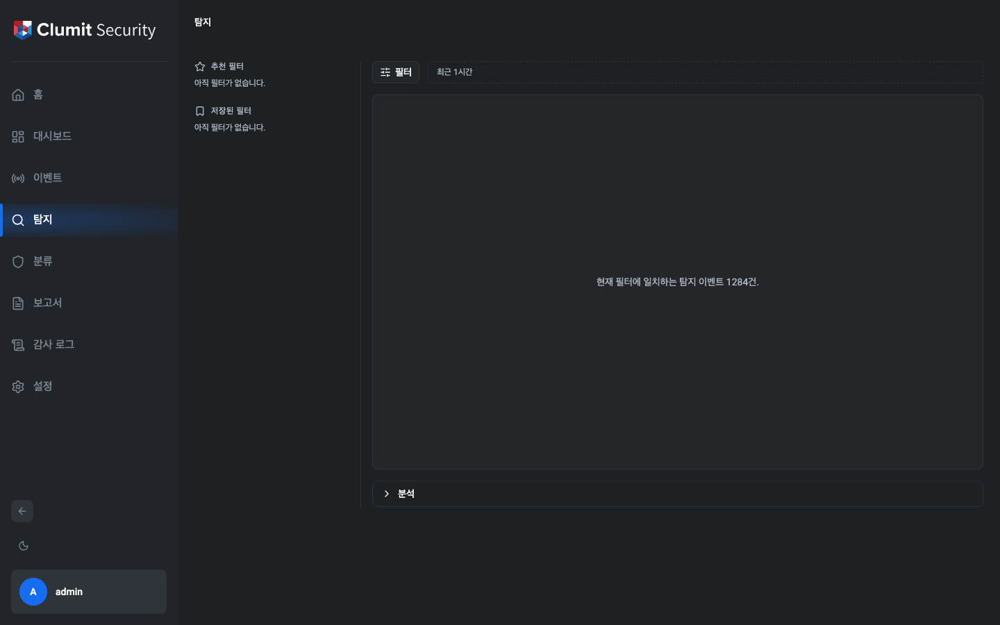

# 탐지

탐지 페이지는 사이드바에서 접근합니다. 백엔드에서 생성된 탐지 결과를
필터링하고 검토하며 개별 항목을 자세히 살펴보는 허브입니다.

페이지 조회에는 `detection:read` 권한이 필요합니다. 기본 제공 역할인
Security Monitor, Tenant Administrator, System Administrator는 이
권한을 기본으로 부여받습니다. `detection:read`를 부여한 사용자 정의
역할도 접근할 수 있습니다.

## 레이아웃

페이지는 네 개의 영역으로 구성됩니다. 결과(Results) 영역이 작업
공간의 중심이며, 보조 영역은 결과에 집중할 수 있도록 간결하게
유지됩니다.

### 추천 / 저장된 필터 레일

왼쪽의 슬림 레일은 두 섹션으로 구성됩니다.

- **추천 필터** — 선별된 시작점.
- **저장된 필터** — 사용자가 직접 저장한 필터.

좁은 뷰포트에서는 레일이 아이콘만 표시되도록 축소되고, 데스크톱
너비에서는 섹션 제목이 함께 나타납니다.

### 상단 바

메인 영역 상단에는 **필터** 버튼과 활성 필터 칩 바가 있습니다.
**필터** 버튼을 클릭하면 오른쪽에 필터 드로어가 열리고, 그 옆의 칩
바는 현재 탭에 적용된 필터를 요약해 보여 줍니다.

### 결과

결과 영역은 화면 대부분을 차지하며 탐지 결과를 표시합니다. 페이지에
진입하면 기본 필터(**최근 1시간**)로 쿼리가 자동 실행되어 결과
영역이 비어 있는 상태로 남지 않습니다. 전체 결과 리스트는 이후
단계에서 렌더링되며, 지금은 필터에 일치하는 이벤트 수를 요약하는
한 줄이 표시됩니다.

### 분석 스트립

결과 아래에는 현재 결과 집합의 집계 정보를 위한 분석 스트립이
마련되어 있습니다. 기본적으로 접혀 있으며, 이번 단계에서는 `▸`
버튼을 클릭하면 비어 있는 플레이스홀더 패널이 나타납니다.

## 필터 드로어

필터 드로어는 조회할 탐지 이벤트의 시간 창을 지정하는 곳입니다.
상단 바의 **필터** 버튼으로 열면 오른쪽에서 슬라이드되어
나타납니다.

### 기간

**기간** 섹션은 흔히 쓰는 상대 시간 창을 칩으로 제공합니다:
`최근 1시간`, `최근 12시간`, `최근 1일`, `최근 1주`, `최근 1개월`,
`최근 3개월`, `최근 6개월`, `최근 1년`, `최근 3년`. 칩을 선택하면
해당 창의 시작과 끝이 **시간 범위** 입력에 채워집니다.

### 시간 범위

두 개의 `datetime-local` 입력으로 시작과 종료 시각을 명시적으로
지정할 수 있습니다. 어느 한쪽이라도 편집하면 기간 칩 선택이
해제됩니다. 사용자가 직접 편집한 범위는 더 이상 퀵 셀렉트
창이 아니기 때문입니다.

### 적용

**적용**을 클릭하거나 드로어에 포커스가 있는 상태에서 `Enter` 키를
누르면 현재 드래프트가 활성 탭의 필터로 커밋되고 쿼리가 실행됩니다.
적용 후에는 드로어가 닫힙니다. 적용 없이 드로어를 닫으면(닫기
버튼 또는 `Esc`) 편집 중이던 내용은 유지되며 다음에 드로어를 열
때 다시 나타납니다.

종료 시각이 시작 시각보다 이르거나 같은 범위는 허용되지 않으며
인라인 유효성 검사 메시지가 표시됩니다.

### 필터 저장

**필터 저장** 버튼은 적용 버튼 옆에 표시되지만 이번 단계에서는
비활성화되어 있습니다. 필터 이름 지정 플로우는 이후 탐지
단계에서 연결됩니다.
