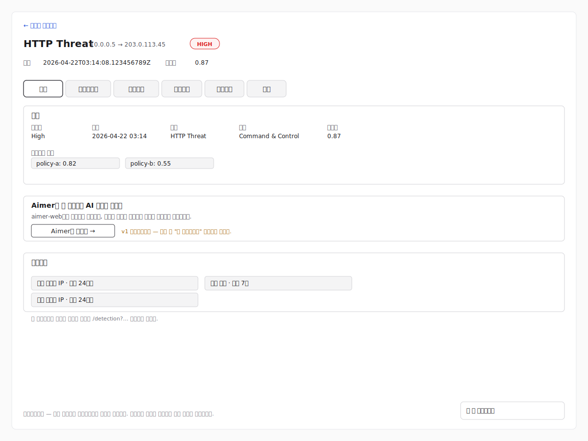

# 이벤트 조사

이벤트 조사 페이지는 단일 탐지 이벤트를 깊이 있게 분석하기 위한
전용 화면입니다. 이 페이지는 URL로 주소 지정이 가능해 조사자가
특정 결과에 대한 링크를 공유하거나 북마크할 수 있습니다.

이 페이지는 탐지 페이지의 Quick peek 인스펙터에 있는
**Open full investigation** 액션에서 도달합니다. Quick peek 자체는
Phase Detection-18에서 제공되며, 해당 단계가 도입되기 전에도 이
페이지는 직접 URL(공유 링크, 북마크, 이웃 메뉴의 피벗)로 접근할 수
있습니다. Quick peek 액션이 호출하는 복합 로케이터 코덱은
`src/lib/events/event-locator.ts`에서 이미 내보내고 있으므로,
인스펙터 연결은 소비자 쪽 변경만으로 가능합니다.

이 페이지를 보려면 `detection:read` 권한이 필요합니다. 탐지
페이지와 동일한 권한입니다. 권한이 없는 계정은 유효한 이벤트
링크를 얻더라도 조사 URL에서 차단됩니다.

위 도식은 SVG 와이어프레임 대체 자료입니다. 대표 PNG 캡처에는
타이트 로케이터 필터와 일치하는 이벤트가 존재하는 REview
환경이 필요하지만, 이 브랜치를 작성한 개발 워크트리에서는
해당 환경에 접근할 수 없습니다. 와이어프레임은
`docs/AUTHORING.md` §"인프라 제약 기능에 대한 스크린샷
예외"가 허용하는 대체 자료로 제공됩니다. 스테이징 환경이
준비되면 PNG 캡처(`event-investigation-ko.png`)로 교체하세요.

## URL 구조

페이지는 `/events/<eventToken>` 경로에서 제공됩니다. 이
라우트는 메뉴 중립적입니다 — `/detection/` 아래에 중첩되지 않아
Triage와 같은 형제 메뉴도 Detection 접두사 없이 같은 페이지로
연결할 수 있습니다.

`eventToken`은 이벤트의 복합 로케이터(센서, 시간, 출발지 및
응답지 주소, 포트, 프로토콜, 종류, 수준)를 인코딩한 URL-안전
문자열입니다. 로케이터는 **최선 노력(best-effort)** 방식입니다.
탐지 저장소에 이벤트가 존재하고 복합 튜플이 고유한 동안에는
링크가 정상적으로 이벤트를 로드합니다.

## 헤더

페이지 헤더는 다음을 표시합니다.

- 이벤트 종류의 친숙한 이름과 엔드포인트 요약
  (예: `HTTP Threat · 10.0.0.5 → 203.0.113.45`).
- 심각도 배지.
- 이벤트 시간과 신뢰도.
- 돌아가기 링크. 기본값은 `/detection`이며, 목록이나
  인스펙터에서 페이지를 열 때 오프너가
  `?returnTo=<상대 경로>`를 추가해 사용자의 이전 탭/필터
  상태를 복원합니다. 외부 사이트로 향하는 `returnTo` 값은
  거부되며, 돌아가기 링크는 동일 출처의 상대 경로만
  따라갑니다.

로케이터가 여러 이벤트와 일치하는 경우(나노초 정밀도에서는
드물지만 가능) 헤더 아래 비차단 알림이 표시되고 첫 번째 일치
이벤트가 렌더링됩니다.

> 이 링크와 일치하는 이벤트가 여러 개 있습니다. 하나만
> 표시합니다. 전체 목록을 확인하려면 결과 목록을 여세요.

## 오류 상태

### 잘못된 이벤트 링크

토큰이 손상되었거나 변조된 경우 페이지는 **잘못된 이벤트
링크** 상태와 탐지로 돌아가는 링크를 렌더링합니다. 탐지
서비스로의 네트워크 요청은 발생하지 않습니다.

### 이벤트를 더 이상 사용할 수 없음

로케이터 디코딩은 성공했지만 탐지 서비스가 일치하는 이벤트를
반환하지 않는 경우 페이지는 **이벤트를 더 이상 사용할 수
없습니다** 상태를 렌더링합니다. 보존 기간이 지났거나, 센서가
범위 밖으로 변경되었거나, 왕복 과정에서 시간 정밀도가 손실된
경우에 발생합니다.

### 이벤트를 불러올 수 없음

탐지 서비스에 접근할 수 없거나 오류를 반환하면 페이지는
**이벤트를 불러올 수 없습니다** 상태를 재시도 안내와 함께
렌더링합니다.

## 탭

조사 뷰는 하나의 긴 스크롤 대신 탭으로 구성됩니다. 이벤트에
유용한 내용을 표시할 수 없는 탭은 빈 플레이스홀더를 그리는 대신
완전히 숨겨집니다.

- **프로토콜** 탭은 조사 페이지가 아직 종류별 필드를 렌더링하지
  않는 이벤트 하위 유형에서는 숨겨집니다. 현재 지원하는 하위
  유형은 HTTP Threat, DNS Covert Channel, Blocklist / DNS, Port
  Scan, Multi-Host Port Scan, FTP Brute Force, FTP Plain Text,
  Network Threat, Blocklist / Connection 입니다.
- **페이로드** 탭은 캡처된 바이트 스트림이 없는 이벤트에서
  숨겨집니다(현재는 HTTP 본문 필드를 통해 HTTP Threat 이벤트만
  페이로드 바이트를 제공합니다).

그 외 개요, 엔드포인트, 컨텍스트, 관련 이벤트 탭은 항상
표시됩니다.

이 섹션은 이슈 원문에서 원시 패킷 캡처 헥스 덤프를 표시하는
**패킷** 탭으로 정의되어 있었습니다. v1에서는 탐지 서비스가
어떤 이벤트 하위 유형에 대해서도 원시 패킷 캡처 필드를
제공하지 않으며, 오직 HTTP Threat만 캡처된 바이트를 제공하고
이것 또한 링크 계층 패킷이 아니라 HTTP 본문 스트림입니다.
따라서 v1에서는 탭 레이블을 **페이로드**로 두어 조사자가
애플리케이션 바이트에 패킷 의미를 부여하지 않도록 합니다.
탐지 서비스가 실제 패킷 캡처 필드를 노출하면 URL이나 레이아웃
변경 없이 탭을 재라벨링하고 확장할 수 있습니다.

이벤트 자체는 페이지가 로드될 때 한 번 조회됩니다. 이 호출은
페이지가 렌더링할 수 있는 모든 하위 유형 프래그먼트를 포함한
단일 `eventList` 조회이며, 추가 네트워크 호출 없이 개요,
프로토콜, 페이로드, 컨텍스트 탭을 채우고 프로토콜·페이로드
탭의 표시 여부를 결정합니다. 추가로 탐지 서비스를 호출하는
두 탭인 엔드포인트(`ipLocation` 보강)와 관련 이벤트(피벗별
건수·최근 발생 시각 스니펫)는 사용자가 해당 탭을 처음 열 때까지
조회를 지연합니다. 한 번 활성화된 지연 탭의 데이터는 페이지가
살아 있는 동안 메모리에 유지되어, 다른 탭으로 전환 후
돌아와도 같은 조회를 다시 수행하지 않습니다.

### 개요

심각도, 시간, 종류, 분류, 신뢰도, 트리아지 점수(각 점수는 정책
ID와 함께)를 포함한 요약 카드를 표시합니다.

이 탭에는 **Aimer로 보내기** 배너도 있습니다. 이번 릴리스에서
버튼은 플레이스홀더입니다. 클릭하면 전송을 수행하는 대신
**곧 제공됩니다** 알림을 표시합니다. 전체 Aimer 브리지(서명된
봉투 패키징, 컨텍스트 토큰 교환, `aimer-web` 브리지 엔드포인트로
POST)는 별도의 후속 작업으로 관리됩니다.

Aimer 배너 아래의 **바로가기**에는 관련 활동으로 사전 필터링된
탐지 페이지를 여는 링크가 나열됩니다. 최근 24시간 같은 출발지
IP, 최근 24시간 같은 목적지 IP, 최근 7일 같은 종류 등입니다.
필터는 탐지 페이지 URL 검색 매개변수(`source`, `destination`,
`kind`, `window`, `origPort`, `respPort`, `proto`)로
인코딩되며, 탐지 페이지는 이를 활성 필터 툴바의 칩으로
표시합니다.

### 엔드포인트

출발지와 목적지 카드에는 IP, 국가, 지역과 도시, 포트, 좌표
(가능한 경우)와 파생된 **회사** 값이 표시됩니다. 회사
값은 다음 우선순위로 세 가지 출처에서 도출되며, 어떤
출처에서 가져왔는지 옆에 함께 표시됩니다.

1. 이벤트의 고객 정보(`origCustomer` / `respCustomer`).
2. 이벤트의 네트워크 정보(`origNetwork` / `respNetwork`).
3. 이 탭이 활성화될 때 탐지 서비스에서 지연 조회되는
    `ipLocation` 보강의 ISP.

배열 엔드포인트를 가진 이벤트 하위 유형(예: 스캔된 포트
목록)에 대해서는 모든 항목이 표시됩니다. 조사 뷰는 목록
뷰에 비해 의도적으로 상세합니다.

응답지가 배열로 제공되는 하위 유형(특히 Multi-Host Port
Scan)에서는 목적지 칸이 응답지마다 하나의 카드로 나뉘며,
각 카드는 자체 국가, 고객, `ipLocation` 보강을 가집니다.

### 프로토콜

이벤트 하위 유형의 종류별 필드가 표시됩니다. 평면 그리드가
아니라 논리적 하위 섹션으로 그룹화됩니다. 예:

- **HTTP Threat** — 요청(메서드, 호스트, URI, 레퍼러, 버전,
    User-Agent, 요청 길이), 응답(상태 코드, 상태 메시지, 응답
    길이, 콘텐츠 인코딩/유형, 캐시 컨트롤), 인증(사용자 이름,
    마스킹된 비밀번호, 쿠키), 본문(파일명, MIME 유형, 이벤트
    콘텐츠, 캡처된 본문 바이트의 헥스 미리보기). 비밀번호는
    고정 길이 마스크로만 표시되며 평문은 이 페이지에서 절대
    렌더링되지 않습니다.
- **DNS Covert Channel** — 질의(질의 이름, 클래스, 유형, 트랜잭션
    ID, 왕복 시간), 응답(답변, 응답 코드, TTL), 플래그(권위,
    잘림, 재귀 요청 / 가용).
- **Port Scan** — 스캔된 포트, 탐지 시작 및 종료 시간.
- **Multi-Host Port Scan** — 대상 IP 목록, 대상 포트, 탐지
    시작 및 종료 시간.
- **FTP Brute Force** — 사용자 목록, 탐지 시작 및 종료 시간.
- **FTP Plain Text** — 사용자, 마스킹된 비밀번호, 세션 시작 시각과
    지속 시간, 캡처된 명령(최초 10개).
- **Blocklist / DNS** — 질의, 응답, 플래그 섹션(DNS Covert
    Channel과 동일 구조).
- **Network Threat** — 서비스, 공격 유형, 내용, 시작 시각, 지속
    시간.
- **Blocklist / Connection** — 연결 상태, 서비스, 시작 시각, 지속
    시간, 송신/수신 바이트 및 패킷 수.

비어 있는 필드는 빈 행으로 렌더링되지 않고 생략됩니다.

### 페이로드

이벤트에 캡처된 바이트가 있으면 페이로드 탭은 오프셋, 헥스,
ASCII 열로 구성된 전형적인 헥스 덤프를 렌더링하고, 페이로드를
`.bin` 파일로 저장하는 **페이로드 다운로드** 액션을 제공합니다
(예: Wireshark 또는 `xxd` 워크플로 활용). 캡처된 바이트가 없는
이벤트에서는 탭이 숨겨집니다.

### 컨텍스트

이벤트의 위협 메타데이터를 표시합니다: 위협 이름(하위
유형의 `attackKind` 필드에서 추출), 위협 분류(REview의
`ThreatCategory` — MITRE 전술로 취급), 위협 수준, 그리고
이벤트가 내장 MITRE 카탈로그에 등록되어 있을 때는 해석된
**MITRE ATT&CK** 카드(전술, 기법, 해당 시 하위 기법). 각
식별자는 `attack.mitre.org`의 표준 항목으로 연결됩니다.
카탈로그가 해당 클래스에 대한 안내를 가지고 있을 때
**설명** 카드가 그 아래 표시됩니다.

카탈로그는 우선 `attackKind`(기법 단위 항목)로 조회한 뒤
이벤트의 `__typename`(설명 전용)과 `category`(전술 전용)로
폴백합니다. `src/lib/events/mitre-catalogue.ts`에 위치하며,
새 기법을 추가하거나 향후 REview 제공 문구를 같은 조회에
병합하는 단일 확장 지점입니다.

### 관련 이벤트

필터 기반 바로가기가 링크 행으로 렌더링됩니다. 각 행은 관련
활동으로 사전 필터링된 새 탐지 페이지를 엽니다.

- 같은 출발지 IP — 최근 24시간.
- 같은 목적지 IP — 최근 24시간.
- 같은 종류 — 최근 7일.
- 같은 세션 / 플로우 — 동일한 출발지와 응답지, 최근 24시간.
    v1에서는 탐지 서비스의 목록 필터가 포트/프로토콜을
    받지 않기 때문에 세션 바로가기는 주소 쌍만으로
    좁힙니다. 건수 / 마지막 발생 요약도 같은 2-튜플로
    계산되므로 클릭 이후 사용자가 보는 결과와 일치합니다.

탭이 활성화되면 페이지는 각 바로가기마다 한 번씩
`eventList` 조회를 수행해 행 옆에 작은 **건수 / 마지막
발생** 요약을 채웁니다. 건수는 REview의 `totalCount`를
사용합니다. 탐지 서비스의 `eventList`는 정렬 순서를
보장하지 않으므로, 표시되는 시각은 조회 결과에서 클라이언트
측으로 계산한 최대 `time`입니다. 이는 정직한 최선 노력
방식입니다 — 표시되는 값은 항상 해당 기간에 실제로 존재하는
이벤트의 시각이지만, 기간이 충분히 넓어 샘플이 실제 가장
최근 이벤트를 놓치면 표시 시각이 실제보다 뒤처질 수
있습니다. 단일 조회가 실패하면 "기간 내 일치 없음"으로
폴백되며 다른 행에는 영향을 주지 않습니다.

관련 바로가기는 탐지 서비스에 대한 필터 기반 조회만 사용합니다.
외부 AI 추론 관계는 가져오지 않습니다.
