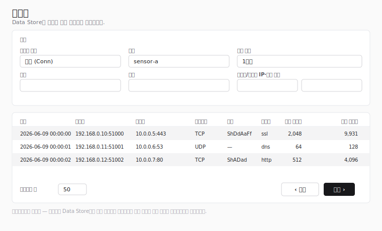

# 이벤트

이벤트 페이지는 사이드바에서 접근합니다. Giganto가 수집한 **원본
이벤트** — 백엔드가 수집한 원시 레코드로, 탐지 로직이 실행되기 전의
데이터 — 를 조회합니다. 연결(**Conn**) 네트워크 레코드와 **Sysmon /
Windows 엔드포인트** 이벤트 유형(프로세스, 파일, 레지스트리, 네트워크
연결, 파이프, DNS, 이미지 이벤트)을 다룹니다.

페이지를 보려면 `event:read` 권한이 필요합니다. 기본 제공 역할인
보안 모니터(Security Monitor), 테넌트 관리자(Tenant Administrator),
시스템 관리자(System Administrator)는 이 권한을 기본으로 부여받습니다.
`event:read`를 부여하는 사용자 지정 역할도 해당합니다. 이벤트 메뉴
항목은 모든 사용자에게 계속 표시되며, 권한은 페이지가 로드될 때
적용되어 권한이 없는 사용자는 다른 곳으로 리디렉션됩니다.

!!! note "와이어프레임 대체본"

    위 그림은 실제 캡처가 아닌 SVG 와이어프레임입니다. 결과 테이블은
    Giganto에서 받은 데이터를 표시하므로, 실제 데이터가 적재된 스택에서
    캡처한 실제 스크린샷이 최종 문서 정리 단계에서 이 자리표시자를
    대체합니다.

## 필터

페이지 상단의 필터 카드에서 질의를 구성합니다. 센서를 선택하고
**적용**을 누르기 전까지는 아무것도 조회하지 않습니다 — Giganto는 모든
네트워크 질의를 정확히 하나의 센서로 한정하므로 센서 선택이
필수입니다.

- **레코드 유형** — 조회할 원본 이벤트의 종류입니다. **연결 (Conn)**
  또는 14가지 Sysmon / Windows 엔드포인트 유형 중 하나를 선택합니다.
  선택에 따라 적용되는 필터도 달라집니다(아래 *Sysmon / 엔드포인트
  이벤트* 참고).
- **센서** — 질의할 단일 센서입니다. 목록은 Giganto가 데이터를 수집한
  센서들로 채워집니다. 목록을 불러올 수 없으면 선택기가 비활성화되고
  안내가 표시됩니다. 센서는 Sysmon 유형을 포함한 모든 레코드 유형에서
  필수입니다.
- **빠른 범위** — 시작/종료 시간 범위를 상대 구간(1시간, 12시간, 1일,
  …, 최대 3년)으로 채우는 단축 기능입니다.
- **시간 범위** — 명시적 **시작**(포함) 및 **종료**(제외) 경계입니다.
  이 값을 편집하면 빠른 범위가 무시됩니다.
- **출발지/목적지 IP 범위** — 출발지 및 응답 주소에 대한 선택적
  시작/종료 IP 경계입니다.
- **출발지/목적지 포트 범위** — 출발지 및 응답 포트에 대한 선택적
  시작/종료 포트 경계입니다. 포트는 0에서 65535 사이의 정수여야 하며,
  해당 범위의 정수가 아니면 **적용**이 차단됩니다(소수나 지수 입력은
  다른 포트로 반올림되지 않고 거부됩니다).

별도의 프로토콜 필터는 없습니다. Giganto의 네트워크 필터에는 프로토콜
필드가 없어 IP 프로토콜을 질의 입력으로 사용할 수 없으며, 대신 레코드별
**프로토콜** 결과 열에 표시됩니다.

**적용**은 첫 페이지부터 검색을 실행합니다. **초기화**는 모든 필드를
지웁니다. 활성 필터와 페이지는 페이지 URL에 유지되므로 검색을 공유할
수 있고 새로고침해도 유지됩니다.

## Sysmon / 엔드포인트 이벤트

Conn 외에도 **레코드 유형** 메뉴에는 14가지 Sysmon / Windows
엔드포인트 이벤트 유형이 있습니다: 프로세스 생성, 프로세스 종료,
프로세스 변조, 파일 생성, 파일 생성 시간 변경, 파일 스트림 해시 생성,
파일 삭제, 파일 삭제 감지, 이미지 로드, 네트워크 연결, 레지스트리 값
설정, 레지스트리 키/값 이름 변경, 파이프 이벤트, DNS 쿼리.

이 유형들은 IP/포트가 아니라 **에이전트**로 필터링합니다.

- Sysmon 유형을 선택하면 출발지/목적지 **IP** 및 **포트** 범위 입력이
  단일 **에이전트 ID** 텍스트 입력으로 대체됩니다. 에이전트 ID는 자유
  텍스트입니다 — 에이전트 선택기가 없으므로 필터링할 ID를 직접
  입력하거나, 비워 두면 모든 에이전트가 매칭됩니다.
- **센서**와 **시간 범위** 필터는 Conn과 동일하게 계속 적용되고
  필수이며 그대로 전송됩니다. IP/포트 경계만 제거되며, 유형을 전환해도
  오래된 IP/포트가(또는 Conn으로 되돌릴 때 오래된 에이전트 ID가)
  질의에 새어 들어가지 않습니다.

각 Sysmon 유형은 고유한 열과, 해당 레코드의 모든 필드(타임스탬프,
프로세스 식별 정보, 해시, 유형별 필드)를 나열하는 행 상세 패널을
가집니다. 해시처럼 목록 값을 가진 필드는 표시용으로 결합되고, 불리언
필드는 지역화된 **예**/**아니요**로 표시되며, 문자열로 인코딩된 숫자
필드(프로세스 ID, 로그온 ID, 쿼리 상태)는 그대로 표시됩니다.

## 결과

일치하는 레코드가 테이블로 표시됩니다. Sysmon 유형은 고유한 열을
렌더링하며(위의 *Sysmon / 엔드포인트 이벤트* 참고), Conn 레코드는 다음
열을 사용합니다.

| 열 | 의미 |
| --- | --- |
| 시간 | 레코드 타임스탬프 |
| 출발지 | 출발지 `주소:포트` |
| 목적지 | 응답 `주소:포트` |
| 프로토콜 | IP 프로토콜(TCP, UDP, ICMP 또는 원시 번호) |
| 상태 | TCP 연결 상태 문자열 |
| 서비스 | 감지된 서비스 이름 |
| 송신 바이트 | 출발지가 보낸 바이트 |
| 수신 바이트 | 목적지가 받은 바이트 |

바이트·패킷 수와 연결 지속 시간은 Giganto가 문자열로 반환하는 64비트
값이며, 정밀도 손실 없이 표시용으로 형식이 지정됩니다.

### 행 상세

행을 선택하면 **전체** 레코드가 측면 패널에 열립니다 — 위의 모든 필드에
더해 시작 시간, 지속 시간, 방향별 패킷 수, 레이어 2 바이트 수가
포함됩니다.

## 페이지네이션

Giganto는 결과를 총 개수를 노출하지 **않는** 커서 기반 연결로
반환하므로, 페이지네이션은 **이전 / 다음** 만 제공합니다 — 총 개수,
"마지막 페이지", 페이지 이동이 없습니다.

- **이전**과 **다음**은 한 번에 한 페이지씩 이동하며, Giganto가 해당
  방향에 다음 페이지가 있다고 보고할 때만 활성화됩니다.
- **페이지당 행**은 페이지 크기(25, 50, 100)를 선택합니다. 100은
  Giganto가 허용하는 최대값입니다.

페이지 크기를 변경하면 첫 페이지부터 다시 시작합니다.
