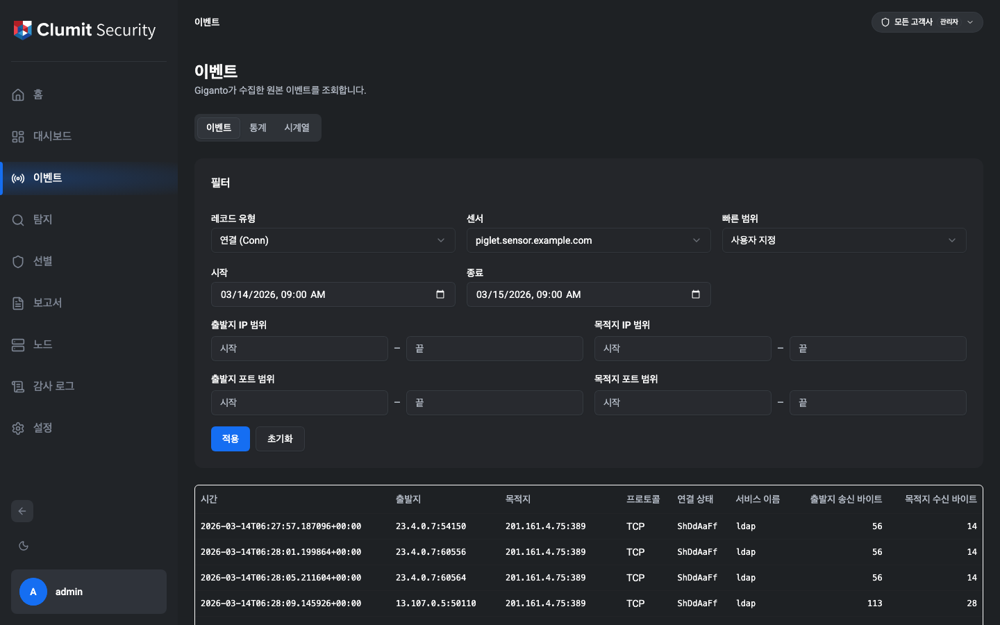
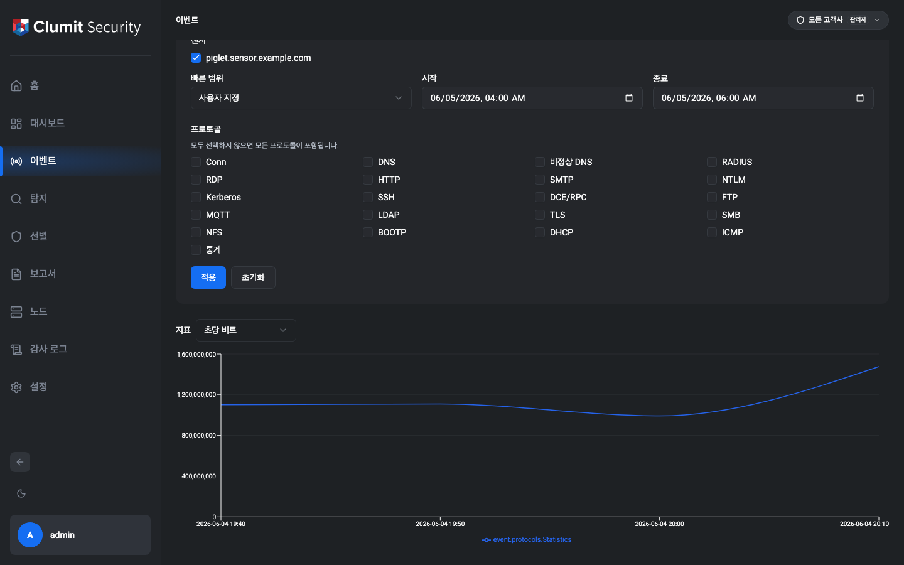
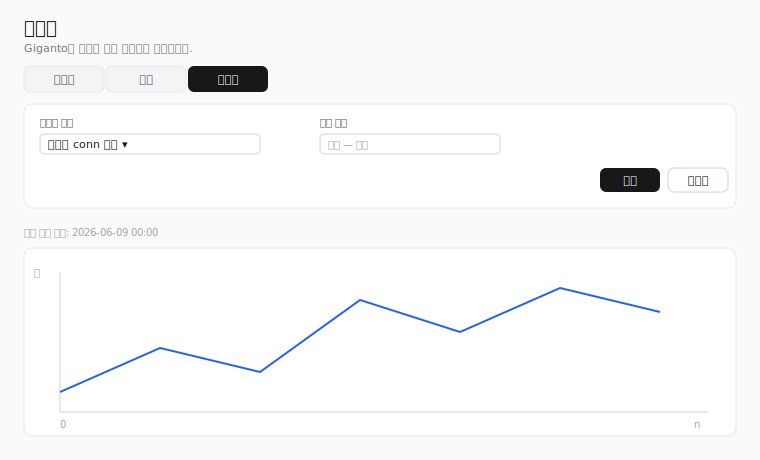

# 이벤트

이벤트 페이지는 사이드바에서 접근합니다. Giganto가 수집한 **원본
이벤트** — 백엔드가 수집한 원시 레코드로, 탐지 로직이 실행되기 전의
데이터 — 를 조회합니다. Giganto의 레코드 유형 34종을 모두 다룹니다:
네트워크 유형 20종 — 연결(**Conn**)과 19개 프로토콜 유형 — 과 Sysmon /
Windows 엔드포인트 유형 14종으로, 모두 [레코드 유형](#레코드-유형)에
나열되어 있습니다. 각 유형마다 알맞은 열과 전체 행 상세를 제공합니다.

페이지를 보려면 `event:read` 권한이 필요합니다. 기본 제공 역할인
보안 모니터(Security Monitor), 테넌트 관리자(Tenant Administrator),
시스템 관리자(System Administrator)는 이 권한을 기본으로 부여받습니다.
`event:read`를 부여하는 사용자 지정 역할도 해당합니다. 이벤트 메뉴
항목은 모든 사용자에게 계속 표시되며, 권한은 페이지가 로드될 때
적용되어 권한이 없는 사용자는 다른 곳으로 리디렉션됩니다.

## 보기

페이지 상단의 토글로 동일한 센서 데이터를 세 가지 방식으로 볼 수
있습니다.

- **이벤트** — 아래에 설명한 레코드 테이블입니다. 기본값입니다.
- **통계** — 시간에 따른 프로토콜별 지표를 보여주는 집계
  차트입니다([통계](#통계) 참조).
- **시계열** — 선택한 샘플링 정책의 주기 숫자 계열입니다([시계열](#시계열)
  참조).

활성 보기는 필터와 함께 페이지 URL에 유지되므로 선택한 보기를 공유할
수 있고 새로고침해도 유지됩니다. 각 보기는 자체 필터를 유지하므로 보기를
전환해도 어떤 필터도 사라지지 않습니다.

## 필터

페이지 상단의 필터 카드에서 질의를 구성합니다. 센서를 선택하고
**적용**을 누르기 전까지는 아무것도 조회하지 않습니다 — Giganto는 모든
네트워크 질의를 정확히 하나의 센서로 한정하므로 센서 선택이
필수입니다.

- **레코드 유형** — 조회할 원본 이벤트의 종류입니다. Giganto의 레코드
  유형 34종을 모두 선택할 수 있습니다([레코드 유형](#레코드-유형)
  참조). 변경한 유형은 **적용**을 누를 때 반영되어 검색이 다시 실행되고
  결과 열과 상세 레이아웃이 해당 유형에 맞게 교체됩니다. 레코드 유형은
  어떤 필터 입력이 적용되는지도 결정합니다. 네트워크 유형은 아래의 IP/포트
  범위를 표시하고, Sysmon 유형은 그 대신 단일 **에이전트 ID** 필드를
  표시합니다(아래 참조).
- **센서** — 질의할 단일 센서입니다. 목록은 Giganto가 데이터를 수집한
  센서들로 채워집니다. 목록을 불러올 수 없으면 선택기가 비활성화되고
  안내가 표시됩니다. 센서는 네트워크·Sysmon 구분 없이 모든 레코드
  유형에 필수입니다.
- **기간** — 시작/종료 시간 범위를 상대 구간으로 채우는 빠른 선택
  버튼(필)입니다. 이벤트 데이터 양이 많기 때문에 구간은 최대 1주로
  제한됩니다: 최근 1시간, 12시간, 1일, 1주. 버튼을 선택하면 강조되며,
  한 번에 하나만 활성화됩니다.
- **시간 범위** — 명시적 **시작**(포함) 및 **종료**(제외) 경계입니다.
  둘 중 하나라도 편집하면 활성화된 기간 버튼이 해제됩니다.
- **출발지/목적지 IP 범위** — 출발지 및 응답 주소에 대한 선택적
  시작/종료 IP 경계입니다.
- **출발지/목적지 포트 범위** — 출발지 및 응답 포트에 대한 선택적
  시작/종료 포트 경계입니다. 포트는 0에서 65535 사이의 정수여야 하며,
  해당 범위의 정수가 아니면 **적용**이 차단됩니다(소수나 지수 입력은
  다른 포트로 반올림되지 않고 거부됩니다). **ICMP** 레코드 유형에서는
  포트 입력이 비활성화되고 적용되지 않습니다 — ICMP 레코드에는 포트가
  없습니다.
- **에이전트 ID** — **Sysmon 유형에서만** IP·포트 범위 대신
  표시됩니다. Sysmon 이벤트는 네트워크 주소가 아니라 보고한 에이전트로
  한정되므로, 에이전트 id에 대한 자유 텍스트 일치입니다(Giganto는
  드롭다운을 채울 에이전트 목록을 노출하지 않습니다). 네트워크 유형과
  Sysmon 유형 사이를 전환하면, 새 유형에 적용되지 않는 입력은 숨겨지고
  비워지며 질의와 북마크 가능한 URL 양쪽에서 제거되므로, 한 계열에 입력한
  값이 다른 계열로 새어 들어가지 않습니다 — 새로고침하거나 다시 전환한
  뒤에도 마찬가지입니다.

별도의 프로토콜 필터는 없습니다. Giganto의 네트워크 필터에는 프로토콜
필드가 없어 IP 프로토콜을 질의 입력으로 사용할 수 없으며, 대신 레코드별
**프로토콜** 결과 열에 표시됩니다.

**적용**은 첫 페이지부터 검색을 실행합니다. **초기화**는 모든 필드를
지웁니다. 활성 필터와 페이지는 페이지 URL에 유지되므로 검색을 공유할
수 있고 새로고침해도 유지됩니다.

## 결과

일치하는 레코드가 테이블로 표시됩니다. 모든 유형은 공통 선행 열 집합 —
**시간**, **출발지**, **목적지**, **프로토콜** — 을 공유하며, 그 뒤에
유형별로 선별된 요약 열이 이어집니다. **Conn**의 요약 열은 다음과
같습니다.

| 열 | 의미 |
| --- | --- |
| 시간 | 레코드 타임스탬프 |
| 출발지 | 출발지 `주소:포트` |
| 목적지 | 응답 `주소:포트` |
| 프로토콜 | IP 프로토콜(TCP, UDP, ICMP 또는 원시 번호) |
| 상태 | TCP 연결 상태 문자열 |
| 서비스 | 감지된 서비스 이름 |
| 송신 바이트 | 출발지가 보낸 바이트 |
| 수신 바이트 | 목적지가 받은 바이트 |

다른 레코드 유형은 각자 고유한 요약 열을 선별해 표시합니다(예: HTTP는
메서드, 호스트, URI, 상태 코드를 표시). 필드가 많은 유형은 테이블에
짧은 기본 열만 표시하고, 전체 필드 목록은 행 상세에 표시합니다.
바이트·패킷 수와 지속 시간은 Giganto가 문자열로 반환하는 64비트 값이며,
정밀도 손실 없이 표시용으로 형식이 지정됩니다.

포트가 없는 **ICMP** 유형에서는 출발지·목적지 열에 주소만 표시됩니다.

Sysmon 유형은 네트워크 엔드포인트가 없으므로 테이블이 다른 공통 집합 —
**시간**, **에이전트 이름**, **이미지**, **사용자** — 으로 시작하고, 그
뒤에 유형별 요약 열이 이어집니다(예: Process Create는 명령줄, 상위
이미지, 무결성 수준, 해시를 표시). 행 상세에는 여전히 선택한 유형의 모든
필드가 나열됩니다.

### 행 상세

행을 선택하면 **전체** 레코드가 측면 패널에 열립니다 — 요약 열뿐 아니라
선택한 유형의 모든 필드가 표시됩니다. 목록 값 필드(예: DNS 응답, TLS
확장)는 인라인으로 표시되고, 원시 바이트 페이로드는 한 줄에 한 행씩
표시되며, **DCE/RPC**(바인드 컨텍스트), **FTP**(명령), **DHCP**(옵션)의
중첩 하위 레코드는 라벨이 달린 하위 블록으로 렌더링됩니다.

## 레코드 유형

**레코드 유형** 필터에서 Giganto의 레코드 유형 34종을 모두 선택할 수
있습니다. 네트워크 유형 20종이 먼저 옵니다.

| 그룹 | 유형 |
| --- | --- |
| 연결 | Conn |
| 이름 해석 | Dns, MalformedDns |
| 웹 | Http, Rdp |
| 메일 | Smtp |
| 인증 / 디렉터리 | Ntlm, Kerberos, Ldap, Radius |
| 원격 접속 / RPC | Ssh, DceRpc |
| 파일 전송 / 공유 | Ftp, Smb, Nfs |
| 메시징 | Mqtt |
| 암호화 | Tls |
| 주소 할당 | Bootp, Dhcp |
| 진단 | Icmp |

일부 네트워크 유형은 나머지와 다릅니다.

- **MalformedDns**는 Dns와 형태가 다릅니다. query/answer/rcode 대신
  DNS 헤더 카운트와 원시 비정상 질의/응답 바이트 페이로드를 담습니다.
- **Tls**, **Http**, **Dhcp**, **Radius**는 필드가 많습니다(26–33개).
  테이블은 선별된 일부만, 행 상세는 전체를 표시합니다.
- **DceRpc**, **Ftp**, **Dhcp**는 중첩 하위 레코드를 담으며 행 상세에
  렌더링됩니다.
- **Icmp**는 포트가 없으며 포트 필터 입력이 비활성화됩니다.

### Sysmon / 엔드포인트 레코드 유형

Sysmon / Windows 엔드포인트 유형 14종은 선택기에서 네트워크 유형 뒤에
옵니다. IP/포트가 아니라 [**에이전트 ID**](#필터)로 필터링되며, 공통
헤더 — 시간, 에이전트 이름, 에이전트 id, 프로세스 GUID, 프로세스 id,
이미지, 사용자 — 와 각자의 유형별 필드를 공유합니다.

| 그룹 | 유형 |
| --- | --- |
| 프로세스 | Process Create, Process Terminate, Process Tamper |
| 이미지 | Image Load |
| 파일 | File Create, File Create Time, File Create Stream Hash, File Delete, File Delete Detected |
| 레지스트리 | Registry Value Set, Registry Key Rename |
| 네트워크 | Network Connect |
| 파이프 | Pipe Event |
| DNS | DNS Query |

몇몇 Sysmon 유형은 유의할 점이 있습니다.

- **Network Connect**는 자체 출발지/목적지 호스트, IP, 포트 필드를
  담습니다(네트워크 계열의 연결 레코드와는 별개입니다).
- **File Create Stream Hash**는 단수형 `hash` 목록 필드를 사용하고, 다른
  파일/프로세스 유형은 `hashes`를 사용합니다.
- **DNS Query**는 `queryResults` 목록과 `queryStatus` 코드를 담습니다.

## 페이지네이션

Giganto는 결과를 총 개수를 노출하지 **않는** 커서 기반 연결로
반환하므로, 페이지네이션은 **이전 / 다음** 만 제공합니다 — 총 개수,
"마지막 페이지", 페이지 이동이 없습니다.

- **이전**과 **다음**은 한 번에 한 페이지씩 이동하며, Giganto가 해당
  방향에 다음 페이지가 있다고 보고할 때만 활성화됩니다.
- **페이지당 행**은 페이지 크기(25, 50, 100)를 선택합니다. 100은
  Giganto가 허용하는 최대값입니다.

페이지 크기를 변경하면 첫 페이지부터 다시 시작합니다.

## 통계

**통계** 보기는 개별 레코드를 나열하는 대신 Giganto의 프로토콜별 트래픽
지표를 시계열 차트로 집계합니다. [보기 토글](#보기)에서 선택합니다.

### 통계 필터

- **센서** — **다중 선택** 목록입니다(센서마다 체크박스 하나). 통계
  질의는 선택한 모든 센서를 집계하므로 단일 센서 이벤트 검색과 달리
  여러 개를 한 번에 선택할 수 있습니다. **적용**이 활성화되려면 센서를
  하나 이상 선택해야 합니다.
- **기간**과 **시간 범위** — 이벤트 검색과 동일하게 최대 1주로 제한된
  기간 버튼(최근 1시간, 12시간, 1일, 1주)과 명시적 시작/종료 경계입니다.
- **프로토콜** — 통계 API가 추적하는 프로토콜의 선택적 하위 집합입니다
  (Conn, DNS, 비정상 DNS, RADIUS, RDP, HTTP, SMTP, NTLM, Kerberos, SSH,
  DCE/RPC, FTP, MQTT, LDAP, TLS, SMB, NFS, BOOTP, DHCP, ICMP, 통계).
  모두 선택하지 않으면 전체가 포함됩니다. Giganto가 다른 프로토콜 값을
  거부하므로 선택기는 이 키들만 제공합니다.

### 차트

**지표** 선택기로 그릴 값을 고릅니다 — **초당 비트**, **초당 패킷**,
**초당 이벤트**, **건수**, **크기** — 그리고 차트는 시간에 따라
**프로토콜별로 하나의 선**을 그립니다. 모든 지표를 한 번에 그리면 읽기
어려우므로, 지표는 이미 조회한 데이터에 대한 표시 전환일 뿐 다시 질의하지
않습니다.

X축은 버킷 시간입니다. Giganto는 각 버킷의 타임스탬프를 에폭 나노초
값으로 보고하며, 이는 축 표시를 위해 달력 시간으로 변환됩니다. 64비트
`count`와 `size` 값은 차트 좌표가 정확히 담을 수 있는 범위를 넘을 수
있어 그려지는 선은 2^53 이상에서 반올림될 수 있지만, 툴팁에는 항상
Giganto가 반환한 정확한 정수가 표시됩니다.

## 시계열

**시계열** 보기는 트래픽 지표를 집계하는 대신 단일 샘플링 정책의 **주기
숫자 계열**을 차트로 그립니다. [보기 토글](#보기)에서 선택합니다.

!!! note "와이어프레임 대체본"

    위 그림은 실제 캡처가 아닌 SVG 와이어프레임입니다. 차트는 Giganto에서
    받은 데이터를 표시하므로, 실제 데이터가 적재된 스택에서 캡처한 실제
    스크린샷이 최종 문서 정리 단계에서 이 자리표시자를 대체합니다.

### 시계열 필터

- **샘플링 정책** — 그릴 계열을 고르는 단일 선택 드롭다운입니다. 옵션은
  REview에 정의된 샘플링 정책이며, 각 옵션의 라벨은 정책 이름입니다.
  Giganto는 시계열을 정책 id로 식별하므로 **적용**이 활성화되려면 정책을
  반드시 선택해야 합니다. 정책 목록을 불러올 수 없으면 선택기가
  비활성화되고 안내가 표시됩니다.
- **기간**과 **시간 범위** — 다른 보기와 동일하게 최대 1주로 제한된 기간
  버튼(최근 1시간, 12시간, 1일, 1주)과 명시적 시작/종료 경계입니다.
  범위는 선택 사항이며, 설정하지 않으면 정책의 사용 가능한 전체 계열을
  그립니다.

샘플링 정책 목록과 계열을 모두 읽으려면 `event:read` 권한이 필요합니다 —
이벤트 메뉴의 나머지와 동일한 게이트입니다. 정책 목록은 REview에서,
계열 자체는 Giganto에서 가져오며 추가 권한은 필요하지 않습니다.

### 차트

차트는 선택한 정책의 `data` 값에 대해 **하나의 선**을 그립니다. 계열은
여러 청크로 도착할 수 있으며 각 청크는 자체 기준 시각을 가집니다. 이들은
기준 시각 순으로 정렬되어 하나의 연속된 선으로 이어집니다. **계열 기준
시각**(첫 청크의 타임스탬프)은 차트 위에 표시됩니다.

X축은 **누적 샘플 인덱스**(계열에는 샘플별 간격 정보가 없음)이고, Y축은
샘플 값입니다. 값은 일반 숫자이므로 통계와 달리 64비트 파싱이 필요하지
않습니다. 선택한 정책에 데이터 포인트가 없으면 빈 차트 대신 빈 상태
메시지가 표시됩니다.
