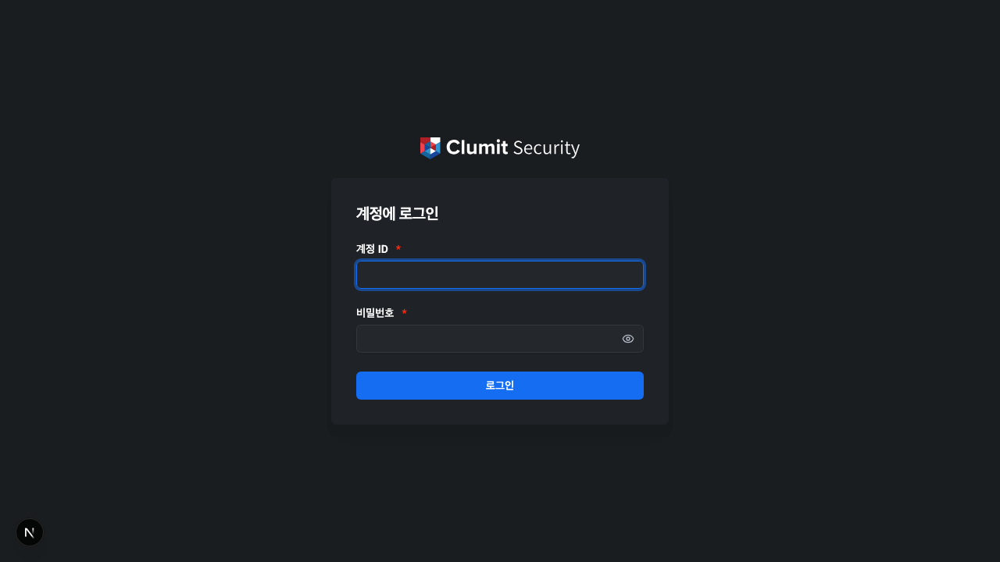
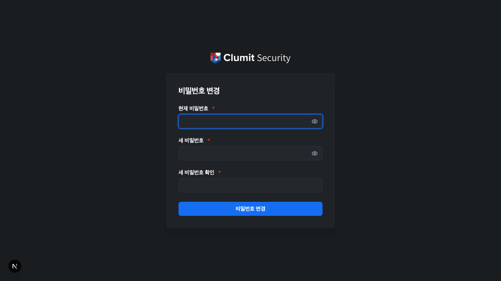

# 시작하기

이 페이지에서는 사전 요구 사항, 설치, 첫 로그인 방법을
안내합니다.

## 사전 요구 사항

| 구성 요소 | 버전 |
|-----------|------|
| Node.js | 24 이상 |
| PostgreSQL | 15 이상 |
| pnpm | 9 이상 |

두 개의 PostgreSQL 데이터베이스가 필요합니다:

- **auth_db** — 계정, 역할, 세션, 고객, 시스템 설정을
  저장합니다.
- **audit_db** — 변경 불가한 감사 로그 기록을 저장합니다.
  위변조 방지를 위해 제한된 데이터베이스 역할
  (`INSERT`/`SELECT` 전용)을 사용합니다.

## 설치

리포지터리를 클론하고 의존성을 설치합니다:

```bash
git clone https://github.com/aicers/aice-web-next.git
cd aice-web-next
pnpm install
```

예제 환경 파일을 복사하고 값을 채웁니다(자세한 내용은
[설정](configuration.md) 참조):

```bash
cp .env.example .env.local
```

애플리케이션을 빌드합니다:

```bash
pnpm build
```

## 데이터베이스 설정

두 개의 데이터베이스와 감사 전용 역할을 생성합니다:

```sql
CREATE DATABASE auth_db;
CREATE DATABASE audit_db;

-- audit_db 쓰기 역할 (INSERT/SELECT 전용)
CREATE ROLE audit_writer WITH LOGIN PASSWORD 'changeme';
GRANT CONNECT ON DATABASE audit_db TO audit_writer;
-- audit_db에 연결한 후:
GRANT USAGE ON SCHEMA public TO audit_writer;
ALTER DEFAULT PRIVILEGES IN SCHEMA public
  GRANT SELECT, INSERT ON TABLES TO audit_writer;
```

마이그레이션은 시작 시 자동으로 실행됩니다. 수동 마이그레이션
단계는 필요하지 않습니다.

## 초기 관리자 계정

첫 시작 시 `accounts` 테이블이 비어 있으면 AICE Web이 System
Administrator 계정을 생성합니다. 자격 증명은 다음 순서로
확인됩니다:

1. **Docker 시크릿 파일** (프로덕션 권장):
    - `/run/secrets/init_admin_username`
    - `/run/secrets/init_admin_password`
2. **환경 변수** (개발 환경에 편리):
    - `INIT_ADMIN_USERNAME`
    - `INIT_ADMIN_PASSWORD`

초기 계정은 `must_change_password`가 활성화된 상태로
생성됩니다. 첫 로그인 시 새 비밀번호를 설정하라는 안내가
표시됩니다.

계정이 생성된 후 시크릿 파일은 삭제됩니다(삭제가 불가능한
경우 `DATA_DIR`에 소비 마커가 기록됩니다). 계정이 하나라도
존재하면 부트스트랩 과정은 다시 실행되지 않습니다.

## 첫 실행

개발 서버를 시작합니다:

```bash
pnpm dev
```

또는 프로덕션 모드로 시작합니다:

```bash
pnpm build
pnpm start
```

브라우저에서 `http://localhost:3000`(또는 설정된 주소)을
엽니다. 로그인 페이지가 표시됩니다:



초기 관리자 자격 증명을 입력한 후 안내에 따라 새 비밀번호를
설정합니다:



비밀번호를 변경하면 대시보드로 리디렉션됩니다.
