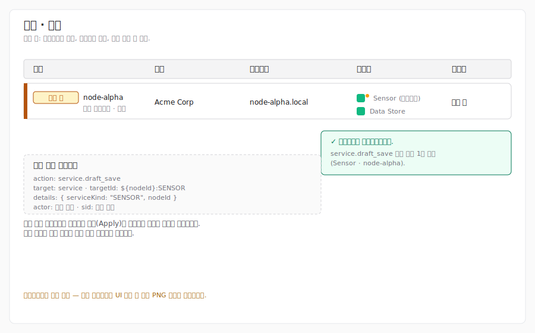
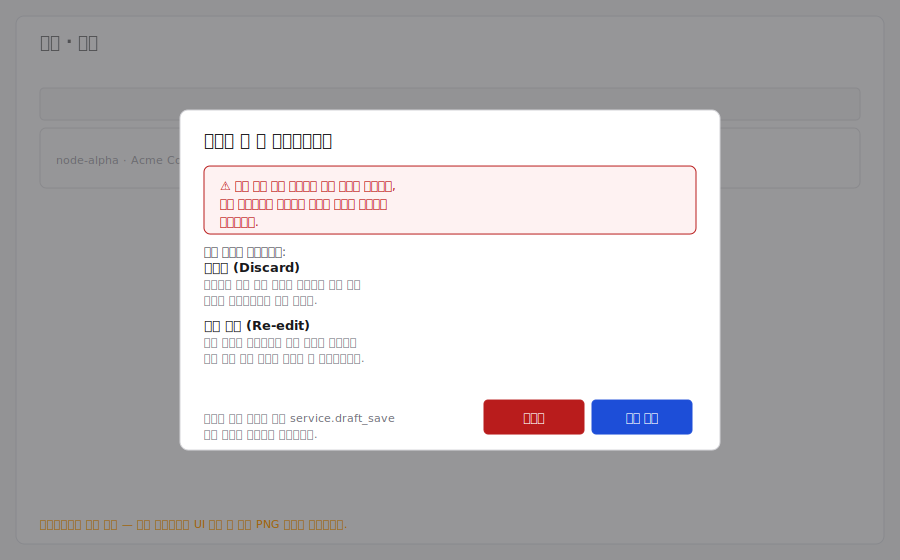

# 노드 관리

이 문서는 노드 기능의 **설정** 탭을 설명합니다. 노드/서비스 상태, 재시작/
종료, 서비스별 구성 편집기는 후속 단계에서 제공되며 해당 단계에 맞춰 문서가
추가됩니다.

## 권한

설정 탭은 **`nodes:read`** 와 **`services:read`** 권한을 모두 보유한 사용자만
접근할 수 있습니다. 둘 중 하나라도 없으면 403으로 리다이렉트됩니다. 빌트인
역할은 두 권한을 함께 부여합니다:

- **시스템 관리자(System Administrator)** — 전체 고객을 대상으로 전체 권한.
- **테넌트 관리자(Tenant Administrator)** — 할당된 고객 범위 내 전체 권한.
- **보안 모니터(Security Monitor)** — 할당된 고객 범위 내 읽기 전용. 목록은
  보이지만 추가/수정/삭제 기능은 나타나지 않습니다.

## 노드 목록

표에는 사용자가 접근 가능한 모든 노드가 표시됩니다. 각 행은 매니저에 적용된
값과 대기 중인 초안을 함께 보여 줍니다.

### 대기 중인 변경

적용 값과 다른 초안이 있는 행은 다음과 같이 표시됩니다.

- 왼쪽 가장자리에 **대기 중(Pending)** 배지.
- `이름`, `고객`, `설명`, `호스트명` 중 초안 값이 다른 셀은 두 줄로 표시되며
  적용 값은 취소선이 그어지고 그 아래에 초안 값이 나타납니다.
- 서비스 상태 아이콘 옆에 작은 황색 점이 표시되어 해당 서비스에 대기 중인
  초안이 있음을 알립니다.

표 위의 요약 칩 — "대기 중인 변경 N건" — 을 누르면 변경이 있는 행만
필터링됩니다.

### 상태 필터

표 위의 칩 그룹에서 다음 항목을 임의로 조합하여 선택할 수 있습니다.

- **대기 중** — 이름/프로필/에이전트/외부 서비스 중 어느 하나라도 초안이 적용
  값과 다른 행.
- **정상** / **응답 없음** — 페이지 렌더 시 한 번 가져온 `nodeStatusList`
  ping 정보로 결정됩니다. ping 데이터가 도착하기 전에는 접근성 친화적인
  비활성 상태로 표시되며, Phase Node-6 폴링 훅이 도입되면 실시간 데이터로
  전환됩니다.

### 검색과 정렬

검색창은 적용 값과 초안 값 모두에서 이름·호스트명·고객을 대소문자 구분 없이
매칭합니다. 정렬 드롭다운으로 **최신순**, **이름순**, **호스트명순** 으로
정렬할 수 있습니다.

### 고객(테넌트) 필터

시스템 관리자에게는 고객별 필터 드롭다운이 추가로 표시됩니다. 테넌트
관리자는 이미 소속 고객 범위로 자동 한정되므로 드롭다운이 표시되지 않습니다.

### 매니저 열

오른쪽 끝 열은 `NodeStatus.manager` 값으로부터 도출된 상태 전용 배지입니다.

- **실행 중(Running)** — 노드의 매니저 프로세스에 정상적으로 도달.
- **중지됨(Not running)** — 매니저가 살아 있다고 보고되지 않음.

v1에서는 매니저에 대해 UI에서 편집 가능한 초안이 없으므로 대기 중 배지나
케밥 메뉴가 매니저 셀에 표시되지 않습니다.

## 일괄 삭제

행 왼쪽 체크박스로 한 개 이상의 행을 선택하면 페이지 상단에 떠 있는 막대가
나타납니다.

- "N개 선택됨" 카운터.
- 확인 모달을 여는 **선택 삭제** 동작.
- 선택을 해제하는 **취소** 동작.

일괄 삭제를 확정하면 각 노드를 개별 삭제합니다. 성공한 삭제마다 노드 ID와
`details: { hostname }` 정보를 포함한 `node.delete` 감사 로그 항목이 한 건씩
기록됩니다. 실패한 삭제는 감사 로그를 남기지 않습니다.

`nodes:delete` 권한이 없는 사용자(보안 모니터)에게는 체크박스 열 자체가
표시되지 않으므로 일괄 삭제 진입 단계가 노출되지 않습니다.

## 행별 수정 / 삭제

행 케밥 메뉴는 **수정**(생성/수정 다이얼로그를 엽니다)과 **삭제**(단일 행
삭제 확인 모달을 엽니다)를 제공합니다. 권한이 없는 사용자에게는
`nodes:write` / `services:write` 또는 `nodes:delete` 부재에 따라 해당 항목이
숨겨집니다.

## 매니저 연결 끊김

상위 매니저에 연결할 수 없으면 표 영역이 "매니저에 연결할 수 없습니다" 패널로
대체됩니다. 사이드바와 노드 탭 바는 그대로 표시되어 다른 화면으로 이동할 수
있습니다.

## 드래프트 저장

수정 다이얼로그는 매니저에 직접 변경을 기록하지 않습니다. 저장은 항상 *드래프
트*(다음 상태 후보)로 보존되며, 목록 페이지에서 검토한 뒤 적용(Apply) 단계에서
실제로 반영됩니다. 드래프트 저장에는 `nodes:write` 와 `services:write` 권한이
모두 필요하며, 빌트인 **테넌트 관리자**와 **시스템 관리자** 역할은 두 권한을
함께 부여받습니다.

위 도식은 SVG 와이어프레임 대체 자료입니다. 수정 다이얼로그 UI는 동일한 Phase
Node-9 단계의 다른 서브 이슈에서 구현되며, 해당 PR이 머지된 뒤 `docs/
AUTHORING.md` 의 로컬 REview 절차에 따라 실제 PNG 캡처로 교체합니다.

### 저장 시 전송되는 내용

**저장**을 누르면 BFF는 매니저에 `updateNodeDraft(id, old, new)` 한 건을
보냅니다. `old` 는 다이얼로그가 열릴 때의 적용 상태 스냅샷이고, `new` 에는
이름·프로필·에이전트·외부 서비스 드래프트의 변경 후보가 들어 있습니다. 매니저
는 compare-and-swap 검증을 수행하여 `old` 가 서버의 최신 적용 상태와 일치
하지 않으면 *stale conflict* 로 거절합니다. 따라서 로컬 편집 내용이 조용히
덮어써지는 일은 없습니다.

### 감사 로그에 남는 기록

저장 한 번마다, *드래프트 문자열이 실제로 변경된 서비스* 별로 **`service.
draft_save`** 감사 항목이 한 건씩 기록됩니다. 두 개 서비스를 동시에 수정한
저장은 두 건을 남기고, 노드 메타데이터(이름/고객/설명/호스트명)만 변경하는
저장은 `service.draft_save` 항목을 남기지 않습니다. 각 항목은
`targetId = "${nodeId}:${serviceKind}"` 와 `details = { serviceKind, nodeId }`
형태로 기록되므로 운영자는 특정 노드의 특정 서비스만 필터링하여 조회할 수
있습니다.

### Stale-conflict 재시도와 사용자 화면

다이얼로그가 열린 시점과 **저장**을 누르는 시점 사이에 다른 사용자(동료, 스크
립트, 다른 브라우저 탭 등)가 같은 노드의 드래프트를 저장하면, 첫 번째 호출은
stale conflict 로 거절됩니다. BFF는 최신 노드 상태를 다시 읽어 현재 사용자의
편집을 새 기준 위에 한 번만 자동 재시도합니다. 한 번의 재시도로 성공하면
사용자에게는 별도 안내가 표시되지 않고 저장이 정상적으로 완료됩니다.

위 그림 역시 정상 흐름 그림과 동일한 사유로 SVG 와이어프레임 대체 자료를 사용
합니다. 수정 다이얼로그 UI를 추가하는 후속 PR에서 실제 캡처로 교체됩니다.

재시도까지 또 다시 충돌하면(그 사이 또 다른 사용자가 저장한 경우) 다이얼로그
는 진행을 멈추고 재조정 프롬프트를 표시합니다.

- **버리기(Discard)** — 저장하지 않은 편집 내용을 폐기하고 최신 적용 상태로
  다이얼로그를 다시 엽니다.
- **다시 수정(Re-edit)** — 편집 내용은 유지한 채 기준 상태만 갱신합니다. 이
  후 최신 서버 상태와 필드 단위로 차이를 확인한 뒤 저장을 다시 시도할 수 있
  습니다.

두 번 연속 충돌하여 실패한 저장은 `service.draft_save` 감사 항목을 남기지
않습니다. 감사 로그에는 성공한 저장만 기록됩니다.
