# 노드 관리

이 문서는 노드 기능의 **상태** 탭과 **설정** 탭을 설명합니다. 서비스별 구성
편집기와 서비스별 on/off 제어는 후속 단계에서 제공되며 해당 단계에 맞춰
문서가 추가됩니다.

## 권한

두 탭 모두 **`nodes:read`** 와 **`services:read`** 권한을 모두 보유한 사용자만
접근할 수 있습니다. 둘 중 하나라도 없으면 URL은 그대로 유지된 채 HTTP 403이
반환되고, 표 대신 현지화된 "권한 없음" 패널이 표시됩니다. 빌트인 역할은 두
권한을 함께 부여합니다:

- **시스템 관리자(System Administrator)** — 전체 고객을 대상으로 전체 권한.
- **테넌트 관리자(Tenant Administrator)** — 할당된 고객 범위 내 전체 권한.
- **보안 모니터(Security Monitor)** — 할당된 고객 범위 내 읽기 전용. 목록은
  보이지만 추가/수정/삭제 기능은 나타나지 않습니다.

## 노드 목록

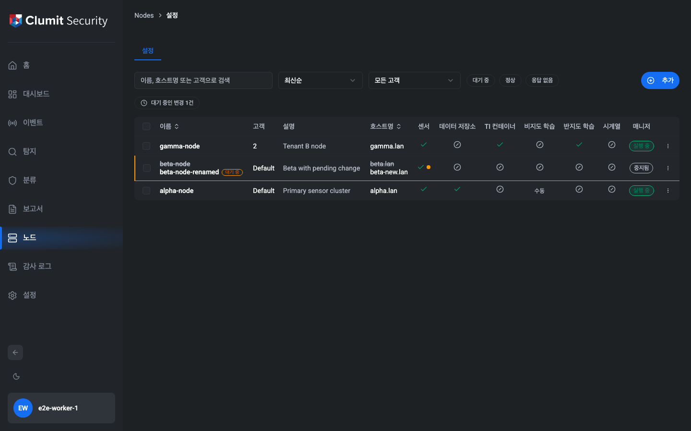

표에는 사용자가 접근 가능한 모든 노드가 표시됩니다. 각 행은 매니저에 적용된
값과 대기 중인 초안을 함께 보여 줍니다.

### 대기 중인 변경

적용 값과 다른 초안이 있는 행은 다음과 같이 표시됩니다.

- 왼쪽 가장자리에 **대기 중(Pending)** 배지.
- `이름`, `고객`, `설명`, `호스트명` 중 초안 값이 다른 셀은 두 줄로 표시되며
  적용 값은 취소선이 그어지고 그 아래에 초안 값이 나타납니다.
- 서비스 상태 아이콘 옆에 작은 황색 점이 표시되어 해당 서비스에 대기 중인
  초안이 있음을 알립니다.

표 위의 요약 칩 — "대기 중인 변경 N건" — 을 누르면 변경이 있는 행만
필터링됩니다.

### 상태 필터

표 위의 칩 그룹에서 다음 항목을 임의로 조합하여 선택할 수 있습니다.

- **대기 중** — 이름/프로필/에이전트/외부 서비스 중 어느 하나라도 초안이 적용
  값과 다른 행.
- **정상** / **응답 없음** — 페이지 렌더 시 한 번 가져온 `nodeStatusList`
  ping 정보로 결정됩니다. ping 데이터가 도착하기 전에는 접근성 친화적인
  비활성 상태로 표시되며, Phase Node-6 폴링 훅이 도입되면 실시간 데이터로
  전환됩니다.

### 검색과 정렬

검색창은 적용 값과 초안 값 모두에서 이름·호스트명·고객을 대소문자 구분 없이
매칭합니다. 정렬 드롭다운으로 **최신순**, **이름순**, **호스트명순** 으로
정렬할 수 있습니다.

### 고객(테넌트) 필터

시스템 관리자에게는 고객별 필터 드롭다운이 추가로 표시됩니다. 테넌트
관리자는 이미 소속 고객 범위로 자동 한정되므로 드롭다운이 표시되지 않습니다.

### 매니저 열

오른쪽 끝 열은 `NodeStatus.manager` 값으로부터 도출된 상태 전용 배지입니다.

- **실행 중(Running)** — 노드의 매니저 프로세스에 정상적으로 도달.
- **중지됨(Not running)** — 매니저가 살아 있다고 보고되지 않음.

v1에서는 매니저에 대해 UI에서 편집 가능한 초안이 없으므로 대기 중 배지나
케밥 메뉴가 매니저 셀에 표시되지 않습니다.

## 일괄 삭제

행 왼쪽 체크박스로 한 개 이상의 행을 선택하면 페이지 상단에 떠 있는 막대가
나타납니다.

- "N개 선택됨" 카운터.
- 확인 모달을 여는 **선택 삭제** 동작.
- 선택을 해제하는 **취소** 동작.

일괄 삭제를 확정하면 각 노드를 개별 삭제합니다. 성공한 삭제마다 노드 ID와
`details: { hostname }` 정보를 포함한 `node.delete` 감사 로그 항목이 한 건씩
기록됩니다. 실패한 삭제는 감사 로그를 남기지 않습니다.

`nodes:delete` 권한이 없는 사용자(보안 모니터)에게는 체크박스 열 자체가
표시되지 않으므로 일괄 삭제 진입 단계가 노출되지 않습니다.

## 행별 수정 / 삭제

행 케밥 메뉴는 **수정**(생성/수정 다이얼로그를 엽니다)과 **삭제**(단일 행
삭제 확인 모달을 엽니다)를 제공합니다. 권한이 없는 사용자에게는
`nodes:write` / `services:write` 또는 `nodes:delete` 부재에 따라 해당 항목이
숨겨집니다.

## 매니저 연결 끊김

상위 매니저에 연결할 수 없으면 표 영역이 "매니저에 연결할 수 없습니다" 패널로
대체됩니다. 사이드바와 노드 탭 바는 그대로 표시되어 다른 화면으로 이동할 수
있습니다.

## 노드 생성과 편집

설정 목록의 **추가** 버튼은 생성/편집 다이얼로그를 열고, 행별 케밥 메뉴의
**편집** 항목은 정식 노드 페이로드로 사전 채워진 동일한 다이얼로그를 엽니다.
두 표면 모두 `nodes:write` 와 `services:write` 두 권한을 **모두** 요구합니다.
둘 중 하나라도 없는 호출자는 **추가** 버튼을 보지 못하며, 편집 URL 로 직접
이동하면 HTTP 403 으로 거절됩니다.

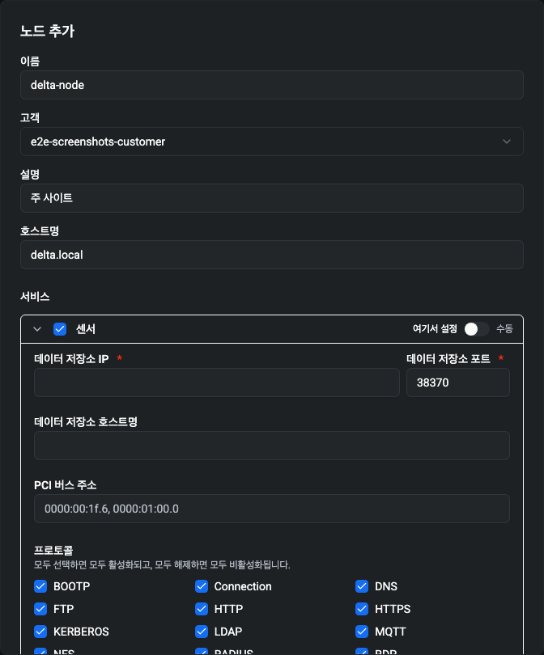

### 노드 메타데이터

다이얼로그 상단에서 `decisions/node-field-catalog.md` 가 정의하는 네 가지
메타데이터 필드를 수집합니다.

- **이름** — 필수, 최대 32자, 노드 간 유일. 유일성 사전 확인은 현재 보이는
  목록에 대해 수행되며, 매니저가 저장 시 최종 확인하고 충돌이 발생하면 다이얼
  로그가 해당 필드로 다시 스크롤합니다.
- **고객** — 필수, 단일 선택. 테넌트 관리자는 자신의 계정에 할당된 고객만
  보고, 시스템 관리자는 모든 고객을 봅니다.
- **설명** — 선택, 최대 64자.
- **호스트명** — 필수, 최대 64자, 소문자 `[a-z0-9-.]` 만 허용, 선·후행 `.` /
  `-` 금지, 연속된 특수문자 금지.

각 필드 아래에 입력 도중 인라인 오류가 표시되며, 서버가 보고한 충돌은 다시
해당 필드로 스크롤되어 상위 메시지가 인라인으로 표시됩니다.

### 서비스 아코디언

메타데이터 블록 아래에는 서비스마다 접을 수 있는 섹션이 있습니다. 헤더에는
다음 항목이 있습니다.

- 이 노드에 해당 서비스의 **멤버십** — 즉 노드가 그 서비스를 호스팅할지
  여부 — 을 켜거나 끄는 **체크박스**. 이는 설정 결정이며, Phase Node-8 가
  도입할 서비스별 런타임 on/off 와는 다릅니다.
- 센서 / 준지도 학습 엔진 / 시계열 생성기 의 경우 **여기서 설정 / 수동**
  스위치. **수동** 으로 설정하면 패널이 정보 카드로 접힙니다 — *"이 서비
  스는 노드의 로컬 TOML 파일에서 설정을 읽습니다. aice-web-next 에서는
  확인하거나 편집할 수 없습니다."* 그리고 매니저로 보내는 드래프트는 빈
  문자열입니다. **비지도 학습 엔진** 은 항상 정보 카드만 표시되며 스위치가
  없습니다.

### 취소와 저장

**취소** 를 클릭하면 모든 편집 사항이 폐기되고 감사 항목은 남지 않습니다 —
설정 모드를 토글한 뒤 취소해도 `service.set_mode` 행은 남지 **않습니다**.
**저장** 을 클릭하면 폼 전체 검증이 실행되고, 모두 통과한 경우에만 BFF 를
통해 생성/수정 mutation 이 디스패치됩니다.

성공한 생성은 정확히 하나의 `node.create` 감사 행을 남깁니다. 성공한 편집은
`name` / `customer` / `description` / `hostname` 중 하나라도 변경된 경우에만
하나의 `node.update` 행을 남깁니다. 서비스 드래프트만 변경하는 편집은
`node.update` 행을 0건 남깁니다(대신 Phase Node-9 가 소유하는 서비스별
`service.draft_save` 행이 발행됩니다). 사용자가 에이전트 서비스의 **여기서
설정 / 수동** 스위치를 토글했고 저장이 성공했다면, 순 변경된 서비스마다
하나의 `service.set_mode` 행이 발행됩니다.

### 서버 충돌 매핑

REview 의 GraphQL 표면은 유일성 / 범위 충돌에 대해 평문 오류 메시지를
반환합니다. BFF 는 `decisions/node-conflict-patterns.md` 의 패턴 표에 대해
각 메시지를 매칭하여 타입드 오류를 정확한 필드로 라우팅합니다.

- **이름 유일성** → 이름 필드 아래 인라인.
- **호스트명 유일성** → 호스트명 필드 아래 인라인.
- **고객 범위 / 미존재** → 고객 필드 아래 인라인.
- **수정 시 stale-conflict** → 다이얼로그가 **편집 버리고 새로고침** 과
  **계속 편집** 액션을 제공하는 전용 재조정 프롬프트를 표시합니다(일반
  풋터 배너와 분리). 단발성 재시도는 Phase Node-9 서버 액션이 처리하며,
  재시도까지 충돌하면 본 프롬프트가 노출됩니다(아래 *드래프트 저장* 참조).
  두 액션 모두 진행 전에 `GET /api/nodes/[id]` 를 호출하여 정식 기준
  상태(baseline)를 새로고침합니다 — **편집 버리고 새로고침** 은 새로
  가져온 노드로 폼을 다시 시드합니다(사용자의 진행 중 편집은 폐기됩니다).
  **계속 편집** 은 사용자가 직접 편집한 필드의 값은 그대로 유지하면서,
  사용자가 만지지 않은 노드 메타데이터 필드는 새로고친 기준 상태에 맞춰
  다시 정렬합니다. 그래야 다음 저장이 사용자가 변경하지 않은 필드에서
  새로고침 직전의 값을 덮어쓰지 않고 현재 서버 상태를 반영합니다. 기준
  상태도 함께 새로고쳐 다음 저장의 `old` 페이로드가 동일한 CAS 검사를
  다시 트립하지 않고 현재 서버 상태와 일치하도록 합니다. 두 경우 모두
  다이얼로그는 열린 채로 유지되며, 새로고침이 진행되는 동안 저장
  버튼은 비활성화됩니다.
- **에이전트 미존재** → BFF가 업스트림의 `agent <key> not found` 메시지를
  `serviceKindFromAgentNotFound` 로 서비스 레지스트리 종류에 매핑해, 다이
  얼로그가 해당 아코디언 섹션 안에 인라인 오류를 고정합니다. 식별자가
  알려진 에이전트와 일치하지 않으면 메시지는 폼 단위 배너로 강등됩니다.

매칭되지 않은 메시지는 풋터 위 폼 단위 배너 한 건으로 노출됩니다.

## 드래프트 저장

이 절은 BFF의 **드래프트 저장 서버 액션** 을 설명합니다. 위 절의 편집
다이얼로그가 주된 호출자이며, 본 절에서 설명하는 계약은 스크립트와 자동화
에도 동일하게 적용됩니다.

### 권한

드래프트 저장 액션은 `nodes:write` 와 `services:write` 두 권한을 **모두**
요구합니다. 둘 중 하나라도 없는 호출은 BFF 경계에서 GraphQL 디스패치 이전에
타입드 `NodePermissionError` 로 거절됩니다. 빌트인 **테넌트 관리자** / **시
스템 관리자** 역할은 두 권한을 함께 부여하며, **보안 모니터** 는 둘 다 보유
하지 않습니다. 고객 범위는 디스패치 컨텍스트의 `customer_ids` 를 통해 매니저
DB가 강제하며, 범위 밖 노드는 호출자에게 타입드 `NodeNotFoundError` 로 노출
됩니다.

### CAS 계약 (`updateNodeDraft(id, old, new)`)

저장 한 번마다 매니저로 `updateNodeDraft(id, old, new)` 호출 한 건이 발송됩니
다. `old` 는 호출자가 편집을 시작한 시점의 **전체 노드 스냅샷** 입니다 —
적용 상태뿐 아니라 현재 드래프트(이름 드래프트, 프로필 드래프트, 서비스별
`status` 와 `draft`)까지 포함합니다. `new` 는 이름·프로필·에이전트·외부
서비스 드래프트의 변경 후보입니다. 매니저는 이 스냅샷 전체에 대해
compare-and-swap 을 수행하며, 현재 서버 스냅샷이 `old` 와 일치하지 않으면 —
다른 사용자의 드래프트만 변경된 경우라도 — *stale conflict* 로 거절합니다.
사용자 편집은 절대 조용히 덮어써지지 않습니다.

### `service.draft_save` 감사 항목

저장이 성공하면 *드래프트 문자열이 실제로 변경된 서비스* 별로 **`service.
draft_save`** 감사 항목이 한 건씩 기록됩니다. 두 서비스를 동시에 수정한 저장
은 두 건을 남기고, 노드 메타데이터(이름/고객/설명/호스트명)만 변경하는 저장은
`service.draft_save` 항목을 남기지 않습니다. 각 항목은
`targetId = "${nodeId}:${serviceKind}"` 와 `details = { serviceKind, nodeId }`
형태로 기록되므로 운영자는 특정 노드의 특정 서비스만 필터링하여 조회할 수
있습니다. 권한 경계, 고객 범위 검사, 또는 아래의 이중 stale-conflict 로
실패한 저장은 **`service.draft_save` 항목을 남기지 않습니다**.

### Stale-conflict 자동 재시도

첫 번째 `updateNodeDraft` 호출이 문서화된 stale-conflict 형태(자세한 내용은
`decisions/node-conflict-patterns.md`)로 거절되면, BFF는 자동으로 최신 노드
상태를 다시 읽어 호출자의 의도를 새 기준 위에 다시 정렬한 뒤 한 번만 재시도
합니다. 재정렬은 행 단위가 아니라 **필드 단위** 로 이루어집니다. 예를 들어
호출자가 어떤 서비스의 `draft` 만 수정하고 다른 사용자가 같은 서비스의
`status` 만 뒤집었다면, 재시도 페이로드는 `{fresh status, user draft}` 형태로
나갑니다. 프로필 하위 필드(`customerId` / `description` / `hostname`) 도 동
일한 규칙입니다. 호출자가 항목을 새로 추가하거나 제거한 경우에 한해 행 단위
fallback이 적용됩니다(보간할 fresh 하위 필드가 없기 때문).

재정렬된 페이로드가 편집 가능한 영역에서 fresh 정상태와 바이트 단위로 동일
하면 — 동일한 페이로드를 중복 재시도한 경우가 여기에 해당합니다 — 재시도
mutation은 **발송되지 않으며** 추가 감사 항목도 남지 않습니다.

### 이중 충돌 시 `StaleConflictError`

재시도까지 또 다시 stale-conflict 형태로 거절되면 서버 액션은 진행을 중단하
고 타입드 `StaleConflictError` 를 throw 하며 감사 항목을 남기지 않습니다.
호출자(수정 다이얼로그 또는 향후 자동화)는 자동 재시도 대신 사용자에게 재
조정 선택지를 노출해야 합니다 — 로컬 편집을 폐기하고 새로 불러오거나, 편집
은 유지한 채 기준 상태만 갱신합니다. 이 선택지의 시각적 표면은 다이얼로그를
구현하는 서브 이슈가 소유합니다.

### 편집 다이얼로그 — 저장 정상 경로와 stale-conflict 프롬프트

이 다이얼로그는 Phase Node-9b (PR #366) 가 미루어 둔 스크린샷 부채를
해소합니다. 아래 저장 정상 경로 캡처는 저장 후 상태를 보여줍니다 —
다이얼로그가 닫히고 설정 목록 화면이 복원된 시점이며, 이때 위 절이 설명
하는 `node.update` / `service.draft_save` 감사 항목이 BFF 에서 발행됩
니다. 캡처는 진행 중 편집 상태가 아니라 다이얼로그가 정상적으로 닫힌
이후에 촬영되어 "저장이 성공했다"는 결과를 그대로 반영합니다.

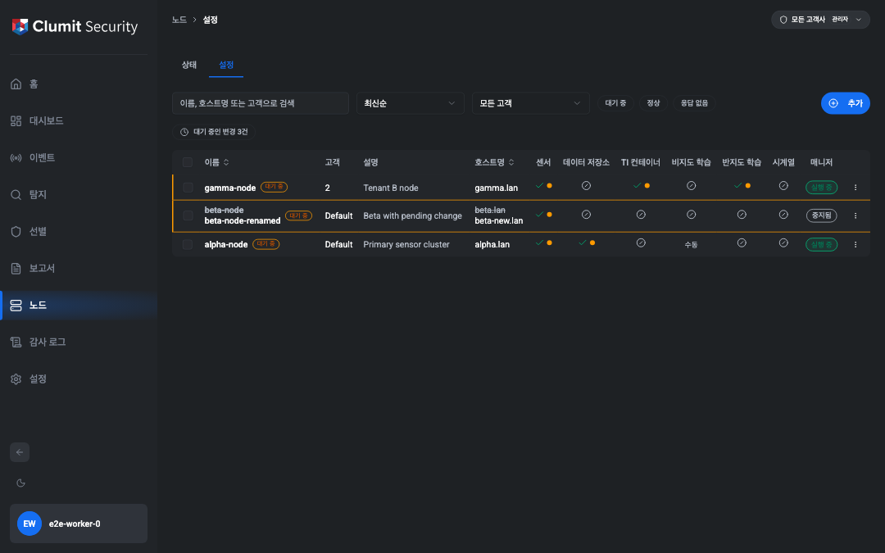

stale-conflict 재조정 프롬프트는 BFF 의 1회 재시도까지 CAS 검사에 걸렸을
때 노출되며, `docs/AUTHORING.md` 가 정의하는 모의 GraphQL 캡처 경로로
촬영되었습니다.

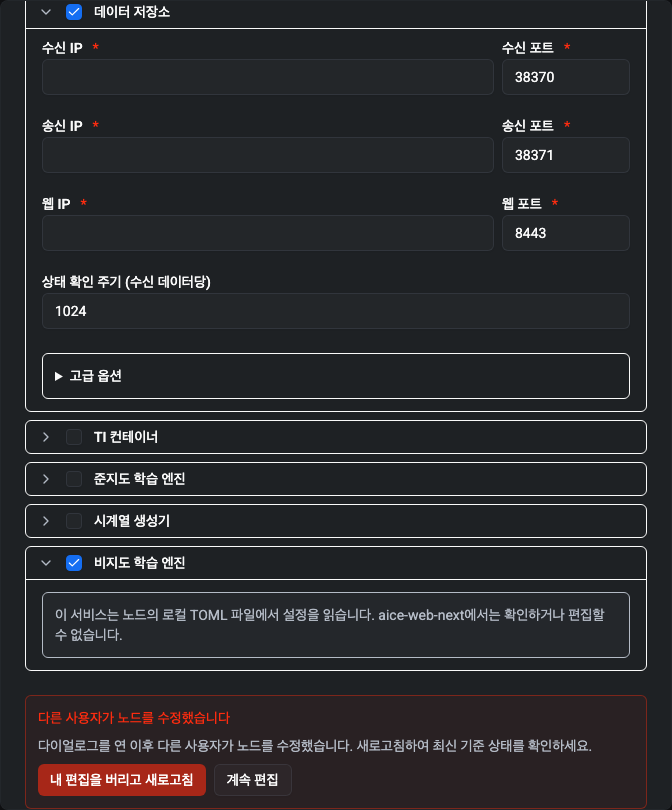

## 일괄 적용

이 절은 노드의 대기 중인 드래프트를 한 번의 작업으로 적용하는 **일괄 적용
실행기**를 설명합니다. 이 흐름을 여는 사용자용 모달은 동일한 Phase Node-9
의 다른 서브 이슈에서 구현되며, 본 브랜치에서는 아직 렌더링되지 않습니다.
아래는 향후 모달 또는 자동화 호출자가 의존하게 될 BFF 계약과, 적용이 실제
로 발생하기 시작했을 때 운영자가 감사 로그에서 보게 될 항목의 형태입니다.

> **스크린샷 부채.** 적용 미리보기 모달, 라이프사이클 배지, 재시도/재구성
> 프롬프트는 모달 UI를 구현하는 서브 이슈가 소유합니다. 적용 정상 경로,
> 부분 실패 프롬프트, 재구성 프롬프트 상태의 캡처는 해당 서브 이슈의 PR에
> 서 `docs/AUTHORING.md` 절차에 따라 본 절에 추가됩니다.

### 일괄 적용이 수행하는 작업

일괄 적용은 사용자가 한 번 확정한 결과로 세 단계의 fan-out 디스패치를 실행
합니다.

1. **매니저 DB 단계.** 상위 매니저의 `applyNodeDraft` mutation 을 디스패치
   하여 노드의 모든 대기 중 드래프트(이름, 프로필, 에이전트, 외부 서비스)를
   매니저 DB의 적용 상태로 원자적으로 승격합니다. `draft` 가 `null` 인
   에이전트 또는 외부 서비스(운영자의 삭제 의도)는 이 단계에서 노드로부터
   **제거** 됩니다.
2. **매니저 알림 단계.** 상위 매니저의 `applyAgentConfig` mutation 을 디스
   패치하여 승격 후 `config` 가 `Some(non-empty)` 인 모든 에이전트에 변경
   사항을 알리며, 에이전트는 새 설정을 다시 가져옵니다. 노드의 `hostname`
   이 비어 있으면 이 mutation 은 호출을 거부하며 디스패치는 즉시
   `failed_terminal` 로 표시됩니다(운영자가 프로필을 수정하기 전까지는
   재시도해도 성공할 수 없기 때문입니다).
3. **외부 서비스 단계.** 적용 빌드 시점에 비-null `draft` 가 있던 각 외부
   서비스(Giganto 는 `DATA_STORE`, Tivan 은 `TI_CONTAINER`) 에 대해 상위
   서비스의 `updateConfig(old, new)` mutation 을 디스패치합니다. `old` 는
   디스패치 시마다(재시도 포함) 서비스에서 fresh 하게 다시 읽고, `new` 는
   적용 빌드 시점에 캡처된 frozen 드래프트 문자열로 절대 다시 읽지 않습니다.

디스패치는 계획 순서대로 순차적으로 진행됩니다. 매니저 DB가 먼저, 그 다음에
매니저 알림, 그리고 각 외부 서비스가 실행됩니다. 매니저 DB 단계는 이후의
모든 단계를 게이트합니다. DB 단계가 실패하면 알림이나 외부 서비스
디스패치는 시도되지 않습니다. **DB 단계가 성공한 이후의 디스패치들은 서로
독립적입니다.** 알림 디스패치가 실패해도 외부 서비스 디스패치는 차단되지
않고, 한 외부 서비스의 실패가 다른 외부 서비스를 차단하지도 않습니다.
DB 이후의 각 디스패치는 자신의 상태를 기록하며, 실행기는 같은 claim 하에서
다음 queued 디스패치로 진행합니다. 행 전체의 상태는 모든 디스패치가
시도된 후 디스패치별 결과의 집계로 결정됩니다. 두 매니저 단계는 독립적으로
관측되고 재시도 가능합니다. 운영자가 DB 단계가 이미 성공한 행의 알림
디스패치만 재시도하면 DB mutation 은 다시 실행되지 않습니다.

### 권한과 테넌트 범위

일괄 적용은 **`nodes:write`** 와 **`services:write`** 를 모두 요구합니다.
이 통합 게이트는 적용 빌드 시점뿐 아니라 모든 confirm / retry 시점에 다시
검증됩니다. 적용 빌드와 확정 사이에 권한이나 고객 범위가 변경된 호출자는
GraphQL 디스패치가 발송되기 전에 타입드 `NodePermissionError` 로 거절됩니
다.

재검증은 두 계층에서 수행됩니다.

1. **테넌트 범위 재구성.** 모든 confirm / retry 호출은 호출자의 현재 세션
   에서 dispatch context 를 다시 빌드하여 `customer_ids` 와
   `customers:access-all` 보유 여부를 다시 결정합니다. `customers:access-all`
   이 없으면서 테넌트 범위가 비어 있는 호출자는 어떤 노드도 읽기 전에 거절
   됩니다.
2. **노드 단위 범위 검사(및 존재 확인).** 그 다음 래퍼는 **여전히 디
   스패처에 도달할 수 있는 상태인 경우에만** — confirm 은 `pending`,
   retry 는 `failed_retryable` — 매니저 DB 에서 정식 노드를 다시
   읽습니다. 종료 / 멱등 상태(`succeeded`, `failed_terminal`,
   `stale`, `expired`, `executing`) 에서는 라이프사이클이 영속된 행을
   멱등하게 반환하거나 디스패치 없이 거절하므로 정식 노드 읽기는 불필
   요하며, 만약 그 경로를 강제하면 이미 `succeeded` 인 행에 대한 멱등
   재확정이 노드가 나중에 삭제될 경우 잘못된 `NodeNotFoundError` 로
   거절됩니다(라운드 8). 또한 이 상태들에서 읽기를 건너뛰는 것은 감사
   회수 마무리 경로를 보존합니다. 감사 발행이 완료되지 않은 `succeeded`
   행에 대한 후속 confirm / retry 는 노드가 삭제된 뒤에도 `node.apply`
   를 내구성 있게 만들 수 있어야 합니다.

   테넌트 범위 호출자는 노드의 `customerId` 를 다시 가져와 호출자의
   *현재* 범위와 비교하고, 전역 범위 호출자
   (`customers:access-all`) 는 동일한 읽기를 **존재 확인**으로만 수행
   합니다. 적용할 테넌트 경계는 없지만 confirm 과 이후의 retry 사이에
   노드가 삭제되지 않았는지 보장하기 위해 읽기는 그대로 수행합니다. 이
   검사는 외부 서비스 재시도(`retryDispatch`) 에 특히 중요합니다. 외부
   디스패처는 배포 전체에 걸친 Giganto / Tivan 엔드포인트와 통신하며
   자체적인 per-node 가드가 없기 때문입니다. 래퍼 단계의 이 재검증이
   없으면 confirm 과 retry 사이에 고객 범위가 축소된 액터가 범위 밖
   노드에 대해 `updateConfig` 를 계속 발송할 수 있고, 전역 범위 액터는
   *삭제된* 노드에 대해 `updateConfig` 를 계속 발송하면서 그 노드에 대한
   `node.apply` 감사 로그까지 발행할 수 있습니다. `customerId` 와 존재
   판정 모두 매니저 DB 에서 읽으므로 위조된 클라이언트 페이로드로 우회
   할 수 없습니다. 테넌트 범위 호출자에 대해서는 review-web 이 범위 밖
   노드에 대해 응답할 수 있는 두 가지 형태 — 필터링된 `null` 페이로드
   와 `NOT_FOUND` GraphQL 에러 — 를 모두 `NodePermissionError` 로 매핑
   합니다(시도 생성 면과 동일). 따라서 래퍼는 호출자에게 "이 노드는
   존재하지만 볼 수 없다" 는 의미를 절대 노출하지 않습니다. 전역 범위
   호출자에게는 삭제된 노드 읽기가 `NodeNotFoundError` 로 표면화됩니다
   (감출 범위-축소 의미가 없습니다).

일괄 적용은 **단일 액터** 입니다. 계획을 빌드한 계정만 확정하거나 재시도할
수 있습니다. 같은 `attemptId` 를 다른 계정이 제시하면 BFF는 해당 행이 존재
하는지 노출하지 않기 위해 `ApplyAttemptNotFoundError` 로 거절합니다.

### 라이프사이클 상태

확정된 적용은 하나의 **재개 가능** 상태와 세 가지 **종료** 상태로 진행됩
니다. 종료 상태는 `succeeded`, `failed_terminal`, `stale` 세 가지뿐이며,
`failed_retryable` 은 원래의 시간 창 내에서 재개 가능한 비-종료 상태입니다.

- **`failed_retryable`** *(재개 가능, 비-종료)* — 외부 서비스의 일시적
  실패로 fan-out 이 멈췄으며 원래 시간 창 내에서 재시도가 가능합니다.
  동일한 액터가 실패한 디스패치 ID로 재시도
  (`retryDispatch({ attemptId, dispatchId })`)를 호출하여 이어서 실행할
  수 있습니다. 적용 빌드 시점의 frozen `new` 가 그대로 전송되며 `old`
  만 fresh 하게 다시 읽힙니다. 매니저 단계가 이미 성공했다면 다시 실행
  되지 **않습니다**. 디스패치별 한도 내의 연속 재시도는 행을 `succeeded`
  또는 `failed_terminal` 로 이끕니다. 원래의 시간 창은 일시 실패 동안
  유지되며 창 밖에서 제출된 재시도는 stale-plan 오류로 거절됩니다.
- **`succeeded`** *(종료)* — 모든 디스패치가 성공했습니다. `node.apply`
  감사 항목이 정확히 한 건 기록됩니다(아래 참조). 행은 운영자가 조회할
  수 있는 일정 기간 동안 보관된 후 정리 스윕에서 hard-delete 됩니다.
- **`failed_terminal`** *(종료)* — 디스패치별 재시도 한도에 도달했거나,
  복구 스윕이 멈춘 클레임을 회수했거나, 행이 `expires_at` 을 지나
  TTL-종료된 경우입니다. 더 이상 상태가 변하지 않으며, 운영자는 fresh 한
  미리보기에서 계획을 다시 빌드해야 합니다. 모달은 이 상태에 대해
  "재구성" 프롬프트를 노출합니다.
- **`stale`** *(종료)* — 적용 빌드와 적용 확정 사이의 fingerprint 가
  어긋난 경우입니다. 실행기가 post-claim fingerprint 재계산(단계 5b)
  에서 불일치가 지속됨을 감지하면 이 상태가 기록되며, 호출은 타입드
  `StalePlanError` 로 거절됩니다. 매니저 mutation 도 외부 mutation 도
  발송되지 않습니다. 사전 힌트가 어긋났더라도 post-claim 재계산 시점
  까지 drift 가 정착되었다면 그대로 진행됩니다 — 재계산이 권위 있는
  판단입니다. 모달은 이 상태에 대해서도 "재구성" 프롬프트를 노출합니다.

### `node.apply` 감사 항목

성공적인 적용은 정확히 **한 건** 의 `node.apply` 감사 항목을 기록합니다.
하나의 `confirmApplyAttempt` 만으로 도달했든, confirm 이후 여러 번의
`retryDispatch` 가 합쳐져 도달했든, 이미 `succeeded` 인 행에 대한 (예:
이중 클릭으로 인한) 재확정 호출이 있더라도 한 건만 기록됩니다. "정확히
한 번" 계약은 서로 보완하는 두 계층으로 강제됩니다.

**계층 A — 스키마 수준 중복 제거 (권위적).** `audit_logs` 에는
`(correlation_id) WHERE action = 'node.apply' AND correlation_id IS
NOT NULL` 부분 유니크 인덱스가 있습니다. 래퍼와 정리 스윕 회수 모두 모든
`node.apply` 행에 시도(attempt) UUID 를 `correlation_id` 로 전달하므로,
어떤 출처에서 발생한 중복 INSERT 도(동시 호출자, 회수 스윕, 부분 실패한
이전 호출, 프로세스 재시작) 데이터베이스에서 `unique_violation`
(PG SQLSTATE 23505) 으로 거부됩니다. 이는 동일 시도에 대해 두 개의
`node.apply` 행이 존재할 수 없다는 보장이며, 래퍼와 정리 스윕 사이의
조정에 의존하지 않습니다.

**계층 B — 슬롯 조정 (낭비되는 INSERT 방지).** `apply_attempts` 의 두
컬럼이 일반 케이스를 직렬화하여 중복-위반 경로가 드문 예외가 되도록
합니다.

1. `succeeded_audit_emitted_at` — `status='succeeded' AND emitted_at
   IS NULL` 가드 아래에서 원자적으로 `NULL → NOW()` 로 테스트-앤-셋합니
   다. UPDATE 가 행 1건과 일치한 호출자만 감사 항목을 기록할 수 있습니다.
   동시 경합자와 멱등 재확정은 모두 `rowCount = 0` 을 관찰하고 발행을 건
   너뜁니다.
2. `succeeded_audit_completed_at` — 감사 DB 에 항목이 안정적으로 기록된
   뒤에 설정됩니다. 이 컬럼이 발행을 *내구성* 있게 만듭니다. 일단
   `completed_at` 이 설정되면 슬롯은 다시 해제되지 않습니다.

감사 DB 쓰기가 동기적으로 실패하고 *그 실패가 중복-위반이 아닌* 경우,
래퍼는 슬롯을 해제(`completed_at IS NULL` 가드 아래에서
`succeeded_audit_emitted_at` 을 `NULL` 로 되돌림)하여 이후의 confirm /
retry 가 다시 시도할 수 있게 합니다. 중복-위반인 경우 슬롯은 클레임
상태로 유지되고 대신 `completed_at` 이 표시됩니다 — 감사 행은 이미
내구성 있게 존재하므로, 슬롯을 해제하면 다음 호출이 같은 INSERT 를
시도해 다시 거부될 뿐입니다. 슬롯 클레임과 감사 쓰기 사이에 프로세스가
죽으면, 정리 스윕의 `recoverPendingNodeApplyAudits` 패스가
`APPLY_EXECUTING_STALE_MS` 가 지난 행을 회수하여 행에 영속된 메타
데이터(`audit_actor` → actor, planned dispatches → `appliedServices`,
`node_id` → `targetId`, `attempt_id` → `correlationId`)로 감사를 다시
발행하고 `completed_at` 을 표시합니다. 만약 원래의 감사 행이 크래시
이전에 이미 기록되어 있었다면, 회수 스윕도 동일한 중복-위반을 관찰하고
재-INSERT 없이 `completed_at` 만 표시합니다.

**계정 cascade-삭제와 감사 회수 (라운드 8).** 라운드 8 이전까지
`apply_attempts.created_by` 외래 키는 `accounts(id)` 에 대해
`ON DELETE CASCADE` 였기 때문에 작성자 계정이 삭제되면 회수 스윕이
처리해야 할 행도 함께 사라졌습니다 — `succeeded` 까지 도달했지만
`succeeded_audit_completed_at` 까지 가지 못한 행은 `node.apply` 가
하나도 남지 않을 수 있었습니다. 라운드 8 은 cascade 동작과 감사
회수 내구성을 분리합니다.

- `audit_actor UUID NOT NULL` 은 INSERT 시점에 작성자의 계정 id 를
  찍어 두는 외래 키 없는 스냅샷 컬럼입니다. 회수 스윕은 감사
  `actor` 필드를 이 컬럼에서 읽으므로, 계정이 삭제되어도 보류
  중인 회수에서 액터가 사라지지 않습니다.
- `created_by` FK 는 `ON DELETE CASCADE` 에서 `ON DELETE SET NULL`
  로 변경됩니다. `accounts` 에 대한 `BEFORE DELETE` 트리거가 먼저
  실행되어 succeeded-audit-pending 이 **아닌** `apply_attempts`
  행만 명시적으로 삭제하므로, 일반적인 경우의 "cascade-삭제로 시도
  행이 제거된다" 는 동작은 유지됩니다(`failed_retryable`,
  `pending`, `failed_terminal` 등). `status = 'succeeded' AND
  succeeded_audit_completed_at IS NULL` 인 행은 살아남고 그 행의
  `created_by` 가 NULL 로 설정됩니다. 이후의 confirm / retry 는
  라이프사이클의 소유자 검사(`row.createdBy !==
  session.accountId`) 에 의해 `ApplyAttemptNotFoundError` 로
  거절되므로 사용자가 보는 표면 동작은 그대로이며, 회수 스윕은
  스냅샷된 `audit_actor` 로 `node.apply` 를 발행합니다.

**회수는 두 가지 윈도우를 다룹니다 (라운드 6).** 정리 스윕의 후보
`SELECT` 는 두 가지 실패 모드 모두를 일치시킵니다.

1. **슬롯은 클레임됐지만 완료가 기록되지 않음.** 래퍼가 슬롯을
   클레임했지만 감사 INSERT 또는 `completed_at` 표시가 기록되지 못한
   경우(감사 DB 일시 장애 또는 클레임 직후 프로세스 사망). 술어:
   `succeeded_audit_emitted_at IS NOT NULL AND
   succeeded_audit_completed_at IS NULL` 가 스테일니스 윈도우를 초과.
2. **슬롯이 한 번도 클레임되지 않음.** 라이프사이클이 `status =
   'succeeded'` 를 커밋했지만 래퍼가 `claimNodeApplyAuditSlot` 에 도달
   하기 전에 크래시하여 두 감사 컬럼이 모두 `NULL` 로 남은 경우. 이 분기
   가 없으면 행은 `node.apply` 감사 없이 `succeeded` 상태로 영원히 남고,
   수동 재확정만이 행을 구할 수 있습니다. 술어:
   `succeeded_audit_emitted_at IS NULL` 와 파생된 `succeeded_at`
   (≈ `expires_at - APPLY_ATTEMPT_RETENTION_MS`) 가 스테일니스 윈도우를
   초과. 이 분기에서는 회수 스윕이 직접 슬롯을 클레임한 뒤 감사를
   발행합니다. 동시에 래퍼가 도착해 클레임을 차지하면 스윕은 건너뛰고
   래퍼가 행을 처리합니다.

**퍼지 순서 (라운드 6).** 보존 스윕(`purgeRetained`)은 보존 마감을
지난 종단 행을 하드 삭제하지만, 이제는 `succeeded_audit_completed_at IS
NULL` 인 `succeeded` 행을 면제합니다. 이는 장기간의 감사 DB 장애가
회수 스윕이 행을 마무리하기 전에 감사 미완료 행을 퍼지해버리는 것을
막습니다. `completed_at` 이 설정될 때까지 행은 회수 가능 상태로
유지되며, 그 다음 퍼지 스윕에서 제거됩니다. 정리 오케스트레이터는 또한
같은 패스 안에서 감사 회수를 *퍼지보다 먼저* 실행하므로, 감사 DB 가
정상인 케이스에서는 면제 조건이 해소되기를 한 사이클 기다리는 대신 한
번의 사이클로 회수가 완료됩니다.

**회수 스윕 실패 처리.** 회수 패스 중에 일시적인 감사 DB 오류가
발생하면 슬롯은 *클레임 상태* 그대로 유지됩니다
(`succeeded_audit_emitted_at` 을 `NULL` 로 되돌리지 않습니다). 슬롯을
클레임 상태로 두면 다음 스윕이 같은 행을 다시 잡습니다 (스테일니스
윈도우는 더 넓어질 뿐입니다). INSERT 이후 `completed_at` UPDATE 가
던지는 경우에도 같은 규칙이 적용됩니다. 감사 행은 이미 내구성 있게
존재하므로 슬롯은 클레임 상태로 유지되고, 다음 스윕이 스키마 수준의
중복-위반을 관찰해 중복-제거 경로로 `completed_at` 을 표시합니다.
이러한 계층들이 발행 계약을 "최대 한 번" 에서 "`succeeded` 에 도달한
시도당 정확히 한 번" 으로 끌어올립니다.

감사 항목은 다음과 같이 구성됩니다.

- `actor` — 적용을 확정한 계정.
- `action` — `"node.apply"`.
- `target` — `"node"`.
- `targetId` — 노드 ID (복합 키가 아님).
- `details.appliedServices` — 디스패치된 외부 서비스 종류 목록
  (`["DATA_STORE"]`, `["TI_CONTAINER"]` 또는 둘 다, 계획 순서로).

확정된 적용이 `failed_retryable`, `failed_terminal`, `stale` 로 정착하면
`node.apply` 항목은 기록되지 **않습니다**. v1은 외부 서비스별
`service.apply` 감사 항목을 기록하지 않습니다 — 해당 항목은 Phase Node-12
(#333) 에 예약되어 있습니다.

## 적용 미리보기

**적용 미리보기** 모달은 운영자가 드래프트 저장과 적용 확정 사이에
점검할 수 있는 체크포인트입니다. 두 단계로 동작합니다 — 실행 전
읽기 전용 **예정된 디스패치** 목록과, 운영자가 **적용**을 클릭한
이후 표시되는 **디스패치별 상태** 뷰입니다.

### 예정된 디스패치 (실행 전)

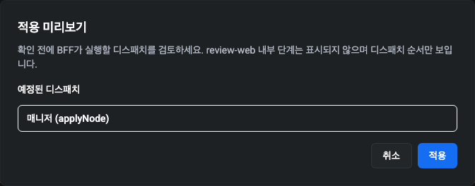

모달을 여는 즉시 `createApplyAttempt({ nodeId })` 가 호출됩니다.
BFF 는 예정된 디스패치 목록을 반환합니다 — 이는 **BFF 자신이
오케스트레이션하는 최상위 디스패치**입니다. 매니저의
`applyNodeDraft` 뮤테이션, 매니저의 `applyAgentConfig` 뮤테이션
순으로 실행되고, 그 뒤에 적용 빌드 시점에 드래프트가 대기 중인
외부 서비스마다 `updateConfig` 가 한 번씩 실행됩니다. review-web
내부 실행 단계는 표시되지 않으며, 모달은 BFF가 발행할 디스패치
시퀀스만 표시합니다.

각 행은 디스패치 종류 레이블 (`매니저 DB (applyNodeDraft)` /
`매니저 알림 (applyAgentConfig)` /
`데이터 저장소 (updateConfig)` / `TI 컨테이너 (updateConfig)`) 을
보여줍니다. **적용** 버튼은 예정된 디스패치가 하나 이상 있을 때
활성화되며, 빈 계획은 "적용할 변경 사항이 없음" 메시지를 표시하고
적용 버튼을 비활성화합니다.

### 디스패치별 상태 (실행 중 / 실행 후)

**적용** 클릭은 `confirmApplyAttempt({ attemptId })` 를 호출합니다.
호출 진행 중 모달은 다음과 같이 동작합니다.

- Escape 와 모달 외부 클릭이 무시됩니다 — 진행 중인 BFF 호출은
  취소할 수 없기 때문에, 중간에 UI 를 닫으면 행이 `executing`
  상태로 고립됩니다.
- 아직 `대기 중` 인 행 가운데 **첫 번째** 행만 **진행 중** 으로
  승격합니다. 이는 BFF 의 순차 진행 규칙 (`apply-attempt-lifecycle.ts`
  의 `advanceForClaim`) 을 그대로 반영한 것입니다. 후속 행은 실행기가
  진행 중인 행을 커밋하고 다음 행으로 넘어갈 때까지 **대기 중** 으로
  남습니다. 모든 행을 진행 중으로 표시하면 상태 머신이 수행하지 않는
  병렬 실행이 일어나는 것처럼 보일 수 있습니다.
- 액션 버튼에 **적용 중…** 라벨이 표시됩니다.

각 행은 다섯 가지 상태 중 하나로 표시됩니다. **대기 중**은 사용자가
적용을 클릭하기 전 (예정 목록 뷰), 선행 행이 진행 중일 때의 후속
디스패치, 그리고 정착된 `failed_retryable` 시도 이후에도 나타날 수
있습니다 — #359 의 순차 진행 규칙에 따라 실패가 시퀀스를 정지시키고
후속 디스패치는 재시도 성공 시 재개를 기다리며 `queued` 로 남기
때문입니다.

| 상태 | 의미 |
| :-- | :-- |
| **대기 중** | 아직 시작되지 않음 — 적용 클릭 전 예정 목록, 선행 행이 진행 중일 때의 후속 디스패치, 그리고 `failed_retryable` 행 이후 재개 규칙이 진행시키지 않은 디스패치에 모두 나타납니다. |
| **진행 중** | 디스패치가 실행 중입니다. `confirmApplyAttempt` 호출이 진행 중일 때는 첫 번째 `queued` 행에만, `retryDispatch` 호출이 진행 중일 때는 재시도된 행에만 모달이 이 상태를 프로젝션합니다. |
| **성공** | 디스패치가 정상 반환되었습니다. |
| **실패 (재시도 가능)** | 일시적 실패; 행에 **다시 시도** 버튼이 노출됩니다. |
| **실패 (복구 불가)** | 한도 도달, 중단, 또는 stale-lock 복구 — Retry 가 제공되지 않습니다. |

상태 색상: **성공**은 녹색, **진행 중**은 하늘색, **실패 (재시도
가능)** 은 주황색, **실패 (복구 불가)** 는 빨강, **대기 중**은
무채색.

### Retry 와 Rebuild

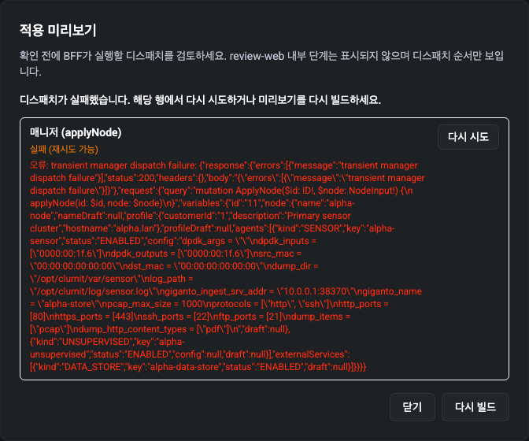

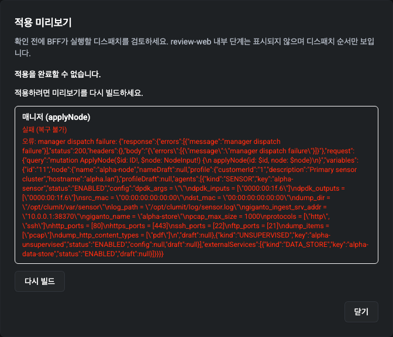

실패한 디스패치는 두 가지 복구 경로 중 하나를 제시합니다.

- **다시 시도 (Retry)** — 디스패치가 `failed_retryable` 상태일
  때만 노출됩니다. 행의 다시 시도 버튼은 동일한 `attemptId` 에 대해
  `retryDispatch({ attemptId, dispatchId })` 를 호출합니다. 상태
  머신 (#359) 의 순차 진행 + 첫 실패 시 정지 규칙에 의해 한 시도
  내에 동시에 `failed_retryable` 인 디스패치는 항상 최대 하나이므로,
  모달은 동일 계획에서 Retry 버튼을 두 개 이상 그리지 않습니다.
  재시도가 성공하면 `_internal_retryDispatch` 의 재개 규칙이 다음
  `queued` 디스패치를 자동으로 진행합니다 — 추가 클릭은 필요
  없습니다.
- **다시 빌드 (Rebuild)** — 행이 `failed_terminal` 로 정착했거나,
  계획이 `stale` / `expired` 가 되었거나, 모달이 계획 자체를
  가져오지 못했을 때 필요합니다. Rebuild 는 현재 `attemptId` 를
  버리고, 최신 매니저-DB 드래프트로 새 계획을 받기 위해
  `createApplyAttempt({ nodeId })` 를 다시 실행합니다. 행이
  `failed_terminal` 인 경우 모달은 "적용하려면 미리보기를 다시
  빌드하세요" 라고 명시합니다. 복구 불가 행에는 Retry 버튼이
  제공되지 않습니다.

### 접근성

모달은 `role="dialog"` 를 가지며 Radix 의 포커스 트랩을 통해 탭
이동이 다이얼로그 내부에 머무릅니다. Escape 는 실행 중이 아닐 때만
닫기 동작을 트리거합니다. 행별 Retry 버튼은 디스패치 종류를
명시하는 접근성 이름 ("다시 시도 – 데이터 저장소 (updateConfig)")
을 가지고 있어 스크린 리더가 구분할 수 있습니다.

## 노드 상세 페이지

상세 페이지는 `/nodes/<id>` 경로로 렌더링되며, 상태 탭(읽기 전용
진입점)에서 노드 행을 클릭하거나 다른 화면이 노드 ID를 가리키는
딥링크를 통해 도달합니다. 페이지는 노드의 메타데이터, 실시간 핑과
자원 사용률 지표, 그리고 위에서 설명한 동일한 적용 미리보기 모달이
연결된 서비스 카드 그리드를 함께 보여줍니다.

### 대시보드

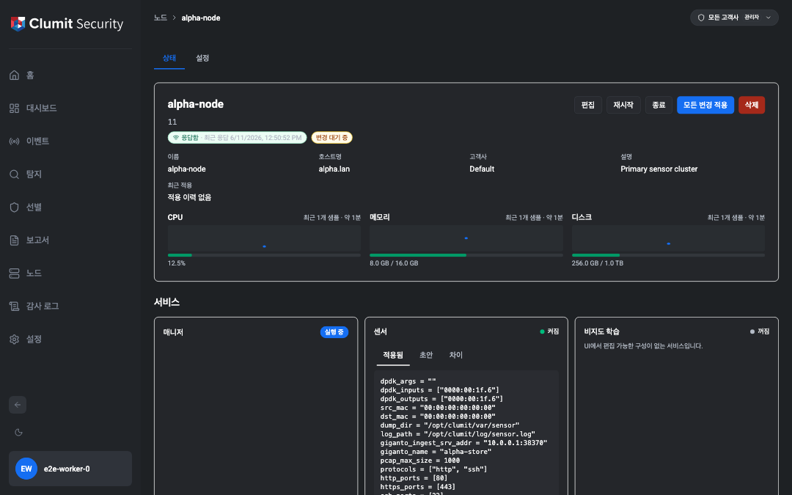

페이지 상단 대시보드에는 노드의 메타데이터(이름, 호스트명, 고객,
설명, 마지막 적용 시각), **핑 인디케이터**(alive/dead와 "마지막으로
본 시각" 타임스탬프), 그리고 상태 탭과 동일한 클라이언트 측 폴링
루프로 구동되는 세 개의 자원 스파크라인(CPU, 메모리, 디스크)이
배치됩니다. 첫 페인트에는 SSR로 시드된 샘플 한 개가 실려 있어 콜드
로드에서도 빈 축이 그려지지 않으며, 다음 클라이언트 틱부터는 폴링
버퍼가 데이터의 출처가 됩니다. 노드 단위 드래프트(이름 / 메타데이터
/ 에이전트 / 외부 서비스) 가 하나라도 비어 있지 않으면 **변경 대기
중** 배지가 노출됩니다. 대시보드의 컨트롤(`수정`, `재시작`, `종료`,
`전체 적용`, `삭제`) 은 각각 해당하는 쓰기 / 삭제 권한으로
개별 게이팅됩니다.

### 서비스 카드와 3-탭 패널

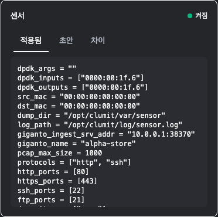

대시보드 아래에는 노드가 호스팅하는 서비스마다 카드 한 개를
배치한 카드 그리드가 렌더링됩니다(매니저, 센서, 비지도 엔진,
준지도 엔진, 시계열 생성기, 데이터 저장소, TI 컨테이너). 매니저
카드는 상태 전용입니다 — 실행 / 미실행 배지만 표시하고 구성
탭은 없습니다. 다른 모든 카드는 다음을 포함합니다.

- 상태 탭과 동일한 공유 폴링 버퍼로 구동되는 상태 배지
  (`On` / `Off` / `Idle`).
- 정규 노드 페이로드에서 서비스의 드래프트가 비어 있지 않을 때
  표시되는 **변경 대기 중** 배지(주황색).
- 3-탭 패널: **적용됨**(서비스가 실제로 실행 중인 라이브 구성),
  **드래프트**(운영자가 작성한 대기 변경), **차이**(적용됨과 드래프트의
  필드 단위 비교).
- **이 서비스 수정** 링크 (`nodes:write + services:write` 게이트)
  — 클릭하면 해당 서비스 섹션이 자동으로 펼쳐진 상태로 생성/편집
  다이얼로그로 딥링크됩니다.

서비스의 드래프트가 비어 있을 때 차이 탭은 문서화된 문구
`"이 서비스에는 적용 대기 중인 변경이 없습니다."` 를 표시합니다.
외부 서비스(데이터 저장소 / TI 컨테이너)에 도달할 수 없는 경우
적용됨 탭은 사용 불가 문구를, 차이 탭은 `"서비스에 도달할 수 없는
동안에는 차이를 계산할 수 없습니다."` 를 표시합니다 — 드래프트는
매니저 측에 보관되므로 드래프트 탭은 외부 엔드포인트 상태와 무관하게
계속 정상적으로 렌더링됩니다.

### 상세 페이지의 적용 미리보기

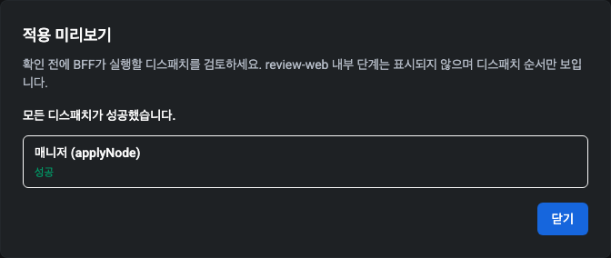

대시보드의 **전체 적용** 버튼은 확인 프롬프트를 띄우며, 사용자가
승인하면 위 *적용 미리보기* 절에서 설명한 동일한 모달을 마운트
합니다. 위 캡처는 실행 단계의 모달입니다 — 매니저 디스패치가
진행 중이고, 액션 버튼에 **적용 중…** 라벨이 표시되며, 호출이
완료될 때까지 Escape / 모달 외부 클릭이 비활성화됩니다. 이후 모달은
디스패치별 상태 뷰(`성공`, **다시 시도** 버튼이 노출되는 `실패
(재시도 가능)`, 또는 다시 빌드 안내가 표시되는 `실패 (복구 불가)`)
로 진행합니다.

### 매니저 연결 끊김 폴백

조합 게이트를 통과한 후 정규 노드 읽기가 매니저 장애로 실패하면,
페이지는 상태 탭과 동일한 매니저 사용 불가 폴백 패널로 전환됩니다.
이는 게이트 통과 후 "이 읽기 직전에 매니저가 끊긴" 경로이며,
`nodes:read + services:read` 가 없는 호출자가 보게 될 게이트 시점
HTTP 403 화면과는 다릅니다.

### 상세 페이지의 권한

상세 페이지는 `nodes:read + services:read` 게이트를 가집니다.
**Security Monitor**(읽기 전용)는 페이지에 진입하여 대시보드,
상태 인디케이터, 서비스 카드(읽기 전용)를 확인할 수 있습니다.
단, 수정 / 삭제 / 재시작 / 종료 / 전체 적용, 또는 서비스별
"이 서비스 수정" 어포던스는 모두 노출되지 않습니다. 본 페이지에서
적용 미리보기 모달로 진입하는 유일한 통로는 **전체 적용** 버튼이며,
Security Monitor 는 해당 버튼을 보지 못하므로 모달에 도달할 수
없습니다. Phase Node-7 에서 도입될 서비스별 on/off 컨트롤은
#317 PR 2 에서 배포되며, v1 의 이 페이지에는 표시되지 않습니다.

## 상태 탭

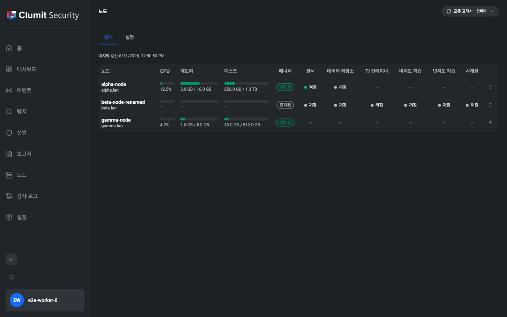

상태 탭은 `/nodes` 진입 시 기본으로 표시되는 화면입니다. 사용자가 접근 가능한
모든 노드를 한 행씩 표시하며, 클라이언트 측 폴링으로 자원 사용률을 실시간
갱신하고 노드 단위의 제어 메뉴를 제공합니다.

### 표 항목

- **노드** — 가장 최근 스냅샷의 이름과 호스트명.
- **CPU**, **메모리**, **디스크** — 진행률 막대. 80% 이상이면 황색, 95% 이상이면
  빨간색으로 표시됩니다.
- **매니저** — `nodeStatusList` 응답의 `NodeStatus.manager` 값으로부터 직접
  도출됩니다. `true` 이면 **실행 중**, `false` 이면 **중지됨**.
- 6개 서비스 열(센서, 데이터 저장소, TI 컨테이너, 비지도 학습, 반지도
  학습, 시계열) — 각 셀은 서비스의 신호로부터 도출된 **켜짐 / 꺼짐 /
  유휴** 배지를 표시합니다. 자세한 규칙은 아래 *상태 범례* 절을
  참고하세요.
- 행 단위 케밥 메뉴는 **재시작** / **종료** 제어 메뉴를 엽니다.

### 폴링

표는 `NEXT_PUBLIC_NODE_STATUS_POLL_MS` 밀리초(기본 `10000`, `[5000, 300000]`
범위로 클램프됨)마다 갱신됩니다. 탭이 숨겨지면 폴링이 일시 중지되고, 다시
보일 때 다음 주기 전에 한 번의 즉시 갱신이 실행된 뒤 정상 주기가 재개됩니다.
표 위의 "마지막 갱신" 표시는 가장 최근 샘플의 시각을 보여주며, 폴링 주기의
2배 이상 시간이 경과하면 "오래됨" 안내로 전환됩니다. 누락된 샘플은 합성
보충하지 않으며, 끊김은 롤링 버퍼에 그대로 반영됩니다.

### 재시작 / 종료

두 동작 모두 행 케밥 메뉴 안에 있으며 `nodes:write` 권한이 필요합니다.
보안 모니터(Security Monitor) 계정은 행은 보지만 제어 메뉴는 보지 못합니다.
각 동작은 확인 모달을 띄우고, 확정 시 BFF 가 `nodeReboot(hostname)` 또는
`nodeShutdown(hostname)` 을 호출하면서 호스트명을 `details` 에 담은
`node.restart` / `node.shutdown` 감사 로그 항목을 한 건 기록합니다. 호스트명은
서버 측에서 노드 ID 로부터 다시 조회되므로 위조된 호스트명으로 테넌트 범위
제한을 우회할 수 없습니다.

### 행 탐색

상태 탭에는 적용 버튼이 없습니다. 케밥 메뉴 외 영역을 클릭하면 해당
노드의 상세 경로 `/nodes/[id]` 로 이동하며, 노드 이름 역시 같은 대상을
가리키는 키보드 포커스 가능한 링크입니다. 상세 경로는 [상태 범례](#상태-범례)
에서 설명한 노드별 서비스 상태 카드(센서, 비지도 학습, 반지도 학습, 시계열,
데이터 저장소, TI 컨테이너 — 서비스마다 하나씩)를 노출하며, 각 카드는
켜짐 / 꺼짐 / 유휴 배지와 진단 툴팁, 그리고 해당 신호를 따라 갱신되는
"마지막 확인 N초 전" 푸터(에이전트 카드는 노드별 폴링, 외부 카드는 각
프로브의 결과)를 함께 보여줍니다. 보류 중인 편집을 확인하고 **모든 변경
적용** 동작을 실행하는 노드별 대시보드는 Phase Node-5 (후속 작업) 에서
제공됩니다. v1 의 유일한 적용 진입점은 Phase Node-5 가 도입된 이후 해당
상세 대시보드 위에 자리잡게 되며, 그 전까지 상태 탭에서는 어떠한 적용
동작도 사용할 수 없습니다.

### 상태 범례 { #상태-범례 }

각 서비스 셀은 세 가지 상태 중 하나로 표시됩니다. 동일한 어휘를 상태 탭과
노드 상세 페이지의 서비스 카드에서 공유합니다.

| 상태 | 시각 | 의미 |
|------|------|------|
| **켜짐** | 녹색 점 | 서비스가 활성화되어 정상적으로 보고 중입니다. |
| **꺼짐** | 회색 점 | 서비스가 비활성화되었거나 연결할 수 없거나, 노드가 응답하지 않습니다. |
| **유휴** | 황색 점 | 에이전트가 일시적인 실패(현재 `RELOAD_FAILED`)를 보고했습니다. v1 의 외부 서비스에는 이 상태가 없습니다. |

서비스 종류별 신호 규칙:

- **에이전트 서비스**(센서, 비지도 학습, 반지도 학습, 시계열)는
  `NodeStatus.agents[].storedStatus` 값에서 직접 읽습니다.

    | `storedStatus` | 셀 |
    |----------------|----|
    | `ENABLED` | 켜짐 |
    | `DISABLED` | 꺼짐 |
    | `UNKNOWN` | 꺼짐 |
    | `RELOAD_FAILED` | 유휴 |

- **외부 서비스**(데이터 저장소, TI 컨테이너)는 폴링 주기마다 해당
  서비스의 `status` GraphQL 쿼리를 디스패치합니다. 응답이 성공하면
  **켜짐**, 어떤 형태든 오류(연결 거부, HTTP 500, GraphQL `errors[]`,
  스키마 불일치)면 **꺼짐** 으로 표시합니다. v1 의 외부 서비스에는
  유휴 상태가 없습니다. Giganto 와 Tivan 이 같은 틱에 호출되지 않도록
  프로브가 엇갈려 발사되며, 서비스별 주기는 기본적으로
  `NEXT_PUBLIC_NODE_STATUS_POLL_MS` 와 같습니다.

- **응답 없는 노드 우선 적용** — 노드의 `ping` 이 `null`(매니저의
  최근 핑에 응답하지 않음)이면 원시 신호와 무관하게 모든 서비스 셀이
  **꺼짐** 으로 강제 표시됩니다. 매니저 배지는 별도의 핑 신호를
  사용하며 영향을 받지 않습니다.

- **툴팁** — 셀에 마우스를 올리면 진단을 위한 원시 신호("에이전트가
  비활성 상태로 보고합니다", "외부 서비스에 연결할 수 없습니다",
  "노드가 응답하지 않아 서비스 상태가 꺼짐으로 표시됩니다")가
  표시되어 상세 페이지를 열지 않고도 원인을 확인할 수 있습니다.

같은 행의 매니저 배지는 위 서비스 어휘와 별개로 Phase Node-6 의 소관이며,
`nodeStatusList` 가 반환하는 `NodeStatus.manager: Boolean!` 값에서 직접
도출됩니다.

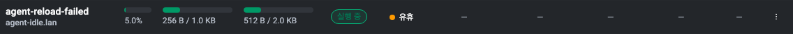

### 매니저 연결 끊김

상태 탭도 매니저 연결 불가 시 동일한 fallback 패널을 사용합니다. 첫 렌더링
이후 매니저가 끊긴 경우에도 다음 폴링이 503 을 받는 즉시 표 영역이
"매니저에 연결할 수 없음" 패널로 전환되어 오래된 스냅샷이 그대로 남아 있는
상황을 방지합니다. 이후 폴링이 성공하면 패널이 자동으로 사라집니다.

## 적용 시도 운영 (정리, 런북)

이 절은 `apply_attempts` 테이블과 그 정리(cleanup) 스윕을 구동하는
배포 측 스케줄러를 운영하는 운영자를 위한 안내입니다. 라이프사이클
상태(`failed_retryable` 와 `failed_terminal`, 다시 시도와 다시 빌드)
의 사용자 측 의미는 위의 **일괄 적용** 절과 **적용 미리보기** 절에서
설명합니다. 본 절은 동일한 상태들을 운영 증상과, 테이블을 건강하게
유지하는 런북 항목에 매핑합니다.

### 행 수명 (TTL과 보존)

`apply_attempts` 의 모든 행은 `expires_at` 한도를 가지며, 이 값은
라이프사이클 전이 시마다 다시 기록되므로 의미는 행의 현재 상태에
따라 달라집니다.

- **30 분** (`APPLY_ATTEMPT_TTL_MS`) — 행이 생성되면 `pending`
  상태이며 `expires_at` 은 생성 시각 + 30 분으로 설정됩니다. 이
  TTL 은 행이 `pending` 일 때, 그리고 재시도 가능 실패 후
  `failed_retryable` 일 때만 적용됩니다. `expires_at` 을 지나면
  정리 TTL 스윕이 두 상태를 종료 처리하고 (`pending → expired`,
  `failed_retryable → failed_terminal`) `expires_at` 을 아래의
  보존 horizon 으로 다시 기록합니다. 사용자는 새 미리보기에서
  계획을 다시 빌드해야 합니다.
- **2.5 시간** (`APPLY_EXECUTING_STALE_MS`) — `executing` 행은
  30 분 TTL 의 **대상이 아닙니다**. 원자적 클레임은 `pending` 행을
  `executing` 으로 승격하면서 `expires_at` 을 다시 기록하지 않지만,
  TTL 스윕은 `executing_lock` 을 보유한 행은 건너뜁니다. 따라서
  `executing` 행은 완료 (`succeeded` / `failed_retryable` /
  `failed_terminal` 로의 전이) 되거나 `claim_started_at` 이
  `APPLY_EXECUTING_STALE_MS` 를 지날 때까지 원래의 30 분 마감을
  적법하게 초과해 살아 있을 수 있습니다. 임계를 지나면 회수 스윕이
  멈춘 클레임으로 간주해 행을 `failed_terminal` 로 뒤집고, 진행
  중인 디스패치와 남은 대기 디스패치를 abandonment `lastError`
  와 함께 `failed_terminal` 로 cascade 합니다. 사용자는 이후 모달
  방문 시 다시 빌드 안내를 보게 됩니다.
- **7 일** (`APPLY_ATTEMPT_RETENTION_MS`) — 모든 종료 상태 전이
  (`succeeded`, `failed_terminal`, `stale`, `expired`) 가
  `expires_at = NOW() + retentionMs` 로 다시 기록됩니다. 따라서
  보존 기간은 원래의 30 분 마감이 아니라 **행이 종료 상태가 된 시점
  부터** 측정됩니다. 보존 스윕은 `NOW() > expires_at` 이 다시 참이
  된 종료 상태 행을 하드 삭제합니다.

보존 스윕은 `succeeded_audit_completed_at IS NULL` 인 `succeeded`
행은 **퍼지하지 않습니다** — 회수 스윕이 해당 행의 `node.apply`
감사 항목을 발행하기 전까지 면제됩니다 (위의 **일괄 적용** 절에
문서화된 감사 발행 계약 참조). 이 면제 덕분에 장기간의 감사 DB
장애가 회수 스윕이 행을 마무리하기 전에 감사 미완료 행을 퍼지해
버리는 일을 막습니다.

### 정리 엔드포인트

정리 스윕은 라우트 핸들러
`POST /api/internal/apply-attempts/cleanup` 로 노출됩니다. 배포
스케줄러는 이 라우트를 고정 주기로 구동해야 합니다. 시작 시점
스윕 + 인라인 pre-create 스윕 fallback 은 활성 경로가 **아닙**니다.
fallback 은 Next.js 프로세스가 유휴 상태일 때 정리를 조용히 건너뛰
므로, 한 인스턴스가 유휴인 동안 다른 인스턴스가 시도를 생성하는
멀티 인스턴스 배포에서는 안전하지 않습니다.

이 라우트는 **내부 토큰 가드**가 적용됩니다. 모든 요청은
`Authorization: Bearer <APPLY_INTERNAL_CLEANUP_TOKEN>` 을 포함해야
합니다. 공유 비밀은 timing oracle 을 피하기 위해 상수 시간으로
비교됩니다. 이 환경변수가 비어 있으면 라우트는 모든 요청을
거부합니다 — 스케줄링 이전에 배포에서 토큰을 명시적으로 설정해야
합니다. 핸들러는 시스템 액터로 동작하며 매니저 DB 를 읽지도 않고
외부 서비스로 디스패치하지도 않습니다. recorder 인수 테스트가
정리 패스 동안 외부 GraphQL 호출이 0 임을 단언합니다.

성공한 패스는 HTTP 200 으로 스윕별 카운터를 반환합니다.

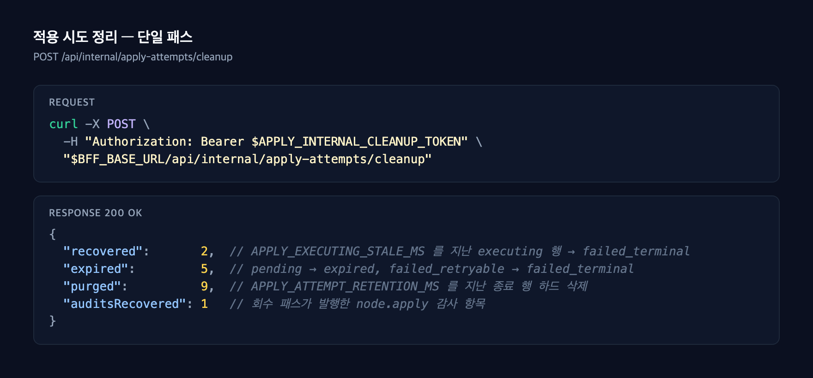

네 개의 카운터가 이번 패스에서 각 스윕이 수행한 작업을 보고합니다.

| 카운터 | 의미 |
| :-- | :-- |
| `recovered` | `claim_started_at` 이 `APPLY_EXECUTING_STALE_MS` 를 지난 stale-lock 행을 `failed_terminal` 로 회수한 수. |
| `expired` | TTL 종료 처리된 행 수: `pending → expired` 와 `failed_retryable → failed_terminal`. |
| `purged` | 보존 마감을 지난 종료 행을 하드 삭제한 수 (`succeeded` / 감사 미완료 면제 제외). |
| `auditsRecovered` | `node.apply` 감사가 회수 패스에 의해 내구성 있게 마무리된 `succeeded` 행 수 (slot-claimed-but-not-completed 와 slot-never-claimed 두 윈도우 모두 포함). |

실패한 패스는 HTTP 500 으로 `{ "error": "<message>" }` 를 반환합니
다. HTTP 401 은 Bearer 토큰이 누락되었거나 잘못되었음을 의미합니다.

### 런북 항목 — 정리 엔드포인트 스케줄링

릴리스 런북에서 배포 스케줄러에 정리 라우트를 추가합니다. 권장
주기는 **5 분마다** 입니다. 30 분의 비-종료 TTL 윈도우보다 충분히
짧기 때문에, 한두 사이클의 일시적 스케줄러 장애가 비-종료 행을
관찰되지 않은 채 `expires_at` 을 넘기게 만들 수 없습니다.

1. `APPLY_INTERNAL_CLEANUP_TOKEN` 으로 사용할 강한 난수 토큰을
   준비합니다. 다른 내부 비밀과 동일하게 취급합니다 — 비밀
   매니저에 보관하고 정상적인 주기로 회전하며 절대 저장소에
   체크인하지 않습니다.
2. 모든 BFF 인스턴스와 라우트를 호출하는 스케줄러에 환경 변수를
   설정합니다. 세 TTL 노브의 기본값은
   [`.env.example`](https://github.com/aicers/aice-web-next/blob/main/.env.example)
   에 포함되어 있으며 런타임에 읽히므로, 환경 변수를 미설정 상태로
   두는 것은 "문서화된 기본값을 사용한다" 는 지원되는 경로입니다.

    ```text
    APPLY_ATTEMPT_TTL_MS=1800000         # 30 분
    APPLY_ATTEMPT_RETENTION_MS=604800000 # 7 일
    APPLY_EXECUTING_STALE_MS=9000000     # 2.5 시간
    APPLY_INTERNAL_CLEANUP_TOKEN=        # 환경별로 설정
    ```

    문서화된 사유가 있는 경우에만 재정의합니다 (장시간 실행되는
    외부 디스패처가 있는 배포는 더 긴 `APPLY_EXECUTING_STALE_MS`
    가 필요할 수 있고, 7 일보다 짧은 컴플라이언스 윈도우는 더 작은
    `APPLY_ATTEMPT_RETENTION_MS` 를 원할 수 있습니다).

3. 다음을 발송하는 반복 호출자(cron, Kubernetes `CronJob`, GitHub
   Actions 스케줄 등)를 연결합니다.

    ```bash
    curl -fsS -X POST \
      -H "Authorization: Bearer $APPLY_INTERNAL_CLEANUP_TOKEN" \
      "$BFF_BASE_URL/api/internal/apply-attempts/cleanup"
    ```

4. 첫 스케줄 실행을 스케줄러 로그에서 추적하여 JSON 본문이 위 네
   카운터로 파싱되는지 확인합니다. 트래픽이 적은 배포의 정상적인
   첫 실행은 보통 모든 카운터가 0 입니다. 장기간 장애 직후의 첫
   실행에서 `recovered` 또는 `expired` 가 0 이 아닌 것은 정상이며,
   이후 패스에서 다시 0 으로 떨어져야 합니다.

### 관측성과 알림

운영자는 다른 주기 스윕과 동일하게 정리 패스를 모니터링해야 합
니다.

- **HTTP 실패율.** 정리 라우트의 200 이 아닌 응답은 모두 사고로
  처리합니다. 401 은 토큰이 회전되었는데 스케줄러가 갱신되지
  않았음을 의미합니다. 500 은 데이터베이스 트랜잭션이 throw
  했음을 의미하며 BFF 로그에 스택 트레이스가 남아야 합니다.
- **`recovered > 0` 알림.** `recovered` 가 0 이 아니면 적어도 한
  `executing` 행이 2.5 시간을 넘겨 abandonment 처리되었음을
  의미합니다. 정상 배포에서는 드문 일이며, 지속적으로 0 이
  아니라면 사용자 동작이 아니라 클레임과 커밋 사이의 실행기
  크래시를 의심해야 합니다.
- **`auditsRecovered > 0` 알림.** 0 이 아니라면 적어도 한
  `succeeded` 행이 `node.apply` 감사를 내구성 있게 마무리하기
  위해 회수 스윕에 의존했음을 의미합니다. 감사 DB 지연이나 BFF
  프로세스 라이프사이클을 점검해야 합니다. 지속적으로 0 이
  아니라면 적용 측 버그가 아니라 감사 DB 압박을 시사합니다.
- **패스 소요 시간.** 한 패스는 상태 머신 트랜잭션, 분리된 감사
  회수 루프, 그리고 보존 트랜잭션으로 구성됩니다. 정상 배포에서는
  전체 호출이 1 초 미만으로 반환됩니다. 장시간 실행되는 패스는
  라이프사이클 모듈과의 락 경합을 의미합니다.

### 라이프사이클 상태와 운영 증상의 매핑

`apply_attempts` 테이블에 대한 사고 로그를 읽을 때 행 단위 상태
이름은 다음 증상에 매핑됩니다. 각 상태의 사용자 측 의미는 위의
**일괄 적용** 절에서 다루므로 여기서는 반복하지 않습니다.

| 행 상태 | 운영 증상 |
| :-- | :-- |
| `failed_retryable` | 원래의 30 분 윈도우 내에서 외부 서비스의 일시적 실패. 다음 사용자 클릭에서 같은 행이 재개되며, soft-fail 비율이 상승하지 않는 한 운영자 조치가 필요하지 않습니다. |
| `failed_terminal` | 디스패치별 재시도 한도 도달, 회수 스윕 abandonment, 또는 TTL 종료 처리. 디스패치의 `lastError` 가 abandonment 사유를 담고 있습니다. |
| `stale` | 적용 빌드와 적용 확정 사이의 fingerprint 가 어긋남 — 미리보기와 확정 사이에 정식 노드가 변경됨. 매니저 mutation 도, 외부 mutation 도 발송되지 않았습니다. |
| `expired` | `pending` 인 채로 행이 `expires_at` 을 지남 (사용자가 모달을 열고 30 분 이상 자리를 비운 경우). 어떤 mutation 도 발송되지 않았습니다. |

`action = 'node.apply'` 와 `correlation_id = <attempt-id>` 인 감사
항목은 적용이 끝까지 실행되었다는 운영 측 증거입니다. `succeeded`
에 도달한 행에서 이 감사 항목이 없는 경우는 다음 정리 패스의
`auditsRecovered` 가 자동으로 회수합니다. 이 카운터가 여러 패스에
걸쳐 0 이 아니라면 감사 DB 가 의심됩니다.

### 모달 스크린샷

모달 상태 캡처 (예정된 디스패치, `failed_retryable` 와 다시 시도,
`failed_terminal` 와 다시 빌드, 실행 중) 는 위의
**적용 미리보기** 와 **상세 페이지의 적용 미리보기** 절에 함께
있으며 본 절에서는 중복하지 않습니다. 멈춘 행을 분석하는 운영자는
사용자가 보는 동일한 모달을 열어야 하며 — 사용자에게 보이는 모든
상태가 그곳에 문서화되어 있습니다.
