# 설정

설정 페이지는 사이드바에서 접근할 수 있습니다. 계정, 역할,
고객, 정책, 계정 현황 관리를 위한 탭이 포함되어 있습니다. 각
탭은 권한에 따라 표시됩니다.

## 계정

**설정 → 계정**으로 이동하여 사용자 계정을 관리합니다.
조회하려면 `accounts:read`, 생성 및 편집하려면
`accounts:write`, 비활성화하려면 `accounts:delete` 권한이
필요합니다.

### 계정 목록

계정 목록은 필터링과 페이지네이션을 지원합니다.


사용 가능한 필터:

- **검색** — 사용자명 또는 표시 이름으로 필터링합니다.
- **역할** — 할당된 역할로 필터링합니다.
- **상태** — 계정 상태(활성, 잠김, 정지, 비활성화)로
  필터링합니다.
- **고객** — 할당된 고객으로 필터링합니다.

### 계정 생성

**+** 버튼을 클릭하여 계정 생성 대화상자를 엽니다.


필드:

- **사용자명** — 고유한 로그인 식별자(생성 후 변경 불가).
- **표시 이름** — UI에 표시되는 이름(필수).
- **이메일** — 선택적 연락처 이메일.
- **전화번호** — 선택적 연락처 전화번호.
- **역할** — 권한을 결정합니다. System Administrator는 모든
  역할을 할당할 수 있습니다. Tenant Administrator는 Security
  Monitor 동급 역할의 계정만 생성할 수 있습니다.
- **고객 할당** — 고객 범위가 필요한 역할에 필수입니다.
- **비밀번호** — 계정의 초기 비밀번호를 설정합니다.

### 계정 편집

계정 행의 편집 아이콘(연필)을 클릭합니다. 표시 이름, 이메일,
전화번호를 수정할 수 있습니다. 사용자명, 역할, 고객 할당은
생성 후 변경할 수 없습니다.

### 계정 비활성화

계정 행의 삭제 아이콘(휴지통)을 클릭합니다. 확인 대화상자가
나타납니다. 역할 계층이 적용되어 자신과 같거나 높은 역할의
계정은 삭제할 수 없습니다.

### MFA 초기화

사용자가 MFA 기기에 대한 접근 권한을 잃은 경우, 관리자가
해당 계정의 모든 MFA 수단을 초기화할 수 있습니다. 계정
행의 드롭다운 메뉴(⋮)를 열고 **MFA 초기화**를 선택합니다
(MFA가 등록된 계정에서만 표시됩니다).

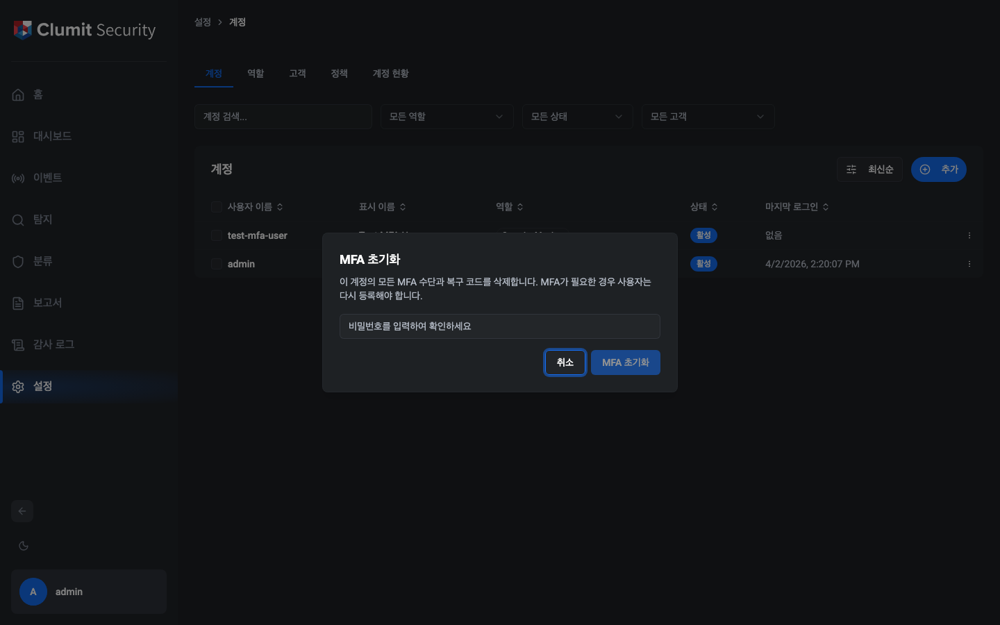

확인 대화상자에서 **본인의 비밀번호**(단계별 인증)를
입력해야 합니다. 확인 후:

- 모든 TOTP 자격 증명, 패스키, 복구 코드가 삭제됩니다.
- 해당 계정의 모든 활성 세션이 무효화됩니다.
- 해당 역할이 MFA를 요구하는 경우, 다음 로그인 시 MFA를
  다시 등록해야 합니다.

**제한 사항:**

- 자신과 같거나 높은 역할의 계정에 대해서는 MFA를 초기화할
  수 없습니다.
- 이 화면에서 자신의 MFA는 초기화할 수 없습니다(본인의
  MFA는 **프로필 → 2단계 인증**에서 관리합니다).

### 긴급 MFA 초기화 (비상 복구)

모든 관리자가 MFA로 잠겨 접근할 수 없는 경우, 서버 레벨의
긴급 초기화를 사용할 수 있습니다.

1. 환경 변수 `EMERGENCY_MFA_RESET`에 잠긴 계정의 사용자
   이름을 설정합니다.
2. 서버를 재시작합니다.
3. 서버 시작 시 해당 계정의 모든 MFA 자격 증명이 삭제되고
   모든 세션이 무효화됩니다.
4. 사용 후 환경 변수를 제거합니다.

사용자별 마커 파일
(`$DATA_DIR/.emergency_mfa_reset_consumed_{username}`)이
이후 재시작 시 반복 실행을 방지합니다. 감사 이벤트
(`mfa.emergency.reset`)가 행위자 `system`으로 기록됩니다.

같은 사용자에 대해 다시 긴급 초기화가 필요한 경우, 재시작
전에 마커 파일을 삭제하세요:

```bash
rm "$DATA_DIR/.emergency_mfa_reset_consumed_<username>"
```

!!! warning
    이 메커니즘은 모든 인증 검사를 우회합니다. 재해 복구
    용도로만 사용하고, 초기화 후 즉시 환경 변수를 제거하세요.

### 계정 상태

| 상태 | 설명 |
|------|------|
| 활성 | 정상 운영 상태 |
| 잠김 | 로그인 실패로 인한 일시적 잠금(자동 해제됨) |
| 정지 | 반복된 잠금으로 인한 영구 잠금(관리자 복원 필요) |
| 비활성화 | 관리자에 의해 비활성화됨 |

## 역할

**설정 → 역할**로 이동하여 역할을 관리합니다.
조회하려면 `roles:read`, 생성·편집·복제하려면
`roles:write`, 삭제하려면 `roles:delete` 권한이 필요합니다.


### 기본 제공 역할

세 가지 역할이 기본 제공되며 편집하거나 삭제할 수 없습니다
(**BUILTIN** 배지로 표시):

- **System Administrator** — 모든 기능에 대한 전체 접근 권한.
- **Tenant Administrator** — 할당된 고객 내 운영 및 Security
  Monitor 계정 관리.
- **Security Monitor** — 할당된 단일 고객 내 이벤트, 대시보드,
  탐지 읽기 전용 접근.

### 커스텀 역할

**+** 버튼을 클릭하여 커스텀 역할을 생성하거나, 기존 역할의
복제 아이콘(복사)을 클릭합니다.


권한 그리드는 리소스별로 그룹화된 모든 사용 가능한 권한을
보여줍니다:

| 그룹 | 권한 |
|------|------|
| 대시보드 | `dashboard:read`, `dashboard:write` |
| 탐지 | `detection:read` |
| 계정 | `accounts:read`, `accounts:write`, `accounts:delete` |
| 역할 | `roles:read`, `roles:write`, `roles:delete` |
| 고객 | `customers:read`, `customers:write`, `customers:delete`, `customers:access-all` |
| 시스템 설정 | `system-settings:read`, `system-settings:write` |
| 감사 로그 | `audit-logs:read` |

### MFA 필수

각 역할에는 **MFA 필수** 플래그가 있습니다. 활성화하면 해당
역할의 사용자는 대시보드에 접근하기 전에 최소 하나의 MFA
방식(TOTP 또는 패스키)을 등록해야 합니다. System
Administrator 역할은 기본적으로 MFA가 필수입니다.

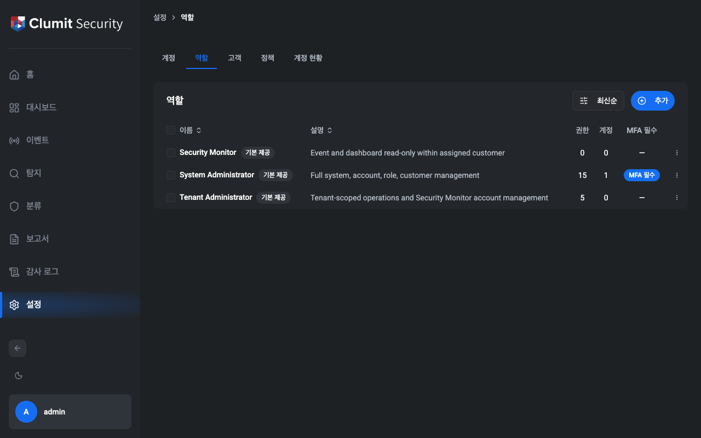

역할의 MFA 강제를 전환하려면 역할 행의 드롭다운
메뉴(⋯)를 클릭하고 **MFA 전환**을 선택합니다. 기본 제공
역할과 커스텀 역할 모두에서 작동합니다. `roles:write` 권한이
필요합니다.

개별 계정은 `mfa_override` 필드를 사용하여 역할 기본값을
재정의할 수 있습니다:

| 재정의 | 동작 |
|--------|------|
| *(없음)* | 역할의 MFA 필수 설정을 따름 |
| 면제 | 역할에서 요구하더라도 MFA가 필요하지 않음 |
| 필수 | 역할에서 요구하지 않더라도 MFA가 항상 필요함 |

## 고객

**설정 → 고객**으로 이동하여 고객을 관리합니다.
조회하려면 `customers:read`, 생성 및 편집하려면
`customers:write`, 삭제하려면 `customers:delete` 권한이
필요합니다.


### 고객 생성

**+** 버튼을 클릭하여 고객 생성 대화상자를 엽니다.


필드:

- **이름** — 고객 표시 이름(필수).
- **설명** — 선택적 설명.

고객이 생성되면 시스템이 전용 데이터베이스를 자동으로
프로비저닝합니다.

### 고객 삭제

삭제하려면 `customers:delete` 권한이 필요합니다(System
Administrator 전용). 해당 고객에 할당된 계정이 없어야 합니다.
삭제 시 고객의 데이터베이스가 드롭됩니다.

## 정책

**설정 → 정책**으로 이동하여 시스템 전체 정책을 구성합니다.
조회하려면 `system-settings:read`, 편집하려면
`system-settings:write` 권한이 필요합니다.


설정은 탭으로 구성되어 있습니다:

### 비밀번호 정책

| 설정 | 기본값 | 설명 |
|------|--------|------|
| 최소 길이 | 12 | 최소 비밀번호 길이 |
| 최대 길이 | 128 | 최대 비밀번호 길이 |
| 복잡도 | 활성화 | 대문자, 소문자, 숫자, 기호 필수 |
| 재사용 금지 횟수 | 5 | 재사용할 수 없는 이전 비밀번호 수 |

### 세션 정책

| 설정 | 기본값 | 설명 |
|------|--------|------|
| 유휴 타임아웃 | 30분 | 비활성 세션 만료 시간 |
| 절대 타임아웃 | 8시간 | 최대 세션 지속 시간 |
| 최대 세션 수 | 무제한 | 계정당 최대 동시 세션 수 |

### 잠금 정책

| 설정 | 기본값 | 설명 |
|------|--------|------|
| 1단계 임계값 | 5 | 일시적 잠금 전 실패 횟수 |
| 1단계 지속 시간 | 30분 | 일시적 잠금 지속 시간 |

2단계(영구 정지)는 계정이 두 번째로 잠길 때 자동으로
발생합니다.

### JWT 정책

| 설정 | 기본값 | 설명 |
|------|--------|------|
| 토큰 만료 시간 | 15분 | JWT 액세스 토큰 유효 기간 |

### MFA 정책

| 설정 | 기본값 | 설명 |
|------|--------|------|
| WebAuthn (FIDO2) | 활성화 | 하드웨어 키 / 플랫폼 인증기 허용 |
| TOTP | 활성화 | 시간 기반 일회용 비밀번호 허용 |

### 속도 제한

**로그인 속도 제한:**

| 설정 | 기본값 | 설명 |
|------|--------|------|
| IP당 횟수 / 윈도우 | 20 / 5분 | IP 주소당 요청 수 |
| 계정+IP당 횟수 / 윈도우 | 5 / 5분 | 계정 + IP당 요청 수 |
| 전역 횟수 / 윈도우 | 100 / 1분 | 전체 로그인 요청 수 |

**API 속도 제한:**

| 설정 | 기본값 | 설명 |
|------|--------|------|
| 사용자당 횟수 / 윈도우 | 100 / 1분 | 인증된 사용자당 요청 수 |

모든 정책 설정 변경 사항은 감사 로그에 기록됩니다.

## 프로필

프로필 페이지는 **설정 → 프로필**에서 접근할 수 있습니다.
개인 환경설정, 2단계 인증, 패스키를 관리할 수 있습니다.

### 환경설정

사용자는 언어와 시간대 환경설정을 구성할 수 있습니다.


### 2단계 인증 (TOTP)

TOTP 카드는 현재 등록 상태를 표시하며 시간 기반 일회용
비밀번호를 활성화하거나 비활성화할 수 있습니다.

카드는 TOTP 등록 상태와 관리자 정책에 따라 네 가지 상태
중 하나를 표시합니다:

| 상태 | 표시 |
|------|------|
| 사용 가능, 미등록 | "비활성" 배지와 **TOTP 활성화** 버튼 |
| 사용 가능, 등록됨 | "활성" 배지와 **TOTP 비활성화** 버튼 |
| 관리자에 의해 비활성화, 등록됨 | "활성" 배지와 관리자 안내 및 **TOTP 제거** 버튼 |
| 사용 불가 | "비활성" 배지와 "TOTP를 사용할 수 없습니다" 메시지 |


#### TOTP 활성화

1. **TOTP 활성화**를 클릭하여 설정 마법사를 엽니다.
2. 인증 앱(예: Google Authenticator, Authy)으로 QR 코드를
   스캔합니다. 또는 **스캔할 수 없나요? 이 키를 직접
   입력하세요**를 클릭하여 비밀 키를 복사합니다.
3. 인증 앱에 표시된 6자리 코드를 입력합니다.
4. **확인**을 클릭하여 설정을 완료합니다.


인증이 완료되면 TOTP가 활성화되며, 이후 로그인 시 코드
입력이 요구됩니다.


#### TOTP 비활성화

1. **TOTP 비활성화**(관리자에 의해 비활성화된 경우
   **TOTP 제거**)를 클릭합니다.
2. 현재 6자리 TOTP 코드를 입력하여 확인합니다.
3. **TOTP 비활성화**(또는 **TOTP 제거**)를 클릭하여
   자격 증명을 제거합니다.


#### 관리자에 의한 비활성화

관리자가 MFA 정책에서 TOTP를 허용 방식에서 제거했지만
사용자에게 TOTP가 아직 등록되어 있는 경우, 카드에
"활성" 배지와 함께 관리자에 의해 비활성화되었다는 안내가
표시됩니다. 사용자는 **TOTP 제거**를 클릭하여 불필요한
자격 증명을 제거할 수 있습니다.


#### 사용 불가

관리자가 MFA 정책에서 TOTP를 활성화하지 않았고 사용자에게
TOTP 자격 증명이 등록되어 있지 않은 경우, 카드에
"비활성" 배지와 "TOTP를 사용할 수 없습니다" 메시지가
표시됩니다. 사용자가 수행할 수 있는 작업은 없습니다.


#### MFA 로그인

TOTP가 활성화된 경우 비밀번호 입력 후 추가 단계가
필요합니다. 인증 앱의 6자리 코드를 입력하고 **확인**을
클릭합니다.


### 패스키 (WebAuthn)

패스키 카드는 등록된 패스키 자격 증명을 표시하며 비밀번호
없이 로그인 인증을 위한 패스키를 등록, 이름 변경 또는
제거할 수 있습니다.

카드는 등록 상태와 관리자 정책에 따라 네 가지 상태 중
하나를 표시합니다:

| 상태 | 표시 |
|------|------|
| 사용 가능, 미등록 | "비활성" 배지와 **패스키 등록** 버튼 |
| 사용 가능, 등록됨 | "활성" 배지와 자격 증명 목록 및 **패스키 추가** 버튼 |
| 관리자에 의해 비활성화, 등록됨 | "활성" 배지와 관리자 안내 및 자격 증명 목록 (제거만 가능) |
| 사용 불가 | "비활성" 배지와 "패스키를 사용할 수 없습니다" 메시지 |


#### 패스키 등록

1. **패스키 등록**(이미 등록된 패스키가 있는 경우
   **패스키 추가**)을 클릭합니다.
2. 선택적으로 표시 이름을 입력합니다 (예: "MacBook
   Touch ID").
3. **패스키 등록**을 클릭하여 브라우저 프롬프트를
   시작합니다.
4. 브라우저의 안내에 따라 패스키를 생성합니다.

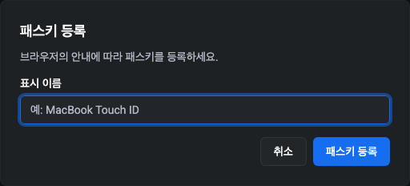

등록이 완료되면 패스키가 자격 증명 목록에 나타납니다.

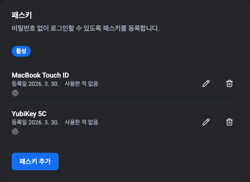

#### 패스키 이름 변경

패스키 옆의 연필 아이콘을 클릭하고 새 이름을 입력한 후
**저장**을 클릭합니다.

#### 패스키 제거

1. 제거하려는 패스키 옆의 휴지통 아이콘을 클릭합니다.
2. 계정 비밀번호를 입력하여 확인합니다.
3. **패스키 제거**를 클릭하여 자격 증명을 삭제합니다.

#### 관리자에 의한 비활성화

관리자가 MFA 정책에서 WebAuthn을 허용 방식에서 제거했지만
사용자에게 패스키가 아직 등록되어 있는 경우, 카드에
"활성" 배지와 함께 관리자에 의해 비활성화되었다는 안내가
표시됩니다. 사용자는 자격 증명을 제거할 수 있지만 새로
등록할 수는 없습니다.

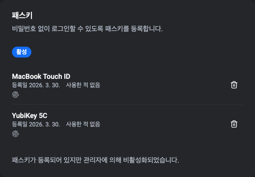

#### 사용 불가

관리자가 MFA 정책에서 WebAuthn을 활성화하지 않았고
사용자에게 패스키가 등록되어 있지 않은 경우, 카드에
"비활성" 배지와 "패스키를 사용할 수 없습니다" 메시지가
표시됩니다. 사용자가 수행할 수 있는 작업은 없습니다.


#### 패스키로 MFA 로그인

패스키가 등록된 경우 비밀번호 입력 후 추가 단계가
필요합니다. 브라우저의 안내에 따라 패스키로 본인 인증을
합니다. TOTP와 WebAuthn이 모두 등록된 경우 방식을
전환할 수 있습니다.

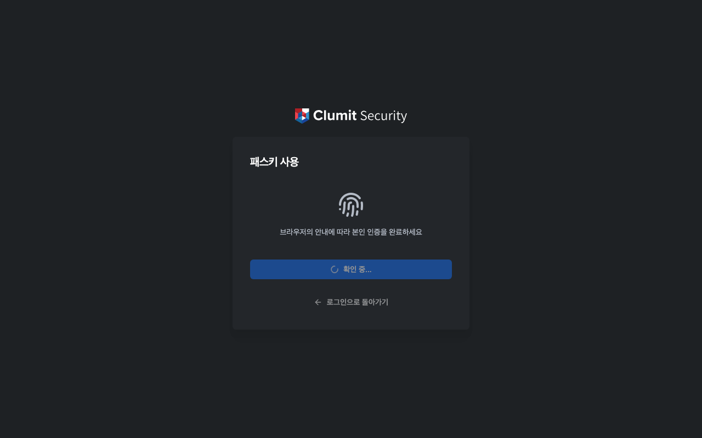

#### 복구 코드로 로그인

인증 앱이나 패스키에 접근할 수 없는 경우 복구 코드를
사용하여 로그인할 수 있습니다. MFA 인증 단계에서
**복구 코드 사용**을 클릭하고 저장된 코드 중 하나를
입력한 후 **확인**을 클릭합니다.

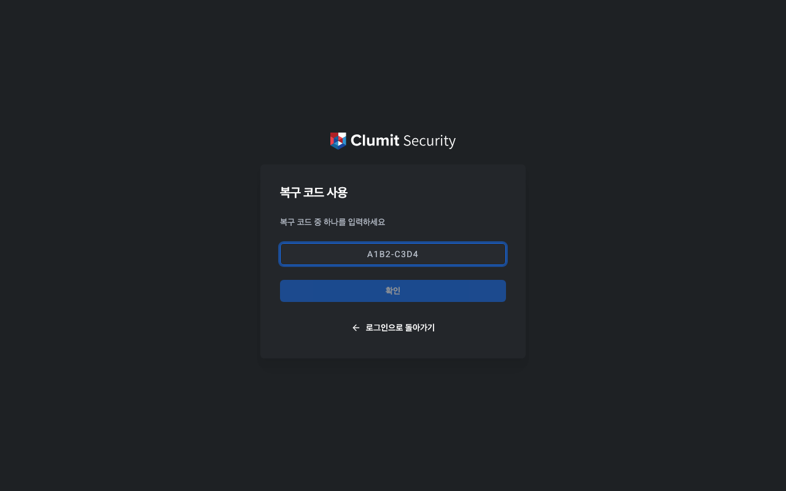

각 복구 코드는 한 번만 사용할 수 있습니다.

### 복구 코드

복구 코드는 기본 MFA 방식(TOTP 또는 패스키)을 사용할 수
없을 때 로그인할 수 있는 백업 방법을 제공합니다. 10개의
일회용 코드가 생성되어 해시 값으로 저장됩니다.

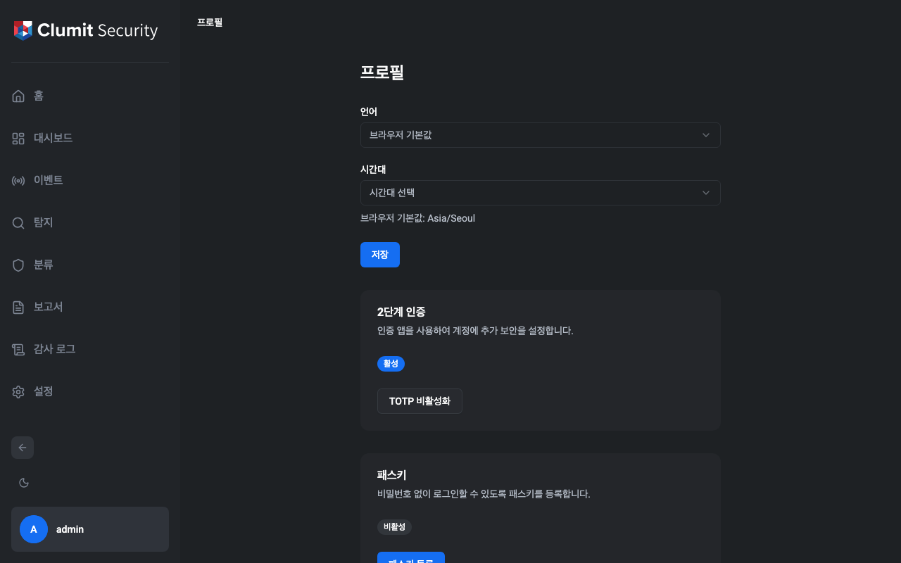

#### 자동 생성

첫 번째 MFA 방식을 등록하면 10개의 복구 코드가 자동으로
생성되어 표시됩니다. 이 코드를 안전한 장소에 저장하세요 —
다시 표시되지 않습니다.

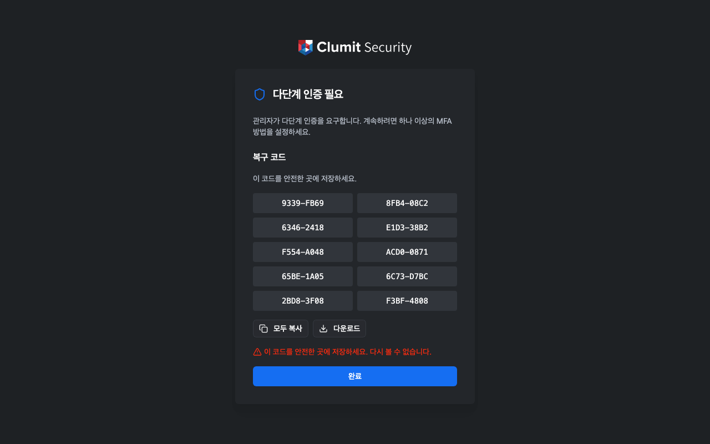

#### 복구 코드 생성

복구 코드가 없거나 기존 코드를 교체하려면:

1. **설정 → 프로필**로 이동합니다.
2. 복구 코드 카드에서 **복구 코드 생성**(코드가 이미 있는
   경우 **코드 재생성**)을 클릭합니다.
3. 계정 비밀번호를 입력하여 확인합니다.
4. 대화상자에서 **복구 코드 생성**을 클릭합니다.

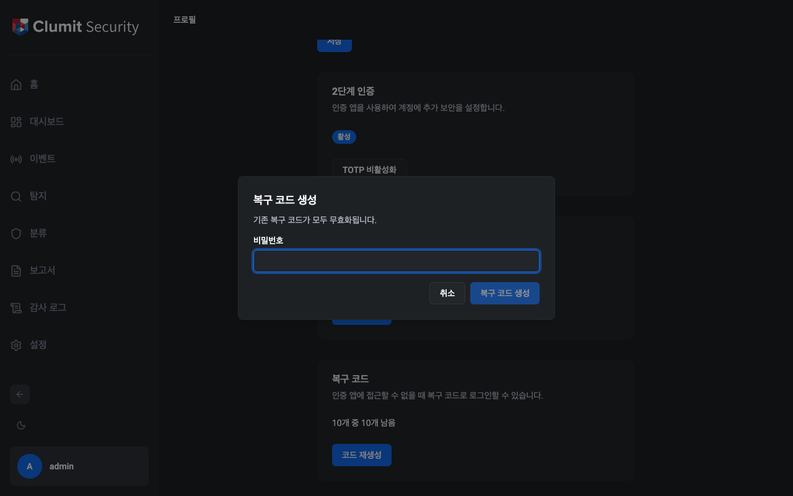

새 코드가 한 번 표시됩니다. **모두 복사**로 클립보드에
복사하거나 **다운로드**로 텍스트 파일로 저장합니다.

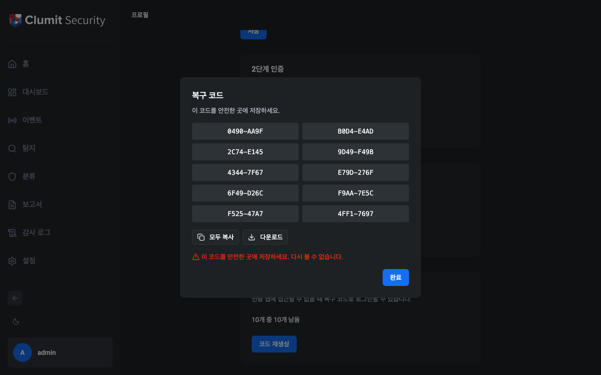

코드를 재생성하면 이전의 모든 코드가 무효화됩니다.

#### 복구 코드 잔여 수

카드에 사용하지 않은 코드 잔여 수가 표시됩니다 (예:
"9/10 남음"). 3개 이하로 남으면 경고 배지가 나타납니다.

### MFA 강제 등록

역할에 MFA가 필수이고 사용자가 MFA 방식을 등록하지 않은
경우, 로그인 후 강제 등록 페이지로 리다이렉트됩니다. 최소
하나의 MFA 방식을 등록할 때까지 대시보드 페이지에 접근할
수 없습니다.

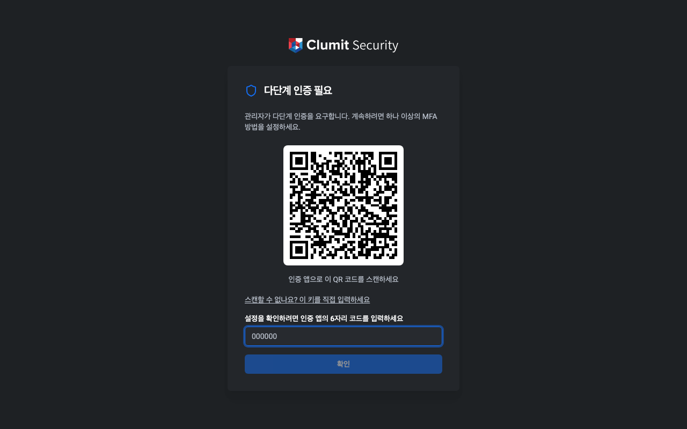

등록 페이지는 자동으로 TOTP 설정 마법사를 시작합니다:

1. 인증 앱으로 QR 코드를 스캔하거나, **이 키를 직접
   입력하세요**를 클릭하여 비밀 키를 복사합니다.
2. 인증 앱의 6자리 코드를 입력합니다.
3. **확인**을 클릭하여 등록을 완료합니다.

인증 후 복구 코드가 표시됩니다. 안전하게 저장한 후
**완료**를 클릭하여 대시보드로 이동합니다.

## 계정 현황

**설정 → 계정 현황**으로 이동하여 운영 모니터링 카드를
확인합니다. `dashboard:read` 권한이 필요합니다.


### 활성 세션

현재 활성 중인 모든 세션을 나열합니다. `dashboard:write`
권한이 있는 사용자는 **해지** 버튼으로 개별 세션을 종료할
수 있습니다.

### 잠긴 계정 및 정지된 계정

현재 잠기거나 정지된 계정을 표시합니다. `accounts:write`
권한이 있는 사용자는:

- 일시적으로 잠긴 계정을 **잠금 해제**할 수 있습니다.
- 정지된 계정을 **복원**할 수 있습니다.

### 의심스러운 활동

최근 24시간 동안 감지된 보안 알림을 심각도별(위험, 높음,
보통, 낮음)로 표시합니다. 각 알림은 규칙 이름, 설명, 발생
횟수, 가장 최근 발생 시간을 보여줍니다.

### 인증서 만료

mTLS 인증서 상태를 심각도 표시기와 함께 표시합니다:

- **정상** — 인증서가 유효하며 남은 시간이 충분합니다.
- **경고** — 인증서가 곧 만료됩니다.
- **위험** — 인증서가 만료되었거나 곧 만료됩니다.

## Aimer 연동

**설정 → Aimer 연동**으로 이동하여 Send to Aimer 흐름에 필요한
시스템 전역 사전 조건을 설정합니다. 이 화면은 **System
Administrator** 역할 전용입니다 — 사용자 정의 권한이 어떻게 부여
되어 있더라도 Tenant Administrator와 Security Monitor는 페이지
경로, 공개 JWK / Thumbprint 조회 엔드포인트, 모든 변경 엔드포
인트에서 거부됩니다.

<!-- TODO: screenshot - aimer-bridge batch -->

### 설정 상태

Send to Aimer는 세 가지 시스템 전역 사전 조건을 요구합니다:

1. **`aice_id`** — 배포 호스트네임. JWT `iss` 클레임과 aimer-web으로
   전달되는 `aice_id` 클레임에 사용됩니다. aimer-web의
   `trust_registry`가 이 값을 키로 조회하므로 등록된 값과 일치해야
   합니다.
2. **`aimer_web_bridge_url`** — `/api/auth/bridge`로 multipart POST
   를 받을 aimer-web 인스턴스의 베이스 URL. HTTPS 전용.
3. **컨텍스트 토큰 서명 키페어** — `data/keys/aimer-context-signing.json`
   에 저장되는 ES256 전용 키페어.

세 가지가 모두 설정되면 화면에 **설정됨 (시스템 전역)**이 표시
됩니다. 누락된 사전 조건이 있으면 빨간색 배지가 표시되고 누락
항목이 나열됩니다. 고객별 `external_key`는 고객별 설정으로 시스템
전역 설정 상태에 의도적으로 포함되지 **않으며**, 화면에는 고객
관리 페이지로 연결되는 안내 줄만 표시됩니다.

<!-- TODO: screenshot - aimer-bridge batch -->

### 컨텍스트 토큰 서명 키페어

서명 키페어는 JWT 서명 키 및 mTLS 키와 **분리**되어 있습니다.
신뢰 도메인을 독립적으로 유지하여 한 키의 침해가 다른 키를 무효
화하지 않도록 하기 위함입니다.

#### Thumbprint

**생성** 후 화면은 공개 JWK와 RFC 7638 SHA-256 Thumbprint를 두
가지 형식으로 동시에 표시합니다:

- **base64url** (43자, 패딩 없음) — 표준. 정확한 비교가 필요할 때
  이 값을 사용하십시오. aimer-web의 환경 등록 화면 값과 복사해
  비교하십시오.
- **콜론 구분 16진수** — 같은 SHA-256(32바이트, 64자 16진수)을 4
  바이트 단위로 그룹화한 형식. 음성/암기 비교용 보조 표현입니다.

두 형식 모두 같은 바이트를 인코딩하며, 표시 방식만 다릅니다.
Thumbprint는 서버에서 공개 JWK로부터 계산되며, **비공개 키는
서버 밖으로 나가지 않습니다** — UI는 API 응답으로 공개 JWK와
Thumbprint만 받습니다.

<!-- TODO: screenshot - aimer-bridge batch -->

#### 회전 라이프사이클

회전 상태 머신은 네 가지 상태를 가집니다:

| 상태 | 가능한 작업 |
| --- | --- |
| 비어 있음 | **생성** |
| 활성만 있음 | **회전** |
| 활성 + 대기 | **전환** (확인 체크박스 필요) |
| 활성 + 이전 | **비활성화** (보존 기간 경과 후) |

1. **생성** — 최초 부트. 활성 kid를 만듭니다.
2. **회전** — 활성 kid 옆에 *대기* kid를 새로 만듭니다. 전환하기
   전까지는 활성 kid가 계속 토큰을 서명합니다.
3. **전환** — 대기 kid를 활성으로 승격하고 기존 kid를 *이전*으로
   강등합니다. **선결 조건**: 새 kid가 aimer-web 신뢰 레지스트리에
   미리 등록되어 있어야 합니다. 등록되지 않으면 새 kid로 서명된
   토큰이 거부됩니다. 화면은 버튼 활성화 전에 확인 체크박스 동의를
   요구합니다.
4. **비활성화** — 디스크에서 이전 kid를 제거합니다. 짧은 보존
   기간(기본 5분 — 컨텍스트 토큰 TTL과 시계 스큐 마진의 합) 이후
   자동 활성화됩니다. aimer-web 측의 in-flight 검증이 재전송으로
   완료될 시간을 확보하기 위함입니다.

다음 임박 회전을 알리는 대시보드 배너:

- 권장 회전일 30일 전부터 **노란색**.
- 7일 전부터 **빨간색**.
- 권장 회전일 경과 후 **회색**.

<!-- TODO: screenshot - aimer-bridge batch -->

#### 파일 권한

디스크 파일은 모드 `0600`, 상위 `data/keys/` 디렉터리는 `0700`로
기록됩니다. 파일 모드가 변경되면(예: 권한이 더 느슨한 백업 복원)
화면은 권한 경고를 표시하고 진행 전 권한을 복구하라는 안내를
제공합니다. 부트 로그에도 경고가 기록됩니다.

새 키 파일에 `0600`을 설정할 수 없는 경우 애플리케이션은 **fail
closed** 동작으로 권한이 더 느슨한 비공개 키를 디스크에 남기지
않습니다.

### `aice_id`

이 AICE 인스턴스를 aimer-web에 식별시키는 호스트네임(RFC 1123).
밑줄(`_`)은 의도적으로 거부됩니다 — `aice_id`는 JWT `iss` 클레임
이기도 하므로 신뢰 레지스트리 조회 키 호환성을 위해 엄격한 호스트
네임을 사용합니다.

예: `aice-kepco.example.com`.

### `aimer_web_bridge_url`

aimer-web 인스턴스의 베이스 URL, HTTPS 전용. 경로는 정규화 형식
(끝 슬래시 없음)으로 저장됩니다. 인증 정보, 쿼리 문자열, 프래그
먼트는 거부됩니다.

예: `https://aimer.example.com`.

### 변경 영향 안내 모달

`aice_id`나 `aimer_web_bridge_url`을 편집하면 닫을 수 없는 모달이
다음을 안내합니다:

> 이 변경 이후 aimer-web에 본 환경을 재등록해야 합니다. 기존 등록
> 은 무효화되며, 그 사이에 발급된 컨텍스트 토큰은 거부됩니다.

명시적으로 확인해야 변경이 적용됩니다.

<!-- TODO: screenshot - aimer-bridge batch -->

### 감사 로그

Aimer 연동 화면은 다음 이벤트를 기록합니다:

- `aimer_signing_key.generated`, `.rotated`, `.switched`,
  `.deactivated` — 키페어 라이프사이클 이벤트.
- `aimer_integration_setting.changed` — `aice_id` 또는
  `aimer_web_bridge_url` 변경. `{key, old, new}` 삼중값을 기록.

위 동작들은 폐쇄형 감사 액션 유니온의 일부이므로 감사 로그 뷰어가
자동으로 표시합니다.

### 백업

서명 키페어 파일(`data/keys/aimer-context-signing.json`)은 JWT
서명 키와 함께 디스크 백업 대상에 포함됩니다. 자세한 백업 범위는
`decisions/backup-restore.md`를 참조하십시오.
