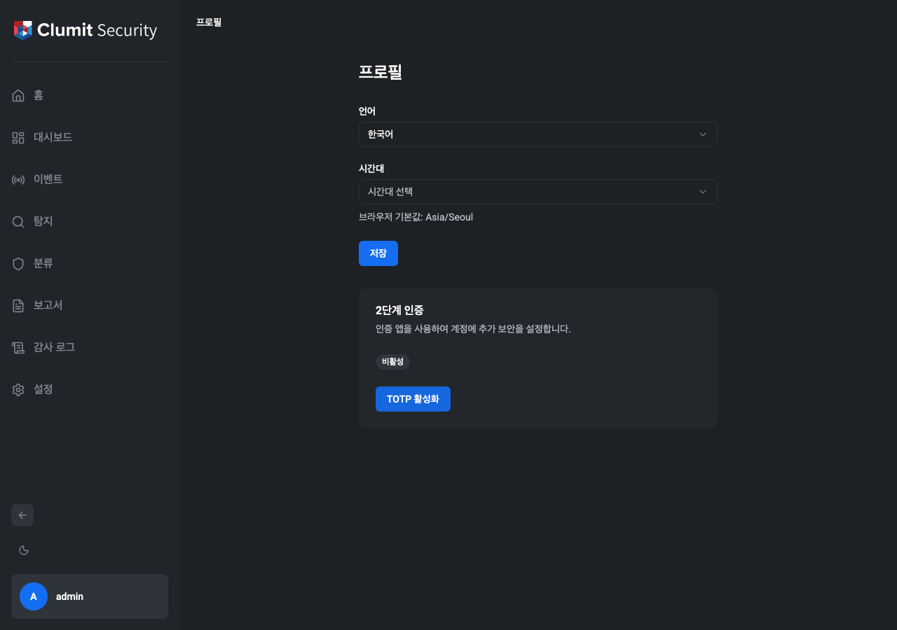
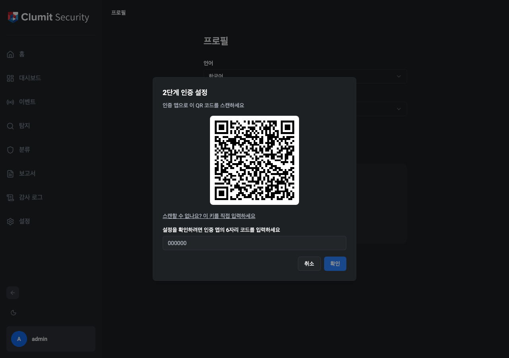
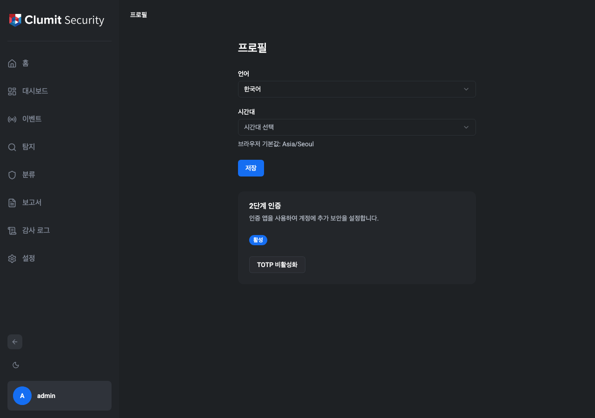
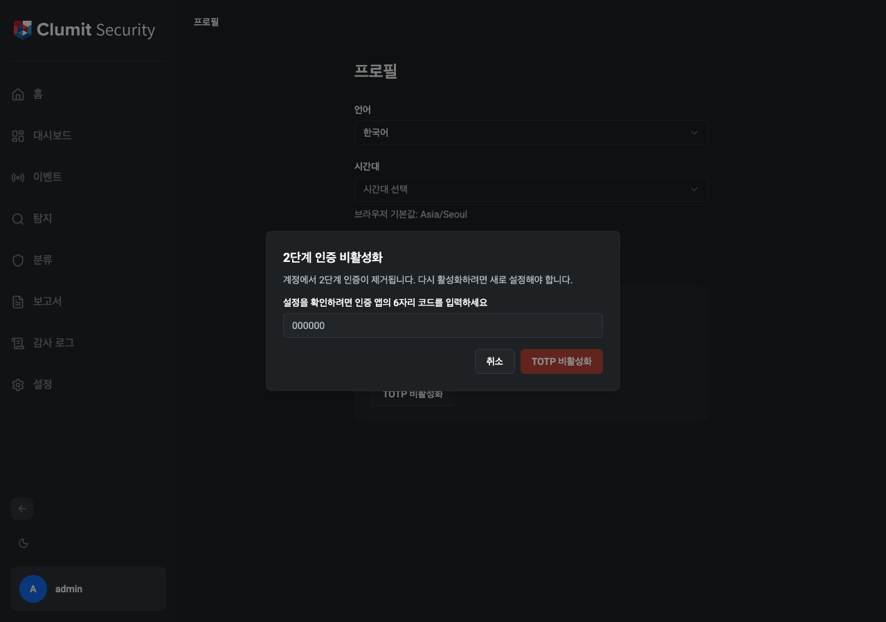
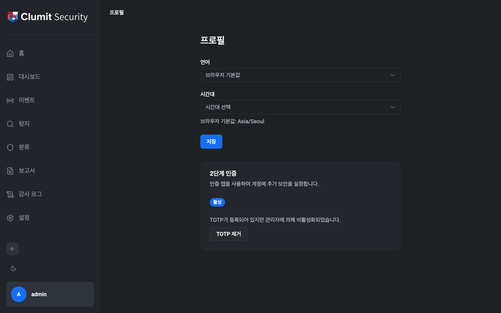
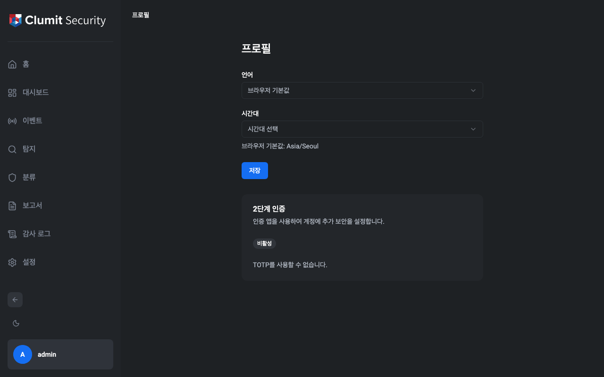
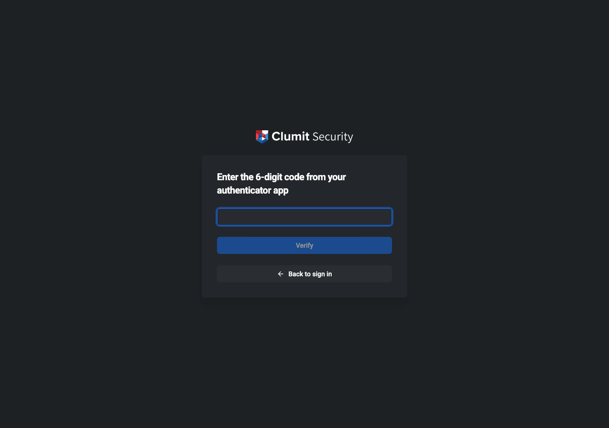

# 설정

설정 페이지는 사이드바에서 접근할 수 있습니다. 계정, 역할,
고객, 정책, 계정 현황 관리를 위한 탭이 포함되어 있습니다. 각
탭은 권한에 따라 표시됩니다.

## 계정

**설정 → 계정**으로 이동하여 사용자 계정을 관리합니다.
조회하려면 `accounts:read`, 생성 및 편집하려면
`accounts:write`, 비활성화하려면 `accounts:delete` 권한이
필요합니다.

### 계정 목록

계정 목록은 필터링과 페이지네이션을 지원합니다.

사용 가능한 필터:

- **검색** — 사용자명 또는 표시 이름으로 필터링합니다.
- **역할** — 할당된 역할로 필터링합니다.
- **상태** — 계정 상태(활성, 잠김, 정지, 비활성화)로
  필터링합니다.
- **고객** — 할당된 고객으로 필터링합니다.

### 계정 생성

**+** 버튼을 클릭하여 계정 생성 대화상자를 엽니다.

필드:

- **사용자명** — 고유한 로그인 식별자(생성 후 변경 불가).
- **표시 이름** — UI에 표시되는 이름(필수).
- **이메일** — 선택적 연락처 이메일.
- **전화번호** — 선택적 연락처 전화번호.
- **역할** — 권한을 결정합니다. System Administrator는 모든
  역할을 할당할 수 있습니다. Tenant Administrator는 Security
  Monitor 동급 역할의 계정만 생성할 수 있습니다.
- **고객 할당** — 고객 범위가 필요한 역할에 필수입니다.
- **비밀번호** — 계정의 초기 비밀번호를 설정합니다.

### 계정 편집

계정 행의 편집 아이콘(연필)을 클릭합니다. 표시 이름, 이메일,
전화번호를 수정할 수 있습니다. 사용자명, 역할, 고객 할당은
생성 후 변경할 수 없습니다.

### 계정 비활성화

계정 행의 삭제 아이콘(휴지통)을 클릭합니다. 확인 대화상자가
나타납니다. 역할 계층이 적용되어 자신과 같거나 높은 역할의
계정은 삭제할 수 없습니다.

### 계정 상태

| 상태 | 설명 |
|------|------|
| 활성 | 정상 운영 상태 |
| 잠김 | 로그인 실패로 인한 일시적 잠금(자동 해제됨) |
| 정지 | 반복된 잠금으로 인한 영구 잠금(관리자 복원 필요) |
| 비활성화 | 관리자에 의해 비활성화됨 |

## 역할

**설정 → 역할**로 이동하여 역할을 관리합니다.
조회하려면 `roles:read`, 생성·편집·복제하려면
`roles:write`, 삭제하려면 `roles:delete` 권한이 필요합니다.

### 기본 제공 역할

세 가지 역할이 기본 제공되며 편집하거나 삭제할 수 없습니다
(**BUILTIN** 배지로 표시):

- **System Administrator** — 모든 기능에 대한 전체 접근 권한.
- **Tenant Administrator** — 할당된 고객 내 운영 및 Security
  Monitor 계정 관리.
- **Security Monitor** — 할당된 단일 고객 내 이벤트 및
  대시보드 읽기 전용 접근.

### 커스텀 역할

**+** 버튼을 클릭하여 커스텀 역할을 생성하거나, 기존 역할의
복제 아이콘(복사)을 클릭합니다.

권한 그리드는 리소스별로 그룹화된 모든 사용 가능한 권한을
보여줍니다:

| 그룹 | 권한 |
|------|------|
| 대시보드 | `dashboard:read`, `dashboard:write` |
| 계정 | `accounts:read`, `accounts:write`, `accounts:delete` |
| 역할 | `roles:read`, `roles:write`, `roles:delete` |
| 고객 | `customers:read`, `customers:write`, `customers:delete`, `customers:access-all` |
| 시스템 설정 | `system-settings:read`, `system-settings:write` |
| 감사 로그 | `audit-logs:read` |

## 고객

**설정 → 고객**으로 이동하여 고객을 관리합니다.
조회하려면 `customers:read`, 생성 및 편집하려면
`customers:write`, 삭제하려면 `customers:delete` 권한이
필요합니다.

### 고객 생성

**+** 버튼을 클릭하여 고객 생성 대화상자를 엽니다.

필드:

- **이름** — 고객 표시 이름(필수).
- **설명** — 선택적 설명.

고객이 생성되면 시스템이 전용 데이터베이스를 자동으로
프로비저닝합니다.

### 고객 삭제

삭제하려면 `customers:delete` 권한이 필요합니다(System
Administrator 전용). 해당 고객에 할당된 계정이 없어야 합니다.
삭제 시 고객의 데이터베이스가 드롭됩니다.

## 정책

**설정 → 정책**으로 이동하여 시스템 전체 정책을 구성합니다.
조회하려면 `system-settings:read`, 편집하려면
`system-settings:write` 권한이 필요합니다.

설정은 탭으로 구성되어 있습니다:

### 비밀번호 정책

| 설정 | 기본값 | 설명 |
|------|--------|------|
| 최소 길이 | 12 | 최소 비밀번호 길이 |
| 최대 길이 | 128 | 최대 비밀번호 길이 |
| 복잡도 | 활성화 | 대문자, 소문자, 숫자, 기호 필수 |
| 재사용 금지 횟수 | 5 | 재사용할 수 없는 이전 비밀번호 수 |

### 세션 정책

| 설정 | 기본값 | 설명 |
|------|--------|------|
| 유휴 타임아웃 | 30분 | 비활성 세션 만료 시간 |
| 절대 타임아웃 | 8시간 | 최대 세션 지속 시간 |
| 최대 세션 수 | 무제한 | 계정당 최대 동시 세션 수 |

### 잠금 정책

| 설정 | 기본값 | 설명 |
|------|--------|------|
| 1단계 임계값 | 5 | 일시적 잠금 전 실패 횟수 |
| 1단계 지속 시간 | 30분 | 일시적 잠금 지속 시간 |

2단계(영구 정지)는 계정이 두 번째로 잠길 때 자동으로
발생합니다.

### JWT 정책

| 설정 | 기본값 | 설명 |
|------|--------|------|
| 토큰 만료 시간 | 15분 | JWT 액세스 토큰 유효 기간 |

### MFA 정책

| 설정 | 기본값 | 설명 |
|------|--------|------|
| WebAuthn (FIDO2) | 활성화 | 하드웨어 키 / 플랫폼 인증기 허용 |
| TOTP | 활성화 | 시간 기반 일회용 비밀번호 허용 |

### 속도 제한

**로그인 속도 제한:**

| 설정 | 기본값 | 설명 |
|------|--------|------|
| IP당 횟수 / 윈도우 | 20 / 5분 | IP 주소당 요청 수 |
| 계정+IP당 횟수 / 윈도우 | 5 / 5분 | 계정 + IP당 요청 수 |
| 전역 횟수 / 윈도우 | 100 / 1분 | 전체 로그인 요청 수 |

**API 속도 제한:**

| 설정 | 기본값 | 설명 |
|------|--------|------|
| 사용자당 횟수 / 윈도우 | 100 / 1분 | 인증된 사용자당 요청 수 |

모든 정책 설정 변경 사항은 감사 로그에 기록됩니다.

## 프로필

프로필 페이지는 **설정 → 프로필**에서 접근할 수 있습니다.
개인 환경설정과 2단계 인증을 관리할 수 있습니다.

### 환경설정

사용자는 언어와 시간대 환경설정을 구성할 수 있습니다.

### 2단계 인증 (TOTP)

TOTP 카드는 현재 등록 상태를 표시하며 시간 기반 일회용
비밀번호를 활성화하거나 비활성화할 수 있습니다.

카드는 TOTP 등록 상태와 관리자 정책에 따라 네 가지 상태
중 하나를 표시합니다:

| 상태 | 표시 |
|------|------|
| 사용 가능, 미등록 | "비활성" 배지와 **TOTP 활성화** 버튼 |
| 사용 가능, 등록됨 | "활성" 배지와 **TOTP 비활성화** 버튼 |
| 관리자에 의해 비활성화, 등록됨 | "활성" 배지와 관리자 안내 및 **TOTP 제거** 버튼 |
| 사용 불가 | "비활성" 배지와 "TOTP를 사용할 수 없습니다" 메시지 |

#### TOTP 활성화

1. **TOTP 활성화**를 클릭하여 설정 마법사를 엽니다.
2. 인증 앱(예: Google Authenticator, Authy)으로 QR 코드를
   스캔합니다. 또는 **스캔할 수 없나요? 이 키를 직접
   입력하세요**를 클릭하여 비밀 키를 복사합니다.
3. 인증 앱에 표시된 6자리 코드를 입력합니다.
4. **확인**을 클릭하여 설정을 완료합니다.

인증이 완료되면 TOTP가 활성화되며, 이후 로그인 시 코드
입력이 요구됩니다.

#### TOTP 비활성화

1. **TOTP 비활성화**(관리자에 의해 비활성화된 경우
   **TOTP 제거**)를 클릭합니다.
2. 현재 6자리 TOTP 코드를 입력하여 확인합니다.
3. **TOTP 비활성화**(또는 **TOTP 제거**)를 클릭하여
   자격 증명을 제거합니다.

#### 관리자에 의한 비활성화

관리자가 MFA 정책에서 TOTP를 허용 방식에서 제거했지만
사용자에게 TOTP가 아직 등록되어 있는 경우, 카드에
"활성" 배지와 함께 관리자에 의해 비활성화되었다는 안내가
표시됩니다. 사용자는 **TOTP 제거**를 클릭하여 불필요한
자격 증명을 제거할 수 있습니다.

#### 사용 불가

관리자가 MFA 정책에서 TOTP를 활성화하지 않았고 사용자에게
TOTP 자격 증명이 등록되어 있지 않은 경우, 카드에
"비활성" 배지와 "TOTP를 사용할 수 없습니다" 메시지가
표시됩니다. 사용자가 수행할 수 있는 작업은 없습니다.

#### MFA 로그인

TOTP가 활성화된 경우 비밀번호 입력 후 추가 단계가
필요합니다. 인증 앱의 6자리 코드를 입력하고 **확인**을
클릭합니다.

## 계정 현황

**설정 → 계정 현황**으로 이동하여 운영 모니터링 카드를
확인합니다. `dashboard:read` 권한이 필요합니다.

### 활성 세션

현재 활성 중인 모든 세션을 나열합니다. `dashboard:write`
권한이 있는 사용자는 **해지** 버튼으로 개별 세션을 종료할
수 있습니다.

### 잠긴 계정 및 정지된 계정

현재 잠기거나 정지된 계정을 표시합니다. `accounts:write`
권한이 있는 사용자는:

- 일시적으로 잠긴 계정을 **잠금 해제**할 수 있습니다.
- 정지된 계정을 **복원**할 수 있습니다.

### 의심스러운 활동

최근 24시간 동안 감지된 보안 알림을 심각도별(위험, 높음,
보통, 낮음)로 표시합니다. 각 알림은 규칙 이름, 설명, 발생
횟수, 가장 최근 발생 시간을 보여줍니다.

### 인증서 만료

mTLS 인증서 상태를 심각도 표시기와 함께 표시합니다:

- **정상** — 인증서가 유효하며 남은 시간이 충분합니다.
- **경고** — 인증서가 곧 만료됩니다.
- **위험** — 인증서가 만료되었거나 곧 만료됩니다.
