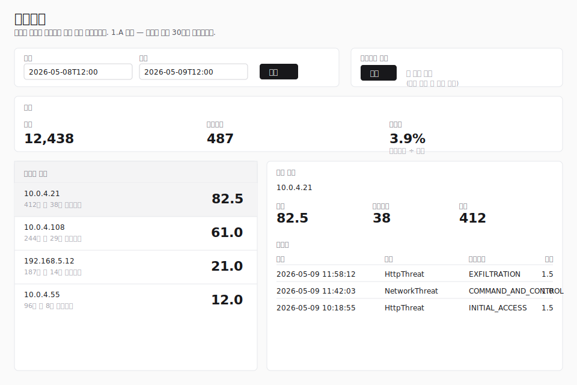
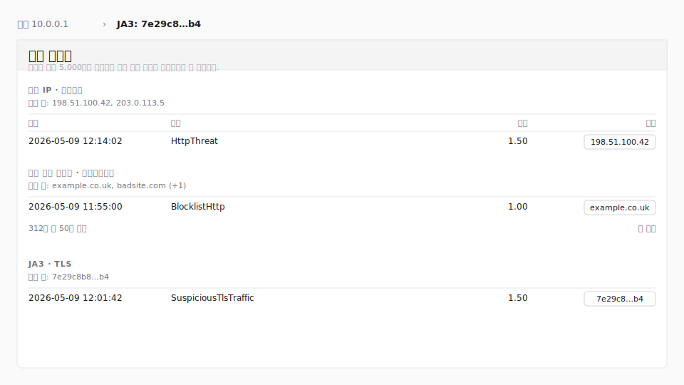

# 트리아지

트리아지 페이지는 대량의 탐지 피드를 사람이 다음으로 살펴봐야 할
가능성이 가장 높은 자산으로 좁혀줍니다. 선택한 기간의 모든 탐지
이벤트를 불러와 기준 점수 규칙을 적용하고, 출발지 주소를 총점
순으로 정렬해 분석가가 영향이 큰 행부터 처리할 수 있게 합니다.

페이지를 열려면 `triage:read` 권한이 필요합니다. 기본 역할 중
보안 모니터(Security Monitor), 테넌트 관리자(Tenant
Administrator), 시스템 관리자(System Administrator)는 이 권한을
기본으로 가지고 있습니다. `triage:read` 권한을 부여한 사용자
정의 역할도 동일하게 사용 가능합니다.

> **참고:** 위 그림은 와이어프레임 대체본입니다. 1.A 단계는
> 트리아지의 라이브 REview 스크린샷 환경이 정비되기 전에
> 출시되며, 와이어프레임은 [작성 가이드](../AUTHORING.md)에
> 정리된 로컬 REview 절차로 대표 데이터를 확보한 뒤 후속
> 작업에서 실제 PNG 캡처로 교체됩니다.

## 레이아웃

페이지는 4개의 영역으로 구성됩니다.

1. **헤더** — 제목과 현재 단계에 대한 한 줄 설명(1.A 단계:
   코퍼스 보존이 아직 제공되지 않으므로 기간이 최근 30일로
   제한됨).
2. **기간 선택기 및 모드 토글** — 분석할 기간과 점수 모드(현재는
   **기준** 모드만 활성화)를 선택하는 컨트롤.
3. **퍼널** — 불러온 슬라이스에 대한 세 가지 수치: 탐지된
   이벤트 수, 기준 규칙을 통과한 수, 그리고 두 값의 비율.
4. **자산 목록 및 자산 상세** — 2단 워크스페이스. 좌측 목록은
   출발지 주소를 총점 순으로 정렬하며, 행을 선택하면 우측에
   해당 자산의 점수와 카운트, 가장 최근 트리아지 이벤트가
   표시됩니다.

## 기간 선택기

분 단위(브라우저의 `datetime-local` 컨트롤)로 시작과 종료
타임스탬프를 입력합니다. **적용** 버튼을 누르면 새 범위가
적용되고, 서버에서 새 슬라이스를 다시 불러와 페이지가
재렌더됩니다.

선택기는 세 가지 규칙을 강제합니다.

- **최대 조회 기간: 30일.** 30일 이전의 시작 타임스탬프는
  거부됩니다. 1.A 단계는 코퍼스 보존이 아직 제공되지 않아 최근
  30일 범위만 지원하며, 보존 기능이 제공되면 하한이 확장됩니다.
- **최대 기간 길이: 30일.** 종료 − 시작 값이 30일을 초과하는
  범위는 거부됩니다.
- **종료는 시작 이후.** 종료가 시작과 같거나 그 이전인 범위는
  거부됩니다.

URL의 `start` / `end` 쿼리스트링이 위 규칙을 벗어나면 페이지가
값을 범위 안으로 자동 보정하고, 퍼널 위에 황색 안내
**"기간을 최근 30일에 맞게 조정했습니다."** 를 표시해 사용자가
요청한 범위와 실제 표시 범위가 다르다는 점을 인지할 수 있도록
합니다.

`start` / `end`가 지정되지 않은 경우 페이지는 현재 시각을 기준
으로 직전 24시간을 기본 범위로 사용합니다.

## 모드 토글

두 가지 모드가 보입니다.

- **기준** (활성) — [기준 점수 규칙](#기준-점수-규칙)에서
  설명하는 규칙입니다.
- **내 정책 적용** (비활성) — 향후 사용자별 정책 서브트리를
  위한 자리입니다. 토글은 첫 출시부터 자리잡혀 있지만, 정책
  기능이 출시되기 전까지는 선택할 수 없습니다. 마우스를 올리면
  **"트리아지 정책 출시 후 사용할 수 있습니다."** 라는 툴팁이
  표시됩니다.

## 기준 점수 규칙 { #기준-점수-규칙 }

기준 점수 규칙은 의도적으로 좁게 설계되어 있습니다.

- **카테고리 화이트리스트.** 이벤트의 카테고리가 운영자
  관점에서 의미 있는 킬체인 단계인 `COMMAND_AND_CONTROL`,
  `EXFILTRATION`, `IMPACT`, `INITIAL_ACCESS`,
  `CREDENTIAL_ACCESS` 중 하나일 때 점수 **1.0**이 부여됩니다.
- **클러스터 보너스.** `HttpThreat` 이벤트의 `clusterId`가
  클러스터 없음 센티넬(빈 문자열, `none`, `null`, 대소문자
  무관)이면 화이트리스트 점수에 추가로 **0.5**가 더해집니다.
  이 행들은 상위 모델이 분류하지 못한 새로운 HTTP 트래픽과
  연관되는 경향이 있어 우선적으로 살펴볼 가치가 있습니다.

카테고리가 화이트리스트 밖인 이벤트는 점수가 **0**이며, 퍼널의
**탐지** 합계에는 포함되지만 **트리아지** 합계에는 포함되지
않고, 어떤 자산 점수에도 기여하지 않습니다.

1.A 단계에는 제외 규칙, 사용자별 정책, 그리고 영구화가 모두
없습니다.

## 퍼널

퍼널은 불러온 슬라이스를 요약합니다.

| 항목 | 의미 |
|---|---|
| **탐지** | 기간에 대해 불러온 총 이벤트 수(5,000건 하드 캡 적용 후, [하드 캡 및 절단](#하드-캡-및-절단) 참조). |
| **트리아지** | 기준 점수가 0보다 큰 이벤트 수. |
| **통과율** | `트리아지 ÷ 탐지` 비율을 백분율로 표시. |

## 자산 목록

각 행은 출발지 IP 주소(`origAddr`)로 이벤트를 그룹화합니다.
행은 총점이 높은 순으로 정렬되며, 동점은 트리아지 카운트, 탐지
카운트, 주소 순으로 처리됩니다.

복수형 `origAddrs` 필드를 내보내는 집계형 위협 서브타입처럼
사용 가능한 출발지 IP가 없는 이벤트는 퍼널의 **탐지** 합계에는
포함되지만 어떤 자산 행에도 기여하지 않습니다.

행을 클릭하면 우측의 **자산 상세** 패널이 채워지며, 페이지가
처음 열릴 때는 첫 번째 행이 미리 선택되어 있습니다.

목록은 서로 다른 주소당 한 행을 표시합니다. 기간 내에 기준
규칙을 통과한 이벤트가 없으면 목록에 **"이 기간 동안 기준
규칙에 일치하는 자산이 없습니다."** 가 표시됩니다.

## 자산 상세

선택한 자산의 상세 패널에는 다음이 표시됩니다.

- 자산의 출발지 주소.
- 자산의 **점수**, **트리아지**, **탐지** 카운트.
- 가장 최근의 **이벤트 50건**이 새 항목부터 시각, 종류
  (`__typename`), 카테고리, 이벤트별 기준 점수와 함께 표시.

시각은 세션의 선호 표준시간대(**설정**에서 변경)로 형식화
됩니다.

## 하드 캡 및 절단 { #하드-캡-및-절단 }

트리아지는 `eventList`를 커서 단위로 페이징하며 기간 내 모든
이벤트를 다 불러오거나 **5,000건**에 도달하면 멈춥니다. 5,000건
하드 캡은 데모 단계의 안전 장치로, 이벤트가 많은 날에 넓은
기간을 선택했을 때 수만 건을 조용히 불러오는 일을 막습니다.

캡에 도달했지만 REview가 더 많은 행이 있다고 알려주는 경우,
페이지는 퍼널 위에 황색 배너를 렌더링합니다.

> 일부만 표시: 기간의 5,000건 표시 (5,000건에서 잘림).

마지막 페이지에서 정확히 캡에 도달했지만(REview가 더 이상의
행이 없다고 응답한 경우) 배너는 표시되지 않습니다 — 운영자가
실제로 기간의 모든 이벤트를 본 것이기 때문입니다.

절단 배너 없이 더 넓은 기간을 보고 싶다면 기간 선택기로 범위를
좁힌 뒤 다시 적용하세요.

## 오류 상태

BFF가 선택한 기간의 이벤트를 가져오지 못하면, 페이지는 빈
셸과 함께 다음 중 하나의 배너를 표시합니다.

- **"이 기간의 이벤트를 불러오지 못했습니다. 다른 기간을
  시도해 주세요."** — BFF가 REview에 도달했지만 응답이 인식되지
  않는 오류였던 경우.
- **"트리아지 결과를 볼 권한이 없습니다."** — 호출자에게
  `triage:read` 권한이 없는 경우. (실제로는 페이지 레벨 권한
  체크가 먼저 리다이렉트하므로 도달 불가능하며, 배너는 다중
  방어선으로 존재합니다.)
- **"할당된 고객이 없습니다. 관리자에게 문의하세요."** —
  호출자는 `triage:read` 권한이 있지만 계정에 할당된 고객이
  없는 경우.

## 관련 이벤트 패널과 피벗

자산이 선택된 상태에서는 자산 목록 아래에 **관련 이벤트** 패널이
함께 렌더링됩니다. 패널은 적재된 코퍼스의 다른 이벤트를 피벗
차원별로 묶어, 추가 네트워크 요청 없이 선택된 자산이 슬라이스
나머지와 어떤 공통점을 갖는지 보여줍니다.

> **참고:** 위 그림은 와이어프레임 대체본입니다. 1.A 단계는
> 라이브 REview 스크린샷 환경이 트리아지에 연결되기 전에
> 출시되며, 트리아지 EN/KR 매뉴얼 스크린샷 작업
> ([이슈 #455](https://github.com/aicers/aice-web-next/issues/455))에서
> 실제 PNG 캡처로 대체됩니다.

### 피벗 차원

패널은 다음 차원별로 이벤트를 그룹화합니다.

- **네트워크** — 외부 IP, 내부 IP, 목적지 포트, 국가. 외부/내부
  분류는 트리아지의 다른 곳과 동일한 측별 분류기를 사용합니다
  (고객이 정의한 네트워크 멤버십이 우선이고, RFC1918 / IPv6
  특수 용도 범위가 폴백입니다).
- **애플리케이션** — 등록 가능 도메인(공개 접미사 목록), 호스트
  헤더, URI 패턴, 사용자 에이전트. URI는 패턴으로 정규화됩니다
  — 쿼리/프래그먼트 제거, 숫자 세그먼트는 `{id}`, 표준 UUID는
  `{uuid}`, 긴 순수 16진 세그먼트는 `{hex}` 로 치환됩니다. 그
  결과 `/api/v1/users/42?token=…` 와 `/api/v1/users/99?token=…`
  는 동일한 피벗 값 `/api/v1/users/{id}` 으로 합쳐집니다.
- **TLS** — JA3, JA3S, SNI(서버 이름), 인증서 시리얼,
  인증서 주체 CN.
- **DNS** — DNS 쿼리, DNS 응답(여러 응답이 포함된 행은 분리됨).
  `event.answer` 가 함께 실어 나르는 CNAME 호스트나 `NXDOMAIN`
  같은 상태 문자열은 걸러내고 IPv4 / IPv6 주소 토큰만 피벗 값으로
  유지됩니다 — 이 차원이 "DNS 응답 IP" 피벗으로 동작하도록 하기
  위함입니다.
- **시간 / 구조** — 동일 종류(`__typename`)의 이벤트가 포커스
  이벤트의 시각을 기준으로 ±15분 안에 있는지, 동일 센서, 동일
  클러스터 ID. 초기 구현은 30분 폭의 고정 버킷을 사용했고
  서로 두 분 차이의 이벤트도 버킷 경계만 다르면 매칭 실패로
  처리되었습니다 — 현재 구현은 포커스 이벤트의 시각을 중심으로
  ±15분 윈도를 직접 계산합니다.

선택된 자산이 값을 갖지 않거나 적재된 코퍼스에 일치하는 다른
이벤트가 없는 차원은 빈 상태로 노출되지 않고 숨겨집니다.

### 섹션별 동작

각 섹션의 행은 이벤트별 점수 내림차순으로 정렬되며 동점은
최신순으로 정렬됩니다. 기본 보기는 섹션당 최대 **10건**이며,
**더 보기**를 누르면 **50건**까지 확장됩니다. 일치 항목이 50건을
넘으면 추가 확장 없이 `50건 / N건 표시` 힌트만 노출됩니다.

기준 이벤트(자산의 origAddr 와 일치하거나 브레드크럼의 피벗
값을 공유하는 이벤트) 자체는 관련 이벤트 행에 다시 등장하지
않습니다. 패널은 이들과 차원을 공유하는 *다른* 이벤트를 보여
줍니다.

기간 배너가 `일부만 표시: 기간의 N건 표시 (5,000건에서 잘림)`
인 동안에는 패널 상단에도 동일한 힌트가 노출되어, 누락된 일치
항목이 부재로 잘못 해석되지 않도록 합니다.

### 브레드크럼 (다단계 피벗)

행에서 피벗하면 브레드크럼에 단계가 추가됩니다. 브레드크럼은
현재 보기에 한정되며, URL에 영구 저장되지 않습니다.

- 첫 단계는 자산입니다 (예: `자산 10.0.0.1`).
- 이후 단계는 피벗한 차원과 값을 표기합니다 (예:
  `JA3: 7e29c8…b4`). 이전 단계를 클릭하면 해당 단계의 보기로
  복원됩니다. 자산 단계를 클릭하면 모든 차원 단계가 자산 보기로
  접힙니다.

차원 단계가 활성 단계일 때, 자산 상세 카드는 헤더가
**피벗 포커스**로 바뀌면서 처음 선택한 자산의 통계 대신 피벗된
값을 공유하는 이벤트들을 보여 줍니다. 자산 목록에서는 처음
선택한 자산의 강조가 그대로 유지되어, 운영자는 자산 단계 크럼을
클릭하거나 목록에서 다시 선택해 되돌아갈 수 있습니다.

자산 목록에서 새 자산을 선택하면 브레드크럼은 그 자산으로
초기화됩니다 (이어붙지 않습니다).

### 기간 변경 확인

브레드크럼에 차원 단계가 하나 이상 있을 때 새 기간을 적용하면
확인 모달이 노출됩니다.

> **피벗 경로를 버리시겠습니까?** 기간을 변경하면 코퍼스를 다시
> 적재하고 현재 피벗 경로를 비웁니다. 계속하시겠습니까?

확인하면 새 기간으로 다시 적재하면서 경로를 비웁니다. 취소하면
현재 기간이 유지됩니다.

## 1.A 단계의 제약

- 최근 30일만 조회할 수 있습니다.
- 기준 규칙은 고정이며, 사용자별 정책은 아직 제공되지 않습니다.
- 자산 키는 단일 출발지 IP이며, 복수형 주소 필드를 내보내는
  이벤트는 어떤 자산 행에도 할당되지 않습니다.
- 기간당 최대 5,000건이 집계되며, 그보다 넓은 기간은 절단
  배너가 표시됩니다.
- 페이지는 기간 선택, 모드 선택, 브레드크럼 상태, 자산별
  상태를 영구 저장하지 않습니다.
- 피벗은 적재된 코퍼스에 대해 읽기 전용입니다. 적재된 슬라이스
  바깥의 이벤트로 확장(2단계)은 별도 이슈로 추적되며 1단계의
  범위가 아닙니다.
