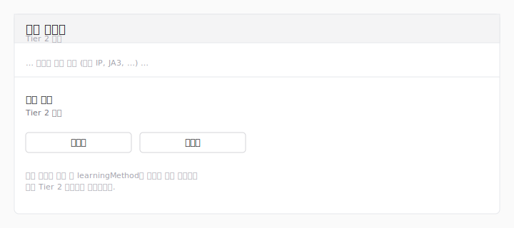

# 트리아지

트리아지 페이지는 대량의 탐지 피드를 사람이 다음으로 살펴봐야 할
가능성이 가장 높은 자산으로 좁혀줍니다. 선택한 기간의 모든 탐지
이벤트를 불러와 기준 점수 규칙을 적용하고, 출발지 주소를 총점
순으로 정렬해 분석가가 영향이 큰 행부터 처리할 수 있게 합니다.

페이지를 열려면 `triage:read` 권한이 필요합니다. 기본 역할 중
보안 모니터(Security Monitor), 테넌트 관리자(Tenant
Administrator), 시스템 관리자(System Administrator)는 이 권한을
기본으로 가지고 있습니다. `triage:read` 권한을 부여한 사용자
정의 역할도 동일하게 사용 가능합니다.


> **참고:** 위 그림은 와이어프레임 대체본입니다. 1.A 단계는
> 트리아지의 라이브 REview 스크린샷 환경이 정비되기 전에
> 출시되며, 와이어프레임은 [작성 가이드](../AUTHORING.md)에
> 정리된 로컬 REview 절차로 대표 데이터를 확보한 뒤 후속
> 작업에서 실제 PNG 캡처로 교체됩니다.

## 레이아웃

페이지는 5개의 영역으로 구성됩니다.

1. **헤더** — 제목, 메뉴에 대한 한 줄 설명, 그리고 고객별
   베이스라인 코퍼스가 마지막으로 수집된 시각을 보여주는
   **신선도 배지**([신선도 헤더](#신선도-헤더) 참조).
2. **기간 선택기 및 모드 토글** — 분석할 기간과 점수 모드(현재는
   **기준** 모드만 활성화)를 선택하는 컨트롤.
3. **퍼널** — 불러온 슬라이스에 대한 세 가지 수치: 탐지된
   이벤트 수(`observed_event_meta`에서), 기준 규칙을 통과한
   수(`baseline_triaged_event`에서), 그리고 두 값의 비율.
4. **자산 목록 및 자산 상세** — 2단 워크스페이스. 좌측 목록은
   호출자의 고객 범위 전체에 걸쳐 출발지 주소를 총점 순으로
   정렬하며(복합키 `(customerId, address)`), 행을 선택하면 우측에
   해당 자산의 점수와 카운트, 가장 최근 트리아지 이벤트가
   표시됩니다.

## 기간 선택기

분 단위(브라우저의 `datetime-local` 컨트롤)로 시작과 종료
타임스탬프를 입력합니다. **적용** 버튼을 누르면 새 범위가
적용되고, 서버에서 새 슬라이스를 다시 불러와 페이지가
재렌더됩니다.

선택기는 세 가지 규칙을 강제합니다.

- **최대 조회 기간: 180일.** 180일 이전의 시작 타임스탬프는
  거부됩니다. 180일 한도는 `baseline_triaged_event` 코퍼스의
  보존 기간과 일치합니다.
- **최대 기간 길이: 30일.** 종료 − 시작 값이 30일을 초과하는
  범위는 거부됩니다. 30일 상한은 코퍼스 속성이 아니라 작업
  창의 비용(UI, 백분위 통과 비용 등)을 고려한 선택입니다.
- **종료는 시작 이후.** 종료가 시작과 같거나 그 이전인 범위는
  거부됩니다.

URL의 `start` / `end` 쿼리스트링이 위 규칙을 벗어나면 페이지가
값을 범위 안으로 자동 보정하고, 퍼널 위에 황색 안내
**"기간을 180일 룩백 / 30일 기간 상한에 맞게 조정했습니다."** 를
표시해 사용자가 요청한 범위와 실제 표시 범위가 다르다는 점을
인지할 수 있도록 합니다.

`start` / `end`가 지정되지 않은 경우 페이지는 현재 시각을 기준
으로 직전 24시간을 기본 범위로 사용합니다.

### 탐지 분모와 30일 보존 한도 { #탐지-분모와-30일-보존-한도 }

퍼널의 **탐지** 수치는 `observed_event_meta`에서 읽는데, 이
테이블의 보존 기간은 **30일**로 `baseline_triaged_event`의
180일보다 짧습니다. 선택한 기간의 시작이 30일 이전이면 관측된
분모는 보존 기간 안의 슬라이스만 포함하게 됩니다. 이 경우 자산
목록 위에 **"관측된 분모의 보존 기간이 선택한 기간보다 짧아
탐지 카운트는 최근 30일만 포함합니다."** 안내가 표시되며,
보존 기간 밖 슬라이스에 속한 자산 행에는 탐지 카운트 옆에
`(최근 30일 기준)` 표시가 붙어 "분모 알 수 없음"과 "분모 0"을
구분할 수 있게 합니다. 자산 목록의 점수와 트리아지 카운트는
코퍼스에서 직접 읽으므로 전체 기간에 걸쳐 정확합니다.

## 신선도 헤더 { #신선도-헤더 }

페이지 헤더의 작은 배지가 고객별 베이스라인 코퍼스가 마지막으로
수집된 시점을 알려줍니다. 배지는 호출자의 범위에 속한 각 고객
DB에서 `baseline_corpus_state.last_ingested_at`를 읽고,
`last_run_status`와 `last_ingested_at` 조합에 따라 6가지 상태 중
하나를 표시합니다.

| 상태       | `last_ingested_at` | 배지                                  |
|------------|--------------------|---------------------------------------|
| `ok`       | non-NULL           | "마지막 업데이트: N분 전"             |
| `running`  | non-NULL           | "지금 업데이트 중… (이전: N분 전)"    |
| `running`  | NULL               | "첫 번째 수집 진행 중…"               |
| `failed`   | non-NULL           | "마지막 시도 실패: N분 전"            |
| `failed`   | NULL               | "첫 번째 수집 실패"                   |
| (행 없음)  | —                  | "첫 번째 수집 대기 중"                |

호출자 범위가 여러 고객에 걸칠 때 배지는 가장 나쁜 상태(failed
> running > 행 없음 > ok)를 선택해, 한 고객의 실패가 초록 헤더
뒤에 가려지지 않도록 합니다. 다중 고객 `ok` 상태는 "마지막
업데이트: N분 전, K개 고객 기준"으로 표시되며, `ok`가 아닌
상태는 영향받은 고객 ID를 호버 툴팁에 나열합니다. `failed` 상태는
호버 시 `last_error`도 표시하며, 다중 고객 범위에서는
영향받은 고객 ID 목록과 오류 메시지를
`Affected: 1, 2 — <오류>` 형태로 결합해 어느 정보도
누락되지 않도록 합니다.

헤더는 의도적으로 `baseline_version`이나 그 외의 코퍼스 메타데이터를
노출하지 않습니다. 감사 / 디버깅에는 저장된 `baseline_version`
컬럼을 직접 사용합니다.

## 모드 토글

두 가지 모드가 보입니다.

- **기준** (활성) — [기준 점수 규칙](#기준-점수-규칙)에서
  설명하는 규칙입니다.
- **내 정책 적용** (비활성) — 향후 사용자별 정책 서브트리를
  위한 자리입니다. 토글은 첫 출시부터 자리잡혀 있지만, 정책
  기능이 출시되기 전까지는 선택할 수 없습니다. 마우스를 올리면
  **"트리아지 정책 출시 후 사용할 수 있습니다."** 라는 툴팁이
  표시됩니다.

## 기준 점수 규칙 { #기준-점수-규칙 }

기준 점수 규칙은 의도적으로 좁게 설계되어 있습니다.

- **카테고리 화이트리스트.** 이벤트의 카테고리가 운영자
  관점에서 의미 있는 킬체인 단계인 `COMMAND_AND_CONTROL`,
  `EXFILTRATION`, `IMPACT`, `INITIAL_ACCESS`,
  `CREDENTIAL_ACCESS` 중 하나일 때 점수 **1.0**이 부여됩니다.
- **클러스터 보너스.** `HttpThreat` 이벤트의 `clusterId`가
  클러스터 없음 센티넬(빈 문자열, `none`, `null`, 대소문자
  무관)이면 화이트리스트 점수에 추가로 **0.5**가 더해집니다.
  이 행들은 상위 모델이 분류하지 못한 새로운 HTTP 트래픽과
  연관되는 경향이 있어 우선적으로 살펴볼 가치가 있습니다.

카테고리가 화이트리스트 밖인 이벤트는 점수가 **0**이며, 퍼널의
**탐지** 합계에는 포함되지만 **트리아지** 합계에는 포함되지
않고, 어떤 자산 점수에도 기여하지 않습니다.

1.A 단계에는 제외 규칙, 사용자별 정책, 그리고 영구화가 모두
없습니다.

## 퍼널

퍼널은 불러온 슬라이스를 요약합니다. 코퍼스 전환 후의 데이터 출처:

| 항목 | 출처 | 의미 |
|---|---|---|
| **탐지** | `observed_event_meta` | 기간에 대해 카덴스의 제외 규칙 재적용을 통과한 이벤트(하한은 `max(:from, now() − 30d)` 클램프 — [탐지 분모와 30일 보존 한도](#탐지-분모와-30일-보존-한도) 참조). |
| **트리아지** | `baseline_triaged_event` | 기준 규칙을 통과한 이벤트(180일 보존). |
| **통과율** | 파생 | `트리아지 ÷ 탐지` 비율을 백분율로 표시. |

퍼널은 기간 변경, 고객 변경, 종류 필터 변경 시마다 재계산됩니다.

## 자산 목록

각 행은 복합 자산키 **`(customerId, 출발지 IP)`** 로 이벤트를
그룹화합니다. 두 고객이 서로 다른 경계망에서 동일한 RFC1918
주소를 가질 수 있으므로 복합키가 두 행을 끝까지 구분된 상태로
유지합니다. 단일 고객 범위(가장 흔한 경우)는 페이지 전체에서
`customerId`가 동일하므로 단일 테넌트 뷰와 동일하게 보입니다.
행은 총점이 높은 순으로 정렬되며, 1차 동점 처리는
`last_event_time`(최신 우선)으로, 테넌트별 SQL의
`ORDER BY score DESC, last_event_time DESC`와 동일한 형태로
머지됩니다. 이후 남는 동점은 트리아지 카운트, 탐지 카운트,
주소, 고객 ID 순으로 처리됩니다 — 이 키들은 이슈 계약에
포함되지는 않지만 `score`와 `last_event_time`이 모두 같을
때 페이지를 재현 가능하도록 유지하는 안정화 키입니다.

복수형 `origAddrs` 필드를 내보내는 집계형 위협 서브타입처럼
사용 가능한 출발지 IP가 없는 이벤트는 퍼널의 **탐지** 합계에는
포함되지만 어떤 자산 행에도 기여하지 않습니다.

자산 목록은 고객별로 `baseline_triaged_event`에 대한 집계 SELECT
(`COUNT(*)`, `SUM(baseline_score)`, `MAX(event_time)`을 `orig_addr`로
GROUP BY)로 읽습니다. 다중 고객 범위는 고객마다 한 번씩 이런
집계 쿼리를 실행하고 결과를 테넌트별 SQL과 동일한
`score DESC, last_event_time DESC` 키로 자바스크립트에서
머지하므로, 점수가 같은 다른 테넌트의 행은 도착 순서가 아니라
최신성으로 정렬됩니다. 다중 고객 코드 경로는 `OFFSET`을
발행하지 않으므로 테넌트 간 전역 정렬이 안정적으로 유지됩니다.

행을 클릭하면 우측의 **자산 상세** 패널이 채워지며, 페이지가
처음 열릴 때는 첫 번째 행이 미리 선택되어 있습니다.

목록은 서로 다른 주소당 한 행을 표시합니다. 기간 내에 기준
규칙을 통과한 이벤트가 없으면 목록에 **"이 기간 동안 기준
규칙에 일치하는 자산이 없습니다."** 가 표시됩니다.

## 자산 상세

선택한 자산의 상세 패널에는 다음이 표시됩니다.

- 자산의 출발지 주소.
- 자산이 속한 **고객사 이름**(테넌트의 `customers.name`). 두
  고객사가 동일한 RFC1918 주소를 공유하는 다중 고객사 범위에서
  선택 후에도 두 행을 구분하기 위해 상세 헤더에 고객사 줄이
  함께 표시됩니다.
- 자산의 **점수**, **트리아지**, **탐지** 카운트.
- 가장 최근의 **이벤트 50건**이 새 항목부터 시각, 종류
  (`__typename`), 카테고리, 그리고 저장된
  `baseline_triaged_event.baseline_score` 값을 직접 사용한
  이벤트별 기준 점수와 함께 표시됩니다(예: 클러스터 ID 화이트
  리스트가 적용된 행도 케이던스가 기록한 값을 그대로 보여줍니다 —
  스칼라 전용 코퍼스 행 위에서 재계산하지 않습니다).

시각은 세션의 선호 표준시간대(**설정**에서 변경)로 형식화
됩니다.

### 기준 모드의 필드 가용성

기준 모드 상세 패널은 `baseline_triaged_event` 컬럼만 읽으며,
코퍼스 행에 없는 서브타입별 필드는 패널에서 생략됩니다. 기준
모드에서 **사용할 수 없는** 필드(그리고 그 필드를 사용하던
차원):

- `level` (위협 레벨) — 기준 모드에서는 레벨 칩과 레벨 필터가
  숨겨집니다.
- `origCountry` / `respCountry` — 기준 모드에서는 **국가** 피벗
  차원이 숨겨집니다.
- `origNetwork` / `respNetwork` — 고객 네트워크 멤버십 분류기는
  RFC1918 / IPv6 특수 사용 범위로 폴백합니다(IP 피벗 차원은 계속
  동작).
- HTTP `userAgent`, DNS `answer`, TLS 서브타입 필드(JA3, JA3S,
  SNI, 인증서 시리얼, 인증서 주체 CN), `clusterId` — 이에
  대응하는 **사용자 에이전트**, **DNS 응답**, **TLS** 피벗
  차원과 **클러스터 ID** 피벗이 기준 모드에서 숨겨집니다.

위 필드는 향후 "내 정책 적용" 모드(코퍼스 B)에서 자동으로
다시 사용할 수 있게 됩니다. 코퍼스 B는 스냅샷 JSONB를 통해
전체 `eventList` 페이로드를 보존합니다. 기준 모드 피벗 패널에서는
인덱스 빌더가 코퍼스 A에서 읽을 때 위 차원들을 건너뛰므로 빈
섹션이 표시되지 않습니다.

## 하드 캡 및 절단 { #하드-캡-및-절단 }

트리아지는 `eventList`를 커서 단위로 페이징하며 기간 내 모든
이벤트를 다 불러오거나 **5,000건**에 도달하면 멈춥니다. 5,000건
하드 캡은 데모 단계의 안전 장치로, 이벤트가 많은 날에 넓은
기간을 선택했을 때 수만 건을 조용히 불러오는 일을 막습니다.

캡에 도달했지만 REview가 더 많은 행이 있다고 알려주는 경우,
페이지는 퍼널 위에 황색 배너를 렌더링합니다.

> 일부만 표시: 기간의 5,000건 표시 (5,000건에서 잘림).

마지막 페이지에서 정확히 캡에 도달했지만(REview가 더 이상의
행이 없다고 응답한 경우) 배너는 표시되지 않습니다 — 운영자가
실제로 기간의 모든 이벤트를 본 것이기 때문입니다.

절단 배너 없이 더 넓은 기간을 보고 싶다면 기간 선택기로 범위를
좁힌 뒤 다시 적용하세요.

## 오류 상태

BFF가 선택한 기간의 이벤트를 가져오지 못하면, 페이지는 빈
셸과 함께 다음 중 하나의 배너를 표시합니다.

- **"이 기간의 이벤트를 불러오지 못했습니다. 다른 기간을
  시도해 주세요."** — BFF가 REview에 도달했지만 응답이 인식되지
  않는 오류였던 경우.
- **"트리아지 결과를 볼 권한이 없습니다."** — 호출자에게
  `triage:read` 권한이 없는 경우. (실제로는 페이지 레벨 권한
  체크가 먼저 리다이렉트하므로 도달 불가능하며, 배너는 다중
  방어선으로 존재합니다.)
- **"할당된 고객이 없습니다. 관리자에게 문의하세요."** —
  호출자는 `triage:read` 권한이 있지만 계정에 할당된 고객이
  없는 경우.

## 관련 이벤트 패널과 피벗

자산이 선택된 상태에서는 자산 목록 아래에 **관련 이벤트** 패널이
함께 렌더링됩니다. 패널은 적재된 코퍼스의 다른 이벤트를 피벗
차원별로 묶어, 추가 네트워크 요청 없이 선택된 자산이 슬라이스
나머지와 어떤 공통점을 갖는지 보여줍니다.


> **참고:** 위 그림은 와이어프레임 대체본입니다. 1.A 단계는
> 라이브 REview 스크린샷 환경이 트리아지에 연결되기 전에
> 출시되며, 트리아지 EN/KR 매뉴얼 스크린샷 작업
> ([이슈 #455](https://github.com/aicers/aice-web-next/issues/455))에서
> 실제 PNG 캡처로 대체됩니다.

### 피벗 차원

패널은 다음 차원별로 이벤트를 그룹화합니다.

- **네트워크** — 외부 IP, 내부 IP, 목적지 포트, 국가. 외부/내부
  분류는 트리아지의 다른 곳과 동일한 측별 분류기를 사용합니다
  (고객이 정의한 네트워크 멤버십이 우선이고, RFC1918 / IPv6
  특수 용도 범위가 폴백입니다).
- **애플리케이션** — 등록 가능 도메인(공개 접미사 목록), 호스트
  헤더, URI 패턴, 사용자 에이전트. URI는 패턴으로 정규화됩니다
  — 쿼리/프래그먼트 제거, 숫자 세그먼트는 `{id}`, 표준 UUID는
  `{uuid}`, 긴 순수 16진 세그먼트는 `{hex}` 로 치환됩니다. 그
  결과 `/api/v1/users/42?token=…` 와 `/api/v1/users/99?token=…`
  는 동일한 피벗 값 `/api/v1/users/{id}` 으로 합쳐집니다.
- **TLS** — JA3, JA3S, SNI(서버 이름), 인증서 시리얼,
  인증서 주체 CN.
- **DNS** — DNS 쿼리, DNS 응답(여러 응답이 포함된 행은 분리됨).
  `event.answer` 가 함께 실어 나르는 CNAME 호스트나 `NXDOMAIN`
  같은 상태 문자열은 걸러내고 IPv4 / IPv6 주소 토큰만 피벗 값으로
  유지됩니다 — 이 차원이 "DNS 응답 IP" 피벗으로 동작하도록 하기
  위함입니다.
- **시간 / 구조** — 동일 종류(`__typename`)의 이벤트가 포커스
  이벤트의 시각을 기준으로 ±15분 안에 있는지, 동일 센서, 동일
  클러스터 ID. 초기 구현은 30분 폭의 고정 버킷을 사용했고
  서로 두 분 차이의 이벤트도 버킷 경계만 다르면 매칭 실패로
  처리되었습니다 — 현재 구현은 포커스 이벤트의 시각을 중심으로
  ±15분 윈도를 직접 계산합니다.

선택된 자산이 값을 갖지 않거나 적재된 코퍼스에 일치하는 다른
이벤트가 없는 차원은 빈 상태로 노출되지 않고 숨겨집니다.

### 섹션별 동작

각 섹션의 행은 이벤트별 점수 내림차순으로 정렬되며 동점은
최신순으로 정렬됩니다. 기본 보기는 섹션당 최대 **10건**이며,
**더 보기**를 누르면 **50건**까지 확장됩니다. 섹션이 펼쳐진 상태
이고 실제 일치 건수가 화면에 표시된 50건을 초과할 때만
`50건 / N건 표시` 힌트가 **접기** 버튼과 함께 노출됩니다. 접힌
상태에서는 화면에 보이는 행이 10건이라 `50건` 힌트가 화면과
어긋나므로 표시하지 않으며, 펼쳐도 전체 일치 집합이 50건 이하인
경우에는 힌트를 생략합니다.

기준 이벤트(자산의 origAddr 와 일치하거나 브레드크럼의 피벗
값을 공유하는 이벤트) 자체는 관련 이벤트 행에 다시 등장하지
않습니다. 패널은 이들과 차원을 공유하는 *다른* 이벤트를 보여
줍니다.

기간 배너가 `일부만 표시: 기간의 N건 표시 (5,000건에서 잘림)`
인 동안에는 패널 상단에도 동일한 힌트가 노출되어, 누락된 일치
항목이 부재로 잘못 해석되지 않도록 합니다.

### 브레드크럼 (다단계 피벗)

행에서 피벗하면 브레드크럼에 단계가 추가됩니다. 브레드크럼(자산
포커스, 각 차원/값 피벗 단계, 현재 범위 토글)은 `triage.pivot.*`
네임스페이스 아래의 URL 해시에 인코딩되므로, 링크를 공유하거나
브라우저를 새로고침하면 새로 적재된 코퍼스에 맞춰 경로가 복원됩니다.
전체 해시 형식과 누락 시 동작은
[URL 해시 영속성](#url-%ED%95%B4%EC%8B%9C-%EC%98%81%EC%86%8D%EC%84%B1)
절을 참고하세요.

- 첫 단계는 자산입니다 (예: `자산 10.0.0.1`).
- 이후 단계는 피벗한 차원과 값을 표기합니다 (예:
  `JA3: 7e29c8…b4`). 이전 단계를 클릭하면 해당 단계의 보기로
  복원됩니다. 자산 단계를 클릭하면 모든 차원 단계가 자산 보기로
  접힙니다.

차원 단계가 활성 단계일 때, 자산 상세 카드는 헤더가
**피벗 포커스**로 바뀌면서 처음 선택한 자산의 통계 대신 피벗된
값을 공유하는 이벤트들을 보여 줍니다. 자산 목록에서는 처음
선택한 자산의 강조가 그대로 유지되어, 운영자는 자산 단계 크럼을
클릭하거나 목록에서 다시 선택해 되돌아갈 수 있습니다.

자산 목록에서 새 자산을 선택하면 브레드크럼은 그 자산으로
초기화됩니다 (이어붙지 않습니다).

### 기간 변경 확인

브레드크럼에 차원 단계가 하나 이상 있을 때 새 기간을 적용하면
확인 모달이 노출됩니다.

> **피벗 경로를 버리시겠습니까?** 기간을 변경하면 코퍼스를 다시
> 적재하고 현재 피벗 경로를 비웁니다. 계속하시겠습니까?

확인하면 새 기간으로 다시 적재하면서 경로를 비웁니다. 취소하면
현재 기간이 유지됩니다.

## 피벗 범위 토글 (Tier 1 / Tier 2)

기간 선택기 옆의 두 번째 토글이 피벗 범위를 결정합니다.

- **트리아지된 이벤트만** (기본값 — Tier 1) 적재된 코퍼스만을
  대상으로 합니다. 차원을 클릭해도 새 조회는 발생하지 않으므로
  탐색은 즉시 이루어지지만, 패널은 기준 규칙을 통과한 일치만
  보여 줍니다.
- **모든 탐지 이벤트** (Tier 2) 동일한 패널 레이아웃을 유지하면서
  일부 차원의 클릭을 서버 측 조회로 전환합니다. 적재된 코퍼스가
  너무 좁아 충분한 맥락을 보여주지 못할 때 피벗 범위를 기준 슬라이스
  외부로 확장합니다.

기본값은 매 메뉴 진입 시 **트리아지된 이벤트만**입니다. 토글은
계정 설정에 영구 저장되지 *않습니다*. 영구 기본값은 분석가가
의도하지 않은 5,000건 조회로 돌아오는 위험을 만듭니다. Tier 2 보기를
URL로 공유하면 토글 상태가 함께 전달됩니다 — 브레드크럼과 토글
상태는 URL 해시에 인코딩되므로 공유 링크는 다시 적재해도 동일하게
복원됩니다.

### Tier 2 서버 필터 차원

**모든 탐지 이벤트**로 토글한다고 해서 자동으로 조회가 발생하지는
않습니다. 다음 차원 중 하나를 클릭할 때만 라운드트립이 발생합니다.

- `kinds`, `categories`, `levels` (Tier 2 전용 — 토글을 켜면
  별도의 "Tier 2 only" 그룹으로 표시됩니다).
- `learningMethods` (Tier 2 전용 — 같은 "Tier 2 only" 그룹에
  **정적 옵션** 섹션으로 표시됩니다). `LearningMethod` 두 enum
  값이 하드코딩되어 있어, 적재된 코퍼스에 해당 필드가 없어도
  Tier 2 범위에서는 항상 섹션이 나타납니다. 행을 클릭하면
  `EventListFilterInput.learningMethods`로 필터링된 Tier 2 조회가
  발생합니다.

  

  > **참고:** 위 그림은 와이어프레임 대체본입니다. 트리아지의
  > 라이브 REview 스크린샷 환경이 정비되기 전에 출시되며, 다른
  > 1.A 단계 트리아지 와이어프레임과 함께 트리아지 EN/KR 매뉴얼
  > 스크린샷 작업
  > ([이슈 #455](https://github.com/aicers/aice-web-next/issues/455))에서
  > 실제 PNG 캡처로 대체됩니다.

  - **비지도** — REview의 비지도 탐지 모델로 표시된 이벤트입니다.
    이 행을 누르면 기간 내 `learningMethod`가 `UNSUPERVISED`인
    모든 Tier 2 이벤트가 조회됩니다.
  - **준지도** — REview의 준지도 탐지 모델로 표시된 이벤트입니다.
    이 행을 누르면 기간 내 `learningMethod`가 `SEMI_SUPERVISED`인
    모든 Tier 2 이벤트가 조회됩니다.

- `keywords` (Tier 2 전용 — 같은 "Tier 2 only" 그룹에 **자유 입력
  칩** 섹션으로 표시됩니다). 다른 Tier 2 전용 enum 차원과 달리
  `keywords`는 고정된 클릭 행 대신 운영자가 직접 입력한 값을
  받습니다. 섹션에는 텍스트 입력란과 **검색** 버튼이 함께 표시됩니다.

  - **명시적 제출만 허용됩니다.** 입력 자체로는 조회가 발생하지
    않습니다. **Enter** 키 또는 **검색** 버튼 클릭으로만
    `EventListFilterInput.keywords` 필터링 Tier 2 조회가
    실행됩니다. **Esc** 키는 입력값을 지웁니다.
  - **입력 규칙.** 제출된 값은 trim 처리됩니다. 공백만 입력하거나
    빈 값은 인라인 검증 메시지와 함께 거부되며, **256자**를 초과한
    입력도 같은 메시지로 거부됩니다(URL 해시와 LRU 캐시 키의 비대화
    방지를 위한 상한).
  - **최근 칩.** 입력란 아래에 가장 최근 다섯 건의 제출이 클릭 가능한
    칩으로 표시됩니다. 칩을 클릭하면 동일한 Tier 2 조회가 다시
    발생합니다. 이미 최근 목록에 있는 값을 다시 제출하면 중복이
    추가되지 않고 해당 칩이 가장 최근 위치로 이동합니다.
  - **최근 칩은 페이지 세션 한정입니다.** URL 해시에 인코딩되지
    않으며, `localStorage`나 계정 프로필에도 저장되지 않습니다.
    기간이나 고객 범위가 변경되면 Tier 2 캐시와 함께 최근 칩 목록도
    비워집니다. 해시 내용 없이 페이지를 다시 열면 최근 칩 목록도
    비어 있습니다.
  - **공유 URL.** `keywords` 단계는 다른 Tier 2 전용 단계와 동일하게
    URL 해시에 인코딩됩니다(`triage.pivot.step=keywords:<인코딩 값>`).
    URL을 복원하면 같은 Tier 2 조회가 큐에 들어가며, 입력 문자열이
    그대로 경로(breadcrumb) 레이블로 표시됩니다. 코퍼스에는
    `keywords` 필드가 없으므로 다른 차원에서 사용하는 동기적 정합성
    검사를 의도적으로 건너뛰며, 조회 결과가 0건이면 자산 루트로
    되돌아가지 않고 빈 피벗 포커스를 렌더링합니다.

- `externalIp`, `internalIp`, `country`, `sameSensor` (Tier 1과
  동일한 행이지만, 클릭 동작이 적재된 인덱스 조회 대신 새 조회를
  발생시킵니다).

JA3, JA3S, SNI, 호스트, URI 패턴, 인증서 필드, 사용자 에이전트 등
나머지 차원은 이미 적재된 결과(코퍼스 + 경로 위의 모든 이전
Tier 2 결과)와 클라이언트 측에서 교집합 계산하므로 두 모드 모두
즉시 응답합니다.

### 조회 진행 표시

Tier 2 조회가 시작되면 패널 헤더 근처에 진행 알림이 표시되어
가져오는 차원과 값을 알려줍니다. 조회가 완료되면 알림이 사라지고,
실패한 경우 오류 알림으로 대체됩니다.

### 차원당 한도와 사전 확인

단일 Tier 2 차원 조회는 페이지당 100건(REview의 `first` / `last`
하드캡 `[0, 100]`)으로 최대 **5,000건**까지 순회합니다. 한도에
도달하면 패널은 Tier 1 배너와 유사한 절단 안내를 표시합니다.
브레드크럼 상의 서버 필터링 Tier 2 단계가 한도에 도달한 동안에는
안내가 계속 표시되며, 한도에 도달한 상위 단계(예: `country=KR`)에서
하위 클라이언트 인터섹션 단계(예: JA3)로 피벗한 후에도 패널이 동일한
부분 5,000건 결과로 계산되는 한 안내가 사라지지 않습니다.

예상 일치 건수가 **20,000건**을 초과할 때
(`EventConnection.totalCount` 기반), 운영자가 승인하기 전까지
조회를 차단하는 확인 모달이 표시됩니다.

> **큰 결과를 조회하시겠습니까?** 이 차원의 예상 크기는 N
> 이벤트로 20,000 임계값을 초과합니다. 조회에 시간이 걸릴 수
> 있습니다.

해당 필터에 대해 `totalCount`가 제공되지 않지만 커서 순회의 첫
페이지가 가득 찬 경우, 예상 크기를 20,000 임계값과 비교할 수
없습니다. 모달은 안전을 위해 표시되며, 첫 페이지의 하한 값을
보여주고 총량을 알 수 없다는 점을 명시합니다.

> **큰 결과를 조회하시겠습니까?** 예상 크기를 확인할 수
> 없습니다 — 첫 페이지에서 최소 N 이벤트가 반환되었지만,
> 20,000 임계값과의 비교는 알 수 없습니다. 확인을 누르면 차원별
> 한도까지 조회를 계속합니다.

모달을 취소하면 조회가 중단됩니다. 운영자는 다른 차원을 선택하거나
기간을 좁힐 수 있습니다.

### 캐시와 제거

Tier 2 결과는
`(periodStart, periodEnd, dimensionId, valueKey, customerScope)`를
키로 하여 클라이언트에 캐시됩니다. 누적 캐시 크기는
**100 MB**(`JSON.stringify(events).length` 합계)로 제한됩니다.
삽입이 한도를 초과하면 가장 최근에 사용되지 않은 차원 결과
(개별 이벤트가 아닌 결과 전체 세트)를 제거하고, 제거된 차원을
명시하는 비차단 안내가 표시됩니다. 제거된 차원으로 다시 피벗하면
REview에서 다시 조회합니다.

단일 차원 결과 자체가 100 MB 한도를 초과하는 경우, 캐시는 다른
한도 내 항목을 건드리지 않고 해당 후보를 즉시 거부합니다. 운영자는
거부된 차원을 명시하는 동일한 비차단 안내를 보게 되며, 해당 차원으로
다시 피벗하면 다시 조회합니다.

캐시 키에 customer scope가 포함되므로 같은 브라우저 세션에서
다른 customer로 전환된 후에는 한 customer의 Tier 2 결과가 다시
사용되지 않습니다.

### 조회 실패

BFF가 Tier 2 조회를 완료하지 못하는 경우(REview 타임아웃, 전송
오류, 권한 거부 등), 페이지는 차원과 값을 명시하는 닫을 수 있는
빨간색 안내를 표시하며, 실패한 피벗은 해제되어 운영자가 행을
다시 클릭해 재시도할 수 있습니다. 적재된 코퍼스와 Tier 1 패널은
영향을 받지 않습니다.

### 약신호 표시

Tier 2 조회로 가져온 행이 Tier 1 코퍼스에 *없는* 경우(REview의
안정적인 이벤트별 `Event.id`로 비교), 행은 흐린 불투명도와 작은
**약신호** 배지로 표시됩니다. 두 곳
모두에 있는 행(기준 통과하지 않은 `score === 0` 코퍼스 멤버 포함)은
배지 없이 그대로 표시되므로, 운영자는 한눈에 행이 이미 적재된
슬라이스에 있었는지 새로 가져온 것인지 구분할 수 있습니다.

### 센서 피벗 제한

`EventListFilterInput.sensors`는 REview의 불투명한 센서 **ID**를
요구하지만, Triage 이벤트는 센서 **이름**만을 가지고 있습니다.
이름을 ID로 해석하는 공유 센서 조회는 현재 `detection:read`로
게이트되어 있어 `triage:read`만 가진 운영자는 사용하지 못할 수
있습니다. `triage:read` 호환 조회가 제공되기 전까지 Tier 2 센서
피벗은 사용할 수 없으며, Tier 2 모드에서 패널은 "센서 인덱스 필요"
툴팁과 함께 해당 행을 숨깁니다. Tier 1 센서 피벗은 영향을 받지
않습니다. `mode=tier2`에서 `sameSensor` 단계가 포함된 공유 URL은
복원 시 만료된 단계로 처리되어(페이지는 비차단 안내와 함께 자산
보기로 폴백) Tier 1 센서 이름이 REview에 `sensors: [ID!]` 리터럴
값으로 전송되지 않습니다.

### URL 해시 영속성

자산 포커스, 브레드크럼의 모든 차원 단계, Tier 1 / Tier 2 토글
상태가 `triage.pivot.*` 네임스페이스 아래의 URL 해시에 인코딩됩니다.

```text
#triage.pivot.asset=42/10.0.0.1&triage.pivot.step=ja3:abc123&triage.pivot.mode=tier2
```

자산 포커스는 복합키 `customerId/address`로 인코딩되므로, 동일한
RFC1918 주소를 사용하는 두 고객의 자산이 복원 시에도 서로 구분된
채로 유지됩니다. 복합키가 도입되기 전에 만들어진 URL은 주소만
포함하는데, 이런 URL은 페이지가 만료(stale)된 것으로 간주하고
어느 고객의 행에 포커스할지 추측하지 않고 비차단 안내와 함께
자산 루트로 폴백합니다.

해시가 채워진 상태로 페이지를 적재하면 새로 적재된 코퍼스에 맞춰
브레드크럼이 그 단계로 복원됩니다. 새 기간에서 단계 값에 도달할
수 없는 경우(예: 어떤 이벤트와도 일치하지 않는 JA3) 페이지는 비차단
안내와 함께 자산 보기로 폴백하고 만료된 단계를 브레드크럼에서
지웁니다.

복원된 해시가 Tier 2 모드이고 서버 필터링 상위 단계(예:
`country=KR`) 아래에 클라이언트 인터섹션 단계(예: JA3)를 포함하는
경우, 페이지는 먼저 큐에 들어간 Tier 2 상위 조회를 발송한 다음
확장된 코퍼스에 대해 하위 단계를 검증합니다. 하위 단계는 해당
조회가 완료된 후에도 값이 여전히 누락된 경우에만 만료된 것으로
처리되므로, 하위 값이 상위 단계의 조회 결과에만 존재하더라도
공유된 URL은 새로고침 안정성을 유지합니다.

해시는 향후 Triage 해시 확장(예: `triage.strictness.*` 아래의
엄격도 컨트롤)과 충돌하지 않도록 `triage.pivot.*` 아래에
네임스페이스화되어 있습니다.

## 제약 사항

- 기간 시작은 최대 **180일** 이전까지 거슬러 올라갈 수 있으며,
  단일 윈도우 길이는 30일로 제한됩니다.
- 기준 규칙은 고정이며, 사용자별 정책은 아직 제공되지 않습니다.
- 자산 키는 복합키 `(customerId, 출발지 IP)`이며, 복수형 주소
  필드를 내보내는 이벤트는 어떤 자산 행에도 할당되지 않습니다.
- 기간당 최대 5,000건이 집계되며, 그보다 넓은 기간은 절단
  배너가 표시됩니다.
- 모드 토글, 기간 선택, 자산별 상태는 세션 간에 영구 저장되지
  않습니다. 피벗 브레드크럼과 Tier 1 / Tier 2 범위는 URL 해시에
  인코딩되므로 공유/재적재 URL이 이를 복원하지만, 매 메뉴 진입
  시 초기화됩니다.
- `triage:read` 호환 센서 조회가 제공될 때까지 Tier 2 센서
  피벗은 숨겨집니다.
- 기준 모드에서는 **국가**, **사용자 에이전트**, **TLS** (JA3 /
  JA3S / SNI / 인증서 시리얼 / 인증서 주체 CN), **DNS 응답**,
  **클러스터 ID**, **위협 레벨** 피벗 차원이 숨겨집니다 — 해당
  컬럼이 `baseline_triaged_event`에 존재하지 않습니다. 이 차원
  들은 향후 "내 정책 적용" 모드(코퍼스 B)에서 다시 사용할 수
  있게 됩니다.
